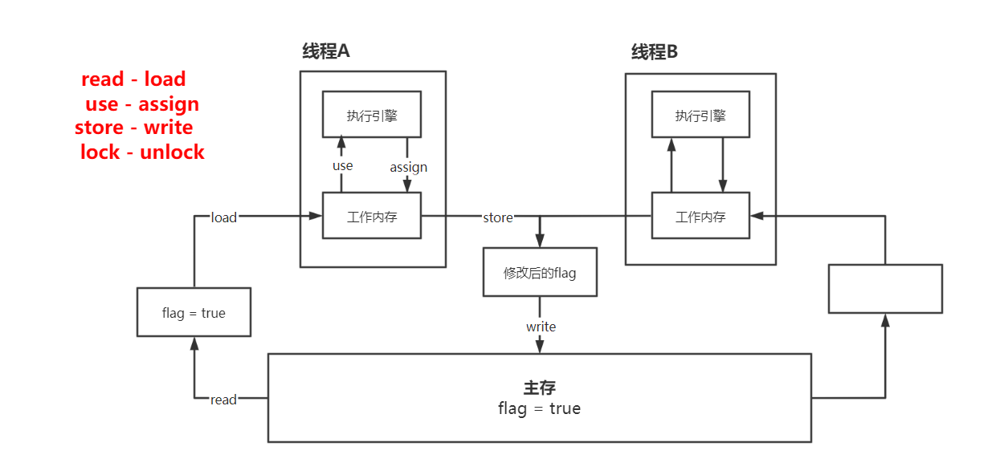
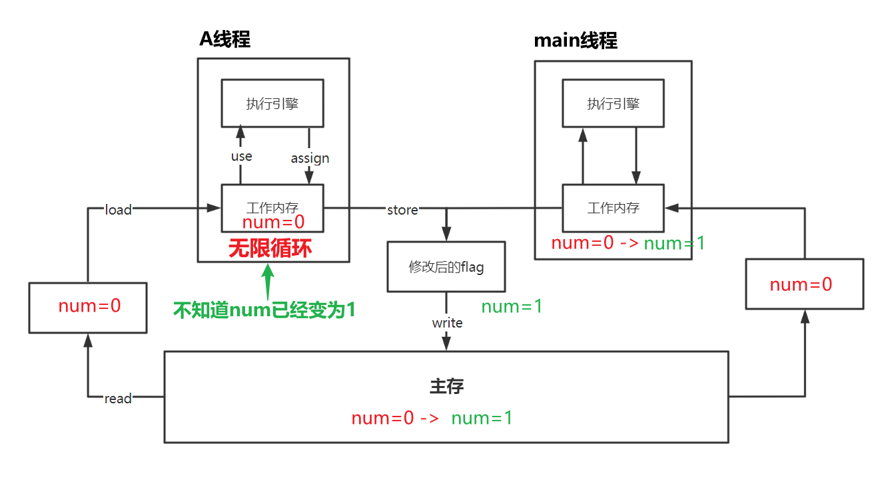
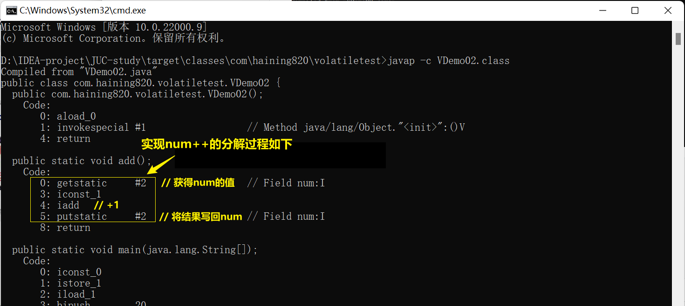
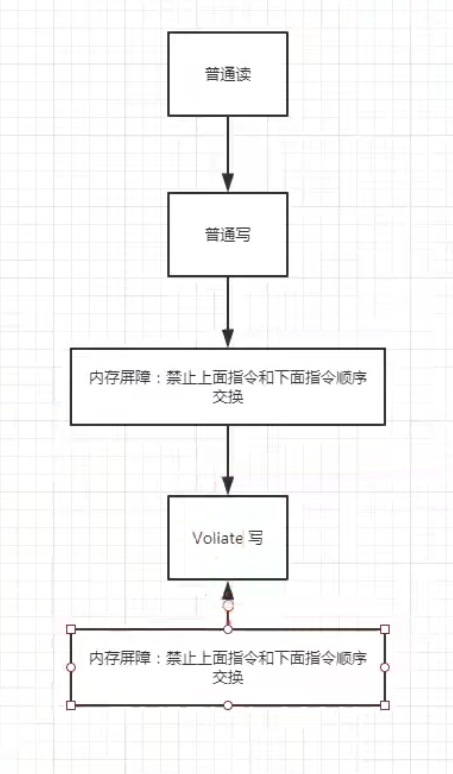
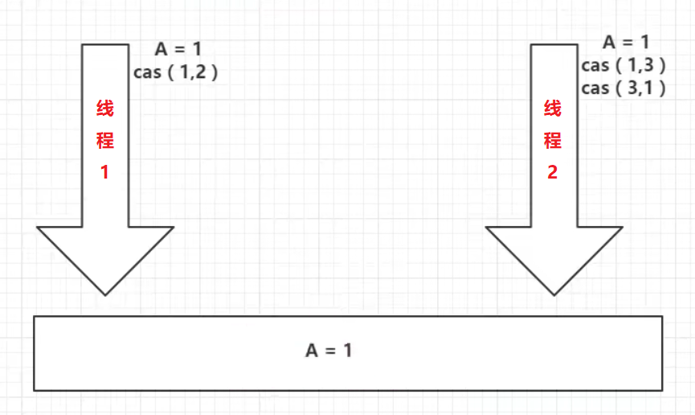
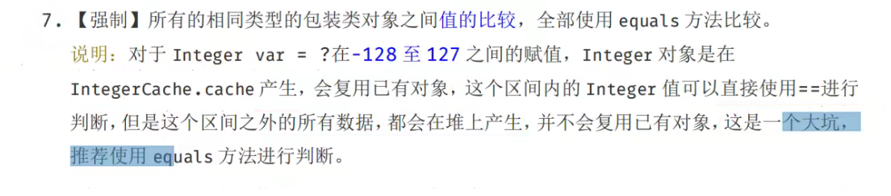

# 1、JUC

什么是 JUC？

JUC 指的是 Java 中以下几个包中的内容

```java
java.util.concurrent 
java.util.concurrent.atomic
java.util.concurrent.locks
```

<!--more-->

## 1.1、线程和进程？

进程：进程是一个具有一定独立功能的程序关于某个数据集合的一次运行活动。它是操作系统动态执行的基本单元，在传统的操作系统中，进程既是基本的分配单元，也是基本的执行单元。 

线程：通常在一个进程中可以包含若干个线程，当然一个进程中至少有一个线程，不然没有存在的意义，线程可以利用进程所有拥有的资源。

在引入线程的操作系统中，通常都是把进程作为分配资源的基本单位，而把线程作为独立运行和独立调度的基本单位，由于线程比进程小，基本上不拥有系统资源， 故对它的调度所付出的开销就会小得多，能更高效的提高系统多个程序间并发执行的程度。

**通俗的来说**

进程：就是操作系统中运行的一个程序，QQ.exe，word.exe，这就是多个进程。

线程：每个进程中都存在一个或者多个线程，比如用 word 写文章时，就会有一个线程默默帮你定时自动保存。

- Java 默认有几个线程？

  两个，一个是 main 线程，一个是 GC 线程。

- Java 真的可以开启线程吗？**不能**

  ```java
  private native void start0();	// 本地方法，底层是C++，Java无法直接操作硬件。
  ```

## 1.2、并发和并行？

> 并发编程：并发与并行

并发和并行是两个非常容易混淆的概念。它们都可以表示两个或多个任务一起执行，但是偏重点有点不同。

- 并发偏重于**多个任务交替执行**，而多个任务之间有可能还是串行的；CPU 只有一核，模拟出多条线程，快速交替执行。并发是**逻辑上的同时发生**。
- CPU 多核，多个线程可以同时执行，并行是**物理上的同时发生**。

严格意义上来说，并行的多个任务是真实的同时执行，而对于并发来说，这个过程只是交替的，一会运行任务 1，一会儿又运行任务 2，系统会不停地在两者间切换。但对于外部观察者来说，即使多个任务是串行并发的，也会造成是多个任务并行执行的错觉。

实际上，如果系统内只有一个 CPU，执行多线程任务，那么真实环境中这些任务是不可能真实并行的，毕竟一个 CPU 一次只能执行一条指令，这种情况下多线程任务就是并发的，而不是并行，操作系统会不停的切换任务。真正的并发只能够出现在拥有多个CPU的系统中（多核CPU）。

```Java
System.out.println(Runtime.getRuntime().availableProcessors());	// 获取当前系统CPU核数
```

**并发的动机**：在计算能力恒定的情况下处理更多的任务。

**并行的动机**：用更多的 CPU 核心更快的完成任务。

并发编程的本质：<font color='red' style="font-weight:bold;">充分利用 CPU 资源，以达到最高的处理性能。</font>

# 2、Lock 锁

公平锁：公平，可以先来后到。3s 与 3h

非公平锁：不公平，可以插队（默认）。

- 从 JDK 5.0 开始，Java 提供了更强大的线程同步机制：通过显式定义同步锁对象来实现同步，同步锁使用 Lock 对象充当；
- `java.util.concurrent.locks.Lock` **接口**是控制多个线程对共享资源进行访问的工具。 锁提供了对共享资源的独占访问，每次只能有一个线程对 Lock 对象加锁，线程开 始访问共享资源之前应先获得 Lock 对象。
- ReentrantLock 类（可重入锁）实现了 Lock ，它拥有与 synchronized 相同的并发性和内存语义，在实现线程安全的控制中，比较常用的是 ReentrantLock，可以显式加锁、释放锁。

**可重入锁的使用**

```java
class A {
    private final ReentrantLock lock = new ReentrantLock();

    public void m() {
        lock.lock();
        try {
            /*
            	需要保证线程安全的代码;
            */
        } finally {
            lock.unlock();	// 如果同步代码有异常，要将unlock()写入finally语句块
        }
    }
}
```

**以下是使用可重入锁实现线程安全的买票的一个例子**

```java
import java.util.concurrent.locks.ReentrantLock;

public class TestLock {

    public static void main(String[] args) {
        Ticket ticket = new Ticket();
        new Thread(ticket).start();
        new Thread(ticket).start();
        new Thread(ticket).start();
    }

}

class Ticket implements Runnable {

    private int ticketNum = 10;
    private final ReentrantLock lock = new ReentrantLock();

    @Override
    public void run() {
        try {
            lock.lock();    // 加锁
            while (true) {
                if (ticketNum > 0) {
                    try {
                        Thread.sleep(1000);
                    } catch (InterruptedException e) {
                        e.printStackTrace();
                    }
                    System.out.println(ticketNum--);	// 票数减一
                } else {
                    break;
                }
            }
        } finally {
            lock.unlock();  // 解锁
        }
    }
}
```

## 2.1、synchronized 与 Lock 的区别

- synchronized 是 Java 内置的关键字，Lock 是一个 Java 类；
- synchronized 无法判断获取锁的状态，Lock 可以判断是否获得了锁；

- synchronized 是**隐式锁**，出了作用域自动释放，Lock 是**显式锁**，需要手动开启和关闭，不释放会产生死锁；

- synchronized 操作线程 1（获得锁，阻塞），此时线程 2 会一直等待，Lock 锁不一定会等下去`lock.tryLock()`；
- synchronized 是可重入锁，是不可以中断的，是公平锁；Lock 也是可重入的，可以判断锁，自行设置是否公平；可重入就是说某个线程已经获得某个锁，可以再次获取锁而不会出现死锁。

- synchronized 适合少量的代码同步问题，Lock 适合锁大量的同步代码；

- Lock 只有代码块锁，synchronized 有代码块锁和方法锁；
- 使用 Lock 锁，JVM 将花费较少的时间来调度线程，性能更好，并且具有更好的扩展性（提供更多的子类）；
- 优先使用顺序： Lock > 同步代码块（已经进入了方法体，分配了相应资源）> 同步方法（在方法体之外）

## 2.2、八锁问题

<font size=4 style="font-weight:bold;background:yellow;">① 1个对象，2个同步方法</font>

<font color='red' style="font-weight:bold;">被 synchronized 修饰的方法，synchronized 锁的对象是方法的调用者。</font> 

main 方法中两个线程中的两个方法属于相同的对象 phone，用的是同一个锁，一个对象只有一个锁，谁先拿到谁就执行。第一个方法先拿到了锁没有释放，等待4秒后释放，然后第二个方法执行，顺序不改变。



```java
package com.haining820.lock8;

import java.util.concurrent.TimeUnit;

/**
 * 测试：
 * 明确：synchronized锁的对象是方法的调用者
 *
 * 1、1个对象，2个同步方法
 * 发短信拿到了锁没有释放
 * main方法中两个方法用的是同一个锁，一个对象只有一个锁，谁先拿到谁就执行
 *
 * 2、sendMessage()延迟4秒运行，程序运行结果的输出顺序是什么？
 * 第一个方法先拿到了锁没有释放，等待4秒后释放，然后第二个方法执行，顺序不改变
 */

public class _1_1object2method {

    /**
     * 1个对象，2个同步方法
     * 输出顺序：打电话 发短信（因为有延迟）
     */
    public static void main(String[] args) throws InterruptedException {
        // main中两个方法用的是同一个锁，谁先拿到谁就执行
        // 先调用不是先执行，有锁，先拿到锁就会阻塞
        Phone phone = new Phone();
        new Thread(() -> {
            phone.sendMessage();
        }, "A").start();
        TimeUnit.SECONDS.sleep(1);
        new Thread(() -> {
            phone.call();
        }, "B").start();
    }
}

class Phone {
    public synchronized void sendMessage() {
        // 添加延时后顺序依然不变
        /*try {
            TimeUnit.SECONDS.sleep(4);
        } catch (InterruptedException e) {
            e.printStackTrace();
        }*/
        System.out.println("发短信");
    }

    public synchronized void call() {
        System.out.println("打电话");
    }
}
```



<font size=4 style="font-weight:bold;background:yellow;">② 2个对象，2个同步方法</font>

 * 2个对象，2个同步方法

   <font color='red' style="font-weight:bold;">有两个调用者，是两个不同的对象，是两把不同的锁。</font>结果就是按时间顺序来的，phone2 打电话不需要延迟，phone1 发短信会有延迟，所以结果是：打电话 发短信。
   
* 增加1个普通方法 `hello()`，1个对象，1个同步方法 sendMessage，1个普通方法 hello

  普通方法 `hello()` 没有锁，不是同步方法，不受锁的影响，所以会先打印出来。



```java
package com.haining820.lock8;

import java.util.concurrent.TimeUnit;

/**
 * 测试：
 * 3、2个对象，2个同步方法
 * 两个对象，两个同步方法，程序运行结果的输出顺序是什么？
 * 有两个调用者，两个不同的对象，是两把不同的锁，调用各自独立，结果就是按时间顺序来的
 * phone2打电话不需要延迟，phone1发短信会有延迟，所以结果是打电话 发短信
 *
 * 4、1个对象，1个同步方法，1个普通方法
 * 普通方法没有锁，不是同步方法，不受锁的影响，会直接输出
 * 而同步方法sendMessage中含有延时操作，会较晚输出
 */

public class _2_2object2method {

    /**
     * 2个对象，2个同步方法
     * 输出顺序：打电话 发短信（因为有延迟）
     */
    public static void method1() throws InterruptedException {
        HelloPhone phone1 = new HelloPhone();
        HelloPhone phone2 = new HelloPhone();

        new Thread(()->{
            phone1.sendMessage();
        },"A").start();

        TimeUnit.SECONDS.sleep(1);

        new Thread(()->{
            phone2.call();
        },"B").start();
    }

    /**
     * 1个对象，1个同步方法sendMessage，1个普通方法hello
     * 输出顺序：hello 发短信
     */
    public static void method2() throws InterruptedException {
        HelloPhone phone1 = new HelloPhone();

        new Thread(()->{
            phone1.sendMessage();
        },"A").start();

        TimeUnit.SECONDS.sleep(1);

        new Thread(()->{
             phone1.hello();
        },"B").start();
    }

    public static void main(String[] args) throws InterruptedException {
        method2();
    }
}

class HelloPhone {
    public synchronized void sendMessage() {
        try {
            TimeUnit.SECONDS.sleep(4);
        } catch (InterruptedException e) {
            e.printStackTrace();
        }
        System.out.println("发短信");
    }
    public synchronized void call(){
        System.out.println("打电话");
    }
    // 这里没有锁，不是同步方法，不受锁的影响
    public void hello(){
        System.out.println("hello");
    }
}
```



<font size=4 style="font-weight:bold;background:yellow;">③ 1/2个对象，2个静态同步方法</font>

static 静态方法在类加载初就有了，<font color='red' style="font-weight:bold;">此时 synchronized 锁的对象是 class 对象 StaticPhone.class，</font>这里对象不同，锁是相同的，两个方法用的是同一个锁，锁的是唯一的 class 对象，所以无论有几个对象，顺序不变。



```java
package com.haining820.lock8;

import java.util.concurrent.TimeUnit;


/**
 * 测试：
 * 5、1个对象，2个静态同步方法
 * static静态方法，类一加载就有了，锁的对象是class对象，StaticPhone.class
 * 两个方法用的是同一个锁
 *
 * 6、2个对象，2个静态同步方法
 * 锁的是class对象，两个对象的class类模板只有一个，无论有几个对象顺序都不变
 */
public class _3_2staticmethod {

    /**
     * 1个对象，2个静态同步方法
     * 打印顺序：发短信 打电话
     */
    public static void method1() throws InterruptedException {
        StaticPhone phone = new StaticPhone();
        new Thread(() -> {
            phone.sendMessage();
        }, "A").start();
        TimeUnit.SECONDS.sleep(1);
        new Thread(() -> {
            phone.call();
        }, "B").start();
    }

    /**
     * 2个对象，2个静态同步方法
     * 打印顺序：发短信 打电话
     */
    public static void method2() throws InterruptedException {
        StaticPhone phone1 = new StaticPhone();
        StaticPhone phone2 = new StaticPhone();
        new Thread(() -> {
            phone1.sendMessage();
        }, "A").start();
        TimeUnit.SECONDS.sleep(1);
        new Thread(() -> {
            phone2.call();
        }, "B").start();
    }

    public static void main(String[] args) throws InterruptedException {
        method2();
    }
}

class StaticPhone {
    public static synchronized void sendMessage() {
        try {
            TimeUnit.SECONDS.sleep(4);
        } catch (InterruptedException e) {
            e.printStackTrace();
        }
        System.out.println("发短信");
    }

    public static synchronized void call() {
        System.out.println("打电话");
    }
}
```



<font size=4 style="font-weight:bold;background:yellow;">④ 1/2个对象，1个静态同步方法，1个普通同步方法</font>

静态同步方法锁的是 class 类模板，普通同步方法锁的是方法调用者，锁的对象是不一样的。打印顺序取决于时间延迟，所以不管是几个对象调用这两个方法，锁的对象不一样，打印顺序不变。



```java
package com.haining820.lock8;

import java.util.concurrent.TimeUnit;

/**
 * 测试：
 * 7、1个对象，1个静态同步方法，1个普通同步方法
 * 一个锁的是class类模板，一个锁的是调用者，锁的对象不一样，打印顺序取决于时间延迟
 *
 * 8、2个对象，1个静态同步方法，1个普通同步方法
 * 锁的对象仍然不一样，结果仍然不变
 */
public class _4_1staticmethod1method {

    /**
     * 1个对象，1个静态同步方法sendMessage，1个普通同步方法call
     * 打电话 发短信
     */
    public static void method1() throws InterruptedException {
        StaticSynPhone phone = new StaticSynPhone();
        new Thread(() -> {
            phone.sendMessage();
        }, "A").start();
        TimeUnit.SECONDS.sleep(1);
        new Thread(() -> {
            phone.call();
        }, "B").start();
    }

    /**
     * 2个对象，1个静态同步方法sendMessage，1个普通同步方法call
     * 打电话 发短信
     */
    public static void method2() throws InterruptedException {
        StaticSynPhone phone1 = new StaticSynPhone();
        StaticSynPhone phone2 = new StaticSynPhone();
        new Thread(() -> {
            phone1.sendMessage();
        }, "A").start();
        TimeUnit.SECONDS.sleep(1);
        new Thread(() -> {
            phone2.call();
        }, "B").start();
    }

    public static void main(String[] args) throws InterruptedException {
        method1();
    }
}

class StaticSynPhone {

    public static synchronized void sendMessage() {
        try {
            TimeUnit.SECONDS.sleep(4);
        } catch (InterruptedException e) {
            e.printStackTrace();
        }
        System.out.println("发短信");
    }

    public synchronized void call() {
        System.out.println("打电话");
    }

}
```



# 3、生产者消费者问题

应用场景：生产者和消费者问题

- 假设仓库中只能存放一件产品，生产者将生产出来的产品放入仓库，消费者将仓库中产品取走消费；

- 如果仓库中没有产品，生产者将产品放入仓库；如果仓库中有产品，停止生产并等待，直到仓库中的产品被消费者取走为止；

- 如果仓库中放有产品，则消费者将产品取走消费，否则停止消费并等待，直到仓库中再次放入产品为止 ；

这是一个线程同步问题，生产者和消费者共享同一个资源，并且生产者和消费者之间相互依赖，互为条件。

- 对于生产者，没有生产产品之前，要通知消费者等待；而生产了产品之后，又需要马上通知消费者消费；
- 对于消费者，在消费之后，要通知生产者已经结束消费，需要生产新的产品以供消费；

- 在生产者消费者问题中 , 仅有 synchronized 是不够的，synchronized 可阻止并发更新同一个共享资源 , 实现了同步；但是 synchronized 不能用来实现不同线程之间的消息传递（通信）。这里要用到 `wait()` 和`notify()` 的相关方法。

Java 提供了几个方法解决线程之间的通信问题

| 方法名               | 作用                                                         |
| -------------------- | ------------------------------------------------------------ |
| `wait()`             | 表示线程一直等待，直到其他线程通知，与 `sleep()` 不同，会释放锁。 |
| `wait(long timeout)` | 指定等待的毫秒数                                             |
| `notify()`           | 唤醒一个处于等待状态的线程                                   |
| `notifyAll()`        | 唤醒**同一个对象**上所有调用`wait()`方法的线程，优先级别高的线程优先调度。 |

注意：这些方法均是 Object 类的方法，都只能在同步方法或者同步代码块中使用，否则会抛出异常 IllegalMonitorStateException。

**测试：生产者消费者模式**

```java
// 测试：生产者消费者模式
public class TestPC {
    public static void main(String[] args) {
        SynContainer container = new SynContainer();
        new Producer(container).start();	// 开启生产者
        new Consumer(container).start();	// 开启消费者
    }
}

// 生产者
class Producer extends Thread {
    SynContainer container;
    public Producer(SynContainer container) {
        this.container = container;
    }
    @Override   // 生产
    public void run() {
        for (int i = 0; i < 100; i++) {
            container.push(new Chicken(i));
            // 在这里输出生产情况和库存情况会有数据不一致的问题，所以在这里不进行输出
            // 因为push和pop是同时进行的，在输出之前已经进行了push/pop
            // 假设当前push完成后输出，在push完成到输出这段时间内可能会发生其他的push或pop，输出结果就会受到影响
        }
    }
}

// 消费者
class Consumer extends Thread {
    SynContainer container;

    public Consumer(SynContainer container) {
        this.container = container;
    }

    @Override   // 消费
    public void run() {
        for (int i = 0; i < 100; i++) {
            container.pop();
        }
    }
}

// 产品
class Chicken {
    int id;
    public Chicken(int id) {
        this.id = id;
    }
}

// 缓冲区
class SynContainer {
    Chicken[] chickens = new Chicken[10];	// 容器大小为10
    int count = 0;	// 容器计数器
    // 生产者放入产品
    public synchronized void push(Chicken chicken) {
        while (count == 10) {   // 容器满了，等待消费者消费
            try {
                this.wait();    // 通知消费者消费，生产者等待
            } catch (InterruptedException e) {
                e.printStackTrace();
            }
        }
        // 如果容器没满，生产者继续生产，将产品丢入容器
        chickens[count] = chicken;
        count++;
        System.out.println("生产: " + chicken.id + "-->" + count);
        // 通知消费者消费
        this.notifyAll();
    }

    public synchronized Chicken pop() {
        while (count == 0) {    // 容器为空，等待生产者生产
            try {
                this.wait();    // 通知生产者生产，消费者等待
            } catch (InterruptedException e) {
                e.printStackTrace();
            }
        }
        count--;    // 消费者消费
        Chicken chicken = chickens[count];
        System.out.println("消费: " + chicken.id + "-->" + count);
        this.notifyAll();   // 消费完了，通知生产者生产
        return chicken;
    }

}
```

## 3.1、传统的生产者消费者问题（虚假唤醒）

```java
/**
 * 线程之间的通信：生产者消费者问题（传统方式处理）
 * 线程A、B交替对同一个变量num进行操作
 */
// 判断等待->业务->通知
class Resource {
    private int number = 0;

    public synchronized void increment() throws InterruptedException {
        while (number != 0) {	// if
            this.wait();	// 等待
        }
        number++;   // 生产
        System.out.println(Thread.currentThread().getName() + "=>" + number);
        // 通知其他线程，+1完毕
        this.notifyAll();
    }

    public synchronized void decrement() throws InterruptedException {
        while (number == 0) {	// if
            this.wait()； // 等待
        }
        number--;   // 消费
        System.out.println(Thread.currentThread().getName() + "=>" + number);
        // 通知其他线程，-1完毕
        this.notifyAll();
    }
}

public class Test1 {
    public static void main(String[] args) {
        Resource resource = new Resource();
        new Thread(() -> {
            for (int i = 0; i < 10; i++) {
                try {
                    resource.increment();
                } catch (InterruptedException e) {
                    e.printStackTrace();
                }
            }
        }, "A").start();
        new Thread(() -> {
            for (int i = 0; i < 10; i++) {
                try {
                    resource.decrement();
                } catch (InterruptedException e) {
                    e.printStackTrace();
                }
            }
        }, "B").start();
        /*new Thread(() -> {
            for (int i = 0; i < 10; i++) {
                try {
                    resource.increment();
                } catch (InterruptedException e) {
                    e.printStackTrace();
                }
            }
        }, "C").start();
        new Thread	(() -> {
            for (int i = 0; i < 10; i++) {
                try {
                    resource.decrement();
                } catch (InterruptedException e) {
                    e.printStackTrace();
                }
            }
        }, "D").start();*/
    }
}
```

**存在的问题：**以上程序中只使用了A、B两个线程的话没有问题，但是如果使用四个甚至八个线程的话仍然会出现线程不安全的问题。这种情况叫做**虚假唤醒**。

**虚假唤醒：**当一个条件满足时，很多线程都被唤醒了，但是只有其中部分是有用的唤醒，其它的唤醒都是无用功。 比如买货，如果商店本来没有货物，突然新增一件商品，此时所有的线程都被唤醒了 ，但是只能一个人买，所以其他人都是假唤醒，获取不到对象的锁。

**解决方法：**等待应该总是出现在循环 `while` 中，而不是 `if` 中，因为 while 会一直进行判断，直到条件不满足才会继续向下执行，不使用一次性判断，就可以避免产生虚假唤醒的问题。

## 3.2、JUC 版的生产者消费者问题

| 传统三件套 | synchronized | `wait()`                   | `notifyAll()`  |
| ---------- | ------------ | -------------------------- | -------------- |
| **JUC**    | **Lock**     | **`await()`**（Condition） | **`signal()`** |

Lock 可以替换 synchronized 方法和语句的使用，Condition 取代了对象监视器方法的使用，原理相同，仍可以实现生产者消费者问题。

```java
/**
 * 线程之间的通信：生产者消费者问题（传统方式处理）
 * 线程A、B交替对同一个变量进行操作
 */
public class Test2 {
    public static void main(String[] args) {
        Resource2 resource = new Resource2();

        new Thread(() -> {
            for (int i = 0; i < 10; i++) {
                try {
                    resource.increment();
                } catch (InterruptedException e) {
                    e.printStackTrace();
                }
            }
        }, "A").start();

        new Thread(() -> {
            for (int i = 0; i < 10; i++) {
                try {
                    resource.decrement();
                } catch (InterruptedException e) {
                    e.printStackTrace();
                }
            }
        }, "B").start();

        new Thread(() -> {
            for (int i = 0; i < 10; i++) {
                try {
                    resource.increment();
                } catch (InterruptedException e) {
                    e.printStackTrace();
                }
            }
        }, "C").start();

        new Thread(() -> {
            for (int i = 0; i < 10; i++) {
                try {
                    resource.decrement();
                } catch (InterruptedException e) {
                    e.printStackTrace();
                }
            }
        }, "D").start();
    }
}

// 判断等待->业务->通知
class Resource2 {
    private int number = 0;
    Lock lock = new ReentrantLock();
    Condition condition = lock.newCondition();

    public void increment() throws InterruptedException {
        lock.lock();
        try {
            while (number != 0) {
                condition.await();	// 等待
            }
            number++;   // 生产
            System.out.println(Thread.currentThread().getName() + "=>" + number);
            condition.signalAll();	// 通知其他线程，+1完毕
        } catch (Exception e) {
            e.printStackTrace();
        } finally {
            lock.unlock();
        }
    }

    public void decrement() throws InterruptedException {
        lock.lock();
        try {
            while (number == 0) {
                condition.await();	// 等待
            }
            number--;   // 消费
            System.out.println(Thread.currentThread().getName() + "=>" + number);
            condition.signalAll();	// 通知其他线程，-1完毕
        } catch (Exception e) {
            e.printStackTrace();
        } finally {
            lock.unlock();
        }
    }
}
```

问题：虽然实现了功能，但是线程的执行是随机的，和之前传统方式的解决效果是一样的，没什么区别。

<font size=4 style="font-weight:bold;background:yellow;">如何让 ABCD 四个线程按顺序执行？</font>

**使用 Condition 精准的通知和唤醒线程**，这是通过 JUC 的方式解决生产者消费者问题的一个优势。

```java
/**
 * A执行完调用B，B执行完调用C，C执行完调用A
 */
public class Test3 {
    public static void main(String[] args) {
        Resource3 resource3 = new Resource3();
        new Thread(() -> {
            for (int i = 0; i < 10; i++) {
                resource3.printA();
            }
        }, "A").start();
        new Thread(() -> {
            for (int i = 0; i < 10; i++) {
                resource3.printB();
            }
        }, "B").start();
        new Thread(() -> {
            for (int i = 0; i < 10; i++) {
                resource3.printC();
            }
        }, "C").start();
    }
}

class Resource3 {
    private Lock lock = new ReentrantLock();
    private Condition condition1 = lock.newCondition();
    private Condition condition2 = lock.newCondition();
    private Condition condition3 = lock.newCondition();
    private int number = 1;     // 1A 2B 3C

    public void printA() {
        lock.lock();
        try {
            while (number != 1) {
                // 等待
                condition1.await();
            }
            System.out.println(Thread.currentThread().getName() + "=>A");
            // 唤醒B
            number = 2;
            condition2.signal();
        } catch (Exception e) {
            e.printStackTrace();
        } finally {
            lock.unlock();
        }
    }

    public void printB() {
        lock.lock();
        try {
            while (number != 2) {
                // 等待
                condition2.await();
            }
            System.out.println(Thread.currentThread().getName()+"=>B");
            // 唤醒C
            number = 3;
            condition3.signal();
        } catch (InterruptedException e) {
            e.printStackTrace();
        } finally {
            lock.unlock();
        }
    }

    public void printC() {
        lock.lock();
        try {
            while (number != 3) {
                // 等待
                condition3.await();
            }
            System.out.println(Thread.currentThread().getName()+"=>B");
            // 唤醒A
            number = 1;
            condition1.signal();
        } catch (InterruptedException e) {
            e.printStackTrace();
        } finally {
            lock.unlock();
        }
    }
}
```

# 4、多线程下的集合类

## 4.1、CopyOnWriteList/Set

<font size=4 style="font-weight:bold;background:yellow;">什么是 CopyOnWrite？</font>

CopyOnWrite（COW），写入时复制，是计算机程序设计领域中的一种通用优化策略。

**CopyOnWrite 的核心思想**

如果有多个调用者同时访问相同的资源（如内存或者是磁盘上的数据存储），他们会共同获取相同的指针指向相同的资源，直到某个调用者修改资源内容时，系统才会真正复制一份专用副本给该调用者，而其他调用者所见到的最初的资源仍然保持不变。这过程对其他的调用者都是透明的。**此做法主要的优点是如果调用者没有修改资源，就不会有副本被创建，因此多个调用者只是读取操作时可以共享同一份资源。**

通俗易懂的讲，**写入时复制技术就是不同进程在访问同一资源的时候，只有更新操作，才会去复制一份新的数据并更新替换，否则都是访问同一个资源。**

<font size=4 style="font-weight:bold;background:yellow;">COW 思想的应用</font>

JDK 的 `CopyOnWriteArrayList` / `CopyOnWriteArraySet` 容器正是采用了 COW 思想：

- 简单来说，就是平时查询的时候，都不需要加锁，随便访问；
- 只有在更新的时候，才会从原来的数据复制一个副本出来，然后修改这个副本，最后把原数据替换成当前的副本；
- 修改操作的同时，读操作不会被阻塞，而是继续读取旧的数据。这点要跟读写锁区分一下。

<font size=4 style="font-weight:bold;background:yellow;">CopyOnWrite 的优缺点</font>

**优点**

- 对于一些读多写少的数据，写入时复制的做法就很不错，例如配置、黑名单、物流地址等变化非常少的数据，这是一种无锁的实现。可以实现程序更高的并发。

- **CopyOnWriteArrayList 并发安全且性能比 Vector 好。**

  Vector 是增删改查方法都加了 synchronized 来保证同步，但是每个方法执行的时候都要去获得锁，性能就会大大下降，而 CopyOnWriteArrayList 只是在增删改上加锁，但是读不加锁，在读方面的性能就好于 Vector。

**缺点**

- 数据一致性问题。这种实现只是保证数据的最终一致性，在添加到拷贝数据后还没进行替换的时候，读到的仍然是旧数据。
- 内存占用问题。如果对象比较大，频繁地进行替换会消耗内存，从而引发 Java 的 GC 问题。这个时候，该考虑其他的容器，例如 ConcurrentHashMap。

<font size=4 style="font-weight:bold;background:yellow;">CopyOnWriteArrayList</font>

普通的集合类在多线程环境下使用时会产生并发修改异常 `java.util.ConcurrentModificationException`，这个时候就要使用线程安全的集合类进行操作，可以使用 CopyOnWriteArrayList。

```java
public class UnsafeArrayList {
    public static void main(String[] args) {
        // List<String> list = new ArrayList<>();	// 并发下ArrayList是不安全的，会有并发修改异常ConcurrentModificationException
        // List<String> list = new Vector<>();  	// 解决方案1
        // List<String> list = Collections.synchronizedList(new ArrayList<>());    // 解决方案2
        List<String> list = new CopyOnWriteArrayList<>();   // 解决方案3
        for (int i = 1; i <= 10; i++) {
            new Thread(() -> {
                list.add(UUID.randomUUID().toString().substring(0, 5));
                System.out.println(list);
            }, String.valueOf(i)).start();
        }
    }
}
```

<font size=4 style="font-weight:bold;background:yellow;">CopyOnWriteArraySet</font>

```java
public class UnsafeSet {

    public static void main(String[] args) {
        // Set<String> set = new HashSet<>();
        // Set<String> set = Collections.synchronizedSet(new HashSet<>()); // 解决方案1
        Set<String> set = new CopyOnWriteArraySet<>(); // 解决方案2
        for (int i = 1; i <= 30; i++) {
            new Thread(() -> {
                set.add(UUID.randomUUID().toString().substring(0, 5));
                System.out.println(set);
            }, String.valueOf(i)).start();
        }
    }
}
```

## 4.2、ConcurrentHashMap

```java
public class UnsafeMap {

    public static void main(String[] args) {
        // Map<String, String> map = new HashMap<>();
        // Map<Object, Object> map = Collections.synchronizedMap(new HashMap<>());  // 1
        Map<String, String> map = new ConcurrentHashMap<>();    // 2
        for (int i = 0; i < 30; i++) {
            new Thread(() -> {
                map.put(Thread.currentThread().getName(), UUID.randomUUID().toString().substring(0, 5));
                System.out.println(map);
            }, String.valueOf(i)).start();
        }
    }
}
```

# 5、常用的辅助类

## 5.1、CountDownLatch

**减法计数器**，首先为计数器设定一个初始值 count，每当有线程调用 `countDownLatch.countDown()` 时 count 就就会减 1，当 count 变为 0 的时候 `countDownLatch.await()` 函数就会被唤醒，继续向下执行！

```java
package com.haining820.add;
import java.util.concurrent.CountDownLatch;

public class CountDownLatchDemo {
    public static void main(String[] args) throws InterruptedException {
        // 当有必须要执行的任务的时候使用CountDownLatch，这里是6个
        CountDownLatch countDownLatch = new CountDownLatch(6);   // 总数是6
        for (int i = 1; i <= 6; i++) {
            new Thread(()->{
                System.out.println(Thread.currentThread().getName()+"go out!");
                countDownLatch.countDown();  // 数量-1
            },String.valueOf(i)).start();
        }
        countDownLatch.await();  // 等待计数器归0，然后再向下执行
        System.out.println("close door!");
    }
}
```

## 5.2、CyclicBarrier

与 CountDownLatch 相反，**加法计数器**。 

```java
package com.haining820.add;

import java.util.concurrent.BrokenBarrierException;
import java.util.concurrent.CyclicBarrier;

public class CyclicBarrierDemo {
    // 集齐七颗龙珠召唤神龙
    public static void main(String[] args) {
        CyclicBarrier cyclicBarrier = new CyclicBarrier(7, () -> {
            System.out.println("召唤神龙成功！");
        });
        for (int i = 1; i <= 7; i++) {
            final int temp = i; // lambda操作不到i
            new Thread(() -> {
                System.out.println(Thread.currentThread().getName() + "收集到" + temp + "星球");
                try {
                    cyclicBarrier.await();
                } catch (InterruptedException e) {
                    e.printStackTrace();
                } catch (BrokenBarrierException e) {
                    e.printStackTrace();
                }
            }).start();
        }
    }
}
```

## 5.3、Semaphore

抢车位：6 个车，3 个停车位置	123 停车 456 等待空闲车位

semaphore（信号量）的两个方法

- ` semaphore.acquire()`：获取，如果当前信号量满了线程就会等待，等到释放为止；

- `semaphore.release()`：释放，会将当前信号量释放，然后唤醒等待的线程。

作用：多个共享资源互斥的使用；控制最大的线程数（并发限流）。

```java
package com.haining820.add;

import java.util.concurrent.Semaphore;
import java.util.concurrent.TimeUnit;

public class SemaphoreDemo {
    public static void main(String[] args) {
        Semaphore semaphore = new Semaphore(3); // 线程数为3
        for (int i = 1; i <= 6; i++) {
            new Thread(()->{
                // 停车 限流
                // acquire()/release() 得到/释放
                try {
                    semaphore.acquire();
                    System.out.println(Thread.currentThread().getName()+"抢到车位！");
                    TimeUnit.SECONDS.sleep(3);
                    System.out.println(Thread.currentThread().getName()+"离开车位！");
                } catch (InterruptedException e) {
                    e.printStackTrace();
                } finally {
                    semaphore.release();
                }
            }).start();
        }
    }
}
```

# 6、ReadWriteLock

**ReadWriteLock：读写锁，读的时候对象可以被多个线程同时读；写的时候只能有一个线程写入。**读写锁的粒度更细。

还有以下类似读写锁的其他说法，都是一样的🔒

 * 独占锁（写锁）一次只能被一个线程占有
 * 共享锁（读锁）多个线程可以同时占有

```java
/**
 * ReadWriteLock 读写锁
 * 读-读 可以共存！
 * 读-写 不能共存！
 * 写-写 不能共存！
 */
public class ReadWriteLockDemo {
    public static void main(String[] args) {
        // 目标：写入的时候只有一个线程能写，读取的时候可以有多个线程同时读
        MyCacheLock myCache = new MyCacheLock();

        // 写入
        for (int i = 1; i <= 5; i++) {
            int finalI = i;
            new Thread(() -> {
                myCache.put(finalI + "", finalI + "");
            }, String.valueOf(i)).start();

        }

        // 读取
        for (int i = 1; i <= 5; i++) {
            int finalI = i;
            new Thread(() -> {
                myCache.get(finalI + "");
            }, String.valueOf(i)).start();

        }
    }
}

class MyCache {		// 未加锁的缓存
    private volatile Map<String, Object> map = new HashMap<>();

    // 存/写
    public void put(String key, Object value) {
        System.out.println(Thread.currentThread().getName() + "写入: " + key);
        map.put(key, value);
        System.out.println(Thread.currentThread().getName() + "写入完毕");
    }

    // 取/读
    public void get(String key) {
        System.out.println(Thread.currentThread().getName() + "读取: " + key);
        Object o = map.get(key);
        System.out.println(Thread.currentThread().getName() + "读取完毕");
    }
}

class MyCacheLock {		// 加入读写锁的缓存
    private volatile Map<String, Object> map = new HashMap<>();
    private ReadWriteLock readWriteLock = new ReentrantReadWriteLock(); // 更细粒度的锁

    // 存/写：写入的时候只希望同时只有一个线程写入
    public void put(String key, Object value) {
        readWriteLock.writeLock().lock();	// 加上写入锁
        try {
            System.out.println(Thread.currentThread().getName() + "写入: " + key);
            map.put(key, value);
            System.out.println(Thread.currentThread().getName() + "写入完毕");
        } catch (Exception e) {
            e.printStackTrace();
        } finally {
            readWriteLock.writeLock().unlock();
        }
    }

    // 取/读：所有人都可以读
    public void get(String key) {
        readWriteLock.readLock().lock();	// 加上读取锁
        try {
            System.out.println(Thread.currentThread().getName() + "读取: " + key);
            Object o = map.get(key);
            System.out.println(Thread.currentThread().getName() + "读取完毕");
        } catch (Exception e) {
            e.printStackTrace();
        } finally {
            readWriteLock.readLock().unlock();
        }
    }
}
```

# 7、BlockingQueue

BlockingQueue：阻塞队列，实现类有 `ArrayBlockingQueue`，`LinkedBlockingQueue`，`SynchronousQueue`。

当队列是空的，从队列中获取元素的操作将会被阻塞。 

当队列是满的，从队列中添加元素的操作将会被阻塞。

试图从空的队列中获取元素的线程将会被阻塞，直到其他线程往空的队列插入新的元素；试图向已满的队列中添加新元素的线程将会被阻塞，直到其他线程从队列中移除一个或多个元素或者完全清空，使队列变得空闲起来并后续新增。

**==什么情况下使用阻塞队列？==**

多线程并发处理，线程池！


**阻塞队列的操作（添加/移除）**

1、抛出异常

2、不会抛出异常

3、阻塞 等待

4、超时 等待

| 队列操作 | 抛出异常    | 不抛出异常，有返回值 | 阻塞等待 | 超时等待                  |
| -------- | ----------- | -------------------- | -------- | ------------------------- |
| 添加     | `add()`     | `offer()`            | `put()`  | `offer(e, timeout, unit)` |
| 移除     | `remove()`  | `poll()`             | `take()` | `poll(timeout, unit)`     |
| 判断队头 | `element()` | `peek()`             |          |                           |

```java
package com.haining820.blockingqueue;

import java.util.concurrent.ArrayBlockingQueue;

public class Test {
    public static void main(String[] args) {
        test1();
    }

    // 抛出异常的阻塞队列解决方案：add/remove
    public static void test1() {
        ArrayBlockingQueue blockingQueue = new ArrayBlockingQueue<>(3);
        System.out.println(blockingQueue.add("a"));
        System.out.println(blockingQueue.add("b"));
        System.out.println(blockingQueue.add("c")); // 入队三个元素
        // java.lang.IllegalStateException: Queue full  // 队列已满，继续入队会抛出异常
//        System.out.println(blockingQueue.add("d"));
        System.out.println("=========================");
        System.out.println(blockingQueue.remove());
        System.out.println(blockingQueue.remove());
        System.out.println(blockingQueue.remove()); // 连续取出队列中的三个元素
        //  java.util.NoSuchElementException     // 队列已空，继续出队会抛出异常
//        System.out.println(blockingQueue.remove());
    }
}
```

## 7.1、SynchronousQueue

> SynchronousQueue 是 BlockingQueue 接口的实现类

SynchronousQueue：同步队列，没有容量大小，放入一个元素后，必须先将其取出来，才能继续放入另一个元素。

```java
package com.haining820.blockingqueue;

import java.util.concurrent.BlockingQueue;
import java.util.concurrent.SynchronousQueue;
import java.util.concurrent.TimeUnit;

public class SynchronousDemo {
    // 同步队列，和其他的BlockingQueue不一样
    // SynchronousQueue不储存元素，put一个元素之后，必须先take取出来，否则不能再继续put进去
    public static void main(String[] args) {
        BlockingQueue<String> blockingQueue = new SynchronousQueue<>(); // 新建同步队列
        new Thread(() -> {
            try {
                System.out.println(Thread.currentThread().getName() + " put 1");
                blockingQueue.put("1");
                System.out.println(Thread.currentThread().getName() + " put 2");
                blockingQueue.put("2");
                System.out.println(Thread.currentThread().getName() + " put 3");
                blockingQueue.put("3");
            } catch (InterruptedException e) {
                e.printStackTrace();
            }
        }, "T1").start();
        new Thread(() -> {
            try {
                TimeUnit.SECONDS.sleep(3);
                System.out.println(Thread.currentThread().getName() + " get " + blockingQueue.take());
                TimeUnit.SECONDS.sleep(3);
                System.out.println(Thread.currentThread().getName() + " get " + blockingQueue.take());
                TimeUnit.SECONDS.sleep(3);
                System.out.println(Thread.currentThread().getName() + " get " + blockingQueue.take());
            } catch (InterruptedException e) {
                e.printStackTrace();
            }
        }, "T2").start();
    }
}

/*
    T1 put 1
    T2 get 1
    T1 put 2
    T2 get 2
    T1 put 3
    T2 get 3
 */
```


## 8.3、Consumer

**Consumer：消费型接口，只有输入，没有返回值。**

```java
@FunctionalInterface
public interface Consumer<T> {
    void accept(T t);	// 传入类型T，返回null
}
```

测试： 输入一个字符串，输出该字符串，返回 null。

```java
package com.haining820.function;
import java.util.function.Consumer;

public class Demo03 {
    public static void main(String[] args) {
        Consumer<String> consumer = new Consumer<String>(){
            @Override
            public void accept(String str) {
                System.out.println(str);
            }
        };
        consumer.accept("666");
        
        Consumer<String> consumer1 = (str)->{
            System.out.println(str);
        };
        consumer1.accept("888");
    }
}
```

## 8.4、Supplier

**Supplier：供给性接口，没有参数，只有返回值。**

```java
@FunctionalInterface
public interface Supplier<T> {
    T get();	// 无传入类型，返回类型T
}
```

测试：无论输入什么，都返回 1024。

```java
package com.haining820.function;
import java.util.function.Supplier;

public class Demo04 {
    public static void main(String[] args) {
        Supplier<Integer> supplier = new Supplier<Integer>() {
            @Override
            public Integer get() {
                System.out.println("进入get()方法");
                return 1024;
            }
        };
        System.out.println(supplier.get());
        
        Supplier<Integer> supplier1 = ()->{
            return 1025;
        };
        System.out.println(supplier1.get());
    }
}
```

**注意：

# 9、Stream 流式计算

**==什么是 Stream 流式计算？==**

大数据：存储+计算

存储：集合、MySQL的本质就是存储东西的。

计算都应该交给流

# 10、ForkJoin

**==什么是 ForkJoin？==**

JDK 1.7 推出 ForkJoin，并行执行任务，在大数据量的情况下提高效率。

MapReduce：把大任务拆分为小任务

ForkJoin 特点：工作窃取，A 线程正在执行，B 线程已经执行完毕，B 可以将 A 的任务偷过来执行。

原因：底层是由双端队列实现的。

ForkJoin的操作


# 11、异步回调

Future


# 12、JMM

==**什么是 JMM？**==

JVM 在设计时考虑到，如果 Java 线程每次读取和写入变量都直接操作主存，对性能影响较大，所以每条线程拥有各自的工作内容，工作内存中的变量是主内存中的一份拷贝，线程对变量的读取和写入，直接在工作内存中操作，而不能直接去操作主内存中的变量。

但是这样就会出现一个问题，当一个线程修改了自己工作内存中的变量，对其他线程是不可见的，会导致线程不安全的问题，因此 JMM（Java Memory Model，Java 内存模型）制定了一套标准来保证开发者在编写多线程程序的时候，能够控制什么时候内存会被同步给其他线程。JMM 是不存在的东西，是一个概念、约定！

关于 JMM 的一些同步的约定

- 线程解锁前，必须把共享变量立刻刷回主存

- 线程加锁前，必须读取主存中的最新值到工作内存中

- 加锁和解锁的对象必须是同一把锁。


线程：工作内存，主内存

JMM 八种操作

主存 ->工作内存


==**内存交互操作**==

内存交互操作有8种，虚拟机实现必须保证每一个操作都是原子的，不可再分的（对于 double 和 long 类型的变量来说，load、store、read 和 write 操作在某些平台上允许例外）

- **lock（锁定）：**作用于主内存的变量，把一个变量标识为线程独占状态；
- **unlock（解锁）：**作用于主内存的变量，它把一个处于锁定状态的变量释放出来，释放后的变量才可以被其他线程锁定。
- **read（读取）：**作用于主内存变量，它把一个变量的值从主内存传输到线程的工作内存中，以便 随后的load动作使用；
- **load（载入）：**作用于工作内存的变量，它把read操作从主存中变量放入工作内存中。
- **use（使用）：**作用于工作内存中的变量，它把工作内存中的变量传输给执行引擎，每当虚拟机 遇到一个需要使用到变量的值，就会使用到这个指令；
- **assign（赋值）：**作用于工作内存中的变量，它把一个从执行引擎中接受到的值放入工作内存的变量副本中。
- **store（存储）：**作用于主内存中的变量，它把一个从工作内存中一个变量的值传送到主内存 中，以便后续的 write 使用；
- **write（写入）：**作用于主内存中的变量，它把 store 操作从工作内存中得到的变量的值放入主内 存的变量中。

==**JMM 对这八种指令的使用，制定了如下规则**==

- 不允许 read 和 load、store 和 write 操作之一单独出现。即使用了 read 必须 load，使用了 store 必须 write；

- 不允许线程丢弃他最近的 assign 操作，即工作变量的数据改变了之后，必须告知主存；
- 不允许一个线程将没有 assign 的数据从工作内存同步回主内存；
- 一个新的变量必须在主内存中诞生，不允许工作内存直接使用一个未被初始化的变量。就是对变量实施 use、store 操作之前，必须经过 assign 和 load 操作；
- 一个变量同一时间只有一个线程能对其进行 lock。多次 lock 后，必须执行相同次数的 unlock 才能解锁；
- 如果对一个变量进行 lock 操作，会清空所有工作内存中此变量的值，在执行引擎使用这个变量前， 必须重新 load 或 assign 操作初始化变量的值；
- 如果一个变量没有被 lock，就不能对其进行 unlock 操作。也不能 unlock 一个被其他线程锁住的变量；
- 对一个变量进行 unlock 操作之前，必须把此变量同步回主内存。




# 21、Voliate

==**问题引入：线程 B 修改了内存中的值，但是线程 A 不能及时可见。**==

**程序说明：**该程序中有两个线程，一个是 main 线程，一个是 A 线程；A 线程在 num = 0 时会一直运行下去，main 线程会修改 num 的值为1，使用延时确保 main 线程得以执行。

```java
package com.haining820.volatiletest;
import java.util.concurrent.TimeUnit;

public class JMMDemo {
    // 不加volatile程序就会死循环，加上之后可以保证可见性
    // private static int num = 0;
    private volatile static int num = 0;

    public static void main(String[] args) throws InterruptedException {
        new Thread(() -> {	// 对主存中的变化不知情
            while (num == 0) {

            }
        }).start(); // 线程A一直循环

        TimeUnit.SECONDS.sleep(1);	// 让A线程先启动，使用延时确保main线程后启动
        num = 1;    // main线程将num写为1

        System.out.println(num);

    }
}
```

**运行结果：**结果会输出1，但是程序会一直运行。

**原因：**main 线程启动后，工作内存中的 num 被修改为1，主存中的 num 也被修改为1，但是 A 线程工作内存中的 num 仍然是0，会一直运行下去；问题关键在于需要让 A 线程及时知道主存中 num 的变化。

**解决方案：**使用 volatile 对 num 进行修饰，volatile 是 Java 虚拟机提供的**轻量级的同步机制**，volatile 可以保证可见性，不能保证原子性，由于内存屏障可以避免指令重排的现象产生。



## 12.1、保证可见性

加上 volatile 关键字后，A 线程可以及时的获取 num 已经被 main 线程修改的信息，及时停止循环。

## 12.2、不保证原子性

原子性：不可分割，线程 A 在执行任务的时候是不能被打扰的，也不能被分割；要么同时成功，要么同时失败！

**程序说明：**创建20个线程对 num 进行加1操作，每个线程中有1000次循环，在理论情况下 num 最终结果应该是20000。

```java
package com.haining820.volatiletest;
import java.util.concurrent.atomic.AtomicInteger;

public class VDemo02 {
    private volatile static int num = 0;

    public /*synchronized*/ static void add() {
        num++;  // 不是原子性操作
    }

    public static void main(String[] args) {
        for (int i = 0; i < 20; i++) {
            new Thread(() -> {
                for (int j = 0; j < 1000; j++) {
                    add();	// 理论上num的结果应该为20000
                }
            }).start();
        }

        // Thread.yield()是在main线程中执行的，意思只要还有除了GC和main线程之外的线程在跑，主线程就让出cpu不往下执行
        while (Thread.activeCount() > 2) {
            Thread.yield();
        }
        System.out.println(Thread.currentThread().getName() + " " + num);
    }
}
```

**运行结果：**num 的值始终小于20000，`main 18917`、`main 16882` ...

给 num 变量加上 volatile 关键字之后，结果依然小于20000，说明 **volatile不保证原子性，资源在一个线程执行过程中还是有可能被其他线程使用。**

**原因：**`num++;` 为什么一行代码可以被多个线程占用？这个操作不是一个原子性的操作，可以在存储 class 文件夹下使用 javap 反编获得该程序的字节码文件，可以看出这一行代码的底层不是一个操作，而是由多个步骤组成的。



**解决方案：**如果想要原子性的话

- 给 `add()` 方法加上 synchronized 锁，保证原子性，程序可以正常运行，`main 20000`

> 加 synchronized 肯定可以加到20000，如果不加 lock 或 synchronized 怎么保证原子性？

- 使用原子类进行处理，解决原子性问题。锁会比较消耗资源，用 atomic 更好一些。`main 20000`

  原子类 `java.util.concurrent.atomic` 为什么高级？类的底层和操作系统直接挂钩，底层是CAS，在内存中直接修改值，unsafe类是一个很特殊的存在。

  ```java
      private static AtomicInteger num = new AtomicInteger(); // 不加锁解决，使用的是原子类的包装类
      public static void add() {
          num.getAndIncrement();  // AtomicInteger+1方法
      }
  ```

## 12.3、禁止指令重排

**==什么是指令重排？==**

当我们写的程序运行时，计算机并不是按照我们写的去执行的！

从源代码到执行可能会经历的重排过程：源代码 -> 编译器优化重排 -> 指令并行重排 -> 内存系统重排 -> 执行

比如以下一段程序，在编写的时候，我们所期望的执行顺序：1234；但是在执行的时候可能会变为 2134、1324，都可以顺利运行；但是不可能变成 4123，**处理器在进行指令重排的时候会考虑数据之间的依赖性**。

```java
int x = 1;	// 1
int y = 2;	// 2
x = x + 5;	// 3
y = x * x;	// 4
```

**==举例==**

比如现有 a、b、x、y 四个变量，默认值都是 0，不同的执行顺序会对结果产生不同的影响。

- 正常情况下，结果：x = 0，y = 0。

  ```java
  int a = 0, b = 0, x = 0,y = 0;
  /**********************************/
  // 线程A		// 线程B
  x = a;		 y = b;
  b = 1;		 a = 2;	
  /**********************************/
  // 结果：x=0,y=0
  ```

- 线程 A 中的两行代码之间是并没有关联的，如果出现指令重排，执行顺序出现调换，那么结果就是：x = 2，y = 1。

  ```java
  int a = 0, b = 0, x = 0,y = 0;
  /**********************************/
  // 线程A		// 线程B
  b = 1;		 a = 2;
  x = a;		 y = b;	
  /**********************************/
  // 结果：x=2,y=1
  ```

volatile 避免指令重排的原理：内存屏障，CPU 指令，作用：

1、保证特定操作的执行顺序	

2、可以保证某些变量的内存可见性（利用这些特性 volatile 实现了可见性）



内存屏障使用最多的地方：单例模式，饿汉式，懒汉式（DCL）

# 13、彻底理解[单例模式](http://wuchong.me/blog/2014/08/28/how-to-correctly-write-singleton-pattern/)

单例模式：一个类仅有一个实例，并提供一个访问它的全局访问点。

饿汉式 DCL懒汉式

- 单例模式：构造器私有

反射可以破坏单例模式

## 13.1、饿汉式单例

**==什么是 “饿汉”？==**

单例会在加载类后一开始就被初始化，即使在客户端没有调用 `getInstance()` 方法的情况下。

饿汉式单例模式是最简单的单例模式写法，因为单例的实例被声明成 static 和 final 变量了，**在第一次加载类到内存中时就会初始化**，所以创建实例本身是**线程安全**的。

**==缺点==**

- 单例会在加载类后一开始就被初始化，如果长时间没有调用 getInstance()方法，不需要单例对象，就会有**浪费存储空间**的情况出现。

- 饿汉式的创建方式在一些场景中将无法使用：譬如 Singleton 实例的创建是依赖参数或者配置文件的，在 `getInstance()` 之前必须调用某个方法设置参数给它，那样这种单例写法就无法使用了。

```java
package com.haining820.single;

public class HungryMan {
    // 单例模式的重要特征：构造器私有
    // 不让外界直接接触构造方法，而是是通过全局唯一的访问点来获取对象。
    private HungryMan() {}

    private static final HungryMan hungryMan = new HungryMan();

    public static HungryMan getInstance() {
        return hungryMan;
    }
}
```

## 13.2、懒汉式单例

单例只有在需要使用的时候才会加载，解决了之前饿汉式单例存在的问题，在单线程的情况下确实可以实现单例，**但是在多线程并发情况下会存在问题**，当有多个线程并行调用 `getInstance()` 的时候，就会创建多个实例。

以下是一个简单的懒汉式单例的写法，使用多线程进行测试的时候会出现问题，在程序运行的一瞬间会有多个线程同时进入到 `getInstance()` 方法中，同时创建出多个 instance 对象。

想要解决这个问题，最简单的方法就是将整个 `getInstance()` 方法设置为同步方法，虽然做到了线程安全，并且解决了多实例的问题，但是它并不高效。因为在任何时候只能有一个线程调用 `getInstance()` 方法。但是同步操作只需要在第一次调用时才被需要。（即第一次创建单例实例对象时只有一个线程进入，创建 instance 对象，instance 只要不为 null，就可以实现单例）

这就引出了**双重检验🔒**

```java
package com.haining820.single;

// 不安全的懒汉式单例
public class Singleton {
    private Singleton() {
        System.out.println(Thread.currentThread().getName() + "-OK");
    }

    private static Singleton instance;

    public static /*synchronized*/ Singleton getInstance() {
        if (instance == null) {
            instance = new Singleton();
        }
        return instance;
    }

    public static void main(String[] args) {
        for (int i = 0; i < 10; i++) {
            new Thread(() -> {
                Singleton.getInstance();	// 多线程下会出现并发问题
            }).start();
        }
    }
}
```

**==双重检测锁模式的懒汉式单例==**

双重检验锁懒汉式单例，又称作 DCL 懒汉式单例（DCL -> Double Checked Lock），双重检验锁，是一种使用同步块加锁的方法。

**==什么是双重检验锁？==**

在创建单例的过程中有两次检查 `instance == null` 的过程，一次是在同步块外，一次是在同步块内，一共检验了两次，所以叫双重检验锁。因为可能会有多个线程一起进入同步块外的 if，如果在同步块内不进行二次检验的话就会生成多个实例了。

```java
    public static Singleton getInstance() {
        if (instance == null) {             // Single Checked
            synchronized (Singleton.class) {
                if (instance == null) {     // Double Checked
                    instance = new Singleton();
                }
            }
        }
        return instance;
    }
```

**==这样写的双重检验锁仍然还有问题==**

```java
instance = new Singleton();
```

这句代码不是一个原子性的操作，看起来是一个操作，实际上是三个操作，在 JVM 中这句话会做三件事情。

```java
1-给instance分配内存空间
2-调用Singleton的构造方法，初始化instance对象
3-将instance对象指向分配的内存空间（执行完这步instance就非null了）
```

但是在 JVM 的即时编译器中存在指令重排序的优化。也就是说**上面的第2步和第3步的顺序是不能保证的**，最终的执行顺序可能是 1-2-3 也可能是 1-3-2。

假设线程 A 执行完 1 后，先执行了 3（**注意此时 2 还未执行但是 instance 已经非 null 了**），这时线程 B 突然进来，线程 B 会发现 instance 非 null，会直接将 instance 返回，并且后面继续使用了这个 instance。**注意此时 A 线程的 2 还未执行**，此时的 instance 还是不完整的，会产生一些意想不到的错误，所以需要进一步的优化。

**==解决方案：加一个 volatile 关键字，避免指令重排。==**

```java
package com.haining820.single;

// 完整的DCL懒汉式单例
public class Singleton {
    private Singleton() {}
    private volatile static Singleton instance;

    public static Singleton getInstance() {
        if (instance == null) {
            synchronized (Singleton.class) {
                if (instance == null) {
                    instance = new Singleton();
                }
            }
        }
        return instance;
    }
}
```

## 13.3、静态内部类实现单例

```java
public class Singleton {  
    private static class SingletonHolder {  
        private static final Singleton INSTANCE = new Singleton();  
    }  
    private Singleton (){}  
    public static final Singleton getInstance() {  
        return SingletonHolder.INSTANCE; 
    }  
}
```

这种写法仍然使用 JVM 本身机制保证了线程安全问题；由于 SingletonHolder 是私有的，除了 `getInstance()` 之外没有办法访问它，因此它是懒汉式的；同时读取实例的时候不会进行同步，没有性能缺陷；也不依赖 JDK 版本。

## 13.4、反射对单例模式的影响

反射可以从 class 对象中获得类内部的信息，调用本应该私有的构造器方法，破坏单例模式。

程序如下，使用的是 DCL 懒汉式单例，可以被反射轻松破坏。

```java
package com.haining820.single;
import java.lang.reflect.Constructor;
import java.lang.reflect.InvocationTargetException;
// 使用反射破解DCL懒汉式单例
public class ReflectSingleton {
    private ReflectSingleton() {
        System.out.println(Thread.currentThread().getName() + "-OK");
    }
    
    private static volatile ReflectSingleton instance;
    
    public static ReflectSingleton getInstance() {
        if (instance == null) {
            synchronized (ReflectSingleton.class) {
                if (instance == null) {
                    instance = new ReflectSingleton();
                }
            }
        }
        return instance;
    }

    public static void main(String[] args) throws Exception {

        ReflectSingleton instance = ReflectSingleton.getInstance(); // instance，正常获得单例的对象
        // 用反射破坏单例
        Constructor<ReflectSingleton> constructor = ReflectSingleton.class.getDeclaredConstructor(null);
        constructor.setAccessible(true);	// 破坏私有权限
        ReflectSingleton newInstance = constructor.newInstance();   // newInstance，利用反射获得的单例

        System.out.println(instance);
        System.out.println(newInstance);
        /*
            main-OK
            main-OK
            com.haining820.single.ReflectSingleton@74a14482
            com.haining820.single.ReflectSingleton@1540e19d
         */
        // 结果显示两个对象不一样，说明单例模式被破坏
    }
}
```

**==解决办法==**

在构造方法中继续加入判断，将双重校验锁升级为 “三重校验锁”；然而这样的方法治标不治本，只能解决之前的一个 instance 正常创建，另一个由反射创建的情况，如果两个都是由反射创建的话仍然不是同一个对象，单例依然被破坏。

```java
private ReflectSingleton() {
    System.out.println(Thread.currentThread().getName() + "-OK");

    synchronized (ReflectSingleton.class) {
        if (instance != null) {
            throw new RuntimeException("不要用反射破坏单例！");
        }
    }
}

public static void main(String[] args) throws Exception {
	// ReflectSingleton instance = ReflectSingleton.getInstance(); 
    Constructor<ReflectSingleton> constructor = ReflectSingleton.class.getDeclaredConstructor(null);
    constructor.setAccessible(true);
    // instance和newInstance都是利用反射获得的单例，仍然不是同一个对象，单例被破坏
    ReflectSingleton instance = constructor.newInstance();
    ReflectSingleton newInstance = constructor.newInstance();
    System.out.println(instance);
    System.out.println(newInstance);
}
```

所以要继续进行优化，可以通过一个关键字进行记录。

```java
private static boolean flag = false;

private ReflectSingleton() {
    System.out.println(Thread.currentThread().getName() + "-OK");

    synchronized (ReflectSingleton.class) {
        if(flag == false) {
            flag = true;
        } else {
            throw new RuntimeException("不要用反射破坏单例！");
        }
    }
}
```

通过关键字记录之后，多次反射创建不同的单例对象就无法实现了，但是同理，反射可以获取单例对象的构造方法并破坏其私有权限，那么如果知道这个关键字的名称之后，一样可以通过反射去修改这个关键字的值！所以，道高一尺，魔高一丈，由于反射的存在，这样的写法还是不安全！

```java
public static void main(String[] args) throws Exception {
        Field badFlag = ReflectSingleton.class.getDeclaredField("flag");
        System.out.println(badFlag.toString());
        badFlag.setAccessible(true);

        Constructor<ReflectSingleton> constructor = ReflectSingleton.class.getDeclaredConstructor(null);
        constructor.setAccessible(true);
        ReflectSingleton instance = constructor.newInstance();
    
        badFlag.set(flag,false);	// 修改关键字
        ReflectSingleton newInstance = constructor.newInstance();
    
        System.out.println(instance);
        System.out.println(newInstance);
    }
```

## 13.5、枚举实现单例模式

enum 本身也是一个 class 类，反射不能破坏枚举的单例模式，因此可以使用枚举实现单例模式。

```java
package com.haining820.single;

public enum EnumSingleton {

    INSTANCE;

    public EnumSingleton getInstance(){
        return INSTANCE;
    }
}
```

# 14、深入理解 CAS

## 14.1、什么是 CAS？

 CAS，compareAndSwap，比较并交换，比较当前工作内存中的值和主内存中的值，如果这个值是期望值，那么就执行操作进行修改，如果不是就要一直循环！

`public final boolean compareAndSet(int expect, int update)`，如果期望的值达到了就更新，否则不更新。

**缺点：**

- 循环会耗时；
- 一次性只能保证一个共享变量的原子性；
- ABA 问题。

```java
package com.haining820.cas;
import java.util.concurrent.atomic.AtomicInteger;

public class CASDemo {
    public static void main(String[] args) {
        AtomicInteger atomicInteger = new AtomicInteger(2021);
        
        System.out.println(atomicInteger.compareAndSet(2021, 2022));    // true
        System.out.println(atomicInteger.get());    // 2022
        System.out.println(atomicInteger.compareAndSet(2021, 2022));    // false
        System.out.println(atomicInteger.get());    // 2022
    }
}
```

## 23.2、CAS 底层原理与 Unsafe 类

**==`atomicInteger.getAndIncrement();` 这里的自增 +1是怎么实现的？==**

看源码，分析源码中的三个参数：

- this -> 当前对象；
- valueOffse t-> 内存偏移量，内存地址；
- 1 -> 固定写死。

```java
// AtomicInteger.class
public final int getAndIncrement() {
	return unsafe.getAndAddInt(this, valueOffset, 1);
}
```

再向下找，找到 Unsafe 类，Unsafe 类中很多的方法都是 native 方法，不能再向下找了。

```java
// Unsafe.class
public final int getAndAddInt(Object var1, long var2, int var4) {
    int var5;
    do {
        // 获取传入对象的地址
        var5 = this.getIntVolatile(var1, var2);
        // 比较并交换，如果var1var2还是原来的var5，就执行内存偏移+1：var5+var4
    } while(!this.compareAndSwapInt(var1, var2, var5, var5 + var4));

    return var5;
}	 // 自旋锁
```

**==Unsafe 类==**

Unsafe 类中的所有方法都是 native 修饰的，也就是说 Unsafe 类中的方法都直接调用操作系统底层资源执行相应任务。

UnSafe 是 CAS 的核心类，由于 Java 方法无法直接访问底层系统，需要通过本地（native）方法来访问， UnSafe相当于一个后门，基于该类可以直接操作特定内存的数据，Unsafe 类存在于 `sun.misc` 包中，其内部方法操作可以像 C 语言的指针一样直接操作内存，所以 Java 中 CAS 操作的执行依赖于 Unsafe 类的方法。

## 14.3、CAS：ABA 问题

ABA 问题：狸猫换太子，线程 1 和线程 2 都要对 A 的值进行修改。

- 线程 1 的操作是 `cas(1,2)`，若 A 的值是 1，则将其修改为 2；
- 线程 2 的操作是 `cas(1,3),cas(3,1)`，将 A 的值改为 3，然后再改回 1。

但是线程 2 的操作比较快，先对 A 的值进行了修改，当线程 1 进行操作的时候读取到的 "`A = 1`" 已经不是原来的 "`A = 1`" 了，线程 1 不知道自己 “被骗了”。




```java
package com.haining820.cas;
import java.util.concurrent.atomic.AtomicInteger;

public class CASDemo {
    // CAS：compareAndSet，比较并交换
    public static void main(String[] args) {
        AtomicInteger atomicInteger = new AtomicInteger(2021);
        // ==========================捣乱的线程=========================
        System.out.println(atomicInteger.compareAndSet(2021, 2022));    // true
        System.out.println(atomicInteger.get());    // 2022
        System.out.println(atomicInteger.compareAndSet(2022, 2021));    // true
        System.out.println(atomicInteger.get());    // 2021
        // ==========================捣乱的线程=========================
        System.out.println(atomicInteger.compareAndSet(2021, 6666));    // true
        System.out.println(atomicInteger.get());    // 6666
    }
}
```

## 14.4、解决 CAS：原子引用

**原子引用：**带版本号的原子操作，解决 ABA 问题。对应的思想：乐观锁。

```java
package com.haining820.cas;
import java.util.concurrent.TimeUnit;
import java.util.concurrent.atomic.AtomicStampedReference;

public class CASDemo02Reference {
    public static void main(String[] args) {
        // AtomicStampedReference注意：如果泛型是一个包装类，要注意对象的引用问题
        // 正常在业务操作中泛型都是对象
        AtomicStampedReference<Integer> atomicStampedReference = new AtomicStampedReference<>(1, 1);
        // 目的：A线程操作完B线程要知情
        new Thread(() -> {
            int stamp = atomicStampedReference.getStamp();
            System.out.println("A1=>" + stamp);

            try {
                TimeUnit.SECONDS.sleep(1);
            } catch (InterruptedException e) {
                e.printStackTrace();
            }

            System.out.println("A's CAS1:"+atomicStampedReference.compareAndSet(1, 2,
                    atomicStampedReference.getStamp(), atomicStampedReference.getStamp() + 1));
            System.out.println("A2=>" + atomicStampedReference.getStamp());
            System.out.println("A's CAS2:"+atomicStampedReference.compareAndSet(2, 1,
                    atomicStampedReference.getStamp(), atomicStampedReference.getStamp() + 1));
            System.out.println("A3=>" + atomicStampedReference.getStamp());
        }, "A").start();

        // 与乐观锁原理相同
        new Thread(() -> {
            int stamp = atomicStampedReference.getStamp();
            System.out.println("B1=>" + stamp);
            try {
                TimeUnit.SECONDS.sleep(2);
            } catch (InterruptedException e) {
                e.printStackTrace();
            }
            System.out.println("B's CAS:"+atomicStampedReference.compareAndSet(1, 6, stamp, stamp + 1));
            System.out.println("B2=>" + atomicStampedReference.getStamp());
        }, "B").start();
    }
}
/*
	A1=>1
    B1=>1
    A's CAS1:true
    A2=>2
    A's CAS2:true
    A3=>3
    B's CAS:false	// B线程在进行CAS操作之前会对版本号进行判断，发现不是自己指定的版本号就会操作失败
    B2=>3
*/
```


看 compareAndSet 的源码，里面是使用 `==` 进行比较的。由于 new 的时候声明泛型肯定是装箱类，这个时候传入值类型将会自动装箱，自动装箱的后果就是地址不一致，使用 `==` 判断的结果就为false，总结：最好不使用原子类型，使用原子类型得保证比较时候传入的为同一个装箱类。



# 15、Java 中的锁


