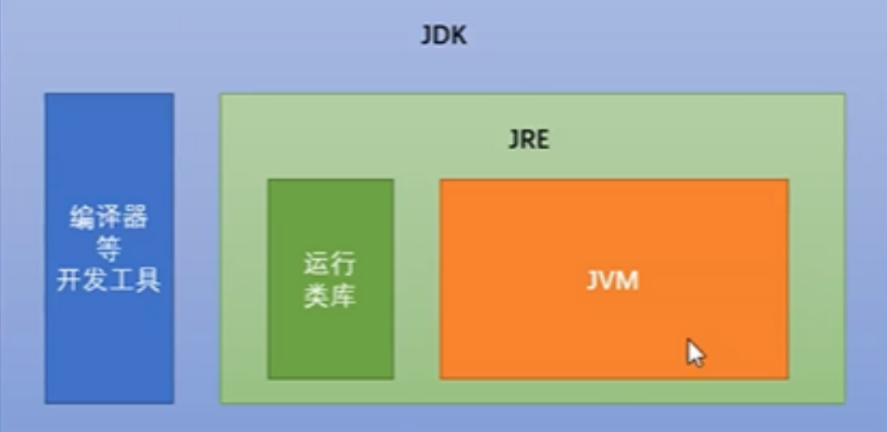
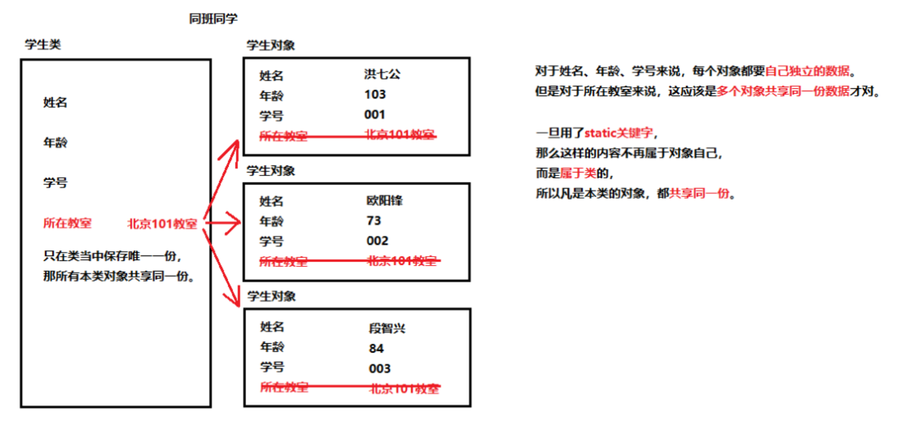
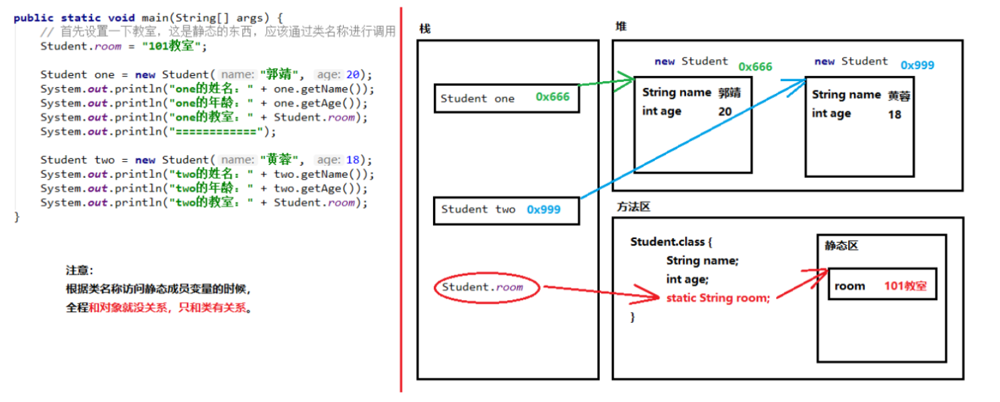
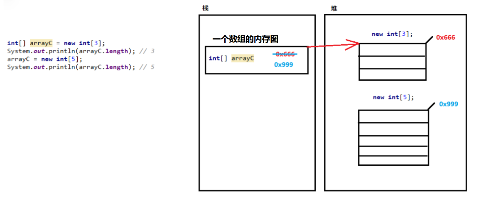
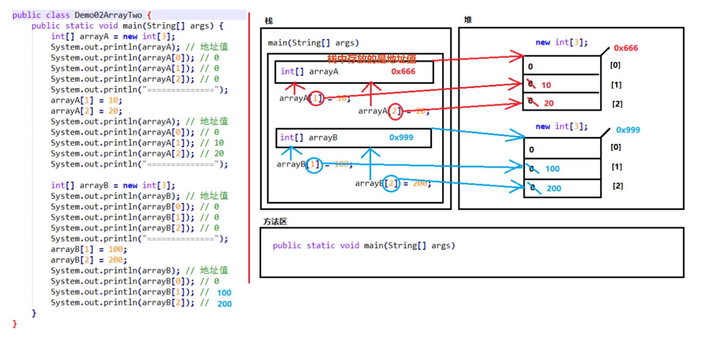
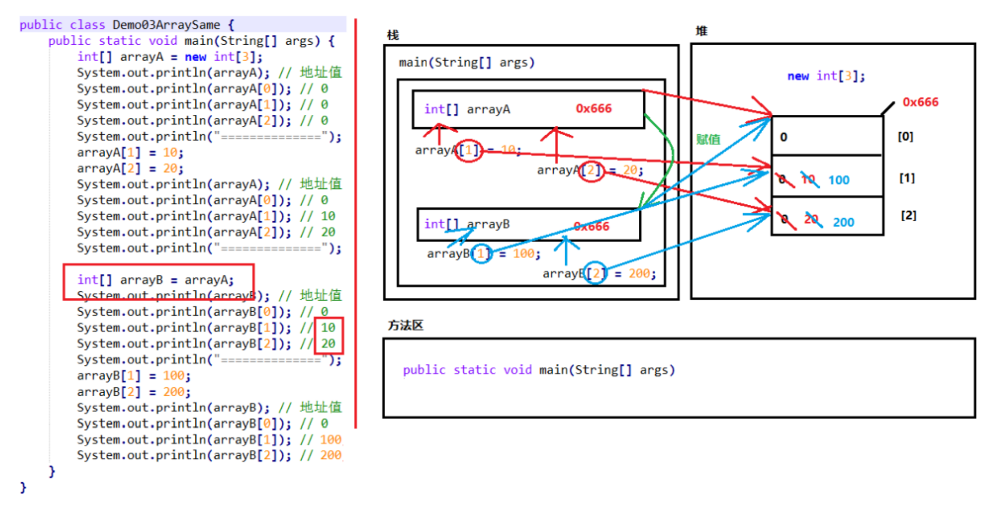
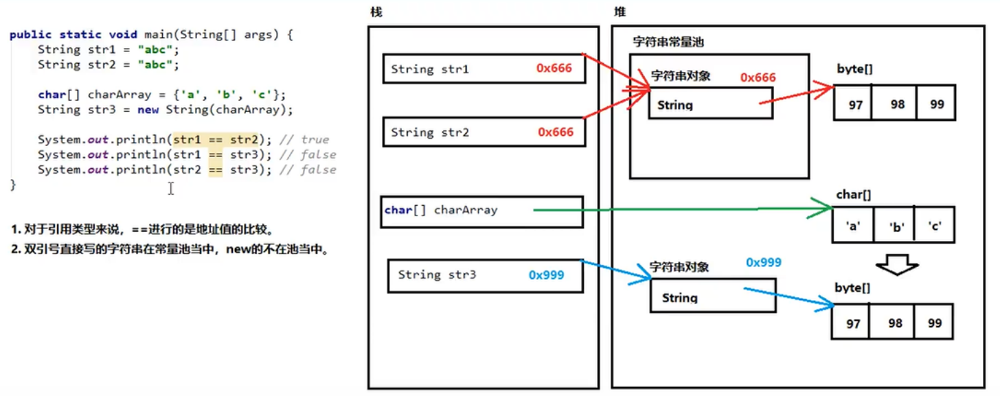
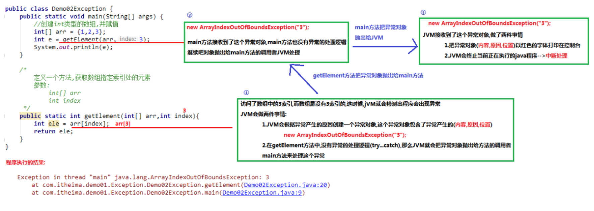

# 1、命令行操作与 JDK

<!--more-->

## 1.1、命令行基础知识

命令行 MS-DOS（Microsoft Disk Operation System）

命令行中的基本操作

```bash
# Win+R输入cmd
# 切换盘符：直接输入盘符名称
cd+文件夹名称			   # 进入文件夹，输入前半段+Tab可以自动补全，多次按Tab自动切换
cd+文件夹1\文件夹2\文件夹3	#直接进入多级文件夹
cd..			# 回到上一级文件夹
cd	\			# 直接回到根路径
dir				# 显示文件夹详细信息目录
cls				# clear screen清屏
exit			# 退出dos
```

## 1.2、JDK

<font size=4 style="font-weight:bold;background:yellow;">JVM、JDK 与 JRE</font>

- JVM（Java Virtual Machine）

  Java 虚拟机：**Java 是一种跨平台的语言**，是因为每个操作系统下有不同版本的虚拟机，比如 win 版 JVM、Linux 版 JVM、Mac 版 JVM，**虚拟机本身不跨平台** 。

- JRE（Java Runtime Environment）

  Java 程序的运行环境，包含 JVM 和运行时需要的核心类库。

- JDK（Java Development Kit）

  - Java 程序开发工具包，包含 JRE 和开发人员使用的工具；
  - 运行已有的 Java 程序，只需 JRE；
  - 开发全新 Java 程序 必须安装 JDK，JDK 包含 JRE，JRE 包含 JVM。

- JDK、JRE、JVM 之间的关系




## 1.3、一个 Java 程序运行的过程

> https://www.cnblogs.com/javastack/p/13397621.html

```java
Java 源程序 -> 编译器 -> Java 字节码文件 -> JVM 运行(字节码文件) 
         javac.exe:编译器				   java.exe:解释器
```

新建 `HelloWorld.java` 文件

```java
// 类的名称必须和文件名完全一样
public class HelloWorld {
    // 程序的起点
    public static void main(String[] args) {
        System.out.println("Hello,World!")	// 默认换行，不换行去掉ln
    }
}
```

- 打开命令行，输入以下内容执行程序。

  ```bash
  javac HelloWorld.java	# 编译，生成HelloWorld.class
  java HelloWorld			# 无.class后缀，运行程序，如果程序内容更改了需要用javac重新编译
  ```

- 命名规范

  类名：首字母大写，后面每个单词首字母大写。（大驼峰式）

  变量名/方法名：首字母小写，后面每个单词首字母大写。（小驼峰式）

<font size=4 style="font-weight:bold;background:yellow;">编译期</font>

**compile：**通过编译器进行<font color='#0000ff' style="font-weight:bold;">编译</font>，其中有各种校验解析步骤，把源代码编译成了可被虚拟机执行的字节码， `Java源码 -> Java字节码`

这个编译器是 jdk 里的 javac 编译器， `javac HelloWorld.java` 编译该源码，javac 编译器位置：`jdk\bin\javac.exe`

<font size=4 style="font-weight:bold;background:yellow;">运行期</font>

**load and execute：**<font color='#0000ff' style="font-weight:bold;">加载 Java 字节码并执行</font>

通过 jdk 里的java命令运行 Java 字节码，`java HelloWorld` 加载并执行该字节码，当运行 java 命令时，JRE 将与您指定的类一起加载。然后执行该类的主要方法，java 命令位置：`jdk\bin\java.exe`

Java 提供类加载器把虚拟机外部的字节码资源载入到**虚拟机的运行时环境（主要是指虚拟机的方法区）**并提供字节码验证器来保证载入的字节码是安全合法的，对程序没有危害的。

**加载器 (Class Loader)：**当字节码还没被类加载器加载之前它目前还处于虚拟机外部存储空间里，要想执行它需要通过类加载器来加载到虚拟机的运行时内存空间里，常见的类加载器：

- Bootstrap ClassLoader（启动类加载器）：加载位于 `<JAVA_HOME>\lib` 目录下的类文件，如 `rt.jar`；
- Extension ClassLoader（扩展类加载器）： 加载位于 `<JAVA_HOME>\lib\ext` 目录下的类文件；
- Application ClassLoader（应用程序类加载器）：加载位于类路径（ClassPath）下的类文件（这部分可参考[注解与反射](https://haining820.github.io/2022/08/14/mynotes/Java/annotation-reflex/annotation-reflex/)）

# 2、变量

## 2.1、局部变量与成员变量

**==局部变量和成员变量的区别==**

- **定义的位置不一样**

  局部变量：在方法的内部。

  成员变量：在方法的外部，直接写在类当中。

- **作用范围不一样**

  局部变量：只有方法当中才可以使用，出了方法就不能再用。

  成员变量：整个类全都可以通用。

- **默认值不一样**

  局部变量：没有默认值，如果要想使用，必须手动进行赋值。

  成员变量：如果没有赋值，会有默认值，规则和数组一样。

- 内存的位置不一样

  局部变量：位于栈内存

  成员变量：位于堆内存

- 生命周期不一样

  局部变量：随着方法进栈而诞生，随着方法出栈而消失。（生命周期稍微短一点）

  成员变量：随着对象创建而诞生，随着对象被垃圾回收而消失。（何时回收不能控制）

```java
public class Demo01VariableDifference {
    String name; // 成员变量

    public void methodA() {
        int num = 20; // 局部变量
        System.out.println(num);
        System.out.println(name);
    }

    public void methodB(int param) { 	// 方法的参数就是局部变量
        System.out.println(param);		// 参数在方法调用的时候, 必然会被赋值
        int age; // 局部变量
        // System.out.println(age); // 没赋值不能用
        // System.out.println(num); // 错误写法！
        System.out.println(name);
    }
}
```

## 2.2、BigDecimal

float，double 等表示会有损失，需要用到BigDecimal

- 不能处理无限循环小数；
- 可以使用 `BigDecimal.valueOf(0.580)`，或者 `new BigDecimal("0.580")`进行精确转换；

# 3、方法

一个方法（函数）

```java
public class HelloWorld     // 类的名称，必须和文件名完全一样
{
    public static void main(String[] args)	// 程序的起点
    {
        System.out.println("Hello,World!");	// 默认换行
        方法名称();
    }

    public static void 方法名称()	// 方法名称小驼峰命名
    {
        方法体;
    }
}
```

**==方法的重载（OverLoad）==**

多个方法名称一样，**参数个数** 或 **参数类型** 或 **多类型参数的顺序**不一样，叫方法的重载。

**==`&&` 与 `||` 具有短路效果==**

如果根据左边已经可以判断得到最终结果，那么右边的代码将不再执行，从而节省一定的性能。

**==Java 中的 switch/case==**

- switch 后面小括号中的数据类型只能是基本数据类型：byte/short/char/int，引用数据类型：String/enum；

- case 没有 break 向下执行，穿透下一个 case，直到遇到 break 或整体结束；

- 死循环后有语句会报错。

# 4、static

**==static 关键字修饰成员变量==**

如果一个成员变量使用了static关键字，**那么这个变量不再属于对象自己，而是属于所在的类。多个对象都可以共享这同一份数据。** 





以下代码只对 two 中的 room 进行了赋值，但是 one 中也能读取到。

```java
class Student {
    private int id; // 学号
    private String name; // 姓名
    private int age; // 年龄
    static String room; // 所在教室
    private static int idCounter = 0; // 学号计数器，每当new了一个新对象的时候，计数器++

    public Student() {
        this.id = ++idCounter;
    }

    public Student(String name, int age) {
        this.name = name;
        this.age = age;
        this.id = ++idCounter;
    }
   
    // get/set方法省略
}

public class Test {
    public static void main(String[] args) {
        Student one = new Student("郭靖", 19);
        one.room = "101教室";
        System.out.println("姓名：" + one.getName()
                + "，年龄：" + one.getAge() + "，教室：" + one.room
                + "，学号：" + one.getId());
        Student two = new Student("黄蓉", 16);
        System.out.println("姓名：" + two.getName()
                + "，年龄：" + two.getAge() + "，教室：" + two.room
                + "，学号：" + two.getId());
    }
}
/*  
    运行结果：
    姓名：郭靖，年龄：19，教室：101教室，学号：1
    姓名：黄蓉，年龄：16，教室：101教室，学号：2
*/
```

**==static 关键字修饰成员方法==**

一旦使用 static 修饰成员方法，那么这就成为了静态方法。静态方法不属于对象，而是属于类的。

- 如果没有 static 关键字，那么必须首先创建对象，然后通过对象才能使用它。

- 如果有了static关键字，那么不需要创建对象，**直接就能通过类名称来使用它**。

**无论是成员变量，还是成员方法。如果有了 static，都推荐使用类名称进行调用。** 

- 静态变量：`类名称.静态变量`
- 静态方法：`类名称.静态方法()`

**==注意事项==**

- 静态不能直接访问非静态。 

  因为在内存当中是**先**有的静态内容，**后**有的非静态内容。*“先人不知道后人，但是后人知道先人。”* 

- 静态方法当中不能用 this。 原因：this 代表当前对象，通过谁调用的方法，谁就是当前对象。

  静态和对象没有关系，静态通过类名直接调用，这时候没有对象，this 代表当前对象，通过谁调用的方法，谁就是当前对象，所以不能用 this。

```java
public class MyClass {
    int num; // 成员变量
    static int numStatic; // 静态变量

    // 成员方法
    public void method() {
        System.out.println("这是一个成员方法。");
        System.out.println(num);		// 成员方法可以访问成员变量
        System.out.println(numStatic);	// 成员方法可以访问静态变量
    }

    // 静态方法
    public static void methodStatic() {
        System.out.println("这是一个静态方法。");
        System.out.println(numStatic);	// 静态方法可以访问静态变量
        // System.out.println(num); 	// 错误！静态不能直接访问非静态
        // System.out.println(this); 	// 错误！静态方法中不能使用this关键字
    }
}
```

```java
public class Demo02StaticMethod {
    public static void main(String[] args) {
        MyClass obj = new MyClass(); // 首先创建对象
        obj.method();	// 然后才能使用没有static关键字的内容
        // 对于静态方法来说，可以通过对象名进行调用，也可以直接通过类名称来调用。
        // 通过对象名调用，没有问题但是不推荐
        // 这种写法在编译之后也会被javac翻译成为“类名称.静态方法名”
        obj.methodStatic(); 
        MyClass.methodStatic(); // 推荐
        
        myMethod();		// 对于本类当中的静态方法，可以省略类名称
        Demo02StaticMethod.myMethod(); // 完全等效
    }

    public static void myMethod() {
        System.out.println("自己的方法！");
    }

}
```

**==静态代码块==**

```java
public class 类名称 {
    static {
        // 静态代码块的内容
    }
}
```

**特点：**当第一次用到本类时，**静态代码块执行唯一的一次**。静态内容总是优先于非静态，所以静态代码块比构造方法先执行。

**静态代码块的典型用途：** 用来一次性地对静态成员变量进行赋值。

```java
class Person{
    static {
        System.out.println("静态代码块执行！");
    }
    public Person() {
        System.out.println("构造方法执行！");
    }
}
```

```java
public class Demo04Static {
    public static void main(String[] args) {
        Person p1 = new Person();
        Person p2 = new Person();
    }
}
/*  
	运行结果：
    静态代码块执行！
    构造方法执行！
    构造方法执行！
 */
```

# 5、接口

## 5.1、接口的使用

接口：接口就是多个类的公共规范。接口是一种引用数据类型，其中最重要的内容就是**抽象方法**。

在任何版本的 Java 中，接口都能定义抽象方法。接口当中的抽象方法，修饰符必须是两个固定的关键字：public、abstract，这两个关键字修饰符可以选择性地省略。

```java
public interface MyInterfaceAbstract {
    // 以下这几种写法都是抽象方法
    public abstract void methodAbs1();
    abstract void methodAbs2();
    public void methodAbs3();
    void methodAbs4();
}
```

**==如何定义一个接口==**

关键字由 class 换成了 interface 之后，编译生成的字节码文件仍然是：.java -> .class。

```java
public interface 接口名称 {
    // 接口内容
}
```

**==接口的使用步骤==**

- 接口不能直接使用，必须有一个**实现类**来**实现**该接口。（类比于子类继承父类）

  ```java
  public class 实现类名称 implements 接口名称 {
      // ...
  }
  ```

- 接口的实现类必须覆盖重写（实现）接口中所有的抽象方法。

  接口的实现类命名：接口名+Impl（implements 的缩写）

  **如果实现类并没有覆盖重写接口中所有的抽象方法，那么这个实现类自己就必须是抽象类。**

- 创建实现类的对象，进行使用。

  ```java
  MyInterfaceAbstract inter = new MyInterfaceAbstract();	// 不能直接new接口
  MyInterfaceAbstractImpl impl = new MyInterfaceAbstractImpl();	// 要创建实现类的对象进行调用
  ```

**==使用接口的注意事项==**

- 接口没有**静态代码块**或者**构造方法**。

- 一个类的直接父类是唯一的，但是一个类可以同时实现多个接口。

  ```java
  public class MyInterfaceImpl implements MyInterfaceA, MyInterfaceB {
      // 覆盖重写所有抽象方法
  }
  ```

## 5.2、JDK 8/JDK 9 对接口的扩展

在不同的 JDK 版本中，接口中可以有不同的内容。

- JDK 7：常量、抽象方法
- JDK 8：常量、抽象方法、默认方法、静态方法
- JDK 9：常量、抽象方法、默认方法、静态方法、私有方法

**==JDK 8：新增默认方法==**

从 <font color='red'>**JDK 8**</font> 开始，接口里允许定义默认方法，**子类可以选择是否重写默认方法。**在原有情况下，如果接口中新增了抽象方法，子类就必须覆盖重写，如果新增默认方法，就可以重写也可以不重写，不必为了添加新方法而将实现类修改为抽象类。

```java
public interface MyInterfaceDefault {
    public abstract void methodAbs();	// 抽象方法
    
    // 新添加了一个抽象方法
//    public abstract void methodAbs2();
    
    // 新添加的方法，改成默认方法
    public default void methodDefault() {
        System.out.println("这是新添加的默认方法");
    }
}
```

```java
public class MyInterfaceDefaultA implements MyInterfaceDefault {
    @Override
    public void methodAbs() {
        System.out.println("实现了抽象方法，AAA");
    }
}
```

```java
public class MyInterfaceDefaultB implements MyInterfaceDefault {
    @Override
    public void methodAbs() {
        System.out.println("实现了抽象方法，BBB");
    }
    @Override
    public void methodDefault() {
        System.out.println("实现类B覆盖重写了接口的默认方法");
    }
}
```

测试：当实现类中没有默认方法时，会向上找接口中的实现。

```java
public class Demo02Interface {
    public static void main(String[] args) {
        MyInterfaceDefaultA a = new MyInterfaceDefaultA();
        a.methodAbs(); // 输出：实现了抽象方法，AAA
        // 调用默认方法，如果实现类当中没有，会向上找接口
        a.methodDefault(); // 输出：这是新添加的默认方法

        MyInterfaceDefaultB b = new MyInterfaceDefaultB();
        b.methodAbs();	   // 输出：实现了抽象方法，BBB
        b.methodDefault(); // 输出：实现类B覆盖重写了接口的默认方法
    }
}
```

**==JDK 8：新增静态方法==**

从 <font color='red'>**JDK 8**</font> 开始，接口当中允许定义静态方法。（就是将 abstract 或者 default 换成 static 即可，带上方法体。）

```java
public static 返回值类型 方法名称(参数列表) {
    // 方法体
}
```

静态方法可以通过接口直接调用：`接口名称.静态方法名(参数);`

注意事项：**不能通过接口实现类的对象来调用接口当中的静态方法。** 要通过接口名称直接调用其中的静态方法。

```java
public interface MyInterfaceStatic {
    public static void methodStatic() {
        System.out.println("这是接口的静态方法！");
    }
}
```

```java
public class MyInterfaceStaticImpl implements MyInterfaceStatic {}
```

```java
public class Demo03Interface {
    public static void main(String[] args) {
        MyInterfaceStaticImpl impl = new MyInterfaceStaticImpl();
		// impl.methodStatic();	// 错误写法！
        MyInterfaceStatic.methodStatic();	// 直接通过接口名称调用静态方法
    }
}
```

**==JDK 9：新增私有方法==**

> 问题描述：我们需要抽取一个共有方法，用来解决两个默认方法之间重复代码的问题。 但是这个公有方法不应该让实现类使用，应该是私有化的。

从 <font color='red'>**JDK 9**</font> 开始，接口当中允许定义私有方法，主要用于解决多个方法之间重复代码问题。

- 普通私有方法，解决多个<font color='red'>**默认**</font>方法之间重复代码问题。

  ```java
  private 返回值类型 方法名称(参数列表) {
      // 方法体
  }
  ```

  通过抽取方法 `mothodCommon` 解决重复代码问题，实现类不应该能够使用抽取方法，抽取方法应该是私有的，这里就要用到普通私有方法。

  ```java
  public interface MyInterfacePrivateA {
      public default void methodDefault1() {
          System.out.println("默认方法1");
          // System.out.println("AAA");
          // System.out.println("BBB");
          methodCommon();
      }
  
      public default void methodDefault2() {
          System.out.println("默认方法2");
          // System.out.println("AAA");
          // System.out.println("BBB");
          methodCommon();
      }
      
      // public default void methodCommon(){}		// ×
      private void methodCommon() {	// 更改之后实现类就访问不到了
          System.out.println("AAA");
          System.out.println("BBB");
      }
  }
  ```

- 静态私有方法，解决多个<font color='red'>**静态**</font>方法之间重复代码问题。

  ```java
  private static 返回值类型 方法名称(参数列表) {
      // 方法体
  }
  ```

  静态私有方法解决代码抽取问题。

  ```java
  public interface MyInterfacePrivateB {
      public static void methodStatic1() {
          System.out.println("静态方法1");
          // System.out.println("AAA");
          // System.out.println("BBB");
          methodStaticCommon();
      }
  
      public static void methodStatic2() {
          System.out.println("静态方法2");
          // System.out.println("AAA");
          // System.out.println("BBB");
          methodStaticCommon();
      }
  
      // public static void methodStaticCommon(){}	// ×
      private static void methodStaticCommon() {
          System.out.println("AAA");
          System.out.println("BBB");
      }
  }
  
  /*****************************************************************/
  public static void main(String[] args) {
      MyInterfacePrivateB.methodStatic1();
      MyInterfacePrivateB.methodStatic2();
      // 错误写法！
      // MyInterfacePrivateB.methodStaticCommon();
  }
  ```

## 5.3、接口中的成员变量

接口当中也可以定义 “成员变量”，但是必须使用 `public static final` 三个关键字进行修饰。 从效果上看，这其实就是接口的【常量】，**一旦赋值，不可修改。**  一旦使用 final 关键字进行修饰，说明不可改变。

```java
// public static final 数据类型 常量名称 = 数据值;
public interface MyInterfaceConst {
    // 这其实就是一个常量，一旦赋值，不可以修改
    public static final int NUM_OF_MY_CLASS = 12;
}
```

```java
public class Demo05Interface {
    public static void main(String[] args) {
        System.out.println(MyInterfaceConst.NUM_OF_MY_CLASS);	// 访问接口当中的常量
    }
}
```

**==注意事项==**

- 接口当中的常量，可以省略 `public static final`，但是无论不写都默认是 `public static final`。
- 接口当中的常量，必须进行赋值；不能不赋值。(因为有 **final**)
- 接口中常量的名称，使用**完全大写的字母**，用下划线进行分隔。（推荐命名规则）

## 5.4、类的单继承

**==对子类实现的接口和父类中同名方法的处理==**

- 如果实现类所实现的多个接口当中，存在**重复的抽象方法**，那么**只需要覆盖重写一次**即可。

- 如果实现类实现的多个接口当中存在**重复的默认方法**，那么实现类（无论是否是抽象类）**一定要对冲突的默认方法进行覆盖重写**。

  ```java
  public interface MyInterfaceA {
      public abstract void methodA();
      public abstract void methodAbs();	// 重复的抽象方法
      public default void methodDefault() {	// 重复的默认方法
          System.out.println("默认方法AAA");
      }
  }
  ```

  ```java
  public interface MyInterfaceB {
      public abstract void methodB();
      public abstract void methodAbs();	// 重复的抽象方法
      public default void methodDefault() {	// 重复的默认方法
          System.out.println("默认方法BBB");
      }
  } 
  ```

  ```java
  public class MyInterfaceImpl /*extends Object*/ implements MyInterfaceA, MyInterfaceB {
      @Override
      public void methodA() {
          System.out.println("覆盖重写了A方法");
      }
  
      @Override
      public void methodB() {
          System.out.println("覆盖重写了B方法");
      }
  
      @Override
      public void methodAbs() {	// 覆盖重写一次即可
          System.out.println("覆盖重写了AB接口都有的抽象方法");
      }
  
      @Override
      public void methodDefault() {	// 对冲突的默认方法进行覆盖重写
          System.out.println("对多个接口当中冲突的默认方法进行了覆盖重写");
      }
  }
  ```

- 一个类如果直接父类当中的方法，和接口当中的默认方法产生了冲突，会优先用父类当中的方法。

  ```java
  public class Fu {
      public void method() {
          System.out.println("父类方法");
      }
  }
  /**********************************************/
  public interface MyInterface {
      public default void method() {
          System.out.println("接口的默认方法");
      }
  }
  /**********************************************/
  public class Zi extends Fu implements MyInterface {
      // 此处不用覆盖重写method()方法，继承是优于接口实现的，这就是“亲爹”与“干爹”的区别
  }
  /*********************************************************/
  public static void main(String[] args) {
      Zi zi = new Zi();
      zi.method();	// 输出：父类方法
  }
  ```

## 5.5、接口之间的多继承

- 类与类之间是单继承的，直接父类只有一个；
- 类与接口之间是多实现的，一个类可以实现多个接口；
- 与类与类之间不同，**接口与接口之间是多继承的**。

**==对子接口的父接口中同名方法的处理==**

多个父接口当中的抽象方法如果重复，子接口无需重写。

多个父接口当中的默认方法如果重复，那么子接口必须进行默认方法的覆盖重写，**而且要带着default关键字**。

```java
public interface MyInterfaceA {
    public abstract void methodA();
    public abstract void methodCommon();
    public default void methodDefault() {
        System.out.println("AAA");
    }
}
```

```java
public interface MyInterfaceB {
    public abstract void methodB();
    public abstract void methodCommon();
    public default void methodDefault() {
        System.out.println("BBB");
    }
}
```

这个子接口当中有几个方法？**4 个**

1. `methodA()` 来源于接口 A；
2. `methodB` 来源于接口 B；
3. `methodCommon()` 同时来源于接口 A 和 B；
4. `method()` 来源于我自己。

```java
public interface MyInterface extends MyInterfaceA, MyInterfaceB {
    public abstract void method();
    @Override
    public default void methodDefault() {
    }
}
```

# 6、数组

**==数组的特点==**

- 数组是一种引用数据类型；
- 数组当中的多个数据，类型必须统一；
- 数组的长度在程序运行期间不可改变。

## 6.1、Java 数组的初始化

数组的初始化会在内存当中创建一个数组，并且向其中赋予一些默认值。 如果不确定数组当中的具体内容，用动态初始化；否则，已经确定了具体的内容，用静态初始化。

**==动态初始化（指定长度）==**

```java
// 数据类型[] 数组名称 = new 数据类型[数组长度];
int[] arrayA = new int[300];		// 创建一个数组，里面可以存放300个int数据
double[] arrayB	= new double[10]; 	// 创建一个数组，能存放10个double类型的数据
String[] arrayC	= new String[5];	// 创建一个数组，能存放5个字符串
```

使用动态初始化数组的时候，其中的元素将会自动拥有一个默认值，规则如下。

- 整数类型，默认为 `0`； 
- 浮点类型，默认为 `0.0`； 
- 字符类型，默认为 `'\u0000'`；(u -> unicode) 
- 布尔类型，默认为 `false`； 
- 引用类型，默认为 `null`。

**==静态初始化（指定内容）==**

```java
// 数据类型[] 数组名称 = new 数据类型[] {元素1, 元素2, ...};
int[] arrayA = new int[]{5, 15, 25, 40};	// 创建一个数组，里面装的全都是int数字
String[] arrayB = new String[]{"Hello", "World", "Java"};    //	创建一个数组，用来装字符串
```

使用静态初始化数组的时候，格式还可以**省略**一下：

```java
// 数据类型[] 数组名称 = new 数据类型[] {元素1, 元素2, ...};	// 标准格式
// 数据类型[] 数组名称 = {元素1, 元素2, ...};	// 省略模式
int[] arrayA = {10, 20, 30};	// 省略格式的静态初始化
```

静态初始化其实也有设置默认值的过程，只不过系统自动马上将默认值替换成为了大括号当中的具体数值。虽然静态初始化没有直接告诉长度，但是根据大括号里面的元素具体内容，也可以自动推算出来长度。

还可以将初始化过程拆分：动态初始化和标准静态初始化可以拆分，省略格式的静态初始化不能拆分。

```java
int[] arrayC;
arrayC = new int[5];	// 动态初始化也可以拆分成为两个步骤 
int[] arrayB;
arrayB = new int[] {11, 21, 31};	// 静态初始化的标准格式，可以拆分成为两个步骤
// int[] arrayD;
// arrayD = {10, 20, 30}; // 错误！静态初始化的省略格式，不能拆分成为两个步骤。
```

**==数组是一种引用类型的变量==**

所有的引用类型变量，都可以赋值为一个 null 值。但是代表其中什么都没有。数组必须进行 new 初始化才能使用其中的元素。如果只是赋值了一个 null，没有进行 new 创建，那么将会发生：空指针异常 `NullPointerException`

```java
int[] array = null;
// array = new int[3];
System.out.println(array[0]);	// 空指针异常
```

**获得数组的长度：**`array.length`

**数组在方法中的应用**

数组作为方法的参数，传递进去的其实是数组的地址值。 数组作为方法的返回值，返回的其实也是数组的地址值。



## 6.2、Java 中的内存划分

Java 的内存需要划分成为 5 个部分:

- 栈（Stack）：存放的都是方法中的局部变量。方法的运行一定要在栈当中运行。

  局部变量：方法的参数，或者是方法{}内部的变量

  特点：有作用域，一旦超出作用域， 立刻从栈内存当中消失。

- 堆（Heap）：凡是 new 出来的东西，都在堆当中。

  堆内存里面的东西都有一个地址值：16进制

  堆内存里面的数据，都有默认值。规则:

  - 如果是整数，默认为0；
  - 如果是浮点数，默认为0.0；
  - 如果是字符，默认为`'\u0000'`；
  - 如果是布尔，默认为false；
  - 如果是引用类型，默认为null。

- 方法区（Method Area）：存储 .class 相关信息，包含方法的信息。

- 本地方法栈（Native Method Stack）：与操作系统相关。

- 寄存器（pc Register）：与CPU相关。





# 7、String

## 7.1、创建 String 对象

java.lang.String 类代表字符串，Java 程序中的所有字符串字面值（如 "abc" ）都作为此类的实例实现。 其实就是说：程序当中所有的双引号字符串，都是 String 类的对象。

**==String 的特点==**

- 字符串的内容永不可变。
- 正是因为字符串不可改变，所以字符串是可以共享使用的。
- 字符串效果上相当于是 `char[]` 字符数组，但是底层原理是 `byte[]` 字节数组。

字符串是不能改变的，再次赋值还是创建了新的字符串只是变量指向的地址发生了改变，如下面这种写法，字符串中的内容仍然是没有改变的。

```java
// 下面有两个字符串："Hello"，"Java",strA当中保存的是地址值。
// 本来地址值是Hello的0x666，后来地址值变成了Java的0x999
String strA = "Hello";
System.out.println(strA); // Hello
strA = "Java";
System.out.println(strA); // Java
```

**==创建 String 的 3+1 种方式==**

- `public String()`：创建一个空白字符串，不含有任何内容；

- `public String(char[] array)` ：根据字符数组的内容，来创建对应的字符串；

- `public String(byte[] array)` ：根据字节数组的内容，来创建对应的字符串；

- `String str = "Hello";` ：右边直接用双引号引上字符串内容，直接写上双引号，就是字符串对象 ，不需要new。

```java
public class Demo01String {
    public static void main(String[] args) {
        String str1 = new String(); // 使用空参构造，小括号留空，说明字符串什么内容都没有。
        System.out.println("第1个字符串：" + str1);

        char[] charArray = { 'A', 'B', 'C' };	// 根据字符数组创建字符串
        String str2 = new String(charArray);
        System.out.println("第2个字符串：" + str2);

        byte[] byteArray = { 97, 98, 99 };		// 根据字节数组创建字符串
        String str3 = new String(byteArray);
        System.out.println("第3个字符串：" + str3);

        String str4 = "Hello";		// 直接创建
        System.out.println("第4个字符串：" + str4);
    }
}
```

## 7.2、字符串常量池

在程序当中直接写上的**双引号字符串**，就储存在字符串常量池中。（ <font color='red'>**JDK 7**</font> 开始储存在堆中）

**关于 `==`**

- 对于基本类型来说，`==` 是进行**数值**的比较。 

- 对于引用类型来说，`==` 是进行**地址值**的比较。

字符串常量池的一个例子：在字符串常量池中储存的在用 `==` 比较时结果是 true。



## 7.3、String 常用的方法

**==字符串的内容比较==**

`==` 是进行对象的地址值比较，如果确实需要字符串的内容比较，可以使用以下两个方法：

- `public boolean equals(Object obj)`： 参数可以是任何对象，只有参数是一个字符串并且内容相同的才会给true；否则返回false。不过要**注意**：

  - 任何对象都能用Object进行接收。

  - equals方法具有对称性，也就是 `a.equals(b)` 和 `b.equals(a)` 效果一样。

  - 如果比较的双方一个常量一个变量，推荐把常量字符串写在前面。推荐：`"abc".equals(str)` 不推荐：`str.equals("abc")`。

    ```java
    String str5 = null;
    System.out.println("abc".equals(str5)); // 推荐：false
    // System.out.println(str5.equals("abc")); // 不推荐：报错，空指针异常NullPointerException
    ```

- `public boolean equalsIgnoreCase(String str)`：忽略大小写，进行内容比较, 只有英文字母区分大小写，其他都不区分大小写。

  ```java
  String strA = "Java";
  String strB = "java";
  System.out.println(strA.equals(strB)); // false，严格区分大小写
  System.out.println(strA.equalsIgnoreCase(strB)); // true，忽略大小写
  // 只有英文字母区分大小写，其他都不区分大小写
  System.out.println("abc一123".equalsIgnoreCase("abc壹123")); // false
  ```

**==获取 String 相关属性的常用方法==**

- `public int length()`：获取字符串当中含有的字符个数，拿到字符串长度；

  ```java
  // 获取字符串的长度
  int length = "asdasfeutrvauevbueyvb".length();
  System.out.println("字符串的长度是：" + length);
  ```

- `public String concat(String str)`：将当前字符串和参数字符串 拼接成新的字符串并返回, 作用相当于`+` ；

  ```java
  String str1 = "Hello";
  String str2 = "World";
  String str3 = str1.concat(str2);	// 拼接字符串
  System.out.println(str1); // Hello，原封不动
  System.out.println(str2); // World，原封不动
  System.out.println(str3); // HelloWorld，新的字符串
  ```

- `public char charAt(int index)`：获取指定索引位置的单个字符 。（索引从0开始）

  ```java
  char ch = "Hello".charAt(1);
  System.out.println("在1号索引位置的字符是：" + ch);
  ```

- `public int indexOf(String str)`：查找参数字符串在本字符串当中首次出现的索引位置，如果没有返回 `-1`。

  ```java
  String original = "HelloWorldHelloWorld";
  int index = original.indexOf("llo");
  System.out.println("第一次索引值是：" + index); // 2
  System.out.println("HelloWorld".indexOf("abc")); // -1
  ```

**==String 的截取==**

- `public String substring(int index)` 截取从参数位置一直到字符串末尾，返回新字符串。

  ```java
  String str1 = "HelloWorld";
  String str2 = str1.substring(5);
  System.out.println(str1); // HelloWorld，原封不动
  System.out.println(str2); // World，新字符串
  ```

- public String `substring(int begin, int end)` 截取从begin开始，一直到end结束，中间的字符串。**[begin,end)**，区间左闭右开。

  ```java
  String str1 = "HelloWorld";
  String str3 = str1.substring(4, 7);
  System.out.println(str3); // oWo
  ```

**==String 的转换与分割==**

- `public char[] toCharArray()`：将当前字符串拆分成为字符数组作为返回值。（对字符串中的元素逐个单独处理）

  ```java
  char[] chars = "Hello".toCharArray();	// 转换成为字符数组
  System.out.println(chars[0]); // H
  System.out.println(chars.length); // 5
  ```

- `public byte[] getBytes()`：获得当前字符串底层的字节数组。

  ```java
  byte[] bytes = "abc".getBytes();	// 转换成为字节数组
  for (int i = 0; i < bytes.length; i++) {
      System.out.println(bytes[i]);	// 输出：97 98 99
  }
  ```

- `public String replace(CharSequence oldString, CharSequence newString)`：将所有出现的老字符串替换成为新的字符串，返回替换之后的结果新字符串。（CharSequence 是一个接口，可以接受字符串类型。）

  ```java
  String str1 = "How do you do?";
  String str2 = str1.replace("o", "*");	// 字符串的内容替换
  System.out.println(str1); // How do you do?
  System.out.println(str2); // 输出：H*w d* y*u d*?
  
  String lang1 = "会不会玩儿呀！你大爷的！你大爷的！你大爷的！！！";
  String lang2 = lang1.replace("你大爷的", "****");
  System.out.println(lang2); // 输出：会不会玩儿呀！****！****！****！！！
  ```

- `public String[] split(String regex)`：按照参数的规则，将字符串切分成为若干部分，返回值是 String 数组。split 方法的参数其实是一个 “正则表达式”，比如若要按照英文句点 `.` 进行切分，括号内参数必须写 `\\.` 。

  ```java
  String str1 = "aaa,bbb,ccc";
  String[] array1 = str1.split(",");
  for (int i = 0; i < array1.length; i++) {
      System.out.println(array1[i]);	// 输出：aaa bbb ccc
  }
  
  String str3 = "XXX.YYY.ZZZ";
  String[] array3 = str3.split("\\.");
  System.out.println(array3.length); 	// 3
  for (int i = 0; i < array3.length; i++) {
      System.out.println(array3[i]);	// 输出：XXX YYY ZZZ
  }
  ```


# 8、异常

> 异常，就是不正常的意思。在生活中医生说，你的身体某个部位有异常，该部位和正常相比有点不同，该部位的功能将受影响。在程序中的意思也类似，异常指的并不是语法错误，语法错了，编译不通过，不会产生字节码文件，根本不能运行。
>
> https://blog.csdn.net/hguisu/article/details/6155636

**什么是异常？**

异常：指的是程序在执行过程中，出现的非正常的情况，最终会导致 JVM 的非正常停止。在 Java 等面向对象的编程语言中，异常本身是一个类，产生异常就是创建异常对象并抛出了一个异常对象，Java 处理异常的方式是中断处理。

**异常体系**

异常机制其实是帮助我们找到程序中的问题，异常的根类是 `java.lang.Throwable`，其下有两个子类：`java.lang.Error` 与 `java.lang.Exception`，平常所说的异常指 `java.lang.Exception`。


- Error：严重问题，不需要处理；

- Exception：异常类，程序本身可以处理的问题：

  - RuntimeException：都是 RuntimeException 类及其子类异常，如 NullPointerException（空指针异常）、IndexOutOfBoundsException（下标越界异常）等，这些异常是不检查异常，程序中可以选择捕获处理，也可以不处理。这些异常一般是由程序逻辑错误引起的，程序应该从逻辑角度尽可能避免这类异常的发生。

    运行时异常的特点是Java编译器不会检查它，也就是说，当程序中可能出现这类异常，即使没有用try-catch语句捕获它，也没有用throws子句声明抛出它，也会编译通过。

  - 非 RuntimeException：这种异常的特点是 Java 编译器会检查它，也就是说，当程序中可能出现这类异常，要么用 try-catch 捕获它，要么用 throws 抛出它，否则编译不会通过。

<font size=4 style="font-weight:bold;background:yellow;">Throwable 体系</font>

**`java.lang.Throwable`** 类是 Java 语言中所有错误或异常的父类。

- Exception：表示异常，异常产生后程序员可以通过代码的方式纠正，使程序继续运行，是必须要处理的。好比感冒、阑尾炎。

  - 运行期异常，Java 程序运行过程中出现的问题。在写代码时不会被发现。

    ```java
    public class Demo01Exception {
        public static void main(String[] args) {
            int[] arr = {1, 2, 3};
            try {
                // ArrayIndexOutOfBoundsException extends IndexOutOfBoundsException extends RuntimeException extends Exception
                System.out.println(arr[3]); // 可能会出现异常的代码
            } catch (Exception e) {
                System.out.println(e); 		// 异常的处理逻辑
            }
        }
    }
    ```
    
  - 编译期异常，在编写代码时就会发现问题。处理方法：`try-catch` 或者 `throws`

    ```java
    public class Demo01Exception {
        // ParseException extends Exception
        public static void main(String[] args) /*throws ParseException*/ {
            SimpleDateFormat sdf = new SimpleDateFormat("yyyy-MM-dd");	// 用来格式化日期
            Date date = null;
            try {
                // 这个方法会报异常
                date = sdf.parse("1999-0909");	// 把字符串格式的日期解析为Date格式的日期
            } catch (ParseException e) {
                e.printStackTrace();
            }
            System.out.println(date);
        }
    }
    ```

- Error：严重错误 Error，无法通过处理的错误，只能事先避免，好比绝症。 

  以下这段代码会产生内存溢出的错误，创建的数组太大了，超出了给 JVM 分配的内存，必须修改代码，使创建的数组小一点。

  ```java
  int[] arr = new int[1024*1024*1024];	// OutOfMemoryError: Java heap space
  int[] arr = new int[1024*1024];			// ✔
  ```

异常的产生过程



## 8.1、异常的处理

Java 异常处理的五个关键字：**try、catch、finally、throw、throws**

<font size=4 style="font-weight:bold;background:yellow;">throw关键字</font>

可以使用 throw 关键字在指定的方法中抛出指定的异常

使用格式：`throw new xxxException("异常产生的原因");`

**注意**

- throw 关键字必须写在方法的内部；

- throw 关键字后边 new 的对象必须是 `Exception` 或者 `Exception` 的子类对象；

- throw 关键字抛出指定的异常对象，我们就必须处理这个异常对象；

  - throw 关键字后边创建的是 `RuntimeException` 或者是 `RuntimeException` 的子类对象，可以不处理, 默认交给 JVM 处理（打印异常对象，中断程序）

  - throw 关键字后边创建的是编译异常（写代码的时候报错），我们就必须处理这个异常，要么 `throws`，要么`try-catch`

**举个例子：**定义一个方法，获取数组指定索引处的元素。

在编写方法时首先必须对方法传递过来的参数进行合法性校验，如果参数不合法，那么我们就必须使用抛出异常的方式,告知方法的调用者，传递的参数有问题。NullPointerException 和 ArrayIndexOutOfBoundsException 是两个运行期异常，我们不用处理，默认交给 JVM 处理。

```JAVA
public class Demo03Throw {
    public static int getElement(int[] arr, int index) {
        // 对传递过来的参数数组进行合法性校验，如果数组arr的值是null就抛出空指针异常，告知方法的调用者"传递的数组的值是null"
        if (arr == null) {
            throw new NullPointerException("传递的数组的值是null");
        }
        // 对参数index进行合法性校验，如果范围不在数组的索引范围内就抛出数组索引越界异常，告知方法的调用者"传递的索引超出了数组的使用范围"
        if (index < 0 || index > arr.length - 1) {
            throw new ArrayIndexOutOfBoundsException("传递的索引超出了数组的使用范围");
        }
        int elem = arr[index];
        return elem;
    }
    public static void main(String[] args) {
        //int[] arr = null;
        int[] arr = new int[3];
        int e = getElement(arr, 3);
        System.out.println(e);
    }
}
```

Throwable中的常用方法：

`public void printStackTrace()`：打印异常的详细信息，包含了异常的类型、异常的原因，还包括异常出现的位置，在开发和调试阶段，都得使用 printStackTrace。

`public String getMessage()`：获取发生异常的原因。提示给用户的时候，就提示错误原因。

# 9、常用 API

**==引用类型的一般使用步骤==**

- 导包

  ```java
  import 包路径.类名称;
  ```

  如果需要使用的目标类，和当前类位于同一个包下，则可以省略导包语句不写。 

  只有 `java.lang` 包下的内容（如 String）不需要导包，其他的包都需要 import 语句。

- 创建对象

  ```java
  类名称 对象名 = new 类名称();
  ```

- 使用

  ```java
  对象名.成员方法名()
  ```

## 9.1、Scanner

Scanner 类的功能：可以实现键盘输入数据到程序当中，使用步骤如下。

```java
Scanner sc = new Scanner(System.in); // System.in表示从键盘进行输入
// 输入字符串用next，nextInt是将字符串转换为int类型。
int num = sc.nextInt();		// 获取键盘输入的int数字
String str = sc.next();		// 获取键盘输入的字符串
```

## 9.2、Random

Random 类用来生成随机数字，使用步骤如下。

```java
// 1、导包
import java.util.Random;
// 2、创建对象
Random r = new Random();
// 3、使用
int num1 = r.nextInt();			// 获取一个随机的int数字，范围是int所有范围，有正负两种
int num2 = r.nextInt(3)			// 获取[0,3)范围内的随机数字，区间左闭右开
int result = r.nextInt(n) + 1;	// 获取[1,n]范围内的随机数字，[0,n)+1->[1,n]
```

## 9.3、ArrayList

数组的长度不可以发生改变，但是 ArrayList 集合的长度是可以随意变化的。

**==泛型与包装类==**

ArrayList 有一个尖括号 `<E>` 代表泛型，装在集合当中的所有元素，全都是统一的类型，叫做泛型。泛型是引用类型，不是基本类型。

**如果希望向集合 ArrayList 当中存储基本类型数据，必须使用基本类型对应的 “包装类”。**包装类都是引用类型，位于 `java.lang` 包下。

```bash
#基本类型#	  #包装类型#
byte	 |	  Byte		|
short	 |	  Short		|
int		 |	  Integer	|
long	 |	  Long		|
float	 |	  Float		|
double	 |	  Double	|
char	 |	  Character	|
boolean	 |	  Boolean	|
```

要注意 Integer 转换为 int 时可能会出现的空指针问题。

```java
Integer a = null;
int b = a.intValue();	// NullPointerException
```

**==自动拆/装箱==**

Java 从 <font color='red'>**JDK 1.5**</font> 开始，支持自动装箱、自动拆箱。

自动装箱：基本类型 -> 包装类型（引用类型）

自动拆箱：包装类型 -> 基本类型

**==ArrayList 的使用==**

对于 ArrayList 集合来说，直接打印得到的不是地址值，而是内容。 如果内容是空，得到的则是空的中括号`[]`。

```java
import java.util.ArrayList;

public class Test {
    public static void main(String[] args) {
        ArrayList<String> list = new ArrayList<>();
        System.out.println(list); // []
        // 备注：从JDK 1.7+开始，右侧的尖括号内部可以不写内容，但是<>本身还是要写的。
        // 向集合当中添加一些数据，需要用到add方法。
        list.add("赵丽颖");
        list.add("迪丽热巴");
        list.add("古力娜扎");
        list.add("玛尔扎哈");
        System.out.println(list); // [赵丽颖, 迪丽热巴, 古力娜扎, 玛尔扎哈]
    }
}
```

**==ArrayList 当中的常用方法==**

- `public boolean add(E e)`

  向集合当中添加元素，参数 e 的类型和泛型一致。返回值代表添加是否成功。对于 ArrayList 集合来说，add 一定是成功的，所以返回值可用可不用。 但是对于其他集合来说，add 不一定成功。

- `public E get(int index)`

  从集合当中获取元素，参数是索引编号，返回值就是对应位置的元素。

- `public E remove(int index)`

  从集合当中删除元素，参数是索引编号，返回值就是被删除掉的元素。

- `public int size()`

  获取集合的尺寸长度，返回值是集合中包含的元素个数。

## 9.3、Math

`java.util.Math` 类是数学相关的工具类，里面提供了大量的静态方法，完成与数学运算相关的操作。

```java
public static double abs(double num)    // 获取绝对值，有多种重载
public static double ceil(double num)   // 向上取整
public static double floor(double num)  // 向下取整
public static long round(double num)    // 四舍五入
Math.PI		// 代表近似的圆周率常量（double）
```

## 9.4、Arrays

`java.util.Arrays` 是一个与数组相关的工具类，里面提供了大量静态方法，用来实现数组常见的操作。

- `public static String toString(int[] arr)`：将参数数组变成字符串，默认格式：`[元素1,	元素2,	元素3...]`

  ```java
      int[] arr = {10,20,30};
      String str = Arrays.toString(arr);
      System.out.println(str);    // [10, 20, 30]
  ```

- `public static void sort(int[] arr)`：按照默认升序（从小到大）对数组的元素进行排序。

  - 如果是数值，sort 默认按照升序从小到大;

  - 如果是字符串，sort 默认按照字母升序;

  - 如果是自定义的类型，那么这个自定义的类需要有 Comparable 或者 Comparator 接口的支持。

  ```java
      int[] arr1 = {2, 5, 10, 4, 1};
      Arrays.sort(arr1);
      System.out.println(Arrays.toString(arr1));  // [1, 2, 4, 5, 10]
  
      String[] arr2 = {"bbb", "aaa", "ccc"};
      Arrays.sort(arr2);
      System.out.println(Arrays.toString(arr2));  // [aaa, bbb, ccc]
  ```

# 10、泛型

> https://blog.csdn.net/weixin_42071874/article/details/82993262

方法的泛型优先级高于类的泛型


```java
public class TDemo {
    public static void main(String[] args) {
        Show<String> show = new Show<String>();
//        show.print1(new Integer(1));    // 不能编译
        show.print1("1");
        show.print2(new Integer(1));    // 可以编译
    }
}

class Show<T> {
    /**
     * 该方法的参数类型必须和Demo的泛型类型相同
     */
    public void print1(T t) {
        System.out.println(t);
    }

    /**
     * <T>表示自定义泛型T，可以传入任何类型的参数
     */
    public <T> void print2(T t) {
        System.out.println(t);
    }
}
```

# 11、String...

`String...` 是 Java5 新加入的功能，表示一个可变长度的参数列表。其语法就是类型后跟 `…`，表示此处接受的参数为 0 到多个 Object 类型的对象，或者是一个 Object 数组。

例如有一个方法叫做 `test(String…strings)`，那么还可以增加方法 `test()`，但是不能写 `test(String[] strings)`（实际上跟前者是一样的），这样会造成编译错误，系统提示出现重复的方法。在使用的时候，对于 `test(String… strings)`，可以用以下几种方式 去调用：

```java
test();				 // 表示没有参数
test("aaa");		 // 一个参数
test("aaa"，"bbb");	// 两个参数
test(new String[]{“aaa”,”bbb”});	// 数组
```

**tips：**

- 如果既有 `test(String… strings)`，又有 `test()`，在调用 `test()` 时会优先使用 `test()` ；

- 只有当没有 `test()` 函数时调用 `test()`，程序才会走 `test(String… strings)`。


