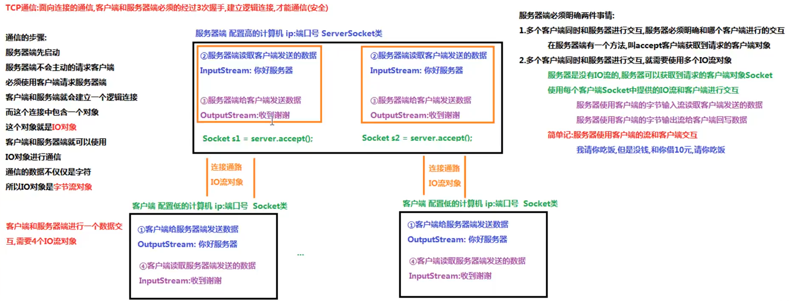
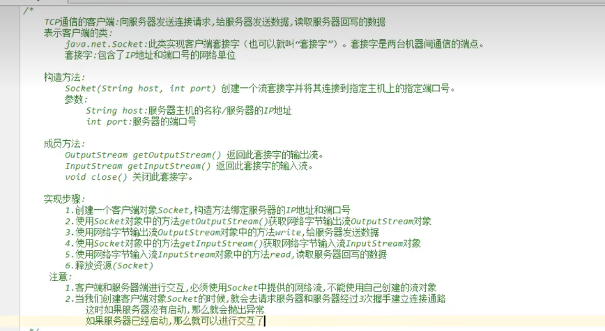

# 一、

## 1.1、软件结构

C/S 结构：Client/Server，客户端服务器结构。（QQ，迅雷）

B/S 结构：Browser/Server，浏览器服务器结构。（Chrome，火狐）

<!--more-->

## 1.2、网络通信协议

TCP/IP 协议：传输控制协议（Transmission Control Protocol），因特网互联协议（Internet Protocol），是 Internet最基本、最广泛的协议，有四层分层。

## 1.3、协议分类

通信协议比较复杂，**`java.net`** 包中包含的类和接口提供低层次的通信细节，可以直接使用这些类和接口，专注于网络程序开发，而不用考虑通信的细节。

 **`java.net`** 包提供两种常见网络协议的支持：

- UDP
- TCP

## 1.4、网络编程三要素

**==协议==**

计算机网络通信必须遵守的规则。

**==IP 地址==**

**IP 地址**：互联网协议地址（Internet Protocol Address），俗称 IP，IP 地址用来给一个网络中的计算机设备做唯一的编号。

**分类**

- IPv4：是一个 32 位的二进制数，通常被分为 4 个字节，表示成 `a.b.c.d` 的形式，例如 `192.168.65.100` 。其中 a、b、c、d 都是 0~255 之间的十进制整数，那么最多可以表示 42 亿个。 

- IPv6：由于互联网的蓬勃发展，IP 地址的需求量愈来愈大，但是网络地址资源有限，使得 IP 的分配越发紧张。为了扩大地址空间，IPv6 重新定义地址空间，采用 128 位地址长度，每 16 个字节一组，分成 8 组十六进制数，表示成 `ABCD:EF01:2345:6789:ABCD:EF01:2345:6789` ，解决了网络地址资源数量不够的问题。

**常用命令**

- 查看本机 IP 地址

  ```
  ipconfig
  ```

- 检查与目标地址之间的网络是否连通（特殊的 IP 地址，本机 IP 地址：`127.0.0.1`、`localhost`）

  ```]
  ping 127.0.0.1
  ping localhost
  ```

**==端口号==**

IP 地址唯一标识网络中的设备，端口号唯一标识设备中的进程（应用程序）。

**端口号**：用两个字节表示的整数，它的取值范围是 0~65535。其中 0~1023 之间的端口号用于一些知名的网络服务和应用，普通的应用程序需要使用 1024 以上的端口号。如果端口号被另外一个服务或应用所占用，会导致当前程序启动失败。

常用端口号

- 80：网络端口，`www.baidu.com:80`
- 3306：MySQL、1521：Oracle
- 8080：Tomcat

当需要网络的软件打开时，操作系统会为该软件随机分配一个端口号，或者该软件向操作系统要求指定的端口号。利用 `协议 + IP地址 + 端口号` 的三元组合，就可以标识网络中的进程了，那么进程间的通信就可以利用这个标识与其它进程进行交互。

# 二、

## 2.1、概述

TCP 额能实现两台计算机之间的数据交互，通信的两端要严格区分为客户端（Client）与服务端（Server）。

通信步骤：

- 启动服务端程序，等待客户端连接；

  `java.net.ServerSocket`，创建 ServerSocket 对象，开启服务，等待客户端连接。

- 客户端连接服务器，连接成功后进行通信，服务端不能主动连接客户端。

  `java.net.Socket`，创建 Socket 对象，向服务端发起连接请求，服务器响应请求进行连接。





TCP通信的客户端：向服务器发送请求，给服务器发送数据，读取服务器回写的数据。
java.net.Socket：实现客户答端套接字，套接字是两台机器通信的端点。
套接字：包含了IP地址和端口号的网络单位

# NIO

- Channels
- Buffers
- Selectors