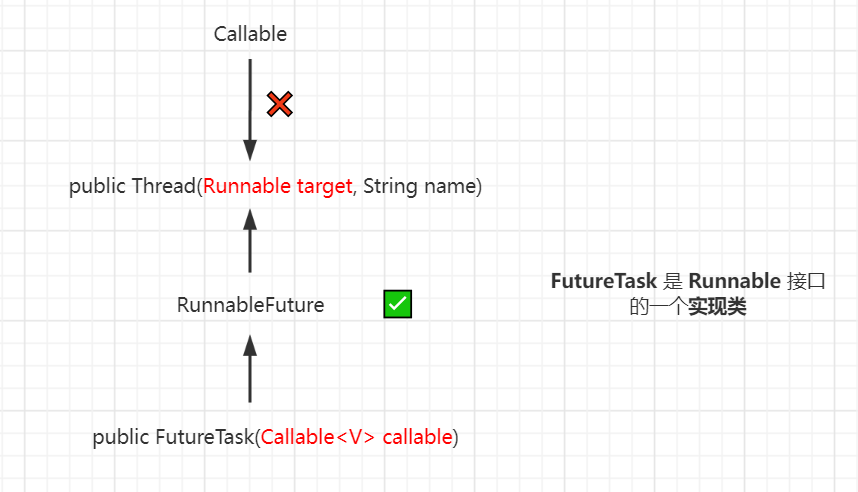
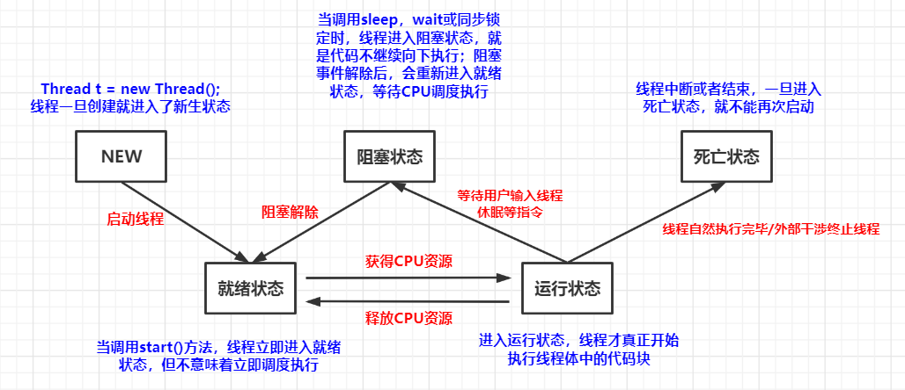

# 1、什么是线程

很多多线程是模拟出来的，真正的多线程是指有多个cpu，即多核，如服务器，如果是模拟出来的多线程，即在一个 cpu 的情况下，在同一个时间点，cpu 只能执行一个代码，**因为切换的很快，所以就有同时执行的错觉。**

<!--more-->

<font size=4 style="font-weight:bold;background:yellow;">进程、线程与程序</font>

- 说起进程，首先说下程序。程序是指令和数据的有序集合，其本身没有任何运行的含义，是一个静态的概念。 程序 -> 进程 -> 线程
- 而进程则是执行程序的一次执行过程，它是一个动态的概念，是系统资源分配的单位；
- 通常在一个进程中可以包含若干个线程，当然一个进程中至少有一个线程，不然没有存在的意义；
- 线程是CPU调度和执行的的单位。

<font size=4 style="font-weight:bold;background:yellow;">多线程的核心概念</font>

- 线程就是独立的执行路径，`main()` 被称为主线程，为系统的入口，用于执行整个程序，在程序运行时，即使没有自己创建线程，后台也会有多个线程，如主线程，gc 线程； 
- 线程的调度：在一个进程中，如果开辟了多个线程，线程的运行由调度器安排调度，调度器是与操作系统紧密相关的，先后顺序是不能人为的干预的；
- 对同一份资源操作时，会存在资源抢夺的问题，需要加入并发控制；线程会带来额外的开销，如并发控制开销、cpu 调度时间；每个线程在自己的工作内存交互，内存控制不当会造成数据不一致。

# 2、创建线程

<font size=4 style="font-weight:bold;background:yellow;">实现多线程的几种方法</font>

- 继承 Thread 类
- 实现 Runnable 接口
- 通过 Callable 和 FutureTask 创建线程
- 使用线程池方式：Callable 接口、Runnable 接口

## 2.1、Thread

> 线程开启之后不一定立即执行，要等 CPU 安排调度。

<font size=4 style="font-weight:bold;background:yellow;">使用</font>

- 自定义线程类继承 `Thread` 类，重写 `run()` 方法，编写线程执行体；
- 创建线程对象，调用 `start()` 方法启动线程。
- 不建议使用：**单继承具有局限性。**

```java
// 继承Thread类，重写run()方法，调用start开启线程
public class TestThread01 extends Thread {
    @Override
    public void run() {
        for (int i = 0; i < 20; i++) {
            System.out.println("学习--"+i);
        }
    }
    public static void main(String[] args) {
        TestThread01 thread01 = new TestThread01();
        thread01.start();
        for (int j = 0; j < 20; j++) {
            System.out.println("玩--"+j);
        }
    }
}
```

## 2.2、Runnable

<font size=4 style="font-weight:bold;background:yellow;">使用</font>

- 定义 `ThreadTest02` 类实现 `Runnable` 接口，重写 `run()` 方法，编写线程执行体，在创建 Thread 时作为参数传入，本质上还是使用 Thread；
- 创建 `Thread` 线程对象，传入 `Runnable` 接口的实现类，调用 `start()` 方法启动线程。
- **推荐使用：避免单继承局限性，灵活方便，方便同一个对象被多个线程使用。**

使用 Thread 调用 Runnable 接口实现类启动多线程的过程中用到了**静态代理模式**。

<font size=4 style="font-weight:bold;background:yellow;">静态代理模式</font>

- 真实对象和代理对象都要实现同一个接口，代理对象要代理真实角色。（比如结婚，你和中介都要实现 ”结婚“ 接口，但是中介可以准备结婚的其他事情，使得 ”你“ 可以只专注于结婚这一件事情上。）
- 好处：代理对象可以做很多真实对象做不了的事情，真实对象可以专注于做自己的事情。

```java
public class ThreadTest02 implements Runnable {
	// 实现Runnable接口，重写run方法
    @Override
    public void run() {
        for (int i = 0; i < 200; i++) {
            System.out.println("666-" + i);
        }
    }
    public static void main(String[] args) {
        // 创建Runnable接口实现类对象
        ThreadTest02 threadTest02 = new ThreadTest02();
        // 通过实现类对象创建线程对象启动多线程
        new Thread(threadTest02).start();
        for (int i = 0; i < 200; i++) {
            System.out.println("777-" + i);
        }
    }
}
```

<font size=4 style="font-weight:bold;background:yellow;">实例：龟兔赛跑</font>

```java
public class Race implements Runnable {
    private static String winner;

    @Override
    public void run() {
        for (int i = 0; i <= 100; i++) {
            // 兔子每走10步睡一觉
            if (Thread.currentThread().getName().equals("兔子") && i % 10 == 0) {
                try {
                    Thread.sleep(1);
                    System.out.println("兔子睡了一觉！");
                } catch (InterruptedException e) {
                    e.printStackTrace();
                }
            }
            boolean flag = gameOver(i);		// 先走到100步的一方获胜
            if (flag) {
                break;
            }
            System.out.println(Thread.currentThread().getName() + "-->跑了" + i + "步");
        }
    }

    private boolean gameOver(int steps) {
        if (winner != null) {
            return true;
        }
        if (steps >= 100) {
            winner = Thread.currentThread().getName();
            System.out.println(winner + "赢得了比赛！");
            return true;
        }
        return false;
    }

    public static void main(String[] args) {
        Race race = new Race();
        new Thread(race, "兔子").start();
        new Thread(race, "乌龟").start();
    }
}
```

## 2.3、Callable

<font size=4 style="font-weight:bold;background:yellow;">Callable 好处：有返回值，可以抛出异常</font>

Callable 接口类似于 Runnable ，因为它们都是为其实例可能由另一个线程执行的类设计的，然而，**Runnable 不返回结果，也不能抛出被检查的异常**。

- Callable 有泛型，实现 Callable 接口需要自定义泛型，泛型的类型就是 `call()` 方法的返回值；
- 实现 Callable 接口需要重写 `call()` 方法，需要抛出异常。

<font size=4 style="font-weight:bold;background:yellow;">使用 FutureTask 执行 Callable 对象</font>

> Thread 只能接收实现 Runnable 接口的对象，那么怎么识别 Callable 接口呢？

Callable 无法直接启动，需要通过一个 ”中介“ 来运行，这个中介就是 **FutureTask**，FutureTask 是 Runnable 接口的一个实现类。

正常线程的执行是在 Thread 中放入 Runnable 接口的实现对象然后启动，Thread 是没有参数为 Callable 的构造器的。

```java
new Thread(new Runnable()).start();
```

但是 Runnable 接口有一个子接口 RunnableFuture，RunnableFuture 有一个实现类叫做 FutureTask，这个类是可以通过 Callable 接口的对象来构建的，所以通过 FutureTask 就实现了 Thread 执行 Callable 的目的。（具体看图）




```java
// Callable 无法直接启动，需要通过 futureTask 来启动！
public class CallableTest {
    public static void main(String[] args) throws ExecutionException, InterruptedException {
        MyThread thread = new MyThread();   			// Callable 无法直接启动
        FutureTask futureTask = new FutureTask(thread); // 创建FutureTask适配类
        new Thread(futureTask,"A").start();
        // futureTask只会执行一次，判断到不是第一次执行就会自动return
        // 所以多次运行也只有一个输出结果
        new Thread(futureTask,"B").start();
        // 如果Callable中的操作比较耗时，get()可能会产生阻塞
        String o = (String) futureTask.get();   // 获取Callable的返回结果
        System.out.println(o);
    }
}
class MyThread implements Callable<String>{
    @Override
    public String call() {  // 泛型的参数等于方法的返回值
        System.out.println("=>call()");
        return "123";
    }
}
```

<font size=4 style="font-weight:bold;background:yellow;">使用线程池执行 Callable 对象</font>

Callable 还可以通过线程池的 `submit()` 方法来执行。

```java
// 使用线程池运行Callable接口
public class TestCallable implements Callable<Boolean> {

    private String str;

    public TestCallable(String str) {
        this.str = str;
    }

    @Override
    public Boolean call() {
        for (int i = 0; i < 20; i++) {
            System.out.println(str + " - " + i);
        }
        return true;
    }

    public static void main(String[] args) throws ExecutionException, InterruptedException {
        
        TestCallable t1 = new TestCallable("666");
        TestCallable t2 = new TestCallable("777");
        TestCallable t3 = new TestCallable("888");
        // 创建执行服务
        ExecutorService service = Executors.newFixedThreadPool(3);
        // 提交执行
        Future<Boolean> r1 = service.submit(t1);
        Future<Boolean> r2 = service.submit(t2);
        Future<Boolean> r3 = service.submit(t3);
        // 获取结果
        boolean rs1 = r1.get();
        boolean rs2 = r2.get();
        boolean rs3 = r3.get();
        // 关闭服务
        service.shutdown();
    }
}
```

<font size=4 style="font-weight:bold;background:yellow;">注意</font>

- futureTask 只会执行一次，判断不是第一次执行，futureTask 的 state 为非 new 会自动 return，所以在同一运行中执行多次只有一个结果，举例如下；
- 如果 Callable 中的操作比较耗时，使用`get()` 会产生阻塞。

```java
public class FuTaskCallable implements Callable<String> {
    @Override
    public String call() throws Exception {
        TimeUnit.SECONDS.sleep(1);
        System.out.println("Task is running...");	// 只在第一次运行时输出
        Date date = new Date();
        SimpleDateFormat sdf = new SimpleDateFormat ("yyyy/MM/dd hh:mm:ss");
        String format = sdf.format(date);
        return format;
    }
}
```

```java
@Test
public void testDuTask() throws ExecutionException, InterruptedException {
    FutureTask<String> futureTask = new FutureTask<>(new FuTaskCallable());

    LOGGER.info("isDone1->" + futureTask.isDone());	// false
    new Thread(futureTask).start();
    LOGGER.info(futureTask.get());

    TimeUnit.SECONDS.sleep(10);		// 休眠10s，结果不变，依然是第一个线程执行时的获得的时间

    LOGGER.info("isDone2->" + futureTask.isDone());	// true
    new Thread(futureTask).start();
    LOGGER.info(futureTask.get());	// 与第一次结果相同
}
```

# 4、线程的相关操作

## 4.1、线程的停止

- 推荐线程自己停止下来，不要使用 `stop()` 、`destroy()` 等过时或 JDK 不建议使用的方法；
- 建议使用一个标志位进行终止变量，当 `flag == false` 时，终止线程运行。



```java
public class TestStop implements Runnable {
    // 1、设置一个标志位
    private boolean flag = true;

    // 2、设置一个公开的方法停止线程，转换标志位
    public void stop() {
        this.flag = false;
    }

    @Override
    public void run() {
        int i = 0;
        while (flag) {
            System.out.println("Thread is running..." + i++);
        }
    }

    public static void main(String[] args) {
        TestStop testStop = new TestStop();
        new Thread(testStop).start();
        for (int i = 0; i < 1000; i++) {
            System.out.println("mian->" + i);
            if (i == 900) {
                // 通过主线程停止子线程
                // 调用stop方法切换标志位，让线程停止，Thread停止运行，main继续运行至结束。
                testStop.stop();
                System.out.println("线程停止了！");
            }
        }
    }
}
```



## 4.2、sleep

sleep 方法的参数指定当前线程阻塞的毫秒数：1000ms = 1ms

```java
sleep (1000);
```

- 线程在 sleep 的时候处于 TIMED_WAITING 状态；
- 在被打断的时候会抛出 InterruptedException
- sleep 存在异常 InterruptedException；
- sleep 时间达到后线程进入就绪状态；
- sleep 可以模拟网络延时（买票），倒计时等；
- 每一个对象都有一个锁，sleep 不会释放锁。

<font size=4 style="font-weight:bold;background:yellow;">wait 和 sleep 的区别？</font>

> https://juejin.cn/post/7067782161012621319

sleep 方法和 wait 方法都会使线程进入休眠状态，在休眠的过程中可以响应 interrupt 中断信号，抛出 InterruptedException 异常。

- 来自不同的类：
  - `wait()` 是 Object 类中的方法；
  - `sleep()` 是 Thread 类中的方法；

- 语法使用不同：

  - wait 方法必须配合 synchronized 一起使用，不然在运行时就会抛出 IllegalMonitorStateException 异常；
  - sleep 可以单独使用，无需配合 synchronized 一起使用，但是需要捕获异常；

- 唤醒方式不同

  - sleep 方法必须要传递一个超时时间的参数，且过了超时时间之后，线程会自动唤醒；
  - wait 方法可以不传递任何参数，不传递任何参数时表示永久休眠，直到另一个线程调用了 notify 或 notifyAll 之后，休眠的线程才能被唤醒；
  - 即 **sleep 方法具有主动唤醒功能，而不传递任何参数的 wait 方法只能被动的被唤醒**。

- 释放锁资源不同

  关于锁的释放，sleep 不会释放锁（抱着锁睡觉），wait 会释放锁。

- 线程进入状态不同

  调用 sleep 方法线程会进入 `TIMED_WAITING` 有时限等待状态，而调用无参数的 wait 方法，线程会进入 `WAITING` 无时限等待状态。

<font size=4 style="font-weight:bold;background:yellow;">InterruptedException</font>

<font color='red' style="font-weight:bold;">在什么情况下，线程会抛出 InterruptedException？</font>

**InterruptedException 注释**

```java
// 线程正在
// wait()或sleep() -> TIMED_WAITING 
// 或处于其他状态被中断时 -> BLOCKED、WAITING
Thrown when a thread is waiting, sleeping, or otherwise occupied, 
// 或者在活动之前或者活动的过程中 -> 从这三种状态转换为RUNNABLE状态
// 会抛出InterruptedException 
and the thread is interrupted, either before or during the activity. 
// 探测当前线程是否被中断
Occasionally a method may wish to test whether the current thread has been interrupted, 
and if so, to immediately throw this exception. The following code can be used to achieve this effect:
if (Thread.interrupted())  // Clears interrupted status!
    throw new InterruptedException();
```

当线程处于 **BLOCKED**、**WAITING**、**TIMED_WAITING** 状态或者**处于从这3种状态转换为 RUNNABLE 状态**的过程中如果被中断，则会抛出 InterruptedException。

<font color='red' style="font-weight:bold;">如果线程没有睡眠，调用该线程的 interrupt 方法会怎样？</font>

线程只有处于不活跃状态的情况下被中断才会抛出 InterruptedException，InterruptedException 只是中断在线程处于非活跃状态下的表现形式。

中断本身跟线程是否在活跃状态没有关系，线程在不活跃状态下遇到中断会抛出异常的原因是如果不抛出异常的话就回不到正常运行状态处理中断。如果线程本身就是活跃状态，调用 interrupt 方法就会被忽视掉并且继续运行原来的任务。

<font color='#924193' style="font-weight:bold;">TODO：`interrupt`、`interrupted`、`isInterrupted` 的区别？</font> [B站视频](https://www.bilibili.com/video/BV1CM4y157vc/?spm_id_from=pageDriver&vd_source=41d80bc4b64d14c77cf954da5d0d2841) 最后的部分继续看

如果想要处理这种活跃状态下的中断，首先线程需要知道自己的中断状态：

- `isInterrupted`：查看线程是否处于中断状态
- `interrupted`：查看中断状态，并且将线程处于中断状态

## 4.3、yield

线程礼让：让当前正在执行的线程暂停，但不阻塞；将线程从运行状态转为就绪状态；yield 会让 CPU 重新调度，所以礼让不一定成功，要看 CPU 心情！

```java
class MyYield implements Runnable {
    @Override
    public void run() {
        System.out.println(Thread.currentThread().getName() + "开始执行！");
        Thread.yield();
        System.out.println(Thread.currentThread().getName() + "停止执行！");
    }
}

public class TestYield {
    public static void main(String[] args) {
        MyYield myYield = new MyYield();
        new Thread(myYield, "线程A").start();
        new Thread(myYield, "线程B").start();
    }
}
```

## 4.4、join

使用 `join()`方法可以合并线程，执行的过程中其他线程阻塞，将 join 的线程执行完毕后，才能继续执行其他线程，**可以想象成插队**。

```java
public class TestJoin implements Runnable {
    @Override
    public void run() {
        for (int i = 0; i < 1000; i++) {
            System.out.println("线程vip来了，快跑！-->" + i);
        }
    }

    public static void main(String[] args) throws InterruptedException {
        TestJoin testJoin = new TestJoin();
        Thread thread = new Thread(testJoin);
        thread.start();
        // 主线程
        for (int j = 0; j < 500; j++) {
            if (j == 20) {
                thread.join();  // vip线程插队进去后要跑完，强制执行vip线程
            }
            System.out.println("main-->" + j);
        }
    }
}
```

## 4.5、getState



线程状态。线程可以处于下列状态之一： 

- `NEW`：**新生**，尚未启动的线程处于这种状态。 
- `RUNNABLE`：**运行**，在java虚拟机中执行的线程处于此状态；
- `BLOCKED`：**阻塞**，被阻塞等待监视器锁定的线程处于此状态；
- `WAITING`：**等待**，无限期的等待另一个线程执行特定动作的线程处于此状态；
- `TIMED_WAITING`：**超时等待**，正在等待另一个线程执行动作**达到指定等待时间**的线程处于此状态； 
- `TERMINATED`：**终止**，已退出的线程处于这种状态。 

在给定时间点上，一个线程只能处于一种状态。这些状态是虚拟机状态，它们并没有反映所有操作系统线程状态。 

**demo**



```java
public class TestState {
    public static void main(String[] args) throws InterruptedException {
        Thread thread = new Thread(() -> {
            for (int i = 0; i < 5; i++) {
                try {
                    Thread.sleep(1000);
                } catch (InterruptedException e) {
                    e.printStackTrace();
                }
            }
            System.out.println("////////////");
        });

        Thread.State state = thread.getState(); // 观察线程状态
        System.out.println(state);

        thread.start(); // 线程启动
        state = thread.getState();
        System.out.println(state);

        while (state != Thread.State.TERMINATED) {	// 只要线程不终止，就一直输出状态
            Thread.sleep(100);
            state = thread.getState();  // 更新线程状态
            System.out.println(state);  // 输出状态
        }
    }
}

/*
运行结果：
	NEW
    RUNNABLE
    TIMED_WAITING
    TIMED_WAITING
    ...
    TIMED_WAITING
    ////////////
    TERMINATED		// 死亡之后的线程就不能再次启动了
*/
```



## 4.6、priority

Java 提供一个线程调度器来监控程序中启动后进入就绪状态的所有线程，线程调度器按照优先级决定应该调度哪个线程来执行，优先级低只是意味着获得调度的概率低，并不是优先级低就不会被调用了，这都要看CPU的调度。

- 线程的优先级用数字表示，范围从1~10；

```java
Thread.MIN_PRIORITY = 1;
Thread.MAX_PRIORITY = 10;
Thread.NORM_PRIORITY = 5; 
```

- 使用以下方式改变或获取优先级

```java
getPriority().setPriority(int xxx);
```

<font size=4 style="font-weight:bold;background:yellow;">测试</font>



```java
class MyPriority implements Runnable {
    @Override
    public void run() {
        System.out.println(Thread.currentThread().getName() + "-->" + Thread.currentThread().getPriority());
    }
}

public class TestPriority extends Thread {
    public static void main(String[] args) {
        // 主线程默认优先级
        System.out.println(Thread.currentThread().getName() + "-->" + Thread.currentThread().getPriority());

        MyPriority myPriority = new MyPriority();
        Thread t1 = new Thread(myPriority,"t1");
        Thread t2 = new Thread(myPriority,"t2");
        Thread t3 = new Thread(myPriority,"t3");
        Thread t4 = new Thread(myPriority,"t4");
        Thread t5 = new Thread(myPriority);
        Thread t6 = new Thread(myPriority);
        // 先设置优先级，再启动
        t1.start();

        t2.setPriority(1);
        t2.start();

        t3.setPriority(4);
        t3.start();

        t4.setPriority(Thread.MAX_PRIORITY);
        t4.start();

        /*
            main-->5
            t1-->5
            t2-->1
            t4-->10
            t3-->4
         */

        // t5.setPriority(-1);
        // t5.start();
        // t6.setPriority(11);
        // t6.start();		// 超出范围会报错

    }
}
```



## 4.7、daemon

线程分为用户线程和守护线程

- 虚拟机必须确保用户线程执行完毕（用户线程：main）
- 虚拟机不用等待守护线程执行完毕（守护线程：后台记录操作日志，监控内存，垃圾回收...）

```java
public class TestDaemon {
	// 示例：我与上帝
    public static void main(String[] args) {
        God god = new God();
        You you = new You();

        Thread thread = new Thread(god);
        thread.setDaemon(true); // 默认是false，表示是用户线程，正常的线程都是用户线程
        thread.start(); 		// 上帝守护线程启动

        new Thread(you).start();    // 用户线程启动..
        // 在用户线程执行完毕后，守护线程还会执行一段时间后自动停止。

    }

}

// 上帝
class God implements Runnable {
    @Override
    public void run() {
        while (true) {
            System.out.println("God bless you!");
        }
    }
}

// 你
class You implements Runnable {
    @Override
    public void run() {
        for (int i = 0; i < 36500; i++) {
            System.out.println("你一生都开心的活着");
        }
        System.out.println("===GoodBye,World...===");
    }
}
```

# 5、线程的同步

并发：同一个对象被多个线程同时操作。

处理多线程问题时，多个线程访问同一个对象，并且某些线程还想修改这个对象。这时候我们就需要**线程同步**，线程同步其实就是一种等待机制，多个需要同时访问 此对象的线程进入这个对象的等待池形成队列，等待前面线程使用完毕，下一个线程再使用。

解决线程安全：**队列 + 锁** 

- 由于同一进程的多个线程共享同一块存储空间，在带来方便的同时，也带来了访问冲突问题，为了保证数据在方法中被访问时的正确性，在访问时加入 **锁机制 synchronized**，当一个线程获得对象的排它锁，独占资源，其他线程必须等待，使用后释放锁即可。

**锁机制也存在以下问题：**

- 一个线程持有锁会导致其他所有需要此锁的线程挂起；
- 在多线程竞争下，加锁、释放锁会导致比较多的**上下文切换**和**调度延时**，引起性能问题；
- 如果一个优先级高的线程等待一个优先级低的线程释放锁会导致**优先级倒置**，引起性能问题。

## 5.1、不安全案例

多个线程同时操作一个对象，会出现并发问题。

<font size=4 style="font-weight:bold;background:yellow;">不安全的买票</font>



```java
class BuyTicket implements Runnable {

    private int ticketNum = 10;
    boolean flag = true;

    @Override
    public void run() {
        // 买票
        while(flag) {
            try {
                buy();
            } catch (InterruptedException e) {
                e.printStackTrace();
            }
        }
    }

    private void buy() throws InterruptedException {
        // 判断是否有票
        if (ticketNum <= 0) {
            flag = false;
            return;
        }
        // 模拟延时
        Thread.sleep(100);
        // 买票
        System.out.println(Thread.currentThread().getName() + "拿到" + ticketNum--);
    }
}

// 不安全的买票
public class UnsafeBuyTicket {
    public static void main(String[] args) {
        BuyTicket station = new BuyTicket();
        new Thread(station,"苦逼的我").start();
        new Thread(station,"牛逼的你").start();
        new Thread(station,"可恶的老黄牛").start();
    }
}

```



<font size=4 style="font-weight:bold;background:yellow;">不安全的取钱</font>



```java
// 两个人取钱
public class UnsafeBank {
    public static void main(String[] args) {
        Account account = new Account(100, "旅游基金");

        Drawing you = new Drawing(account, 50, "于海洋");
        Drawing girlfriend = new Drawing(account, 100, "girlfriend");

        you.start();
        girlfriend.start();
    }
}

// 账户
class Account {
    int money;
    String name;

    public Account(int money, String name) {
        this.money = money;
        this.name = name;
    }
}

// 银行：模拟取款
class Drawing extends Thread {
    Account account;    // 账户
    int drawingMoney;   // 取多少钱
    int curMoney;       // 现在手里有多少钱

    public Drawing(Account account, int drawingMoney, String name) {
        super(name);
        this.account = account;
        this.drawingMoney = drawingMoney;
    }

    @Override
    public void run() {
        // 判断有没有钱
        if (account.money - drawingMoney < 0) {
            System.out.println(Thread.currentThread().getName() + "钱不够，取不了！");
            return;
        }

        try {
            Thread.sleep(1000);
        } catch (InterruptedException e) {
            e.printStackTrace();
        }

        // 卡内余额 = 余额 - 取出的钱
        account.money = account.money - drawingMoney;
        // 手里的钱
        curMoney = curMoney + drawingMoney;
        System.out.println(this.getName() + "取钱," + account.name + "余额为:" + account.money);
        // this.getName() 等价于 Thread.currentThread().getName()（this指代Thread） 
        System.out.println(this.getName() + "手里的钱:" + curMoney);
    }
}
```





```java
ublic class UnsafeList {
    public static void main(String[] args) throws InterruptedException {
        List<String> list = new ArrayList<>();
        for (int i = 0; i < 10000; i++) {	// 10000个线程同时操作
            new Thread(()->{
                // 两个线程在同一瞬间操作同一个位置，把两个数组添加到了同一个位置；
                // 数据被覆盖掉了，数据就会变少。
                list.add(Thread.currentThread().getName());
            }).start();
        }
        Thread.sleep(3000);
        System.out.println(list.size());    // 9997
    }
}
```



## 5.2、同步方法和同步块

由于我们可以通过 private 关键字来保证数据对象只能被方法访问，所以我们只需要针对方法提出一套机制，这套机制就是 synchronized 关键字。它包括两种用法：**synchronized 方法**和 **synchronized 块**。

<font size=4 style="font-weight:bold;background:yellow;">synchronized 方法</font>

```java
 public synchronized void method(int args) {
     
 } 	// 同步方法
```

synchronized 方法控制对 “对象” 的访问，每个对象对应一把锁，每个 synchronized 方法都必须获得调用该方法的对象的锁才能执行，否则线程会阻塞，方法一旦执行，就独占该锁，直到该方法返回才释放锁，后面被阻塞的线程才能获得这个锁 ，继续执行。

**缺陷：**若将一个大的方法申明为 synchronized 将会影响效率。通常情况下方法里面需要修改的内容才需要锁，太多的锁会浪费资源。

<font size=4 style="font-weight:bold;background:yellow;">synchronized 块</font>

```java
synchronized(obj){
    
}	// 同步块
```

- obj 称之为**同步监视器**，obj 可以是任何对象，但是推荐使用共享资源（可变化的对象，需要进行增删改的对象）作为同步监视器。
- 同步方法中无需指定同步监视器，因为同步方法的同步监视器就是 this，就是这个对象本身，或者是 class。

<font size=4 style="font-weight:bold;background:yellow;">同步监视器的执行过程</font>

- 第一个线程访问，锁定同步监视器，执行其中代码。
- 第二个线程访问，发现同步监视器被锁定，无法访问；
- 第一个线程访问完毕，解锁同步监视器；
- 第二个线程访问，发现同步监视器没有被锁，然后锁定并访问。

## 5.3、死锁

<font size=4 style="font-weight:bold;background:yellow;">什么是死锁？</font>

死锁是指多个线程各自占有一些共享资源，并且互相等待其他线程占有的资源才能运行，而导致两个或者多个线程都在等待对方释放资源，都停止执行的情形。

某一个同步块同时拥有 “ 两个以上对象的锁 ” 时，就可能会发生 “ 死锁 ” 的问题。

<font size=4 style="font-weight:bold;background:yellow;">死锁的四个必要条件</font>

下面列出了死锁的四个必要条件，只要想办法破坏其中的任意一个或多个条件，就可以避免死锁发生。

1、互斥条件：一个资源每次只能被一个进程使用。

2、请求与保持条件：一个进程因请求资源而阻塞时，对已获得的资源保持不放。

3、不剥夺条件：进程已获得的资源，在末使用完之前，不能强行剥夺。

4、循环等待条件：若干进程之间形成一种头尾相接的循环等待资源关系。

**demo**



```java
// 死锁：多个线程分别持有对方需要的资源，形成僵持。
// 模拟死锁：女生化妆
public class DeadLock {
    public static void main(String[] args) {
        Makeup g1 = new Makeup(0, "古力娜扎");
        Makeup g2 = new Makeup(1, "迪丽热巴");
        g1.start();
        g2.start();
    }
}

class LipStack {

}

class Mirror {

}

class Makeup extends Thread {   // 化妆
    static LipStack lipStack = new LipStack();	// 用static确保需要的资源只有一份
    static Mirror mirror = new Mirror();

    int choice;
    String girlName;    // 使用化妆品的人

    Makeup(int choice, String girlName) {
        this.choice = choice;
        this.girlName = girlName;
    }

    @Override
    public void run() {
        try {
            makeup();
        } catch (InterruptedException e) {
            e.printStackTrace();
        }
    }

    private void makeup() throws InterruptedException {
        if (choice == 0) {
            synchronized (lipStack) {	// 获得口红的锁
                System.out.println(this.girlName + "获得口红的锁");
                Thread.sleep(1000);
//                synchronized (mirror) {	// 拿着口红的锁想要继续获得镜子的锁
//                    System.out.println(this.girlName + "获得镜子的锁");
//                }
            }
            synchronized (mirror) {
                System.out.println(this.girlName + "获得镜子的锁");
            }
        } else {
            synchronized (mirror) {		// 获得镜子的锁
                System.out.println(this.girlName + "获得镜子的锁");
                Thread.sleep(2000);
//                synchronized (lipStack) {	// 拿着镜子的锁想要继续获得口红的锁
//                    System.out.println(this.girlName + "获得口红的锁");
//                }
            }
            synchronized (lipStack) {
                System.out.println(this.girlName + "获得口红的锁");
            }
        }
    }
}
```



