# 剑指offer

<!--more-->

# 03、[数组中重复的数字](https://leetcode-cn.com/problems/shu-zu-zhong-zhong-fu-de-shu-zi-lcof/)

>找出数组中重复的数字。
>
>在一个长度为 n 的数组 nums 里的所有数字都在 0～n-1 的范围内。数组中某些数字是重复的，但不知道有几个数字重复了，也不知道每个数字重复了几次。请找出数组中任意一个重复的数字。
>
>**示例 1：**
>
>```
>输入：[2, 3, 1, 0, 2, 5, 3]
>输出：2 或 3 
>```
>
>**限制：**
>
>```
>2 <= n <= 100000
>```

【方法一】按数组下标与数组的值交换找出重复数字，时间复杂度O(n)，空间复杂度O(1)。

```java
class Solution {
    public int findRepeatNumber(int[] nums) {
        for(int i = 0;i < nums.length;i++) {
            while(i != nums[i]) {
                int temp = nums[i];
                if(nums[i] == nums[temp]) return nums[i];
                nums[i] = nums[temp];
                nums[temp] = temp;
            }
        }
        return -1;
    }
}
```


```java
class Solution {
    public int findRepeatNumber(int[] nums) {
        int pos = 0;
        int len = nums.length;
        while(pos < len) {
            if(nums[pos] != pos) {
                int temp = nums[pos];   // 记录当前位置上的数字
                if(nums[pos] == nums[temp]) {
                    // 如果当前位置上的数字和以当前位置数字为下标的数组元素值相等
                    // 找到重复元素，直接返回
                    return nums[pos];
                }
                nums[pos] = nums[temp];
                nums[temp] = temp;  // 否则交换
            } else {
                pos++;
            }
        }
        return -1;
    }
}
```


【方法二】先排序，然后遍历，直接找出重复数字，时间复杂度O(nlogn)，空间复杂度O(nlogn)。

```java
class Solution {
    public int findRepeatNumber(int[] nums) {
        Arrays.sort(nums);
        for(int i = 0;i<nums.length;i++){
            if(nums[i] == nums[i+1]){
                return nums[i];
            }
        }
        return -1;
    }
}
```

### *关于`Arrays.sort()`函数

>Q: `java.util.Arrays` 中使用的 sort 采用的是什么算法？ 
>
>A: Java中`Arrays.sort`使用了两种排序方法，quick sort 和优化的 merge sort。 
>
>Q: 为什么采用两种排序算法？ 
>
>A: quick sort 主要是对哪些基本类型数据（int, short, long, float, double等）排序， 而 merge sort 用于对对象类型进行排序。 
>
>Q: quick sort 在统计意义上效率比 merge sort 高，为何不都采用 quick sort ？ 
>
>A: 概括的说，一个是稳定性，一个是移动次数。使用不同类型的排序算法主要是由于 quick sort 是不稳定的，而 merge sort 是 stable 的。这里的 stable 是指比较相等的数据在排序之后仍然按照排序之前的前后顺序排列（保序性）。对于基本数据类型，稳定性没有意义。而对于对象类型，稳定性是比较重要的，因为对象相等的判断可能只是判断关键属性，最好保持相等对象的非关键属性的顺序与排序前一致；另外一个原因是由于合并排序相对而言比较次数比快速排序少，移动（对象引用的移动）次数比快速排序多，而对于对象来说，比较一般比移动耗时。 
>
>merge sort  （1）最坏时间复杂度是 O(nlogn)； （2）平均时间复杂度是 O(nlogn)； （3）空间复杂度是 O(1)。 
>
>quick sort  （1）最坏时间复杂度是 O(n^2)； （2）平均时间复杂度是 O(nlogn)； （3）空间复杂度是 O(n)。

【方法三】新建数组记录数字出现次数，第二次出现直接返回。

# 04、[二维数组中的查找](https://leetcode-cn.com/problems/er-wei-shu-zu-zhong-de-cha-zhao-lcof/)

>在一个 n * m 的二维数组中，每一行都按照从左到右递增的顺序排序，每一列都按照从上到下递增的顺序排序。请完成一个高效的函数，输入这样的一个二维数组和一个整数，判断数组中是否含有该整数。
>
>**示例:**
>
>现有矩阵 matrix 如下：
>
>```
>[
> [1,   4,  7, 11, 15],
> [2,   5,  8, 12, 19],
> [3,   6,  9, 16, 22],
> [10, 13, 14, 17, 24],
> [18, 21, 23, 26, 30]
>]
>```
>
>给定 target = `5`，返回 `true`。
>
>给定 target = `20`，返回 `false`。
>
>**限制：**
>
>```
>0 <= n <= 1000
>0 <= m <= 1000
>```

【方法一】从右上角开始往左下角找，时间复杂度O(m+n)，空间复杂度O(1)。

```java
class Solution {
    public boolean findNumberIn2DArray(int[][] matrix, int target) {
        int m = matrix.length;
        if(m == 0){
            return false;
        }
        int n = matrix[0].length;
        for(int i = 0;i<m;++i){
            for(int j = n-1;j>=0;--j){
                if(matrix[i][j] == target){
                    return true;
                }else if(matrix[i][j] > target){
                    --n;  //如果右上角的元素比target大,说明右上角下方的元素都比target大,所以删掉
                    --i;  //再次遍历还是要从当前的i开始,break后i要++,所以这里先提前--
                    break;
                }else{
                    break;  //右上角元素比target小,右上角左侧的元素需要被删除,break后下次遍历直接从第下一行开始
                }
            }
        }
        return false;
    }
}
```

【方法二】从左下角开始往右上角找

# 05、[替换空格](https://leetcode-cn.com/problems/ti-huan-kong-ge-lcof/)

> 请实现一个函数，把字符串 `s` 中的每个空格替换成"%20"。
>
> **示例 1：**
>
> ```
> 输入：s = "We are happy."
> 输出："We%20are%20happy."
> ```
>
> **限制：**
>
> ```
> 0 <= s 的长度 <= 10000
> ```

【方法一】偷懒

```java
class Solution {
    public String replaceSpace(String s) {
        String res = s.replace(" ","%20");
        return res;
    }
}
```

【方法二】额外新建一个字符串变量，需要遍历整个 char 数组，时间复杂度O(n)，空间复杂度O(n)。

尽量不要在循环里面用+拼接，效率较低，最好用StringBuilder。

```java
class Solution {
    public String replaceSpace(String s) {
        String res = "";
        char[] ch = s.toCharArray();
        for(char c:ch){
            if(c!=' '){
                res+=c;
            }else{
                res+="%20";
            }
        }
        return res;
    }
}
```

【方法二】用 StringBuilder 做会快很多。

```java
class Solution {
    public String replaceSpace(String s) {
        StringBuilder sb = new StringBuilder();
        for(int i = 0; i < s.length(); i++){
            char c = s.charAt(i);
            if(c ==' '){
                sb.append("%20");
            }else{
                sb.append(c);
            }
        }
        return sb.toString();
    }
}
```

【方法三】用C++，不申请额外空间，使用双指针，一边移动一边复制。

### *String、StringBuffer和StringBuilder的区别

**1、String**

String类是不可变类，即一旦一个String对象被创建以后，包含在这个对象中的字符序列是不可改变的，直至这个对象被销毁。

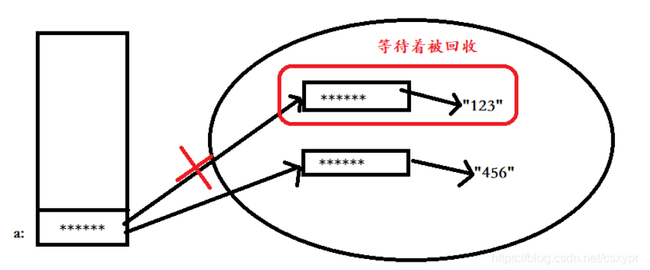

可以看出来，再次给a赋值时，并不是对原来堆中实例对象进行重新赋值，而是生成一个新的实例对象，并且指向“456”这个字符串，a则指向最新生成的实例对象，之前的实例对象仍然存在，如果没有被再次引用，则会被垃圾回收。

**2、StringBuffer**

StringBuffer对象则代表一个字符序列可变的字符串，当一个StringBuffer被创建以后，通过 StringBuffer 提供的 append()、insert()、reverse()、setCharAt()、setLength() 等方法可以改变这个字符串对象的字符序列。一旦通过 StringBuffer 生成了最终想要的字符串，就可以调用它的 toString() 方法将其转换为一个String对象。
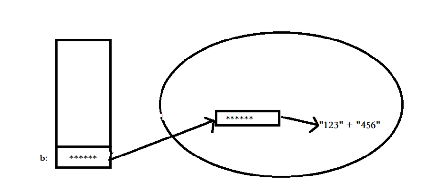

所以说StringBuffer对象是一个字符序列可变的字符串，它没有重新生成一个对象，而且在原来的对象中可以连接新的字符串。

**3、StringBuilder**

StringBuilder类也代表可变字符串对象。实际上，StringBuilder和StringBuffer基本相似，两个类的构造器和方法也基本相同。

**4、StringBuffer 和 StringBuilder 的区别**

区别：**==StringBuffer是线程安全的，而StringBuilder则没有实现线程安全功能，所以性能略高。==**

StringBuffer是如何实现线程安全的呢？StringBuffer类中的方法都添加了 **synchronized 关键字**，也就是给这个方法添加了一个锁，用来保证线程安全，StringBuilder中则没有。

# 06、[从尾到头打印链表](https://leetcode-cn.com/problems/cong-wei-dao-tou-da-yin-lian-biao-lcof/)

> 输入一个链表的头节点，从尾到头反过来返回每个节点的值（用数组返回）。
>
> **示例 1：**
>
> ```
> 输入：head = [1,3,2]
> 输出：[2,3,1]
> ```
>
> **限制：**
>
> ```
> 0 <= 链表长度 <= 10000
> ```

【方法一】用栈储存节点的值，从栈中取出数据的过程就相当于从链表的尾部开始遍历，时间复杂度O(n)，空间复杂度O(n)。

```java
/**
 * Definition for singly-linked list.
 * public class ListNode {
 *     int val;
 *     ListNode next;
 *     ListNode(int x) { val = x; }
 * }
 */
class Solution {
    public int[] reversePrint(ListNode head) {
        Stack<Integer> s = new Stack<>();
        ListNode cur = head;
        while(cur != null) {
            s.push(cur.val);
            cur = cur.next;
        }
        int[] res = new int[s.size()];
        int i = 0;
        while(!s.isEmpty()) res[i++] = s.pop();
        return res;
    }
}
```

【方法二】递归实现

```java
class Solution {
    List<Integer> list = new ArrayList<Integer>();
    public int[] reversePrint(ListNode head) {
        loop(head);
        int n = list.size();
        int[] res = new int[n];
        for(int i = 0;i<n;++i){
            res[i] = list.get(i);
        }
        return res;
    }
    public void loop(ListNode node){
        if(node == null){
            return;
        }
        if(node.next != null){
            loop(node.next);
        }
        list.add(node.val);
    }
}
```

【方法三】先正序遍历链表然后将结果反转。

```java
class Solution {
    public int[] reversePrint(ListNode head) {
        ListNode cur = head;
        List<Integer> list = new ArrayList<>();
        while(cur != null) {
            list.add(cur.val);
            cur = cur.next;
        } 
        int size = list.size();
        int[] res = new int[size];
        for(int i = size - 1;i >=0;i--) {
            res[size - i - 1] = list.get(i);
        }
        return res;
    }
}
```


# 07、[重建二叉树](https://leetcode-cn.com/problems/zhong-jian-er-cha-shu-lcof/)

> 输入某二叉树的前序遍历和中序遍历的结果，请重建该二叉树。假设输入的前序遍历和中序遍历的结果中都不含重复的数字。
>
> 例如，给出
>
> ```
> 前序遍历 preorder = [3,9,20,15,7]
> 中序遍历 inorder = [9,3,15,20,7]
> ```
>
> 返回如下的二叉树：
>
> ```
>     3
>    / \
>   9  20
>     /  \
>    15   7
> ```
>
> **限制：**
>
> ```
> 0 <= 节点个数 <= 5000
> ```

【方法一】递归实现

- 时间复杂度：O(n)，其中 n 是树中的节点个数。
- 空间复杂度：O(n)，除去返回的答案需要的 O(n) 空间之外，我们还需要使用 O(n) 的空间存储哈希映射，以及 O(h)（其中 h 是树的高度）的空间表示递归时栈空间。这里 h<n ，所以总空间复杂度为 O(n)。

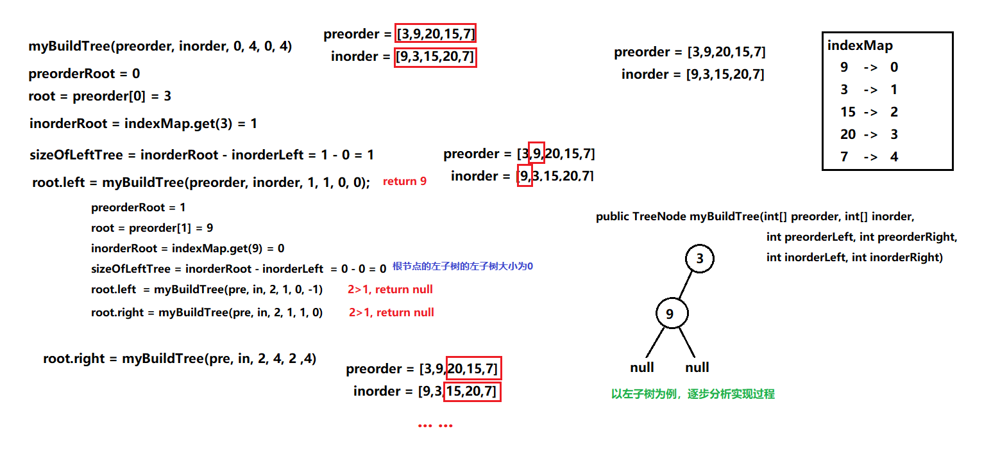

```java
/**
 * Definition for a binary tree node.
 * public class TreeNode {
 *     int val;
 *     TreeNode left;
 *     TreeNode right;
 *     TreeNode(int x) { val = x; }
 * }
 */
class Solution {
    private Map<Integer,Integer> indexMap;
    public TreeNode myBuildTree(int[] preorder, int[] inorder, 
    int preorderLeft, int preorderRight, 
    int inorderLeft, int inorderRight){
        if(preorderLeft > preorderRight){
            return null;
        }  //已经没有子节点,用null替代
        int preorderRoot = preorderLeft;  //前序遍历的第一个元素是当前树的头节点的值
        TreeNode root = new TreeNode(preorder[preorderRoot]);  //建立头节点
        int inorderRoot = indexMap.get(preorder[preorderRoot]);  //获取该头节点在中序遍历的位置
        //以此位置为轴,左侧部分是左子树,右侧部分是右子树
        int sizeOfLeftTree = inorderRoot - inorderLeft;  //计算左子树的节点个数
        //递归调用
        //从 preorderLeft+1 到 preorderLeft+sizeOfLeftTree 是左子树的前序遍历,
        //从 inorderLeft 到 inorderRoot-1 是左子树的中序遍历
        root.left = myBuildTree(preorder,inorder,preorderLeft+1,preorderLeft+sizeOfLeftTree,inorderLeft,inorderRoot-1);
        //从 preorderLeft+sizeOfLeftTree+1 到 preorderRight 是右子树的前序遍历,
        //从 inorderRoot+1 到 inorderRight 是右子树的中序遍历
        root.right = myBuildTree(preorder,inorder,preorderLeft+sizeOfLeftTree+1,preorderRight,inorderRoot+1,inorderRight);
        return root;
    }

    public TreeNode buildTree(int[] preorder, int[] inorder) {
        int len = preorder.length;
        indexMap = new HashMap<Integer,Integer>();
        for(int i = 0; i<len; i++){
            indexMap.put(inorder[i],i);  //为中序遍历建立映射,知道一个节点的值可以迅速找到其在中序遍历中的位置
        }
        return myBuildTree(preorder, inorder, 0, len-1, 0, len-1);
    }
}
```


# 09、[用两个栈实现队列](https://leetcode-cn.com/problems/yong-liang-ge-zhan-shi-xian-dui-lie-lcof/)

>用两个栈实现一个队列。队列的声明如下，请实现它的两个函数 `appendTail` 和 `deleteHead` ，分别完成在队列尾部插入整数和在队列头部删除整数的功能。(若队列中没有元素，`deleteHead` 操作返回 -1 )
>
>**示例 1：**
>
>```
>输入：
>["CQueue","appendTail","deleteHead","deleteHead"]
>[[],[3],[],[]]
>输出：[null,null,3,-1]
>```
>
>**示例 2：**
>
>```
>输入：
>["CQueue","deleteHead","appendTail","appendTail","deleteHead","deleteHead"]
>[[],[],[5],[2],[],[]]
>输出：[null,-1,null,null,5,2]
>```
>
>**提示：**
>
>- `1 <= values <= 10000`
>- `最多会对 appendTail、deleteHead 进行 10000 次调用`

【方法一】

```java
class CQueue {

    public Stack<Integer> inStack;
    public Stack<Integer> outStack;

    public CQueue() {
        inStack = new Stack<>();
        outStack = new Stack<>();
    }
    
    public void appendTail(int value) {
        inStack.push(value);
    }
    
    public int deleteHead() {
        if(outStack.empty()) {
            while(!inStack.empty()) {
                outStack.push(inStack.pop());
            }
        }
        return outStack.empty()?-1:outStack.pop();
    }
}

/**
 * Your CQueue object will be instantiated and called as such:
 * CQueue obj = new CQueue();
 * obj.appendTail(value);
 * int param_2 = obj.deleteHead();
 */
```

# 10-1、[斐波那契数列](https://leetcode-cn.com/problems/fei-bo-na-qi-shu-lie-lcof/)

> 写一个函数，输入 `n` ，求斐波那契（Fibonacci）数列的第 `n` 项（即 `F(N)`）。斐波那契数列的定义如下：
>
> ```
> F(0) = 0,   F(1) = 1
> F(N) = F(N - 1) + F(N - 2), 其中 N > 1.
> ```
>
> 斐波那契数列由 0 和 1 开始，之后的斐波那契数就是由之前的两数相加而得出。
>
> 答案需要取模 1e9+7（1000000007），如计算初始结果为：1000000008，请返回 1。
>
> **示例 1：**
>
> ```
> 输入：n = 2
> 输出：1
> ```
>
> **示例 2：**
>
> ```
> 输入：n = 5
> 输出：5
> ```
>
> **提示：**
>
> - `0 <= n <= 100`

【方法一】动态规划

```java
class Solution {
    public int fib(int n) {
        if(n == 0){
            return n;
        }
        int[] dp = new int[n+1];
        dp[0] = 0;
        dp[1] = 1;
        for(int i = 2; i < n+1; i++){
            dp[i] = dp[i-1] + dp[i-2];
            dp[i] %= 1000000007;
        }
        return dp[n];
    }
}
```

【方法一】空间优化后的动态规划

```java
class Solution {
    public int fib(int n) {
        if(n == 0 || n == 1){
            return n;
        }
        int a = 0;
        int b = 1;
        int res = 0;
        for(int i = 2; i < n+1; i++){
            res = b + a;
            res %= 1000000007;
            a = b;
            b = res;
        }
        return res;
    }
}
```

# 10-2、[青蛙跳台阶问题](https://leetcode-cn.com/problems/qing-wa-tiao-tai-jie-wen-ti-lcof/)

> 一只青蛙一次可以跳上1级台阶，也可以跳上2级台阶。求该青蛙跳上一个 `n` 级的台阶总共有多少种跳法。
>
> 答案需要取模 1e9+7（1000000007），如计算初始结果为：1000000008，请返回 1。
>
> **示例 1：**
>
> ```
> 输入：n = 2
> 输出：2
> ```
>
> **示例 2：**
>
> ```
> 输入：n = 7
> 输出：21
> ```
>
> **示例 3：**
>
> ```
> 输入：n = 0
> 输出：1
> ```
>
> **提示：**
>
> - `0 <= n <= 100`

【方法一】动态规划

```java
class Solution {
    public int numWays(int n) {
        if(n == 0){
            return 1;
        }
        int[] dp = new int[n + 1];
        dp[0] = 1;
        dp[1] = 1;
        for(int i = 2; i < n + 1; i++){
            dp[i] = dp[i-1] + dp[i-2];
            dp[i] %= 1000000007;
        }
        return dp[n];
    }
}
```

【方法一】空间优化后的动态规划

```java
class Solution {
    public int numWays(int n) {
        int a = 1;
        int b = 1;
        int res = 1;
        for(int i = 2; i < n + 1; i++){
            res = a + b;
            res %= 1000000007;
            a = b;
            b = res;
        }
        return res;
    }
}
```

# 11、[旋转数组的最小数字](https://leetcode-cn.com/problems/xuan-zhuan-shu-zu-de-zui-xiao-shu-zi-lcof/)

> 把一个数组最开始的若干个元素搬到数组的末尾，我们称之为数组的旋转。输入一个递增排序的数组的一个旋转，输出旋转数组的最小元素。例如，数组 `[3,4,5,1,2]` 为 `[1,2,3,4,5]` 的一个旋转，该数组的最小值为1。 
>
> **示例 1：**
>
> ```
> 输入：[3,4,5,1,2]
> 输出：1
> ```
>
> **示例 2：**
>
> ```
> 输入：[2,2,2,0,1]
> 输出：0
> ```

【方法一】使用`Arrays.sort()`函数直接对原数组排序，输出排序后的第一个元素即为最小值。

```java
class Solution {
    public int minArray(int[] numbers) {
        Arrays.sort(numbers);
        return numbers[0];
    }
}
```

【方法二】二分法搜索，利用最左边和最右边的数的大小关系进行比较。

注意特殊情况：1. 数组未进行排序	2. 有多个重复元素

```
Arrays.sort(numbers,left,right+1);  //排序后面的参数是左闭右开
```

`Arrays.sort()`函数后边还可以接参数，注意参数对应到数组上的范围是左闭右开。

```java
class Solution {
    public int minArray(int[] numbers) {
        int left = 0;
        int right = numbers.length - 1;
        int mid = left;
        while(numbers[left] >= numbers[right]) {
            // left上的值大于等于right上的值，left+1=right，说明right就是最小值（旋转点）
            if(left + 1 == right) {
                mid = right;
                break;
            }
            mid = left + (right - left) / 2;
            //low+high在low和high特别大的时候可能会造成溢出，使用减法避免了溢出发生
            if(numbers[left] < numbers[mid]) {
                // left上的值小于mid上的值，说明mid仍在前一段的递增序列中
                left = mid;
            } else if (numbers[right] > numbers[mid]){
                // right上的值大于mid上的值，说明mid已经进入后一段的递增序列中
                right = mid;
            } else {
                return directSearch(numbers,left,right);  //判断不出来,直接暴力处理
            }
        }
        return numbers[mid];  //如果未旋转,直接返回
    }
    public int directSearch(int[] numbers,int left,int right) {
        Arrays.sort(numbers,left,right+1);  //排序后面的参数是左闭右开
        return numbers[left];
    }
}
```

【方法二】同样是二分法搜索，只与最右边的指针进行比较，特殊情况也能处理。平均时间复杂度O(log n)，最坏情况下是数组中的数字全部相同，要多次舍弃数组最右边的数字，时间复杂度O(n)；空间复杂度O(1)。（[LeetCode官方题解](https://leetcode-cn.com/problems/xuan-zhuan-shu-zu-de-zui-xiao-shu-zi-lcof/solution/xuan-zhuan-shu-zu-de-zui-xiao-shu-zi-by-leetcode-s/)）

> 这种方法对于重复元素的处理：
>
> 第三种情况是 numbers[pivot] == numbers[high]。如下图所示，由于重复元素的存在，我们并不能确定 numbers[pivot] 究竟在最小值的左侧还是右侧，因此我们不能莽撞地忽略某一部分的元素。我们唯一可以知道的是，由于它们的值相同，所以无论numbers[high] 是不是最小值，都有一个它的「替代品」numbers[pivot]，因此我们可以忽略二分查找区间的右端点。

```java
class Solution {
    public int minArray(int[] numbers) {
        int left = 0;
        int right = numbers.length - 1;
        int mid;
        while(left < right){
            mid = left + (right - left)/2;
            if(numbers[mid] < numbers[right]) {
                // mid上的值小于right上的值，说明mid已经进入后一段的递增序列中
                right = mid;
            } else if(numbers[mid] > numbers[right]) {
                // mid上的值大于right上的值，说明mid仍在前一段的递增序列中
                left = mid + 1;
            } else {
                --right;
            }
        }
        return numbers[left];
    }
}
```

# 12、[矩阵中的路径](https://leetcode-cn.com/problems/ju-zhen-zhong-de-lu-jing-lcof/)

> 给定一个 `m x n` 二维字符网格 `board` 和一个字符串单词 `word` 。如果 `word` 存在于网格中，返回 `true` ；否则，返回 `false` 。
>
> 单词必须按照字母顺序，通过相邻的单元格内的字母构成，其中“相邻”单元格是那些水平相邻或垂直相邻的单元格。同一个单元格内的字母不允许被重复使用。
>
> 例如，在下面的 3×4 的矩阵中包含单词 "ABCCED"（单词中的字母已标出）。
>
> 
>
>  **示例 1：**
>
> ```
>输入：board = [["A","B","C","E"],["S","F","C","S"],["A","D","E","E"]], word = "ABCCED"
> 输出：true
> ```
> 
> **示例 2：**
>
> ```
>输入：board = [["a","b"],["c","d"]], word = "abcd"
> 输出：false
> ```
> 
> **提示：**
>
> - `1 <= board.length <= 200`
>- `1 <= board[i].length <= 200`
> - `board` 和 `word` 仅由大小写英文字母组成

【方法一】递归，回溯法

```java
class Solution {
    boolean[] visited;
    public boolean exist(char[][] board, String word) {
        int rows = board.length;
        int cols = board[0].length;
        visited = new boolean[rows * cols];
        Arrays.fill(visited,false);
        int pathLength = 0; // 已经访问过的路径
        for(int row = 0; row < rows; row++){
            for(int col = 0; col < cols; col++){
                if(backtrack(board,word,rows,cols,row,col,pathLength)){
                    return true;
                }
            }
        }
        return false;
    }
    public boolean backtrack(char[][] board,String word,int rows,int cols,int row,int col,int pathLength){
        // 字符串单词搜索到尾部,搜索成功
        if(pathLength >= word.length()){
            return true;
        }
        // 越界或已访问过,直接返回false
        if(row < 0 || row >= rows || col < 0 || col >= cols || visited[row*cols+col] == true){
            return false;
        }
        boolean hasPath = false;
        if(board[row][col] == word.charAt(pathLength)){
            visited[row*cols+col] = true;
            ++pathLength;
            hasPath = backtrack(board,word,rows,cols,row+1,col,pathLength) || 
                      backtrack(board,word,rows,cols,row-1,col,pathLength) ||
                      backtrack(board,word,rows,cols,row,col+1,pathLength) || 
                      backtrack(board,word,rows,cols,row,col-1,pathLength);  // 回溯
            //当前路径后搜索失败,回溯,将之前的操作重置
            if(!hasPath){
                visited[row*cols+col] = false;
                --pathLength;
            }
        }
        return hasPath;
    }
}
```

要注意的是 Java 字符串的结尾没有`'\0'`符号，在剑指Offer中判断目标字符串是否走到尽头做法如下。 但在 Java 中的类似写法，是错误的，会报越界异常！要用长度判断来替代。

```c++
if(str[pathLength] == '\0'){
    return true;
}
```

【方法二】一些改动，更加简洁，节省了 visited 数组空间，原因见注释。

```java
class Solution {
    public boolean exist(char[][] board, String word) {
        char[] words = word.toCharArray();
        for(int i = 0;i < board.length;i++) {
            for(int j = 0;j < board[0].length;j++) {
                if(backtrack(board,words,0,i,j)) {
                    return true;
                }
            }
        }
        return false;
    }
    public boolean backtrack(char[][] board, char[] words,int k,int i,int j) {
        if(i >= board.length || j >= board[0].length || i < 0 || j < 0 || words[k] != board[i][j]) {
            return false;
        }
        if(k == words.length - 1) {
            return true;
        }
        board[i][j] = '/';
        boolean flag = backtrack(board,words,k + 1,i + 1,j) || backtrack(board,words,k + 1,i - 1,j) || 
                       backtrack(board,words,k + 1,i,j + 1) || backtrack(board,words,k + 1,i,j - 1);
        // 递归搜索匹配字符串过程中，需要 board[i][j] = '/' 来防止 ”走回头路“ 。
        // 当匹配字符串不成功时，会回溯返回，此时需要board[i][j] = tmp 来”取消对此单元格的标记”。
        // 在DFS过程中，每个单元格会多次被访问的， board[i][j] = '/'只是要保证在当前匹配方案中不要走回头路。
        board[i][j] = words[k];
        return flag;
    }
}
```


# 13、[机器人的运动范围](https://leetcode-cn.com/problems/ji-qi-ren-de-yun-dong-fan-wei-lcof/)

> 地上有一个m行n列的方格，从坐标 `[0,0]` 到坐标 `[m-1,n-1]` 。一个机器人从坐标 `[0, 0] `的格子开始移动，它每次可以向左、右、上、下移动一格（不能移动到方格外），也不能进入行坐标和列坐标的数位之和大于k的格子。例如，当k为18时，机器人能够进入方格 [35, 37] ，因为3+5+3+7=18。但它不能进入方格 [35, 38]，因为3+5+3+8=19。请问该机器人能够到达多少个格子？
>
> **示例 1：**
>
> ```
> 输入：m = 2, n = 3, k = 1
> 输出：3
> ```
>
> **示例 2：**
>
> ```
> 输入：m = 3, n = 1, k = 0
> 输出：1
> ```
>
> **提示：**
>
> - `1 <= n,m <= 100`
> - `0 <= k <= 20`


【方法一】回溯法

```java
class Solution {
    
    //计算数位和
    public int add(int m){
        int res = 0;
        while(m != 0){
            res += m % 10;
            m /= 10;
        }
        return res;
    }
    
    //判断机器人是否能进入某个格子
    public boolean judge(int m,int n,int k){
        if(k >= add(m) + add(n)){
            return true;
        }
        return false;
    }

    //回溯法
    public int backtrack(int m, int n, int k,int x,int y){
        int count = 0;
        //越界或已访问过,直接返回
        if(x < 0 || y < 0 || x >= m || y >= n || visited[x][y] == true){
            return count;
        }
        if(judge(x,y,k)){  //如果可以进入的话
            visited[x][y] = true;  //标记为已访问过
            //计算是否能进入四周的格子
            count = 1 + backtrack(m,n,k,x+1,y) + backtrack(m,n,k,x-1,y)
                      + backtrack(m,n,k,x,y+1) + backtrack(m,n,k,x,y-1);
        }
        return count;
    }
    
    boolean[][] visited;
    public int movingCount(int m, int n, int k) {
        visited = new boolean[m][n];
        for(boolean[] b:visited){
            Arrays.fill(b,false);
        }  //初始化visited数组
        int res = backtrack(m,n,k,0,0);
        return res;
    }

}
```

【方法二】优化，分析可得：机器人**仅可通过向右和向下移动，访问所有可达解** 。

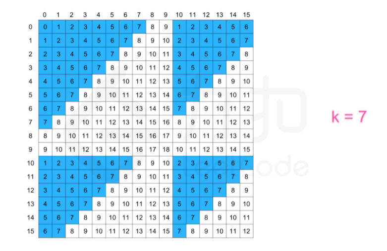

```java
class Solution {
    public boolean canMoveTo(int a,int b,int k) {
        int flag = 0;
        while(a != 0) {
            flag += a % 10;
            a /= 10;
        }
        while(b != 0) {
            flag += b % 10;
            b /= 10;
        }
        return flag > k ? false : true;
    }
    public int backtrack(int m, int n, int k, int i, int j) {
        int res = 0;
        if(i < 0 || i >= m || j < 0 || j >= n || !canMoveTo(i,j,k) || visited[i][j]) {
            return res;
        }
        visited[i][j] = true;
        res = 1 + backtrack(m,n,k,i + 1,j) + backtrack(m,n,k,i,j + 1);
        return res;
    }
    public boolean[][] visited;
    public int movingCount(int m, int n, int k) {
        visited = new boolean[m][n];
        return backtrack(m,n,k,0,0);
    }
}
```

【方法三】使用队列进行广度优先搜索

```java
class Solution {
    public int movingCount(int m, int n, int k) {
        if (k == 0) {
            return 1;
        }
        Queue<int[]> queue = new LinkedList<int[]>();	// 初始化队列
        int[] dx = {0, 1};
        int[] dy = {1, 0};	// 向右和向下的方向数组
        
        boolean[][] vis = new boolean[m][n];
        queue.offer(new int[]{0, 0});
        vis[0][0] = true;	// 将左上角的点进队
        int ans = 1;
        while (!queue.isEmpty()) {
            int[] cell = queue.poll();
            int x = cell[0], y = cell[1];	// 获取队头
            for (int i = 0; i < 2; ++i) {
                int tx = dx[i] + x;
                int ty = dy[i] + y;	// 访问队头的下方元素和右侧元素
                if (tx < 0 || tx >= m || ty < 0 || ty >= n || vis[tx][ty] || get(tx) + get(ty) > k) {
                    continue;	// 如果越界或者已经访问过或者不满足进入条件，跳过
                }
                queue.offer(new int[]{tx, ty});
                vis[tx][ty] = true;
                ans++;	// 可以进入，将其放入队列，结果加1
            }
        }
        return ans;
    }

    private int get(int x) {
        int res = 0;
        while (x != 0) {
            res += x % 10;
            x /= 10;
        }
        return res;
    }
}
```


# 14-1、[剪绳子](https://leetcode-cn.com/problems/jian-sheng-zi-lcof/)

> 给你一根长度为 `n` 的绳子，请把绳子剪成整数长度的 `m` 段（m、n都是整数，n>1并且m>1），每段绳子的长度记为 `k[0],k[1]...k[m-1]` 。请问 `k[0]*k[1]*...*k[m-1]` 可能的最大乘积是多少？例如，当绳子的长度是8时，我们把它剪成长度分别为2、3、3的三段，此时得到的最大乘积是18。
>
> **示例 1：**
>
> ```
> 输入: 2
> 输出: 1
> 解释: 2 = 1 + 1, 1 × 1 = 1
> ```
>
> **示例 2:**
>
> ```
> 输入: 10
> 输出: 36
> 解释: 10 = 3 + 3 + 4, 3 × 3 × 4 = 36
> ```
>
> **提示：**
>
> - `2 <= n <= 58`

【方法一】dp

```java
class Solution {
    public int cuttingRope(int n) {
        if(n == 2){
            return 1;
        }
        if(n == 3){
            return 2;
        }  //规定n的范围大于等于2,对n为2和3的情况进行特殊处理
        int[] dp = new int[n + 1];
        Arrays.fill(dp,0);  //将dp数组全部初始化为0
        dp[1] = 1;
        dp[2] = 2;
        dp[3] = 3;  //dp数组前三个元素并不是对应的dp值,而是为了方便计算所设定的特殊值
        for(int i = 3; i < n + 1; i++){
            for(int j = 1; j <= i/2; j++){
                dp[i] = Math.max(dp[j] * dp[i-j], dp[i]);  //对n取不同加法组合的乘积最大值
            }
        }
        return dp[n];
    }
}
```

【方法二】贪婪算法

当 n >= 5 的时候，可以证明 2 * (n-2) > n 并且 3 * (n-3) > n ，另外， 3 * (n-3) > 2 * (n-2) ，即剩下的绳子长度大于5时，我们应尽量将其剪成长度为3的绳子段。当绳子长度为4的时候，可以剪成 1 * 3 或 2 * 2，2 * 2的结果是4，其实和不剪是一样的（但是题目要求至少剪一刀），当绳子长度为1，2，3时为特殊情况。这样根据绳子可以分成多少个长度为3的份数与分完后的余数进行计算即可。

```java
class Solution {
    public int cuttingRope(int n) {
        if(n == 2){
            return 1;
        }
        if(n == 3){
            return 2;
        }  //规定n的范围大于等于2,对n为2和3的情况进行特殊处理
        int timeOf3 = n/3;
        if(n % 3 == 0){
            return (int)Math.pow(3,timeOf3);  //正好全部剪成长度为3的子段
        }else if(n % 3 == 1){
            return (int)Math.pow(3,timeOf3-1) * 4;  //剪完余1,剩下一个4段的不剪(当原绳长度为4时剪一刀,2*2)
        }else {
            return (int)Math.pow(3,timeOf3) * 2;  //剪完余2,直接乘2
        }
    }
}
```

# 15、[二进制中1的个数](https://leetcode-cn.com/problems/er-jin-zhi-zhong-1de-ge-shu-lcof/)

> 请实现一个函数，输入一个整数（以二进制串形式），输出该数二进制表示中 1 的个数。例如，把 9 表示成二进制是 1001，有 2 位是 1。因此，如果输入 9，则该函数输出 2。
>
> **示例 1：**
>
> ```
> 输入：00000000000000000000000000001011
> 输出：3
> 解释：输入的二进制串 00000000000000000000000000001011 中，共有三位为 '1'。
> ```
>
> **示例 2：**
>
> ```
> 输入：00000000000000000000000010000000
> 输出：1
> 解释：输入的二进制串 00000000000000000000000010000000 中，共有一位为 '1'。
> ```
>
> **示例 3：**
>
> ```
> 输入：11111111111111111111111111111101
> 输出：31
> 解释：输入的二进制串 11111111111111111111111111111101 中，共有 31 位为 '1'。
> ```
>
> **提示：**
>
> - 输入必须是长度为 `32` 的 **二进制串** 。

### * Java 中的位运算

|   <<    | 左移           | 各二进制位全部左移N位，高位丢弃，低位补0                     |
| :-----: | -------------- | ------------------------------------------------------------ |
| **>>**  | **右移**       | **各二进制位全部右移N位，若值为正，则在高位插入 0，若值为负，则在高位插入 1** |
| **>>>** | **无符号右移** | **各二进制位全部右移N位，无论正负，都在高位插入0**           |

【方法一】对 n 使用无符号右移，n 无论是正数还是负数都可以右移左端补0。

```java
public class Solution {
    // you need to treat n as an unsigned value
    public int hammingWeight(int n) {
        int res = 0;
        while(n != 0){
            res += n & 1;
            n = n>>>1;  //无符号右移
        }
        return res;
    }
}
```

【方法二】不对 n 进行右移，对 n 进行与运算的对象进行左移操作。

```java
public class Solution {
    // you need to treat n as an unsigned value
    public int hammingWeight(int n) {
        int res = 0;
        int flag = 1;
        while(flag != 0){
            // 不直接加到res上的原因:位运算的结果是flag对应二进制转换为10进制的结果
            // flag不断左移,是1乘以2的对应位数次幂,不再是1或0了
            // res += n & flag;
            if((n & flag) != 0){
                // System.out.println(n&flag);
                ++res;
            }
            flag = flag << 1;
        }
        return res;
    }
}
```

【方法三】n 与自身减一进行与运算

**规律总结：一个整数减去1，再和原整数进行与运算，会将该整数最右边的1变成0。**（剑指Offer P102）

根据这个规律，可以得出，一个整数的二进制表示 有多少个1，就可以进行多少次这样的操作。

```java
public class Solution {
    // you need to treat n as an unsigned value
    public int hammingWeight(int n) {
        int res = 0;
        while(n != 0){
            res++;
            n = n & (n-1);
        }
        return res;
    }
}
```

# 16、[数值的整数次方](https://leetcode-cn.com/problems/shu-zhi-de-zheng-shu-ci-fang-lcof/)

> 实现 pow(x, n)，即计算 x 的 n 次幂函数（即，xn）。不得使用库函数，同时不需要考虑大数问题。
>
> **示例 1：**
>
> ```
> 输入：x = 2.00000, n = 10
> 输出：1024.00000
> ```
>
> **示例 2：**
>
> ```
> 输入：x = 2.10000, n = 3
> 输出：9.26100
> ```
>
> **示例 3：**
>
> ```
> 输入：x = 2.00000, n = -2
> 输出：0.25000
> 解释：2-2 = 1/22 = 1/4 = 0.25
> ```
>
> **提示：**
>
> - `-100.0 < x < 100.0`
> - `-231 <= n <= 231-1`
> - `-104 <= xn <= 104`

【方法一】 Java代码中 int32 变量 n∈[−2147483648,2147483647] ，因此当 n=-2147483648时执行 n = −n 会因越界而赋值出错。解决方法是先将n存入long变量m，后面用m操作即可。时间复杂度O(log2n)，空间复杂度O(1)。[参考题解](https://leetcode-cn.com/problems/shu-zhi-de-zheng-shu-ci-fang-lcof/solution/mian-shi-ti-16-shu-zhi-de-zheng-shu-ci-fang-kuai-s/)

```java
class Solution {
    public double myPow(double x, int n) {
        if(x == 0 && n < 0) {
            return 0;
        }
        long m = n;
        if(m < 0){
            x = 1 / x;
            m = -m;
        }  // 如果指数小于0的话就将底数取倒数,指数取相反数
        double res = 1.0;
        while(m > 0) {
            if((m & 1) == 1) {
                res *= x;
            }  // 无论如何除到最后都会符合条件(m&1)==1,执行res*=x
            x *= x;  // 类似二分法
            m >>= 1;  // 除以2向下取整
        }  //直接用while循环实现,省去递归
        return res;
    }
}
```

# 17、[打印从1到最大的n位数](https://leetcode-cn.com/problems/da-yin-cong-1dao-zui-da-de-nwei-shu-lcof/)

> 输入数字 `n`，按顺序打印出从 1 到最大的 n 位十进制数。比如输入 3，则打印出 1、2、3 一直到最大的 3 位数 999。
>
> **示例 1:**
>
> ```
> 输入: n = 1
> 输出: [1,2,3,4,5,6,7,8,9] 
> ```
>
> 说明：
>
> - 用返回一个整数列表来代替打印
> - n 为正整数

# 18、[删除链表的节点](https://leetcode-cn.com/problems/shan-chu-lian-biao-de-jie-dian-lcof/)

> 给定单向链表的头指针和一个要删除的节点的值，定义一个函数删除该节点。
>
> 返回删除后的链表的头节点。
>
> **注意：**此题对比原题有改动
>
> **示例 1:**
>
> ```
> 输入: head = [4,5,1,9], val = 5
> 输出: [4,1,9]
> 解释: 给定你链表中值为 5 的第二个节点，那么在调用了你的函数之后，该链表应变为 4 -> 1 -> 9.
> ```
>
> **示例 2:**
>
> ```
> 输入: head = [4,5,1,9], val = 1
> 输出: [4,5,9]
> 解释: 给定你链表中值为 1 的第三个节点，那么在调用了你的函数之后，该链表应变为 4 -> 5 -> 9.
> ```
>
> **说明：**
>
> - 题目保证链表中节点的值互不相同
> - 若使用 C 或 C++ 语言，你不需要 `free` 或 `delete` 被删除的节点

【方法一】

```java
/**
 * Definition for singly-linked list.
 * public class ListNode {
 *     int val;
 *     ListNode next;
 *     ListNode(int x) { val = x; }
 * }
 */
class Solution {
    public ListNode deleteNode(ListNode head, int val) {
        if(head == null){
            return null;
        }
        if(head.val == val){
            return head.next;
        }
        ListNode cur = head;
        ListNode pre = head;
        while(cur != null) {
            if(cur.val == val) {
                pre.next = cur.next;
            }
            pre = cur;
            cur = cur.next;
        }
        return head;
    }
}
```


# 19、[正则表达式匹配](https://leetcode-cn.com/problems/zheng-ze-biao-da-shi-pi-pei-lcof/)

> 请实现一个函数用来匹配包含`'.'`和`'*'`的正则表达式。模式中的字符`'.'`表示任意一个字符，而`'*'`表示它前面的字符可以出现任意次（含0次）。在本题中，匹配是指字符串的所有字符匹配整个模式。例如，字符串`"aaa"`与模式`"a.a"`和`"ab*ac*a"`匹配，但与`"aa.a"`和`"ab*a"`均不匹配。
>
> **示例 1:**
>
> ```
> 输入:
> s = "aa"
> p = "a"
> 输出: false
> 解释: "a" 无法匹配 "aa" 整个字符串。
> ```
>
> **示例 2:**
>
> ```
> 输入:
> s = "aa"
> p = "a*"
> 输出: true
> 解释: 因为 '*' 代表可以匹配零个或多个前面的那一个元素, 在这里前面的元素就是 'a'。因此，字符串 "aa" 可被视为 'a' 重复了一次。
> ```
>
> **示例 3:**
>
> ```
> 输入:
> s = "ab"
> p = ".*"
> 输出: true
> 解释: ".*" 表示可匹配零个或多个（'*'）任意字符（'.'）。
> ```
>
> **示例 4:**
>
> ```
> 输入:
> s = "aab"
> p = "c*a*b"
> 输出: true
> 解释: 因为 '*' 表示零个或多个，这里 'c' 为 0 个, 'a' 被重复一次。因此可以匹配字符串 "aab"。
> ```
>
> **示例 5:**
>
> ```
> 输入:
> s = "mississippi"
> p = "mis*is*p*."
> 输出: false
> ```
>
> - `s` 可能为空，且只包含从 `a-z` 的小写字母。
> - `p` 可能为空，且只包含从 `a-z` 的小写字母以及字符 `.` 和 `*`，无连续的 `'*'`。

【方法一】递归，思路：

判断当前位的下一位是不是`*`

- 如果当前位的下一位是`*`，那么比较当前位。
  - 如果当前位不同的话，根据`*`的性质，字符串不动，模式串向后移动两位，表明`*`前面的字符出现了0次，将这次当前位的失败匹配消除掉。
  - 如果当前位相同，匹配成功后下一位就是`*`，要处理`*`出现的情况，同样根据`*`的性质，会有多种可能。
    - 字符串向后移动一位，模式串移动到`*`的下一位（即向后移动两位），相当于直接跳过`*`（`*`前面的字符出现0次）。
    - 字符串向后移动一位，模式串不动，相当于验证`*`前边是否出现任意次重复元素。
    - 字符串不动，模式串向后移动两位（与当前位不同的情况下的操作相同）。

- 如果不是`*`的话就正常匹配，字符串和模式串顺移下一位进行比较，如果是的话就要考虑`*`的特性了。

```java
class Solution {
    public boolean isMatch(String s, String p) {
        if(s == null || p == null){
            return false;
        }
        int lenS = s.length();
        int lenP = p.length();
        return myMatch(s,p,lenS,lenP,0,0);
    }
    public boolean myMatch(String s,String p,int lenS,int lenP,int curS,int curP) {
        // 同时匹配到最后一位,匹配成功
        if(curS == lenS && curP == lenP) {
            return true;
        }
        // 字符串没有匹配完,模式已经走到了最后一位,匹配失败
        if(curS != lenS && curP >= lenP) {
            return false;
        }
        // 如果模式串当前位置的下一位为'*'
        if(curP < lenP-1 && p.charAt(curP+1) == '*') {
            char charAtcurS;
            if(curS < lenS) {
                charAtcurS = s.charAt(curS);
            } else {
                charAtcurS = '0'; 
            }  // 如果字符串越界了,考剑指Offer原书上的解答,于Java字符串的末尾没有'\0'标记,以在这里手动将其设置为0
            // 对于当前位置字符,如果匹配成功的话则可能是直接匹配成功或者用'.'匹配成功
            if(p.charAt(curP) == charAtcurS || (p.charAt(curP) =='.' && curS != lenS)) {
                // 匹配成功后下一位就是'*',要处理'*'出现的情况
                		// '*'前面的字符出现0次,curP+1到'*',curP+2直接到'*'的下一位
                return myMatch(s,p,lenS,lenP,curS+1,curP+2)
                    // '*'前面的字符出现任意次,curP不动
                    || myMatch(s,p,lenS,lenP,curS+1,curP)
                    // '*'和它前面的字符被忽略了,前面的匹配成功无效
                    || myMatch(s,p,lenS,lenP,curS,curP+2);
            } else {
                return myMatch(s,p,lenS,lenP,curS,curP+2);  // '*'和它前面的字符被忽略了
            }
        }

        // 模式当前位置下一位不是'*',正常匹配
        if(curS < lenS) {
            if(p.charAt(curP) == s.charAt(curS) || (p.charAt(curP) =='.' && curS != lenS)) {
                return myMatch(s,p,lenS,lenP,curS+1,curP+1);
            }
        }
        
        // 匹配失败,返回false
        return false;
    }
}
```


# 21、[调整数组顺序使奇数位于偶数前面](https://leetcode-cn.com/problems/diao-zheng-shu-zu-shun-xu-shi-qi-shu-wei-yu-ou-shu-qian-mian-lcof/)

> 输入一个整数数组，实现一个函数来调整该数组中数字的顺序，使得所有奇数位于数组的前半部分，所有偶数位于数组的后半部分。
>
> **示例：**
>
> ```
> 输入：nums = [1,2,3,4]
> 输出：[1,3,2,4] 
> 注：[3,1,2,4] 也是正确的答案之一。
> ```
>
> **提示：**
>
> 1. `0 <= nums.length <= 50000`
> 2. `1 <= nums[i] <= 10000`

【方法一】暴力解法

从头开始扫描数组，如果是偶数的话，就将其暂存，然后将后边的数组依次向前移动一位，然后把暂存的偶数放在最后空出来的位置上。

这种方法在使用for循环实现时，由于后边向前移动一位，相当于当前位又进行了变化，所以在每次移动完成之后，i 要减1，继续停留在当前的位置上进行判断；但是当所有的偶数都移动完毕后继续判断时，判断当前位置为偶数，后面数字向前移动一位（后面数字全都是偶数），而位置不变，会陷入死循环。所以要另外设置一个变量time记录一下判断的次数，如果判断的次数已经和数组长度相同了，说明数组中的每个元素都被遍历到了，即可退出循环。时间复杂度O(n^2)，空间复杂度O(1)。

```java
class Solution {

    // 判断是否为偶数
    public boolean isEven(int num) {
        if(num % 2 == 0){
            return true;
        }
        return false;
    }

    public int[] exchange(int[] nums) {
        int len = nums.length;
        int time = -1;
        for(int i = 0; i < len; i++) {
            time++;
            if(isEven(nums[i])) {
                int temp = nums[i];
                for(int j = i; j < len - 1; j++) {
                    nums[j] = nums[j+1];
                }
                nums[len-1] = temp;
                i--;
            }
            if(time == len-1) {
                break;
            }
        }
        return nums;
    }
}
```

【方法二】双指针解法

左指针指向第一位，右指针指向最后一位，左指针寻找偶数，右指针寻找奇数，然后交换。

这种双指针解法可以作为这类分为两部分问题的通用解法，比如将数组中的数按大小分为两部分，所有负数放在非负数的前面或者把能被3整除的数放在不能被3整除的前面等... 只需要在额外的方法中添加相应的限制条件即可。

```java
class Solution {

    // 判断是否为偶数
    public boolean isEven(int num) {
        if(num % 2 == 0){
            return true;
        }
        return false;
    }

    public int[] exchange(int[] nums) {
        int left = 0;
        int right = nums.length - 1;
        while(left < right) {
            // 左边找奇数
            while(left < right && !(isEven(nums[left]))) {
                left++;
            }
            // 右边找偶数
            while(left < right && isEven(nums[right])) {
                right--;
            }
            if(left < right) {
                int temp = nums[right];
                nums[right] = nums[left];
                nums[left] = temp;
            }
        }
        return nums;
    }
}
```

用位运算进行优化，提升效率。

```java
class Solution {
    public int[] exchange(int[] nums) {
        int left = 0;
        int right = nums.length - 1;
        while(left < right) {
            // 左边找奇数
            while(left < right && (nums[left] & 1) == 1) {
                left++;
            }
            // 右边找偶数
            while(left < right && (nums[right] & 1) == 0) {
                right--;
            }
            if(left < right) {
                int temp = nums[right];
                nums[right] = nums[left];
                nums[left] = temp;
            }
        }
        return nums;
    }
}
```

# 22、[链表中倒数第k个节点](https://leetcode-cn.com/problems/lian-biao-zhong-dao-shu-di-kge-jie-dian-lcof/)

> 输入一个链表，输出该链表中倒数第k个节点。为了符合大多数人的习惯，本题从1开始计数，即链表的尾节点是倒数第1个节点。
>
> 例如，一个链表有 `6` 个节点，从头节点开始，它们的值依次是 `1、2、3、4、5、6`。这个链表的倒数第 `3` 个节点是值为 `4` 的节点。
>
> **示例：**
>
> ```
> 给定一个链表: 1->2->3->4->5, 和 k = 2.
> 
> 返回链表 4->5.
> ```

这道题在作答时需要注意代码的 “鲁棒性”

- 输入的头节点为空指针。
- 链表的节点个数小于 k ，在 for 循环向前找的时候会遇到空指针。
- 注意输入的 k 为 0 的情况（本题在 LeetCode 中从 1 开始计数，这种情况不存在）。

【方法一】遍历两次，第一次得到链表长度，第二次遍历到链表长度减 k ，即可得到链表中倒数第 k 个节点。

```java
/**
 * Definition for singly-linked list.
 * public class ListNode {
 *     int val;
 *     ListNode next;
 *     ListNode(int x) { val = x; }
 * }
 */
class Solution {
    public ListNode getKthFromEnd(ListNode head, int k) {
        int len = 0;
        ListNode node = head;
        while(node != null){
            len++;
            node = node.next;
        }
        int pos = len - k;
        node = head;
        len = 0;
        while(len != pos){
            len++;
            node = node.next;
        }
        return node;
    }
}
```

【方法二】只遍历一次，用两个指针作为标记，前面的指针领先后面的指针 k 个节点，这样当前面的节点移动到链表的末尾时，后面的节点正好到达倒数 k 个节点的位置处。

```java
class Solution {
    public ListNode getKthFromEnd(ListNode head, int k) {
        if(head == null || k == 0) {
            return null;
        }
        ListNode cur = head;
        ListNode pre = head;
        for(int i = 1; i < k; i++) {
            cur = cur.next;
            if(cur == null) {
                return null;
            }
        }
        while(cur.next != null){
            cur = cur.next;
            pre = pre.next;
        }
        return pre;
    }
}
```

# 24、[反转链表](https://leetcode-cn.com/problems/fan-zhuan-lian-biao-lcof/)

> 定义一个函数，输入一个链表的头节点，反转该链表并输出反转后链表的头节点。
>
> 示例:
>
> ```
> 输入: 1->2->3->4->5->NULL
> 输出: 5->4->3->2->1->NULL
> ```
>
>
> 限制：
>
> 0 <= 节点个数 <= 5000

【方法一】

```java
/**
 * Definition for singly-linked list.
 * public class ListNode {
 *     int val;
 *     ListNode next;
 *     ListNode(int x) { val = x; }
 * }
 */
class Solution {
    public ListNode reverseList(ListNode head) {
        ListNode pre = null;
        ListNode cur = head;
        while(cur != null) {
            ListNode nxt = cur.next;
            cur.next = pre;
            pre = cur;
            cur = nxt;
        }
        return pre;
    }
}
```

# 25、[合并两个排序的链表](https://leetcode-cn.com/problems/he-bing-liang-ge-pai-xu-de-lian-biao-lcof/)

> 输入两个递增排序的链表，合并这两个链表并使新链表中的节点仍然是递增排序的。
>
> **示例1：**
>
> ```
> 输入：1->2->4, 1->3->4
> 输出：1->1->2->3->4->4
> ```
>
> **限制：**
>
> ```
> 0 <= 链表长度 <= 1000
> ```

【方法一】双指针，一个链表向另一个链表中插入，这样可以减少额外空间的使用，缺点是在插入前需要判断哪个链表的头节点更大。

```java
/**
 * Definition for singly-linked list.
 * public class ListNode {
 *     int val;
 *     ListNode next;
 *     ListNode(int x) { val = x; }
 * }
 */
class Solution {
    // 双指针，一个指向l1，一个指向l2，l1若大于等于l2，则放到l2后边，l1向后移动一位
    // 否则l2向后移动一位，当l1移动到末尾时程序结束
    public ListNode mergeTwoLists(ListNode l1, ListNode l2) {
        if(l1 != null && l2 == null) {
            return l1;
        }
        if(l1 == null && l2 != null) {
            return l2;
        }
        if(l1 == null && l2 == null) {
            return null;
        }
        ListNode node1 = l1;
        ListNode node2 = l2;
        ListNode res = l2;  // 默认l1头节点比l2大，l1向l2中插入，返回l2作为结果
        if(l2.val > l1.val) {
            node1 = l2;
            node2 = l1;
            res = l1;
        }
        while(node1 != null) {
            ListNode temp = new ListNode(node1.val);
            if(temp.val >= node2.val) {
                if(node2.next == null) {
                    node2.next = temp;
                    node1 = node1.next;
                } else if(temp.val < node2.next.val){
                    temp.next = node2.next;
                    node2.next = temp;
                    node1 = node1.next;
                } else {
                    node2 = node2.next;
                }
            } 
        }
        return res;
    }
}
```

【方法二】使用一个额外空间储存合并后的链表。

```java
class Solution {
    public ListNode mergeTwoLists(ListNode l1, ListNode l2) {
        ListNode dummy = new ListNode(-1);
		ListNode cur = dummy;
		while(l1 != null && l2 != null) {
			if(l1.val >= l2.val) {
				cur.next = l2;
				l2 = l2.next;
			} else {
				cur.next = l1;
				l1 = l1.next;
			}
			cur = cur.next;
		}
        cur.next = l1 != null ? l1 : l2;
		return dummy.next;
    }
}
```

【方法三】递归

```java
class Solution {
    public ListNode mergeTwoLists(ListNode l1, ListNode l2) {
        if(l1 == null) {
            return l2;
        }
        if(l2 == null) {
            return l1;
        }
        ListNode res;
        if(l1.val <= l2.val) {
            res = l1;
            res.next = mergeTwoLists(l1.next,l2);
        } else {
            res = l2;
            res.next = mergeTwoLists(l1,l2.next);
        }
        return res;
    }
}
```

# 26、[树的子结构](https://leetcode-cn.com/problems/shu-de-zi-jie-gou-lcof/)

输入两棵二叉树A和B，判断B是不是A的子结构。(约定空树不是任意一个树的子结构)

B是A的子结构， 即 A中有出现和B相同的结构和节点值。

例如:
给定的树 A:

```
    3
   / \
  4   5
 / \
1   2
```

给定的树 B：

```
4 
/
1
```

返回 true，因为 B 与 A 的一个子树拥有相同的结构和节点值。

> **示例 1：**
>
> ```
>输入：A = [1,2,3], B = [3,1]
> 输出：false
> ```
>
> **示例 2：**
>    
>    ```
>    输入：A = [3,4,5,1,2], B = [4,1]
>   输出：true
>  ```
> 
>**限制：**
> 
>```
> 0 <= 节点个数 <= 10000
>    ```

【方法一】递归解决，要注意边界问题。

```java
/**
 * Definition for a binary tree node.
 * public class TreeNode {
 *     int val;
 *     TreeNode left;
 *     TreeNode right;
 *     TreeNode(int x) { val = x; }
 * }
 */
class Solution {
    public boolean isSubStructure(TreeNode A, TreeNode B) {
        boolean flag = false;
        if(A != null && B != null) {
            if(A.val == B.val) {	// 如果A和B当前节点值相等的话，就继续比较
                flag = doesAhaveB(A,B);
            }
            if(!flag) {
                flag = isSubStructure(A.left,B);	// 不相等，比较A的左子树和B
            }
            if(!flag) {
                flag = isSubStructure(A.right,B);	// 不相等，比较A的右子树和B
            }
        }
        return flag;
    }
    public boolean doesAhaveB(TreeNode A, TreeNode B) {
        if(B == null) {
            return true;	// B为空的话，说明B在当前子树上已经遍历完成，均相等，返回true
        }
        if(A == null) {
            return false;	// A为空的话，说明B不为空，但是A为空，说明A不包含B，返回false
        }
        if(A.val != B.val) {
            return false;	// A和B值不相等，直接返回false
        }
        return doesAhaveB(A.left,B.left) && doesAhaveB(A.right,B.right);	//递归调用
    }
}
```

# 27、[二叉树的镜像](https://leetcode-cn.com/problems/er-cha-shu-de-jing-xiang-lcof/)

请完成一个函数，输入一个二叉树，该函数输出它的镜像。

例如输入：

```
  4 
 /  \ 
 2   7 
/ \  / \
1  3 6  9
```

镜像输出：

```
  4 
 /  \ 
 7   2
/ \  / \
9  6 3  1
```

> **示例 1：**
>
> ```
> 输入：root = [4,2,7,1,3,6,9]
> 输出：[4,7,2,9,6,3,1]
> ```
>
> **限制：**
>
> ```
> 0 <= 节点个数 <= 1000
> ```

【方法一】递归解决，简单的节点交换。

```java
class Solution {
    public TreeNode mirrorTree(TreeNode root) {
        if(root == null) {
            return null;
        }
        TreeNode temp = root.left;
        root.left = root.right;
        root.right = temp;
        mirrorTree(root.right);
        mirrorTree(root.left);
        return root;
    }
}
```

# 28、[对称的二叉树](https://leetcode-cn.com/problems/dui-cheng-de-er-cha-shu-lcof/)

请实现一个函数，用来判断一棵二叉树是不是对称的。如果一棵二叉树和它的镜像一样，那么它是对称的。

例如，二叉树 [1,2,2,3,4,4,3] 是对称的。

```
    1 
   / \
  2   2 
 / \ / \
3  4 4  3
```

但是下面这个 [1,2,2,null,3,null,3] 则不是镜像对称的:

```
   1
  / \ 
  2  2
   \   \  
    3   3
```

> **示例 1：**
>
> ```
> 输入：root = [1,2,2,3,4,4,3]
> 输出：true
> ```
>
> **示例 2：**
>
> ```
> 输入：root = [1,2,2,null,3,null,3]
> 输出：false
> ```
>
> **限制：**
>
> ```
> 0 <= 节点个数 <= 1000
> ```

【方法一】递归解决，利用前序遍历的对称遍历与前序遍历进行比较。

```java
/**
 * Definition for a binary tree node.
 * public class TreeNode {
 *     int val;
 *     TreeNode left;
 *     TreeNode right;
 *     TreeNode(int x) { val = x; }
 * }
 */
class Solution {
    // 前序遍历：根左右
    // 前序遍历的对称：根右左
    // 如果这两种遍历的方式结果都一样，说明这个二叉树是对称的
    public boolean isSymmetric(TreeNode root) {
        return compare(root,root);
    }
    public boolean compare(TreeNode root1,TreeNode root2) {
        if(root1 == null && root2 == null) {
            return true;    // 两个节点都为空，对称
        }
        if(root1 == null || root2 == null) {
            return false;   //一个为空一个不为空，不对称
        }
        if(root1.val != root2.val) {
            return false;   //值不相等，不对称
        }
        return compare(root1.left,root2.right) && compare(root1.right,root2.left);
    }
}
```


# 29、

# 30、[包含min函数的栈](https://leetcode-cn.com/problems/bao-han-minhan-shu-de-zhan-lcof/)

> 定义栈的数据结构，请在该类型中实现一个能够得到栈的最小元素的 min 函数在该栈中，调用 min、push 及 pop 的时间复杂度都是 O(1)。
>
> 示例:
>
> ```
> MinStack minStack = new MinStack();
> minStack.push(-2);
> minStack.push(0);
> minStack.push(-3);
> minStack.min();   --> 返回 -3.
> minStack.pop();
> minStack.top();      --> 返回 0.
> minStack.min();   --> 返回 -2.
> ```
>
>
> 提示：
>
> 各函数的调用总次数不超过 20000 次


【方法一】最小栈

- 最小栈中储存当前元素对应的最小值，一个元素可能同时对应多个最小值，在最小栈中都用一个数来存储。
- 在出栈时进行判断，如果出栈元素与最小栈栈顶元素大小相等，则最小栈也一并出栈。

```java
class MinStack {

    /** initialize your data structure here. */

    public Stack<Integer> minStack;
    public Stack<Integer> inStack;

    public MinStack() {
        minStack = new Stack<>();
        inStack = new Stack<>();
    }
    
    public void push(int x) {
        inStack.push(x);
        if(minStack.empty() || x <= minStack.peek()) {
            minStack.push(x);
        }
    }
    
    public void pop() {
        if(inStack.pop().equals(minStack.peek())) {	// 两边都是Integer包装类，所以要用equals来比较
            minStack.pop();
        }
    }
    
    public int top() {
        return inStack.peek();
    }
    
    public int min() {
        return minStack.peek();
    }
}

/**
 * Your MinStack object will be instantiated and called as such:
 * MinStack obj = new MinStack();
 * obj.push(x);
 * obj.pop();
 * int param_3 = obj.top();
 * int param_4 = obj.min();
 */
```

【方法二】最小栈

与上一个方法不同的是，主栈中有多少元素，最小栈中就有多少个最小值，在出栈时两个栈都出栈，不用进行额外判断。

```java
class MinStack {
    
    public Stack<Integer> minStack;
    public Stack<Integer> inStack;
    
    public MinStack() {
        minStack = new Stack<>();
        inStack = new Stack<>();
    }
    
    public void push(int x) {
        inStack.push(x);
        if(minStack.empty()) {
            minStack.push(x);
        } else {
            int curMin = Math.min(x,minStack.peek());
            minStack.push(curMin);
        }
    
    public void pop() {
        inStack.pop();
        minStack.pop();
    }
    
    public int top() {
        return inStack.peek();
    }
    
    public int min() {
        return minStack.peek();
    }
}
```

【方法三】用队列实现栈

熟悉队列的相关API使用方法。

```java
class MinStack {

    /** initialize your data structure here. */

    // 用队列实现栈
    Queue<Integer> in_q; 
    Queue<Integer> out_q;
    int minNum = Integer.MAX_VALUE; 

    public MinStack() {
        in_q = new LinkedList<Integer>();
        out_q = new LinkedList<Integer>();
    }
    
    public void push(int val) {
        minNum = Math.min(minNum,val);
        in_q.offer(val);
        while(out_q.size() != 0) {
            in_q.offer(out_q.poll());
        }
        Queue<Integer> temp = out_q;
        out_q = in_q;
        in_q = temp;
    }
    
    public void pop() {
        int popRes = out_q.poll();
        if (popRes == minNum){
            minNum = Integer.MAX_VALUE;
            Queue<Integer> temp = new LinkedList<Integer>();
            while(out_q.size() != 0) {
                minNum = Math.min(minNum,out_q.peek());
                temp.offer(out_q.poll());
            }
            out_q = temp;
        }
    }
    
    public int top() {
        return out_q.peek();
    }
    
    public int min() {
        return minNum;
    }
}
```

# 31、[栈的压入、弹出序列](https://leetcode-cn.com/problems/zhan-de-ya-ru-dan-chu-xu-lie-lcof/)

> 输入两个整数序列，第一个序列表示栈的压入顺序，请判断第二个序列是否为该栈的弹出顺序。假设压入栈的所有数字均不相等。例如，序列 {1,2,3,4,5} 是某栈的压栈序列，序列 {4,5,3,2,1} 是该压栈序列对应的一个弹出序列，但 {4,3,5,1,2} 就不可能是该压栈序列的弹出序列。
>
> 示例 1：
>
> ```
> 输入：pushed = [1,2,3,4,5], popped = [4,5,3,2,1]
> 输出：true
> 解释：我们可以按以下顺序执行：
> push(1), push(2), push(3), push(4), pop() -> 4,
> push(5), pop() -> 5, pop() -> 3, pop() -> 2, pop() -> 1
> ```
>
> 示例 2：
>
> ```
> 输入：pushed = [1,2,3,4,5], popped = [4,3,5,1,2]
> 输出：false
> 解释：1 不能在 2 之前弹出。
> ```
>
>
> 提示：
>
> ```
> 0 <= pushed.length == popped.length <= 1000
> 0 <= pushed[i], popped[i] < 1000
> pushed 是 popped 的排列。
> ```

【方法一】使用一个栈直接进行模拟

```java
class Solution {
    public boolean validateStackSequences(int[] pushed, int[] popped) {
        Stack<Integer> s = new Stack<>();
        int pos = 0;	// 使用一个pos指针指向popped中已被弹出元素的位置
        for(int i:pushed) {
            s.push(i);
            while(!s.empty() && s.peek() == popped[pos]) {
                s.pop();
                ++pos;
            }
        }
        return s.empty();
    }
}
```


# 32-1、[从上到下打印二叉树](https://leetcode-cn.com/problems/cong-shang-dao-xia-da-yin-er-cha-shu-lcof/)

> 从上到下打印出二叉树的每个节点，同一层的节点按照从左到右的顺序打印。 
>
> 例如:
> 给定二叉树: [3,9,20,null,null,15,7],
>
>  	     3
>  	    / \
>  	    9  20
>  	      /  \
>  	     15   7
> 返回：
>
> ```
> [3,9,20,15,7]
> ```
>
>
> 提示：
>
> 节点总数 <= 1000

题目要求：层序遍历打印二叉树，使用的数据结构：队列。

```java
/**
 * Definition for a binary tree node.
 * public class TreeNode {
 *     int val;
 *     TreeNode left;
 *     TreeNode right;
 *     TreeNode(int x) { val = x; }
 * }
 */
class Solution {
    public int[] levelOrder(TreeNode root) {
        if(root == null) {
            return new int[0];
        }	// 空节点无需遍历，直接返回
        ArrayList<Integer> arr = new ArrayList<>();	// 储存遍历结果
        Queue<TreeNode> q = new LinkedList<>();	// 存放结点的链表
        q.offer(root);	// 首先将跟根节点放入队列
        while(!q.isEmpty()) {
            TreeNode remove = q.remove();	// 将队列中的节点出队
            arr.add(remove.val);	// 将该结点的值放入遍历结果中
            if(remove.left != null) {
                q.offer(remove.left);
            }
            if(remove.right != null){
                q.offer(remove.right);
            }	// 若左右子树存在，则放入队列中，共下次循环进行遍历
        }
        int[] res = new int[arr.size()];
        for (int i = 0; i < res.length; i++) {
            res[i] = arr.get(i);
        }	// 将ArrayList转换为数组
        return res;
    }
}
```

## *Java 中队列的一些使用方法

Queue 是 Collection 接口下的一个子接口，常用的实现类有 LinkedList，LinkedList 实现了 List 接口 和 Deque 接口。

```java
Queue<TreeNode> q = new LinkedList<>();	// 初始化一个队列
```

**关于 Queue 接口**

**在 JDK API 1.6 中，Queue 的方法摘要如下：**

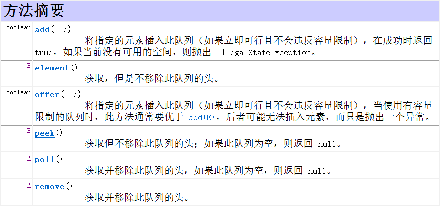

**入队：`q.add(E e) / q.offer(E e) `，区别如下：**

- 两种方法都会将指定的元素插入此队列（如果立即可行且不会违反容量限制），在成功时返回 true，失败返回 false。 如果当前没有可用的空间，add(E) 会抛出 IllegalStateException。 

- 当使用有容量限制的队列时，offer(E) 通常要优于 add(E)，后者可能无法插入元素，而只是抛出一个异常。**即当超出队列界限的时候，add(E) 会抛出异常，而 offer(E) 方法是直接返回false。** 

**出队：`q.remove() / q.poll()`，区别如下：**

- 两种方法都是获取并移除此队列的头。
- **当队列为空时，remove() 会抛出一个异常，而 poll() 会返回 null。**

**获取队头元素：`element() / peek()`，区别如下：**

- 两种方法都是获取，但是不移除此队列的头。
- **当队列为空时，element() 会抛出一个异常，而 peek() 会返回 null。**


**关于 Deque 接口**

Deque 接口是 Queue 接口的一个实现，可用作普通队列，双端队列，栈。

Deque 是一个线性 collection，支持在两端插入和移除元素。名称 *deque* 是 “double ended  queue（双端队列）” 的缩写，通常读为 “deck”。大多数 Deque  实现对于它们能够包含的元素数没有固定限制，但此接口既支持有容量限制的双端队列，也支持没有固定大小限制的双端队列。 

此接口定义在双端队列两端访问元素的方法。提供插入、移除和检查元素的方法。

每种方法都存在两种形式：一种形式在操作失败时抛出异常，另一种形式返回一个特殊值（`null`  或 `false`，具体取决于操作）。插入操作的后一种形式是专为使用有容量限制的 `Deque`  实现设计的；在大多数实现中，插入操作不能失败。 

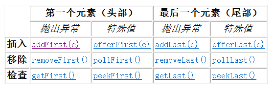

此接口扩展了 Queue 接口。在将双端队列用作队列时，将得到  FIFO（先进先出）行为。将元素添加到双端队列的末尾，从双端队列的开头移除元素。从 Queue 接口继承的方法完全等效于  Deque 方法，如下表所示。

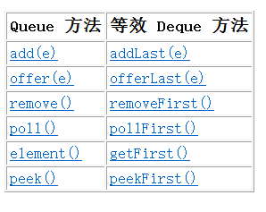

双端队列也可用作 LIFO（后进先出）堆栈。应优先使用此接口而不是遗留 Stack  类。在将双端队列用作堆栈时，元素被推入双端队列的开头并从双端队列开头弹出。堆栈方法完全等效于 Deque 方法，如下表所示。

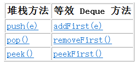


**关于 List 接口**

```java
boolean add(E e)	// 添加元素
void clear()		// 清除所有元素
E get(int index) 	// 获取指定下标的元素
boolean isEmpty() 	// 判断是否为空
```


**关于 LinkedList**

LinkedList 实现了 List 接口 和 Deque 接口，这些接口的方法都可以用。

# 32-2、[从上到下打印二叉树 II](https://leetcode-cn.com/problems/cong-shang-dao-xia-da-yin-er-cha-shu-ii-lcof/)

> 从上到下按层打印二叉树，同一层的节点按从左到右的顺序打印，每一层打印到一行。
>
> 例如:
> 给定二叉树: [3,9,20,null,null,15,7],
>
>     	3
>     	/ \
>       9  20
>         /  \
>        15   7
> 返回其层次遍历结果：
>
> ```
> [
>   [3],
>   [9,20],
>   [15,7]
> ]
> ```

【方法一】该题相较与上一题来说二叉树的遍历方式没有发生改变，主要的改变之处在于结果的储存形式。

同样使用数列这一数据结构，要注意在队列中取出元素时事先记录好当前队列大小，确保在移除队头时只移除当前层的节点即可。

```java
class Solution {
    public List<List<Integer>> levelOrder(TreeNode root) {
        if(root == null) {
            return new ArrayList<>();
        }
        List<List<Integer>> res = new ArrayList<>();
        Queue<TreeNode> q = new LinkedList<>();
        q.offer(root);
        while(!q.isEmpty()) {
            List<Integer> temp = new ArrayList<>();
            for(int i = q.size();i > 0;i--) {
                TreeNode remove = q.remove();
                temp.add(remove.val);
                if(remove.left != null) {
                    q.offer(remove.left);
                }
                if(remove.right != null) {
                    q.offer(remove.right);
                }
            }
            res.add(temp);
        }
        return res;
    }
}
```


# 32-3、[从上到下打印二叉树 III](https://leetcode-cn.com/problems/cong-shang-dao-xia-da-yin-er-cha-shu-iii-lcof/)

> 请实现一个函数按照之字形顺序打印二叉树，即第一行按照从左到右的顺序打印，第二层按照从右到左的顺序打印，第三行再按照从左到右的顺序打印，其他行以此类推。
>
> 例如:
> 给定二叉树: [3,9,20,null,null,15,7],
>
>     	3
>     	/ \
>       9  20
>         /  \
>        15   7
> 返回其层次遍历结果：
>
> ```
> [
>   [3],
>   [20,9],
>   [15,7]
> ]
> ```
>
>
> 提示：
>
> ```
> 节点总数 <= 1000
> ```

【方法一】这题的遍历方式与前两道不同，遍历顺序是一个 “之” 字形，仍然使用队列，这次要用到双端队列中的相关方法。

- 偶数层向队列头部添加元素；
- 奇数层向队列尾部添加元素。

```java
class Solution {
    public List<List<Integer>> levelOrder(TreeNode root) {
        List<List<Integer>> res = new ArrayList<>();
        Queue<TreeNode> q = new LinkedList<>();
        if(root != null) {
            q.offer(root);
        }
        while(!q.isEmpty()) {
            LinkedList<Integer> temp = new LinkedList<>();
            for(int i = q.size();i > 0;--i) {
                TreeNode remove = q.remove();
                if(res.size() % 2 == 0) {
                    temp.addLast(remove.val);	// 偶数层向队列头部添加元素
                } else {
                    temp.addFirst(remove.val);	// 奇数层向队列尾部添加元素
                }
                if(remove.left != null) {
                    q.offer(remove.left);
                }
                if(remove.right != null){
                    q.offer(remove.right);
                }
            }
            res.add(temp);
        }
        return res;
    }
}
```


# 35、[复杂链表的复制](https://leetcode-cn.com/problems/fu-za-lian-biao-de-fu-zhi-lcof/)

> 请实现 copyRandomList 函数，复制一个复杂链表。在复杂链表中，每个节点除了有一个 next 指针指向下一个节点，还有一个 random 指针指向链表中的任意节点或者 null。
>
> 示例 1：
>
> 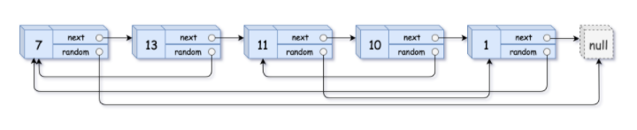
>
> ```
> 输入：head = [[7,null],[13,0],[11,4],[10,2],[1,0]]
> 输出：[[7,null],[13,0],[11,4],[10,2],[1,0]]
> ```
>
> 示例 2：
>
> 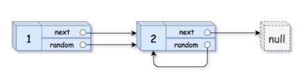
>
> ```
> 输入：head = [[1,1],[2,1]]
> 输出：[[1,1],[2,1]]
> ```
>
> 示例 3：
>
> 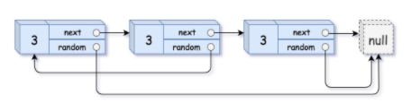
>
> ```
> 输入：head = [[3,null],[3,0],[3,null]]
> 输出：[[3,null],[3,0],[3,null]]
> ```
>
> 示例4：
>
> ```
> 输入：head = []
> 输出：[]
> 解释：给定的链表为空（空指针），因此返回 null。
> ```
>
>
> 提示：
>
> - -10000 <= Node.val <= 10000
> - Node.random 为空（null）或指向链表中的节点。
> - 节点数目不超过 1000 。

【方法一】用哈希储存节点映射关系

```java
/*
// Definition for a Node.
class Node {
    int val;
    Node next;
    Node random;

    public Node(int val) {
        this.val = val;
        this.next = null;
        this.random = null;
    }
}
*/
class Solution {
    public Node copyRandomList(Node head) {
        Map<Node,Node> map = new HashMap<>();
        Node cur = head;
        while(cur != null) {
            map.put(cur,new Node(cur.val));
            cur = cur.next;
        }
        cur = head;
        while(cur != null) {
            map.get(cur).next = map.get(cur.next);
            map.get(cur).random = map.get(cur.random);
            cur = cur.next;
        }
        return map.get(head);
    }
}
```


【方法二】

```java
class Solution {
    public Node copyRandomList(Node head) {
        if(head == null) {
            return null;
        }
        Node cur = head;
        while(cur != null) {
            Node temp = new Node(cur.val);
            temp.next = cur.next;
            cur.next = temp;
            cur = temp.next;
        }	// 复制节点，构造拼接链表
        cur = head;
        while(cur != null) {
            if(cur.random != null) {
                cur.next.random = cur.random.next;
            }	// f
            cur = cur.next.next;
        }
        // 注意指针位置的变化
        cur = head.next;    // cur指向head的next，即新链表头节点
        Node pre = head;    // pre指向head，即旧链表的头节点
        Node res = head.next;   // res指向head的next，即新链表的头节点
        while(cur.next != null) {
            // 分别连接新旧链表
            pre.next = pre.next.next;   // 将旧链表连接
            cur.next = cur.next.next;   // 将新链表连接
            pre = pre.next;
            cur = cur.next;
        }
        pre.next = null;    // 将原链表的最后一个节点的next指针，重新指向null
        return res;
    }
}
```


# 38、[字符串的排列](https://leetcode-cn.com/problems/zi-fu-chuan-de-pai-lie-lcof/)

> 输入一个字符串，打印出该字符串中字符的所有排列。
>
> 你可以以任意顺序返回这个字符串数组，但里面不能有重复元素。
>
> 示例:
>
> ```
> 输入：s = "abc"
> 输出：["abc","acb","bac","bca","cab","cba"]
> ```
>
>
> 限制：
>
> 1 <= s 的长度 <= 8

【方法一】回溯 + 剪枝

```java
class Solution {
    
    char[] c;
    List<String> res = new LinkedList<>();
    
    public String[] permutation(String s) {
        c = s.toCharArray();
        dfs(0);
        return res.toArray(new String[res.size()]);
    }

    public void dfs(int x) {
        if(x == c.length - 1) {
            res.add(String.valueOf(c));
            return;
        }
        HashSet<Character> set = new HashSet<>();
        for(int i = x;i < c.length;i++) {
            if(set.contains(c[i])) continue;	// 剪枝
            set.add(c[i]);
            swap(i,x);		// 将c[i]固定在x的位置上
            dfs(x + 1);		// 往下继续固定x+1位
            swap(i,x);		// 恢复
        }
    }

    public void swap(int a,int b) {
        char temp = c[a];
        c[a] = c[b];
        c[b] = temp;
    }

}
```

## *回溯法的模板

```java
result = []
void backtrack(路径，选择列表){
	if 满足结束条件：
         result.add(路径)
         return
     for 选择 in 选择列表:
         做选择
         backtrack(路径，选择列表)
         撤销选择
}
```

# 39、[数组中出现次数超过一半的数字](https://leetcode-cn.com/problems/shu-zu-zhong-chu-xian-ci-shu-chao-guo-yi-ban-de-shu-zi-lcof/)

> 数组中有一个数字出现的次数超过数组长度的一半，请找出这个数字。
>
> 你可以假设数组是非空的，并且给定的数组总是存在多数元素。
>
> 示例 1:
>
> ```
> 输入: [1, 2, 3, 2, 2, 2, 5, 4, 2]
> 输出: 2
> ```
>
> 限制：
>
> ```
> 1 <= 数组长度 <= 50000
> ```

【方法一】HashMap，遍历一次即可求出结果。（实际遍历时可能不会完全遍历，找到出现次数大于一半的元素立即返回。）

```java
class Solution {
    public int majorityElement(int[] nums) {
        int len = nums.length;
        if(len == 1) {
            return nums[0];
        }
        Map<Integer,Integer> map = new HashMap<>();
         for(int i = 0;i < len;i++) {
            if(map.containsKey(nums[i])) {
                int newNum = map.get(nums[i]) + 1;
                map.put(nums[i],newNum);
                if(newNum > len / 2) {
                   return nums[i];
                }
            } else {
                map.put(nums[i],1);
            }
        }
        return -1;
    }
}
```

【方法二】[摩尔投票法](https://leetcode-cn.com/problems/shu-zu-zhong-chu-xian-ci-shu-chao-guo-yi-ban-de-shu-zi-lcof/solution/mian-shi-ti-39-shu-zu-zhong-chu-xian-ci-shu-chao-3/)

```java
class Solution {
    public int majorityElement(int[] nums) {
        int res = 0;
        int voteNum = 0;
        for(int i:nums) {
            if(voteNum == 0) res = i;
            voteNum += i == res ? 1 : -1;
        }
        // 题目默认众数一定存在，可直接返回res，若有限制条件需验证后再return。
        // return res;
        int count = 0;
        for(int j:nums) {
            if(j == res) ++count;
        }
        return count > nums.length / 2 ? res : 0;
    }
}
```


# 46、[把数字翻译成字符串](https://leetcode-cn.com/problems/ba-shu-zi-fan-yi-cheng-zi-fu-chuan-lcof/)

> 给定一个数字，我们按照如下规则把它翻译为字符串：0 翻译成 “a” ，1 翻译成 “b”，……，11 翻译成 “l”，……，25 翻译成 “z”。一个数字可能有多个翻译。请编程实现一个函数，用来计算一个数字有多少种不同的翻译方法。
>
> 示例 1:
>
> ```
> 输入: 12258
> 输出: 5
> 解释: 12258有5种不同的翻译，分别是"bccfi", "bwfi", "bczi", "mcfi"和"mzi"
> ```
>
> 提示：
>
> ```
> 0 <= num < 231
> ```

【方法一】将num每一位分离开，转换成数组后DP。

```java
class Solution {
    public int translateNum(int num) {
        Integer n = num;
        char[] chars = n.toString().toCharArray();
        int[] nums = new int[chars.length];
        for (int j = 0; j < chars.length; j++) {
            nums[j] = Integer.valueOf(String.valueOf(chars[j]));
        }
        int a = 1;
        int b = 1;
        for(int i = 1;i < nums.length;i++) {
            int temp = 10 * nums[i - 1] + nums[i];
            int curMax = (temp >= 10 && temp <= 25)?a + b:b;
            a = b;
            b = curMax;
        }
        return b;
    }
}
```

【方法二】使用数字求余的节省空间的DP

```java
class Solution {
    public int translateNum(int num) {
        int a = 1, b = 1;	// a:上一位，b:上一位的上一位
        int x;  // 十位上的数字
        int y = num % 10;   // 个位上的数字
        while(num != 0) {
            num /= 10;
            x = num % 10;   // 去掉最后一位后获取十位数字
            int temp = 10 * x + y;
            int curMax = (temp >= 10 && temp <= 25)?a + b:a;
            b = a;
            a = curMax;
            y = x;
        }
        return a;
    }
}
```

【方法三】递归

```java
 class Solution {
        public int translateNum(int num) {
            if (num < 10) {
                return 1;
            }	// 无法拆分，直接返回1
            int res = num % 100;
            if (res < 10) {
                //情况1：128105 % 100 = 5，那么5这个数字和无法和0合体的。那么去掉他 （num / 10），继续下一轮递归
                return translateNum(num / 10);
            } else if (res < 26) {
            	//情况2：12810 % 100 = 10 ，可以分成两种情况进行讨论，就是1281和128进行下一轮的递归。
                return translateNum(num / 10) + translateNum(num / 100);
            } else {
                //情况3：128 % 100 = 28，这种情况比26大，不能像情况2哪样进行拆分成两个递归进行相加。
                return translateNum(num / 10);
            }
        }
    }
```


# 48、[最长不含重复字符的子字符串](https://leetcode-cn.com/problems/zui-chang-bu-han-zhong-fu-zi-fu-de-zi-zi-fu-chuan-lcof/)

> 请从字符串中找出一个最长的不包含重复字符的子字符串，计算该最长子字符串的长度。
>
> 示例 1:
>
> ```
> 输入: "abcabcbb"
> 输出: 3 
> 解释: 因为无重复字符的最长子串是 "abc"，所以其长度为 3。
> ```
>
> 示例 2:
>
> ```
> 输入: "bbbbb"
> 输出: 1
> 解释: 因为无重复字符的最长子串是 "b"，所以其长度为 1。
> ```
>
> 示例 3:
>
> ```
> 输入: "pwwkew"
> 输出: 3
> 解释: 因为无重复字符的最长子串是 "wke"，所以其长度为 3。
>      请注意，你的答案必须是 子串 的长度，"pwke" 是一个子序列，不是子串。
> ```
>
>
> 提示：
>
> ```
> s.length <= 40000
> ```

【方法一】动态规划

```java
class Solution {
    public int lengthOfLongestSubstring(String s) {
        int len = s.length();
        if(len == 0) {
            return 0;
        }
        // 动态规划，dp数组含义：以当前位置字符串结尾的最长不重复字符串
        int[] dp = new int[len];
        int res = 1;
        dp[0] = 1;
        for(int i = 1;i < len;++i) {
            boolean flag = false;
            // 每遍历到一个字符，就会向前搜索，查看在前一个数的dp数组范围内是否有重复的字符
            for(int j = i - 1;j >= i - dp[i - 1];--j) {
                if(s.charAt(i) == s.charAt(j)) {
                    // 如果存在则将重复之前的数字作为新的最长不重复长度存储
                    dp[i] = i - j;
                    res = Math.max(res,dp[i]);	// 记录遍历过程中的最大值
                    flag = false;
                    break;
                } else {
                    flag = true;
                }
            }
            if(flag) {	// 无重复字符，将最长子串长度加1
                dp[i] = dp[i - 1] + 1;
                res = Math.max(res,dp[i]);
            }
        }
        return res;
    }
}
```


# 50、[第一个只出现一次的字符](https://leetcode-cn.com/problems/di-yi-ge-zhi-chu-xian-yi-ci-de-zi-fu-lcof/)

> 在字符串 s 中找出第一个只出现一次的字符。如果没有，返回一个单空格。 s 只包含小写字母。
>
> 示例 1:
>
> ```
> 输入：s = "abaccdeff"
> 输出：'b'
> ```
>
> 示例 2:
>
> ```
> 输入：s = "" 
> 输出：' '
> ```
>
>
> 限制：
>
> 0 <= s 的长度 <= 50000

【方法一】哈希

```java
class Solution {
    public char firstUniqChar(String s) {
        Map<Character,Integer> map = new HashMap<>();
        char[] chars = s.toCharArray();
        for(char c:chars) {
            map.put(c,map.getOrDefault(c,0) + 1);
        }
        for(char c:chars) {
            if(map.get(c) == 1) {
                return c;
            }
        }
        return ' ';
    }
}
```

# 52、[两个链表的第一个公共节点](https://leetcode-cn.com/problems/liang-ge-lian-biao-de-di-yi-ge-gong-gong-jie-dian-lcof/)

> 输入两个链表，找出它们的第一个公共节点。
>
> 如下面的两个链表：
>
> 在节点 c1 开始相交。
>
> 示例 1：
>
> ```
> 输入：intersectVal = 8, listA = [4,1,8,4,5], listB = [5,0,1,8,4,5], skipA = 2, skipB = 3
> 输出：Reference of the node with value = 8
> 输入解释：相交节点的值为 8 （注意，如果两个列表相交则不能为 0）。从各自的表头开始算起，链表 A 为 [4,1,8,4,5]，链表 B 为 [5,0,1,8,4,5]。在 A 中，相交节点前有 2 个节点；在 B 中，相交节点前有 3 个节点。
> ```
>
>
> 示例 2：
>
> ```
> 输入：intersectVal = 2, listA = [0,9,1,2,4], listB = [3,2,4], skipA = 3, skipB = 1
> 输出：Reference of the node with value = 2
> 输入解释：相交节点的值为 2 （注意，如果两个列表相交则不能为 0）。从各自的表头开始算起，链表 A 为 [0,9,1,2,4]，链表 B 为 [3,2,4]。在 A 中，相交节点前有 3 个节点；在 B 中，相交节点前有 1 个节点。
> ```
>
> 示例 3：
>
> ```
> 输入：intersectVal = 0, listA = [2,6,4], listB = [1,5], skipA = 3, skipB = 2
> 输出：null
> 输入解释：从各自的表头开始算起，链表 A 为 [2,6,4]，链表 B 为 [1,5]。由于这两个链表不相交，所以 intersectVal 必须为 0，而 skipA 和 skipB 可以是任意值。
> 解释：这两个链表不相交，因此返回 null。
> ```
>
> 注意：
>
> ```
> 如果两个链表没有交点，返回 null.
> 在返回结果后，两个链表仍须保持原有的结构。
> 可假定整个链表结构中没有循环。
> 程序尽量满足 O(n) 时间复杂度，且仅用 O(1) 内存。
> ```

【方法一】暴力解法

```java
/**
 * Definition for singly-linked list.
 * public class ListNode {
 *     int val;
 *     ListNode next;
 *     ListNode(int x) {
 *         val = x;
 *         next = null;
 *     }
 * }
 */
public class Solution {
    public ListNode getIntersectionNode(ListNode headA, ListNode headB) {
        ListNode curA = headA;
        ListNode curB = headB;
        while(curA != null) {
            while(curB != null) {
                if(curA == curB) {
                    return curA;
                }
                curB = curB.next;
            }
            curA = curA.next;
            curB = headB;
        }
        return null;
    }
}
```

【方法二】A 的长度：a + n，B 的长度：b + n，A 走到尽头后从 B 重新开始，B 走到尽头后从 A 重新开始，两个指针在走完 a + b + n 的长度后相遇，如果两条链表不相交，最终两个节点都会指向 null。

```java
public class Solution {
    public ListNode getIntersectionNode(ListNode headA, ListNode headB) {
        ListNode A = headA;
        ListNode B = headB;
        while(A != B) {
            A = A != null ? A.next : headB;
            B = B != null ? B.next : headA;
        }
        return A;
    }
}
```


# 53-1、[在排序数组中查找数字 I](https://leetcode-cn.com/problems/zai-pai-xu-shu-zu-zhong-cha-zhao-shu-zi-lcof/)

> 统计一个数字在排序数组中出现的次数。
>
> 示例 1:
>
> ```
> 输入: nums = [5,7,7,8,8,10], target = 8
> 输出: 2
> ```
>
> 示例 2:
>
> ```
> 输入: nums = [5,7,7,8,8,10], target = 6
> 输出: 0
> ```
>
>
> 提示：
>
> ```
> 0 <= nums.length <= 10^5
> -10^9 <= nums[i] <= 10^9
> nums 是一个非递减数组
> -10^9 <= target <= 10^9
> ```

【方法一】暴力解法

```java
class Solution {
    public int search(int[] nums, int target) {
        int len = nums.length;
        int pos = 0;
        int res = 0;
        while(pos < len) {
            if(nums[pos] == target) {
                res++;
            }
            pos++;
        }
        return res;
    }
}
```

【方法二】题目要求是在排序数组中查找数字出现的次数，**排序 -> 二分**。因为查找的是一个范围，所以要对二分进行一些特殊处理。

```java
class Solution {
    public int search(int[] nums, int target) {
        int left = 0;
        int right = nums.length - 1;
        while(left <= right) {
            int mid = (left + right) / 2;
            if(nums[mid] < target) {
                left = ++mid;
            } else if(nums[mid] > target) {
                right = --mid;
            } else {	// 当mid上的值与target相等时，需要确定一下left与right的范围
                if(nums[left] == nums[right]) return right - left + 1;
                if(nums[left] < target) left++;
                if(nums[right] > target) right--;
            }
        }
        return 0;
    }
}
```

【方法三】利用二分寻找插入点

```java
class Solution {
    public int search(int[] nums, int target) {
        return binarySearsh(nums,target) - binarySearsh(nums,target - 1);
    }
    public int binarySearsh(int[] nums,int target) {
        int left = 0;
        int right = nums.length - 1;
        while(left <= right) {
            int mid = (left + right) / 2;
            if(nums[mid] <= target) {
                left = ++mid;
            } else {
                right = --mid;
            }
        }
        return left;
    }
}
```

# 53-2、[0～n-1中缺失的数字](https://leetcode-cn.com/problems/que-shi-de-shu-zi-lcof/)

> 一个长度为n-1的递增排序数组中的所有数字都是唯一的，并且每个数字都在范围0～n-1之内。在范围0～n-1内的n个数字中有且只有一个数字不在该数组中，请找出这个数字。
>
> 示例 1:
>
> ```
> 输入: [0,1,3]
> 输出: 2
> ```
>
> 示例 2:
>
> ```
> 输入: [0,1,2,3,4,5,6,7,9]
> 输出: 8
> ```
>
>
> 限制：
>
> 1 <= 数组长度 <= 10000

【方法一】暴力

【方法二】按数组下标与数组中存储的数字的对应关系可以将数组分为两部分，用二分查找找出两部分的分界点。

```java
class Solution {
    public int missingNumber(int[] nums) {
        int left = 0;
        int right = nums.length - 1;
        while(left <= right) {
            int mid = (left + right) / 2;
            if(nums[mid] == mid) left = mid + 1;
            else right = mid - 1;
        }
        return left;
    }
}
```


# 55-1、[二叉树的深度](https://leetcode-cn.com/problems/er-cha-shu-de-shen-du-lcof/)

> 输入一棵二叉树的根节点，求该树的深度。从根节点到叶节点依次经过的节点（含根、叶节点）形成树的一条路径，最长路径的长度为树的深度。
>
> 例如：
>
> 给定二叉树 [3,9,20,null,null,15,7]，
>
>             3
>            / \
>           9  20
>             /  \
>            15   7
> 返回它的最大深度 3 。
>
> 提示：
>
> 节点总数 <= 10000

【方法一】递归

```java
/**
 * Definition for a binary tree node.
 * public class TreeNode {
 *     int val;
 *     TreeNode left;
 *     TreeNode right;
 *     TreeNode(int x) { val = x; }
 * }
 */
class Solution {
    public int maxDepth(TreeNode root) {
        if(root == null) return 0;
        return Math.max(maxDepth(root.left),maxDepth(root.right)) + 1;
    }

}
```

【方法二】使用队列进行层序遍历

>  注意 while 中的 for 循环，必须是 `for(int i = q.size();i > 0;i--)`而不是 `for(int i = 0;i < q,size();i++)`，因为 q 的长度是不断变化的。

```java
class Solution {
    public int maxDepth(TreeNode root) {
        if(root == null) return 0;
        Queue<TreeNode> q = new LinkedList<TreeNode>();
        int res = 0;
        q.offer(root);
        while(!q.isEmpty()) {
            for(int i = q.size();i > 0;i--) {
                TreeNode poll = q.poll();
                if(poll.left != null) q.offer(poll.left);
                if(poll.right != null) q.offer(poll.right);
            }
            ++res;
        }
        return res;
    }
}
```

# 57-2、[和为s的连续正数序列](https://leetcode-cn.com/problems/he-wei-sde-lian-xu-zheng-shu-xu-lie-lcof/)

> 输入一个正整数 target ，输出所有和为 target 的连续正整数序列（至少含有两个数）。
>
> 序列内的数字由小到大排列，不同序列按照首个数字从小到大排列。
>
> 示例 1：
>
> ```
> 输入：target = 9
> 输出：[[2,3,4],[4,5]]
> ```
>
> 示例 2：
>
> ```
> 输入：target = 15
> 输出：[[1,2,3,4,5],[4,5,6],[7,8]]
> ```
>
>
> 限制：
>
> ```
> 1 <= target <= 10^5
> ```

【方法一】滑动窗口

```java
class Solution {
    public int[][] findContinuousSequence(int target) {
        // 整个滑动窗口左闭右开，当前right值s是区间实际最右边的后一位
        List<int[]> res = new ArrayList<>();
        int left = 1;
        int right = 1;
        int sum = 0;
        while(right < target) {
            if(sum < target) {	// 当前区间的和小于target
                sum += right;
                ++right;		// 区间右边扩大
            } else if(sum > target) {
                sum -= left;	// 当前区间的和大于target
                ++left;			// 区间左边缩小
            } else {			// 区间和等于target
                int[] temp = new int[right - left];
                for(int j = left;j < right;j++) {
                    temp[j - left] = j;
                }
                res.add(temp);	// 储存当前区间
                sum += right;	// 区间继续向右扩大
                ++right;
            }
        }
        return res.toArray(new int[0][]);
    }
}
```


# 58-1、[翻转单词顺序](https://leetcode-cn.com/problems/fan-zhuan-dan-ci-shun-xu-lcof/)

> 输入一个英文句子，翻转句子中单词的顺序，但单词内字符的顺序不变。为简单起见，标点符号和普通字母一样处理。例如输入字符串"I am a student. "，则输出"student. a am I"。
>
> 示例 1：
>
> ```
> 输入: "the sky is blue"
> 输出: "blue is sky the"
> ```
>
> 示例 2：
>
> ```
> 输入: "  hello world!  "
> 输出: "world! hello"
> 解释: 输入字符串可以在前面或者后面包含多余的空格，但是反转后的字符不能包括。
> ```
>
>
> 示例 3：
>
> ```
> 输入: "a good   example"
> 输出: "example good a"
> 解释: 如果两个单词间有多余的空格，将反转后单词间的空格减少到只含一个。
> ```
>
> 说明：
>
> ```
> 无空格字符构成一个单词。
> 输入字符串可以在前面或者后面包含多余的空格，但是反转后的字符不能包括。
> 如果两个单词间有多余的空格，将反转后单词间的空格减少到只含一个。
> ```

【方法一】先去除字符串中多余的空格，然后翻转整个字符串，然后根据翻转后的空格一部分一部分翻转。或先根据单词翻转，再翻转整个字符串。

```java
class Solution {
    public void myReverse(char[] ch,int begin,int end) {
        while(begin < end) {
            char temp = ch[begin];
            ch[begin] = ch[end];
            ch[end] = temp;
            ++begin;
            --end;
        }
    }
    public String reverseWords(String s) {
        if("".equals(s)) {
            return "";
        }   // 处理特殊情况
        String s2 = "";
        for(int i = 0;i < s.length();++i) {
            if(s.charAt(i) == ' ') {
                if("".equals(s2) || s2.charAt(s2.length() - 1) == ' ') {
                    continue;
                }
            }
            s2 += s.charAt(i);
        }   // 将s中多余的空格去除，储存在s2中
        if("".equals(s2)) {
            return "";
        }   // 如果字符串内容是"   "，去除空格后是""
        if(s2.charAt(s2.length() - 1) == ' ') {
            s2 = s2.substring(0,s2.length() - 1);
        }   // 额外处理最后一个空格
        
        char[] ch = s2.toCharArray();
        int begin = 0;
        for(int j = 0;j < ch.length;++j) {
            if(ch[j] == ' ') {
                myReverse(ch,begin,j - 1);
                begin = j + 1;
            }
        }
        myReverse(ch,begin,ch.length - 1);
        myReverse(ch,0,ch.length - 1);
        return new String(ch);
    }
}
```

【方法二】使用StringBuilder

```java
class Solution {
    public String reverseWords(String s) {
        s = s.trim();   // 去除前后的空格
        StringBuilder sb = new StringBuilder();
        int start = s.length() - 1;
        int end = s.length() - 1;
        while(start >= 0) {
            while(start >= 0 && s.charAt(start) != ' ') --start;	// 搜索首个空格
            sb.append(s.substring(start + 1,end + 1) + " ");	// 添加单词
            while(start >= 0 && s.charAt(start) == ' ') --start;	// 跳过单词间空格
            end = start;	// 指向下个单词的尾字符
        }
        return sb.toString().trim();
    }
}
```


# 58-2、[左旋转字符串](https://leetcode-cn.com/problems/zuo-xuan-zhuan-zi-fu-chuan-lcof/)

> 字符串的左旋转操作是把字符串前面的若干个字符转移到字符串的尾部。请定义一个函数实现字符串左旋转操作的功能。比如，输入字符串"abcdefg"和数字2，该函数将返回左旋转两位得到的结果"cdefgab"。
>
> 示例 1：
>
> ```
> 输入: s = "abcdefg", k = 2
> 输出: "cdefgab"
> ```
>
> 示例 2：
>
> ```
> 输入: s = "lrloseumgh", k = 6
> 输出: "umghlrlose"
> ```
>
>
> 限制：
>
> 1 <= k < s.length <= 10000

【方法一】直接用 substring

```java
class Solution {
    public String reverseLeftWords(String s, int n) {
        return s.substring(n) + s.substring(0,n);
    }
}
```

【方法二】用 StringBuilder，注意取余操作

```java
class Solution {
    public String reverseLeftWords(String s, int n) {
        StringBuilder sb = new StringBuilder();
        for(int i = n;i < n + s.length();i++) {
            sb.append(s.charAt(i % s.length()));
        }
        return sb.toString();
    }
}
```

【方法三】由于 Java 中的字符串是不可变的，所以不能用翻转实现（空间复杂度O(1)），所以进行一下模拟。

思路：将字符串以 n 为分界线，分为两组；两组分别翻转后再整体翻转。reverse 函数中使用双指针进行翻转，该函数可以通用。

```java
class Solution {
    public void reverse(char[] ch,int begin,int end) {
        while(begin < end) {
            char temp = ch[begin];
            ch[begin] = ch[end];
            ch[end] = temp;
            begin++;
            end--;
        }
    }
    public String reverseLeftWords(String s, int n) {
        char[] ch = s.toCharArray();
        int len = s.length();
        reverse(ch,0,n - 1);
        reverse(ch,n,len - 1);
        reverse(ch,0,len - 1);
        return new String(ch);
    }
}
```


# 62、[圆圈中最后剩下的数字](https://leetcode-cn.com/problems/yuan-quan-zhong-zui-hou-sheng-xia-de-shu-zi-lcof/)

> 0,1,···,n-1这n个数字排成一个圆圈，从数字0开始，每次从这个圆圈里删除第m个数字（删除后从下一个数字开始计数）。求出这个圆圈里剩下的最后一个数字。
>
> 例如，0、1、2、3、4这5个数字组成一个圆圈，从数字0开始每次删除第3个数字，则删除的前4个数字依次是2、0、4、1，因此最后剩下的数字是3。
>
> 示例 1：
>
> ```
> 输入: n = 5, m = 3
> 输出: 3
> ```
>
> 示例 2：
>
> ```
> 输入: n = 10, m = 17
> 输出: 2
> ```
>
>
> 限制：
>
> ```
> 1 <= m <= 10^6
> ```

【方法一】约瑟夫环问题，动态规划，状态转移方程：`f(n,m) = (f(n-1,m) + m) % n`

```java
class Solution {
    public int lastRemaining(int n, int m) {
        int ans = 0;
        for(int i = 2;i <= n;i++) {
            ans = (ans + m) % i;
        }
        return ans;
    }
}
```

# 63、[股票的最大利润](https://leetcode-cn.com/problems/gu-piao-de-zui-da-li-run-lcof/)

> 假设把某股票的价格按照时间先后顺序存储在数组中，请问买卖该股票一次可能获得的最大利润是多少？
>
> 示例 1:
>
> ```
> 输入: [7,1,5,3,6,4]
> 输出: 5
> 解释: 在第 2 天（股票价格 = 1）的时候买入，在第 5 天（股票价格 = 6）的时候卖出，最大利润 = 6-1 = 5。
> 注意利润不能是 7-1 = 6, 因为卖出价格需要大于买入价格。
> ```
>
> 示例 2:
>
> ```
> 输入: [7,6,4,3,1]
> 输出: 0
> 解释: 在这种情况下, 没有交易完成, 所以最大利润为 0。
> ```
>
>
> 限制：
>
> ```
> 0 <= 数组长度 <= 10^5
> ```

【方法一】暴力解法，两层遍历得到最大利润。

```java
class Solution {
    public int maxProfit(int[] prices) {
        int res = 0;
        for(int i = 0;i < prices.length;i++) {
            for(int j = i + 1;j < prices.length;j++) {
                int profit = prices[j] - prices[i];
                res = Math.max(res,profit);
            }
        }
        return res;
    }
}
```

【方法二】动态规划

dp[i] 代表以 prices[i] 为结尾的子数组的最大利润。 

由于题目限定 “买卖该股票一次” ，因此前 i 日最大利润 dp[i] 等于前 i - 1 日最大利润 dp[i-1] 和第 i 日卖出的最大利润中的最大值。

前i日最大利润 = max(前(i-1)日最大利润, 第i日价格 - 前i日最低价格)
`dp[i] = max(dp[i−1],prices[i] − min(prices[0:i]))`

经过空间优化后：

```java
class Solution {
    public int maxProfit(int[] prices) {
        int min = Integer.MAX_VALUE;
        int maxProfit = 0;	// 最大值初始化为0，如果股票一直下跌则最终会返回0
        for(int i = 0;i < prices.length;i++) {
            // 不断动态更新最小值
            min = Math.min(min,prices[i]);
            // 用当前遍历到的值减去最小值，不断取最大值
            maxProfit = Math.max(maxProfit,prices[i] - min);
        }
        return maxProfit;
    }
}
```

