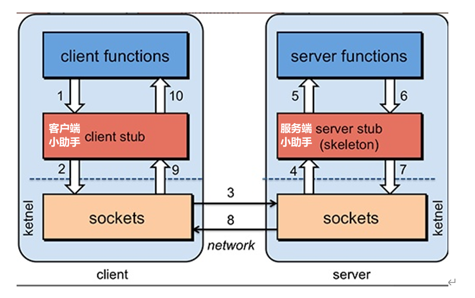
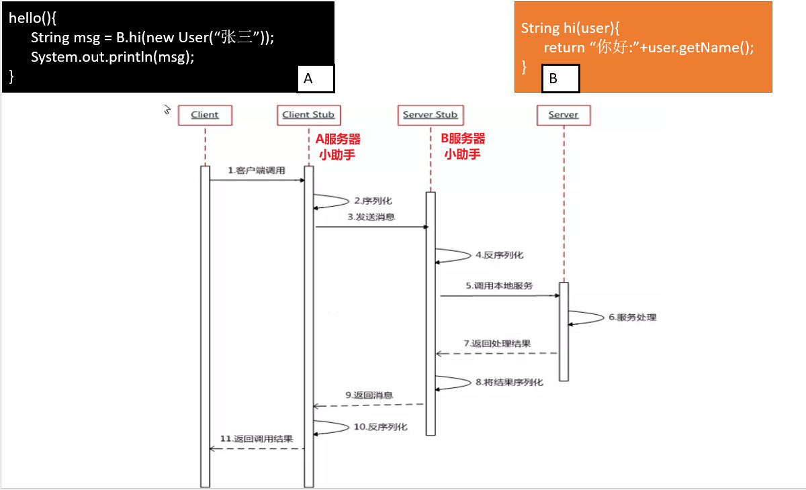
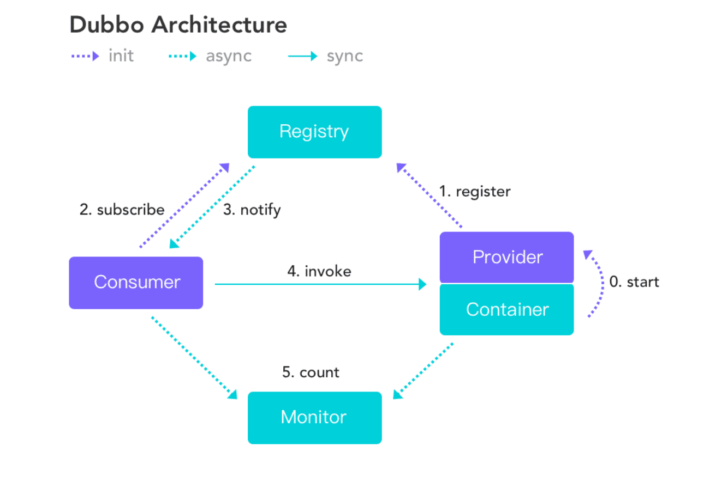
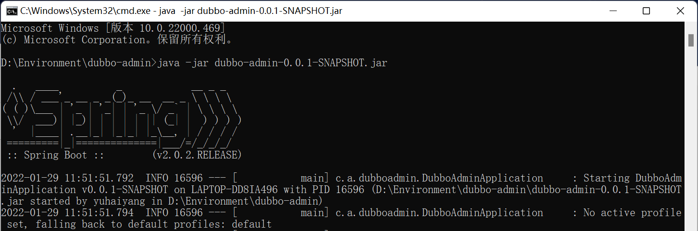
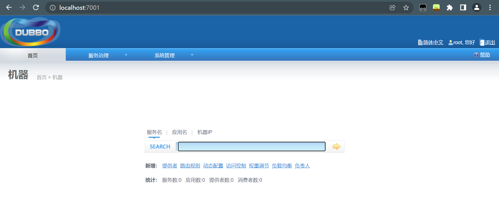
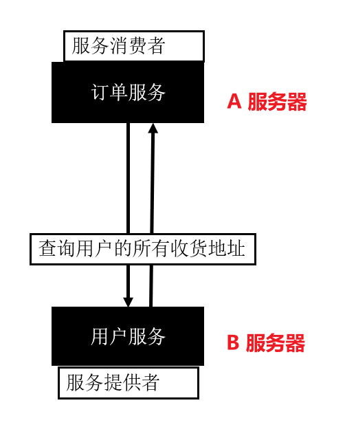
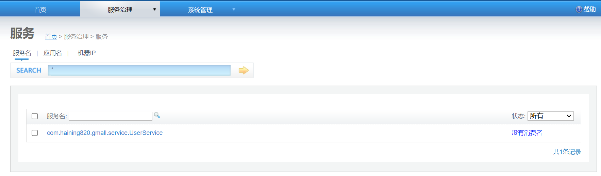
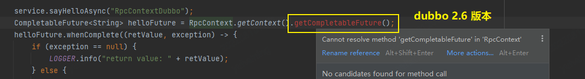
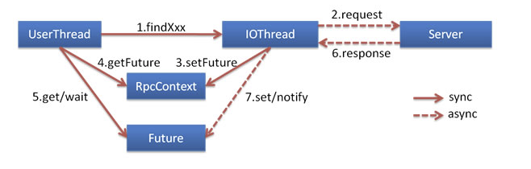

# 1、RPC 介绍

<font size=4 style="font-weight:bold;background:yellow;">什么是 RPC？</font>

RPC（Remote Procedure Call）：远程过程调用，是一种进程间通信方式，是一种技术思想，而不是规范。它允许程序调用另一个地址空间（通常是共享网络的另一台机器上）的过程或函数，而不用程序员显式编码这个远程调用的细节。即程序员无论是调用本地的还是远程的函数，本质上编写的调用代码基本相同。

<!--more-->

<font size=4 style="font-weight:bold;background:yellow;">RPC 的基本原理</font>

A 服务器想要调用 B 服务器的功能，通过 “小助手” 以及 sockets 建立连接实现 A、B 两个服务器之间的通讯。



A、B 之间建立连接，传递数据通过序列化来实现，所以，影响一个 RPC 框架的性能的因素有以下两点

- 通信效率：一个 RPC 框架能否迅速的在不同的服务器之间建立连接；
- 序列化/反序列化效率：指 RPC 框架的序列化与反序列化的速度，不同的数据类型序列化反序列化的速度不一样，RPC 框架的性能都会有差异



<font size=4 style="font-weight:bold;background:yellow;">RPC 框架种类</font>

dubbo，gRPC（Google），Thrift（FaceBook），HSF（High Speed Service Framework，阿里）

虽然用法有所不同，但是思想都是一样的，都是通过网络通信传递数据，实现数据的远程过程调用。

# 2、Dubbo 简介

> 官网：https://dubbo.apache.org/zh/

Dubbo：是一款高性能、轻量级的开源 Java RPC 框架，它提供了三大核心能力：面向接口的远程方法调用，智能容错和负载均衡，以及服务自动注册和发现。

<font size=4 style="font-weight:bold;background:yellow;">Dubbo 的特点</font>

- 面向接口代理的高性能RPC调用：提供高性能的基于代理的远程调用能力，服务以接口为粒度，为开发者屏蔽远程调用底层细节。

- 智能负载均衡：内置多种负载均衡策略，智能感知下游节点健康状况，显著减少调用延迟，提高系统吞吐量。
- 服务自动注册与发现：支持多种注册中心服务，服务实例上下线实时感知。将所有的服务在注册中心进行注册，对服务器的状态能够实时监控，类比于中介，“遇事不决加一层“。

<font size=4 style="font-weight:bold;background:yellow;">Dubbo 的架构图</font>



**服务提供者（Provider）**：暴露服务的服务提供方，服务提供者在启动时，向注册中心注册自己提供的服务。

**服务消费者（Consumer）**: 调用远程服务的服务消费方，服务消费者在启动时，向注册中心订阅自己所需的服务，服务消费者，从提供者地址列表中，基于软负载均衡算法，选一台提供者进行调用，如果调用失败，再选另一台调用。

**注册中心（Registry）**：注册中心返回服务提供者地址列表给消费者，如果有变更，注册中心将基于长连接推送变更数据给消费者

**监控中心（Monitor）**：服务消费者和提供者，在内存中累计调用次数和调用时间，定时每分钟发送一次统计数据到监控中心

**调用关系说明**

- 服务容器负责启动，加载，运行服务提供者。
- 服务提供者在启动时，向注册中心注册自己提供的服务。
- 服务消费者在启动时，向注册中心订阅自己所需的服务。
- 注册中心返回服务提供者地址列表给消费者，如果有变更，注册中心将基于长连接推送变更数据给消费者。
- 服务消费者，从提供者地址列表中，基于软负载均衡算法，选一台提供者进行调用，如果调用失败，再选另一台调用。
- 服务消费者和提供者，在内存中累计调用次数和调用时间，定时每分钟发送一次统计数据到监控中心。

# 3、zookeeper/dubbo-admin

<font size=4 style="font-weight:bold;background:yellow;">Zookeeper 注册中心配置（Win）</font>

[Zookeeper](http://zookeeper.apache.org/) 是 Apache Hadoop 的子项目，是一个树型的目录服务，支持变更推送，适合作为 Dubbo 服务的注册中心，工业强度较高，可用于生产环境，并推荐使用。

- 在[官网](https://archive.apache.org/dist/zookeeper/)下载 `zookeeper-3.4.11.tar.gz` ，解压之后在 `conf`文件夹下将 `zoo_sample.cfg` 文件复制一份并重新命名为 `zoo.cfg`；

  点开配置文件可以看到 zookeeper 的一些配置信息，临时数据的存储位置默认是 linux 的目录存储结构，修改为 zookeeper 根目录下的 data 目录，还有端口号等其他的配置信息。

  ```bash
  # 缓存目录
  dataDir=../data		# /tmp/zookeeper
  # 端口号
  clientPort=2181
  ```

- 然后在 bin 目录下运行 `zkServer.cmd` 程序，zookeeper 成功运行并提示端口号为 `2181`，如果不新增配置文件的话会报错提示 `zoo.cfg file is missing`；

- 继续运行 `zkCli.cmd` 程序，可以使用简单的命令对 zookeeper 进行操作。

  ```bash
  WatchedEvent state:SyncConnected type:None path:null
  [zk: localhost:2181(CONNECTED) 0] get /		# 获得根节点的值
  
  cZxid = 0x0
  ctime = Thu Jan 01 08:00:00 CST 1970
  mZxid = 0x0
  mtime = Thu Jan 01 08:00:00 CST 1970
  pZxid = 0x0
  cversion = -1
  dataVersion = 0
  aclVersion = 0
  ephemeralOwner = 0x0
  dataLength = 0
  numChildren = 1
  [zk: localhost:2181(CONNECTED) 1] ls /	# 显示所有节点
  [zookeeper]
  [zk: localhost:2181(CONNECTED) 2] create -e /yhn 666	# 创建临时节点
  Created /yhn
  [zk: localhost:2181(CONNECTED) 3] ls /
  [zookeeper, yhn]
  [zk: localhost:2181(CONNECTED) 4] get /yhn	# 获取新建结点的值
  666
  cZxid = 0x2
  ctime = Sat Jan 29 11:32:24 CST 2022
  mZxid = 0x2
  mtime = Sat Jan 29 11:32:24 CST 2022
  pZxid = 0x2
  cversion = 0
  dataVersion = 0
  aclVersion = 0
  ephemeralOwner = 0x1000474126f0000
  dataLength = 3
  numChildren = 0
  ```

<font size=4 style="font-weight:bold;background:yellow;">监控中心配置</font>

> Dubbo 2.6 以后改为 jar 包，是一个 SpringBoot 项目，2.5 及之前的版本是 war 包，需要将 web 项目放到 Tomcat 中进行运行

注：新版的 dubbo-admin 前后端分离，需要配置其他环境。

- 下载 `incubator-dubbo-ops-master` 项目，进入 `dubbo-admin` 文件夹首先检查 `application.properties` 中 zookeeper 的注册地址是否为 `127.0.0.1:2181`；

- 在 `dubbo-admin` 文件夹下执行 `mvn clean package` 将项目打包，提示 `BUILD SUCCESS` 之后在 target 文件夹下就可找到打好的 jar 包；

- 将 jar 包移动出来，运行该 jar 包，最后会提示项目端口号为 7001；（可在之前的 properties 配置文件中进行配置）

  ```bash
  java -jar dubbo-admin-0.0.1-SNAPSHOT.jar
  ```

  

- 在浏览器中打开 http://localhost:7001/ ，登录账号密码均为 root，即可登录 Dubbo 的管理控制台。

  

# 4、dubbo-helloworld

## 4.1、需求

某个电商系统，订单服务需要调用用户服务获取某个用户的所有地址，现在需要创建两个服务模块进行测试：

- 订单服务 web 模块：创建订单**（A 服务器）**
- 用户服务 service 模块：查询用户地址**（B 服务器）**

预期结果：订单服务 web 模块在 A 服务器，用户服务模块在 B 服务器，A 可以远程调用 B 的功能。



## 4.2、传统方式实现需求

<font size=4 style="font-weight:bold;background:yellow;">user-service-provider</font>

创建 IDEA 项目，首先新建 maven 项目删去 src 目录，然后新建 Module 命名为 `user-service-provider`，这是服务的提供者； 

- 新建 UserAddress 实体类；

    ```java
    public class UserAddress implements Serializable {
        private Integer id;
        private String userAddress; // 用户地址
        private String userId;      // 用户id
        private String consignee;   // 收货人
        private String phoneNum;    // 电话号码
        private String isDefault;   // 是否为默认地址 是-Y 否-N
    
        // 省略有参/无参构造以及get/set方法
    }
    ```
    
- 新建 UserService 用户服务接口，里面储存查询用户地址的方法；

    ```java
    public interface UserService {
        // 按照用户id返回所有的收货地址
        public List<UserAddress> getAddressList(String userId);
    }
    ```
    
- 编写接口的实现类，这里不连接数据库进行查询，直接返回预设好的数据；

  ```java
  public class UserServiceImpl implements UserService {
      @Override
      public List<UserAddress> getAddressList(String userId) {
          System.out.println("UserServiceImpl.....old...");
          UserAddress address1 = new UserAddress(1, "湖北省武汉市", "1", "于海洋", "15927494456", "Y");
          UserAddress address2 = new UserAddress(2, "黑龙江省绥化市", "1", "于海洋", "15927494456", "N");
          return Arrays.asList(address1,address2);
      }
  }
  ```

<font size=4 style="font-weight:bold;background:yellow;">order-service-consumer</font>

继续新建 Module 命名为 `order-service-consumer`，这是服务的消费者。

- 新建 OrderService 订单服务接口，初始化订单；

  ```java
  public interface OrderService {
      // 初始化订单
      public void initOrder(String userId);
  }
  ```
  
- 在订单服务中需要调用用户服务模块中的方法，所以要将之前模块中的实体类以及用户服务接口移动到新的 Module 中使得方法被正确调用；

  ```java
  public class OrderServiceImpl implements OrderService {
      UserService userService;
      @Override
      public void initOrder(String userId) {
          // 1、查询用户收货地址
          List<UserAddress> addressList = userService.getAddressList(userId);
          System.out.println(addressList);
      }
  }
  ```

<font size=4 style="font-weight:bold;background:yellow;">存在的问题</font>

这就是传统的面向接口编程，无法调用到 UserService，就直接把 UserService 拿过来，这样做存在许多问题。

- `order-service-consumer` 中的调用一定是失败的，因为只是引用了 UserService 这一接口，接口的真正实现 impl 还在 `user-service-provider` 中；
- UserService 这一模块有可能不只被 `order-service-consumer` 一个模块进行调用，还有可能被许多的其他模块调用，也不可能全部写一遍。

**解决方案：**可以将所有的接口以及 bean 抽取到一个新的模块中，供其他模块调用。

Dubbo 官方文档：[服务最佳化实践](https://dubbo.apache.org/zh/docsv2.7/user/best-practice/)

## 4.3、服务拆分

<font size=4 style="font-weight:bold;background:yellow;">分包：新建 gmall-interface</font>

将原有的 bean 和 Service 接口（UserAddress、UserService、OrderService）移动到新模块中，在原有的两个模块的 pom 依赖中加入 `gmall-interface` 的依赖，即可解决报错问题；

```xml
<dependencies>
    <dependency>
        <groupId>com.haining820.gmall</groupId>
        <artifactId>gmall-interface</artifactId>
        <version>1.0-SNAPSHOT</version>
    </dependency>
</dependencies>
```

## 4.4、用 dubbo 对项目进行改造

<font size=4 style="font-weight:bold;background:yellow;">将服务提供者注册到注册中心（暴露服务）</font>

- 导入 dubbo 依赖（dubbo 2.6.2），导入操作 zookeeper 的客户端依赖（curator）；

  ```xml
  <!-- https://mvnrepository.com/artifact/com.alibaba/dubbo -->
  <dependency>
      <groupId>com.alibaba</groupId>
      <artifactId>dubbo</artifactId>
      <version>2.6.2</version>
  </dependency>
  <!--注册中心是zookeeper，导入操作zookeeper的客户端依赖-->
  <!--dubbo 2.6及以后的版本引入curator操作zookeeper-->
  <dependency>
      <groupId>org.apache.curator</groupId>
      <artifactId>curator-framework</artifactId>
      <version>2.12.0</version>
  </dependency>
  
  <!--dubbo 2.6以前的版本引入zkclient操作zookeeper-->
  <dependency>
      <groupId>com.101tec</groupId>
      <artifactId>zkclient</artifactId>
      <version>0.10</version>
  </dependency>
  ```

- 配置服务提供者：新建 Spring 配置文件，输入 dubbo 标签可以自动导入命名空间；

  Dubbo 官方文档：[快速启动](https://dubbo.apache.org/zh/docsv2.7/user/quick-start/)

  ```xml
  <?xml version="1.0" encoding="UTF-8"?>
  <beans xmlns="http://www.springframework.org/schema/beans"
         xmlns:xsi="http://www.w3.org/2001/XMLSchema-instance" xmlns:dubbo="http://code.alibabatech.com/schema/dubbo"
         xsi:schemaLocation="http://www.springframework.org/schema/beans http://www.springframework.org/schema/beans/spring-beans.xsd http://code.alibabatech.com/schema/dubbo http://code.alibabatech.com/schema/dubbo/dubbo.xsd">
  
      <!--1、指定当前服务/应用的名字-->
      <!--同样的服务名字相同，不要和别的服务同名-->
      <dubbo:application name="user-service-provider"/>
  
      <!--2、指定注册中心位置-->
      <dubbo:registry address="zookeeper://127.0.0.1:2181"/>
  <!--    <dubbo:registry protocol="zookeeper" address="127.0.0.1P:2181"></dubbo:registry>-->
  
      <!--指定通信规则（通信协议、通信端口）-->
      <dubbo:protocol name="dubbo" port="20080"/>
      
      <!--4、暴露服务，ref：指向服务的真正实现对象-->
      <dubbo:service interface="com.haining820.gmall.service.UserService" ref="userServiceImpl"/>
      
      <!--服务的实现-->
      <bean id="userServiceImpl" class="com.haining820.gmall.service.impl.UserServiceImpl"/>
  
  </beans>
  ```

- 进行测试：新建 MainApplication 测试程序，运行后可在 Dubbo 监控中心看到新建服务的状态。

  ```java
  public class MainApplication {
      public static void main(String[] args) throws IOException {
          ClassPathXmlApplicationContext ioc = new ClassPathXmlApplicationContext("provider.xml");
          ioc.start();
          System.in.read();   // 按任意键退出
      }
  }
  ```
  
  



<font size=4 style="font-weight:bold;background:yellow;">让服务消费者去注册中心订阅服务提供者的服务地址</font>

暂略，有时间整理

# 5、dubbo 的异步

> dubbo 异步调用官方文档地址：https://dubbo.apache.org/zh/docs3-v2/java-sdk/advanced-features-and-usage/service/async-call/（这个文档在使用 AsyncContext 最后那块有错误）
>
> 这个版本的更详细：https://dubbo.apache.org/zh/blog/2018/09/02/%E5%A6%82%E4%BD%95%E5%9F%BA%E4%BA%8Edubbo%E5%AE%9E%E7%8E%B0%E5%85%A8%E5%BC%82%E6%AD%A5%E8%B0%83%E7%94%A8%E9%93%BE/

**同步调用是指调用线程在服务提供方返回结果前需要被阻塞，异步调用则是消费端发起调用后会马上返回，然后服务方处理完成之后，通过回调的形式将结果告知给消费方。**

<font color='red' style="font-weight:bold;">Provider 端异步执行</font> 和 <font color='red' style="font-weight:bold;">Consumer 端异步调</font>用是相互独立的，可以任意正交组合两端配置

```
Consumer同步 - Provider同步
Consumer异步 - Provider同步
Consumer同步 - Provider异步
Consumer异步 - Provider异步
```

## 5.1、旧版本 dubbo 中异步的实现

<font size=4 style="font-weight:bold;background:yellow;">存在的问题</font>

- Future 获取方式不够直接；
- Future 接口无法实现自动回调，而自定义 ResponseFuture 虽支持回调但支持的异步场景有限，如不支持 Future 间的相互协调或组合等；
- 不支持 Provider 端异步。

<font size=4 style="font-weight:bold;background:yellow;">测试：实现 provider 同步，comsumer 异步</font>

从该例子中可以看出：

- sayHelloAsync 的同步接口，不能直接返回代表异步结果的 Future，通过 RpcContext 进一步获取；

- Future 只支持阻塞式的 get() 接口获取结果；

- 通过获取内置的 ResponseFuture 接口，可以设置回调。但获取 ResponseFuture 的API使用不便，且仅支持设置回调其他异步场景均不支持，如多个 Future 协同工作的场景等。

**在 interface 中定义接口 NormalAsyncService：**

```java
public interface NormalAsyncService {
    String sayHelloAsync(String name);
}
```

**在 provider 中 NormalAsyncServiceImpl 实现如下：** 

```java
public class NormalAsyncServiceImpl implements NormalAsyncService {
    @Override
    public String sayHelloAsync(String name) {
        return "normal async service: hello," + name;
    }
}
```

**配置 service-provider.xml 和 service-consumer.xml：**

```xml
<bean id="normalAsyncService" class="com.haining820.service.impl.NormalAsyncServiceImpl"/>
<dubbo:service interface="com.haining820.service.NormalAsyncService"
               ref="normalAsyncService" registry="N/A" timeout="20000"/>
```

```xml
<dubbo:reference id="normalAsyncService" interface="com.haining820.service.NormalAsyncService"
                 url="localhost:20881" registry="N/A" timeout="20000">
    <dubbo:method name="sayHelloAsync" async="true" />
</dubbo:reference>
```

**在 consumer 中进行测试：**

```java
@Test
public void testNormal1() throws ExecutionException, InterruptedException, IOException {
    NormalAsyncService service = (NormalAsyncService) context.getBean("normalAsyncService");
    service.sayHelloAsync("normal async service");
    Future<String> helloFuture = RpcContext.getContext().getFuture();
    LOGGER.info("testNormal1->" + helloFuture.get());
    System.in.read();
}
```

```java
@Test
public void testNormal2() throws ExecutionException, InterruptedException, IOException {
    NormalAsyncService service = (NormalAsyncService) context.getBean("normalAsyncService");
    service.sayHelloAsync("normal async service");
    // 在dubbo2.7中无法使用，ResponseFuture、ResponseCallBack会被标记为已废弃的方法
    ResponseFuture helloFuture = ((FutureAdapter) RpcContext.getContext().getFuture()).getFuture();
    helloFuture.setCallback(new ResponseCallback() {
        @Override
        public void done(Object o) {
            // testNormal2->RpcResult [result=normal async service: hello,normal async service, exception=null]
            LOGGER.info("testNormal2->" + o.toString());
        }
        @Override
        public void caught(Throwable exception) {
            exception.printStackTrace();
        }
    });
    System.in.read();
}
```

**测试结果：**consumer 端获得输出

```
[INFO ][2022-08-10 14:45:03][com.haining820.test.TestAsync.testNormal1(TestAsync.java:52)] 
testNormal1->normal async service: hello,normal async service
```

## 5.2、2.7.0 版本的改造

> Dubbo 2.6.x 及之前版本中使用的 Future 是在 java 5 中引入的，所以存在以上一些功能设计上的问题，而在 java 8 中引入的 CompletableFuture 进一步丰富了 Future 接口，很好的解决了这些问题。

Dubbo 在 2.7.0 版本升级了对 Java 8 的支持，所有的异步编程接口开始以 java 8 提供的 CompletableFuture 为基础，基于 CompletableFuture 对当前的异步功能进行了增强。

使用 CompletableFuture 签名的接口需要服务提供者事先定义 CompletableFuture 签名的服务，这样就可以直接获得 CompletableFuture，无需再通过 RpcContext。

以上所有的增强，是在兼容已有异步编程的基础上进行的，因此基于2.6.x版本编写的异步程序不用做任何改造即可顺利编译通过。

<font size=4 style="font-weight:bold;background:yellow;">异步的实现方式</font>

- CompleteableFuture：直接新建异步接口；
- 重载同步接口：原有同步接口，在接口中添加重载异步方法；
- AsyncContext：在原同步接口的实现上实现异步。不改变原同步接口；
- RpcContext

## 5.3、CompletableFuture

直接定义返回 CompletableFuture 的服务接口。通过这种类型的接口可以更自然的实现 Consumer、Provider 端的异步编程；

```java
public interface AsyncService {
    CompletableFuture<String> sayHello(String name);
}
```

Provider 端异步执行将阻塞的业务从 Dubbo 内部线程池切换到业务自定义线程，避免 Dubbo 线程池的过度占用，有助于避免不同服务间的互相影响。异步执行无异于节省资源或提升 RPC 响应性能，因为如果业务执行需要阻塞，则始终还是要有线程来负责执行。

<font size=4 style="font-weight:bold;background:yellow;">测试：实现 Provider 异步，Consumer 异步</font>

> 修改 dubbo 版本为 2.7 以上，如果使用 2.6 版本的 dubbo 会报空指针异常。

```xml
<dependency>
    <groupId>org.apache.dubbo</groupId>
    <artifactId>dubbo</artifactId>
    <version>2.7.3</version>
</dependency>
```

**在 interface 中定义接口 CompletableFutureAsyncService：**

```java
public interface CompletableFutureAsyncService {
    CompletableFuture<String> sayHelloAsync(String name);
}
```

**在 provider 中 CompletableFutureAsyncServiceImpl 实现如下：** 

<font color='red' style="font-weight:bold;">通过 `return CompletableFuture.supplyAsync() `，业务代码的执行已从 Dubbo 线程切换到新的业务线程，实现了 Provider 端异步，避免了对 Dubbo 线程池的阻塞。</font>

```java
public class CompletableFutureAsyncServiceImpl implements CompletableFutureAsyncService {
    private static Logger LOGGER = LoggerFactory.getLogger(CompletableFutureAsyncServiceImpl.class);
    @Override
    public CompletableFuture<String> sayHelloAsync(String name) {
        // 直接返回一个CompletableFuture
        return CompletableFuture.supplyAsync(() -> {
            LOGGER.info("async provider received: " + name);
            MyTools.sleepMillis(5000);
            return "async response from provider.";
        });
    }
}
```

**配置 service-provider.xml：**

timeout：远程服务调用超时时间，在 AsyncServiceImpl 中有程序休眠操作，dubbo 默认超时时间是 1000 ms，provider 和 consumer 都要设置，不设置的话会报错。

配置的相关属性官方文档可查：https://dubbo.apache.org/zh/docs3-v2/java-sdk/reference-manual/config/properties/

```xml
<bean id="cfAsyncService" class="com.haining820.service.impl.CompletableFutureAsyncServiceImpl"/>
<dubbo:service interface="com.haining820.service.CompletableFutureAsyncService"
               ref="cfAsyncService" registry="N/A" timeout="20000"/>
```

**配置 service-consumer.xml：**

```xml
<dubbo:reference id="cfAsyncService" interface="com.haining820.service.CompletableFutureAsyncService"
                 url="localhost:20881" registry="N/A" timeout="20000">
    <dubbo:method name="sayHelloAsync" async="true"/>
</dubbo:reference>
```

- async：是否默认异步执行，默认为 false，不可靠异步，只是忽略返回值，不阻塞执行线程。

- 一些特殊场景下，客户端为了尽快调用返回值，可以设置是否等待消息发出：
  - `sent=“true”` 等待消息发出，消息发送失败将抛出异常；

  - `sent=“false”` 不等待消息发出，将消息放入 IO 队列，即刻返回，默认为 false，配置方式如下：

    ```xml
    <dubbo:method name="sayHelloAsync" async="true" sent="true"/>
    ```

- 如果只是想异步，完全忽略返回值，可以配置 `return="false"`，以减少 Future 对象的创建和管理成本，此时`RpcContext.getContext().getFuture()` 将返回null。

  ```xml
  <dubbo:method name="sayHelloAsync" async="true" return="false"/>
  ```

**在 consumer 中进行测试：**

<font color='red' style="font-weight:bold;">`CompletableFuture<String> completableFuture = service.sayHelloAsync("cfAsyncService: hello dubbo");`很自然的返回了 Future 示例，实现了 Consumer 端的异步服务调用。</font>

```java
@Test
public void testSayHelloCompletableFuture() throws ExecutionException, InterruptedException, IOException {
    CompletableFutureAsyncService service = (CompletableFutureAsyncService) context.getBean("cfAsyncService");
    CompletableFuture<String> completableFuture = service.sayHelloAsync("cfAsyncService: hello dubbo");
    LOGGER.info("testSayHello->" + completableFuture.get());
    System.in.read();
}
```

**测试结果：**

- consumer 端获得输出：

  ```
  [INFO ][2022-08-09 17:40:13][com.haining820.test.TestAsync.testSayHelloCompletableFuture(TestAsync.java:41)] 
  testSayHello->async response from provider.
  ```

- provider 端获得输出：

  ```
  [INFO ][2022-08-09 17:40:08][com.haining820.service.impl.CompletableFutureAsyncServiceImpl.lambda$sayHelloAsync$0(CompletableFutureAsyncServiceImpl.java:30)] 
  async provider received: cfAsyncService: hello dubbo
  ```

## 5.4、重载同步接口

如果不想将接口的返回值定义为 Future 类型，或者存在定义好的同步类型接口，则可以选择重载原始方法并为新方法定义 CompletableFuture 类型返回值。（Java 8 新增接口默认方法）

<font color='red' style="font-weight:bold;">这样，Provider 依然可以只实现 sayHi 方法；而 Consumer 通过直接调用新增的 sayHi 重载方法可以拿到一个 Future 实例。</font>

```java
public interface GreetingsService {
    String sayHi(String name);
    // 为了保证方法级服务治理规则依然有效，建议保持方法名不变: sayHi
    // 使用default实现，避免给服务端提供者带来额外实现成本
    // boolean placeHoler只是为了实现重载而增加，只要Java语法规则允许，你可以使用任何方法重载手段
    default CompletableFuture<String> sayHi(String name, boolean placeHolder) {
      return CompletableFuture.completedFuture(sayHello(name));
    }
}
```

<font size=4 style="font-weight:bold;background:yellow;">测试：实现 Provider 异步，Consumer 异步</font>

重载同步接口实际上跟上面的 CompletableFuture 是一样的，只不过 consumer 直接调用了来自接口的重载方法。

**在 interface 中定义接口 DefaultAsyncService：**

```java
public interface DefaultAsyncService {
    /**
     * provider可以只实现普通sayHello方法
     */
    String sayHello(String name);
    
    /**
     * consumer可以直接调用default方法实现异步sayHello
     */
    default CompletableFuture sayHello(String name, boolean isAsync) {
        return CompletableFuture.completedFuture(sayHello(name));
    }
}
```

**在 provider 中 DefaultAsyncServiceImpl 实现如下：** 

只实现普通方法，不管异步的重载 default 方法

```java
public class DefaultAsyncServiceImpl implements DefaultAsyncService {
    @Override
    public String sayHello(String name) {
        return "hello" + name;
    }
}
```

**配置 service-provider.xml 和 service-consumer.xml：**

```xml
<bean id="defaultAsyncService" class="com.haining820.service.impl.DefaultAsyncServiceImpl"/>
<dubbo:service interface="com.haining820.service.DefaultAsyncService" 
               ref="defaultAsyncService" registry="N/A"
               timeout="20000"/>
```

```xml
<dubbo:reference id="defaultAsyncService" interface="com.haining820.service.DefaultAsyncService"
                 url="localhost:20881" registry="N/A" timeout="20000"/>
```

**在 consumer 中进行测试：**

```java
@Test
public void testDefault() throws ExecutionException, InterruptedException, IOException {
    DefaultAsyncService service = (DefaultAsyncService) context.getBean("defaultAsyncService");
    CompletableFuture<String> future = service.sayHello("async call request", true);
    LOGGER.info("async call ret :" + future.get());
    System.in.read();
}
```

**测试结果：**consumer 端获得输出：

```
[INFO ][2022-08-10 10:10:19][com.haining820.test.TestAsync.testDefault(TestAsync.java:92)] 
async call ret :helloasync call request
```

## 5.5、AsyncContext

> 在已有 CompletabeFuture 返回类型的接口上，不建议再使用 AsyncContext，请直接利用 CompletableFuture 带来的异步能力。

如果你的原始接口定义是同步的，这时要实现 Provider 端异步，则可以使用 AsyncContext（类似 Servlet 3.0 里的 AsyncContext 的编程接口）。

```java
public interface AsyncService {
    String sayHello(String name);
}
```

- 在方法体的开始使用 `AsyncContext asyncContext= RpcContext.startAsync();` 启动异步，并开启新线程异步的执行业务逻辑，不会占用 dubbo 线程池里面的线程，在耗时操作完成后通过 `asyncContext.write ` 将结果写回。

- 消费端获取的时候还是使用 `RpcContext.getContext().getFuture().get()` 来获取返回值， 最终得到的也是一个 future。

```java
public class AsyncServiceImpl implements AsyncService {
    public String sayHello(String name) {
        final AsyncContext asyncContext = RpcContext.startAsync();
        new Thread(() -> {
            asyncContext.write("Hello " + name + ", response from provider.");
        }).start();
        return null;
    }
}
```

<font size=4 style="font-weight:bold;background:yellow;">测试：实现 provider 异步，consumer 同步</font>

**在 interface 中新建接口 AsyncContextAsyncService：**

```java
public interface AsyncContextAsyncService {
    String sayHelloAsync(String name);
}
```

 **provider 中 AsyncContextAsyncServiceImpl实现如下：**

在方法体的开始 `RpcContext.startAsync()` 启动异步，并开启新线程异步的执行业务逻辑，在耗时操作完成后通过 `asyncContext.write` 将结果写回。

```java
public class AsyncContextAsyncServiceImpl implements AsyncContextAsyncService {
    @Override
    public String sayHelloAsync(String name) {
        // 如果要使用上下文，则必须要放在第一句执行
        final AsyncContext asyncContext = RpcContext.startAsync();
        new Thread(() -> {
            asyncContext.signalContextSwitch();
            MyTools.sleepMillis(5000);
            // 写回响应
            asyncContext.write("Hello " + name + ", response from provider.");
        }).start();
        return null;
    }
}
```

点进源码可以看到，在写回响应的 `write()` 方法实际上调用的是 `CompletableFuture.complete()`。

```java
public void write(Object value) {
    if (this.isAsyncStarted() && this.stop()) {
        if (value instanceof Throwable) {
            Throwable bizExe = (Throwable)value;
            this.future.completeExceptionally(bizExe);
        } else {
            this.future.complete(value);
        }
    } else {
        throw new IllegalStateException("The async response has probably been wrote back by another thread, or the asyncContext has been closed.");
    }
}
```

**配置 service-provider.xml：**

```xml
<bean id="acAsyncService" class="com.haining820.service.impl.AsyncContextAsyncServiceImpl"/>
<dubbo:service interface="com.haining820.service.AsyncContextAsyncService" ref="acAsyncService" registry="N/A" timeout="20000"/>
```

**配置 service-consumer.xml：**

```xml
<dubbo:reference id="acAsyncService" interface="com.haining820.service.AsyncContextAsyncService" url="localhost:20881" registry="N/A" timeout="20000"/>
```

**在 consumer 中进行测试：**

```java
@Test
public void testSayHelloAsyncContext() throws IOException {
    AsyncContextAsyncService service = (AsyncContextAsyncService) context.getBean("acAsyncService");
    // 不用CompletableFuture也能返回执行结果
    LOGGER.info("testSayHelloAsyncContext->" + service.sayHelloAsync("async call request"));
    System.in.read();
}
```

```
[INFO ][2022-08-09 17:43:37][com.haining820.test.TestAsync.testSayHelloAsyncContext(TestAsync.java:78)] 
testSayHelloAsyncContext->Hello async call request, response from provider.
```

## 5.6、RpcContext

2.7.0 版本的 RpcContext 可以直接返回 CompletableFuture，而 2.6.x 不行，Java 5 中没有 CompletableFuture。



```java
CompletableFuture<String> f = RpcContext.getContext().getCompletableFuture();
```



UserThread 用户线程请求网关服务，调用某个方法，执行 IOThread，再去调用服务端 Server，在服务端返回数据之前，将 Future 对象，复制到 RpcContext 中，在通过 getFuture 获取 Future 对象。在服务端返回数据后，通知 Future 对象，通过 Future 的 get 方法，获取返回结果。<font color='red' style="font-weight:bold;">RpcContext 是单例模式，每次调用完后，都需要保存一个 Future 实例。</font>

通过 `RpcContext.getContext().getFuture()` 获取 Future 对象，然后通过 `Future.get()` 获取结果。

<font size=4 style="font-weight:bold;background:yellow;">测试：实现 provider 同步，consumer 异步</font>

**在 interface 中新建接口 RpcContextAsyncService：**

```java
public interface RpcContextAsyncService {
    String sayHelloAsync(String name);
}
```

 **provider 中 RpcContextAsyncServiceImpl 实现如下：**

```java
public class RpcContextAsyncServiceImpl implements RpcContextAsyncService {
    private static Logger LOGGER = LoggerFactory.getLogger(RpcContextAsyncServiceImpl .class);
    @Override
    public String sayHelloAsync(String name) {
        LOGGER.info("async provider received: " + name);
        return "hello, " + name;
    }
}
```

**配置 service-provider.xml：**

```xml
<bean id="rcAsyncService" class="com.haining820.service.impl.RpcContextAsyncServiceImpl"/>
<dubbo:service interface="com.haining820.service.RpcContextAsyncService"
               ref="rcAsyncService" registry="N/A" timeout="20000"/>
```

**配置 service-consumer.xml：**

```xml
<dubbo:reference id="rcAsyncService" interface="com.haining820.service.RpcContextAsyncService" 
                 url="localhost:20881" registry="N/A" timeout="20000">
    <dubbo:method name="sayHelloAsync" async="true"/>
</dubbo:reference>
```

**在 consumer 中进行测试：**

```java
@Test
public void testSayHelloRpcContext() throws ExecutionException, InterruptedException, IOException {
    RpcContextAsyncService service = (RpcContextAsyncService) context.getBean("rcAsyncService");

    service.sayHelloAsync("RpcContextDubbo");
    CompletableFuture<String> helloFuture = RpcContext.getContext().getCompletableFuture();
    helloFuture.whenComplete((retValue, exception) -> {
        if (exception == null) {
            LOGGER.info("return value: " + retValue);
        } else {
            exception.printStackTrace();
        }
    });

    CompletableFuture<String> f = org.apache.dubbo.rpc.RpcContext.getContext().asyncCall(() -> service.sayHelloAsync("async call request"));
    LOGGER.info("async call returned: " + f.get());

    org.apache.dubbo.rpc.RpcContext.getContext().asyncCall(() -> {
        service.sayHelloAsync("one way call request1");
    });

    System.in.read();
}
```

consumer：

```
[INFO ][2022-08-10 15:13:40][com.haining820.test.TestAsync.lambda$testSayHelloRpcContext$0(TestAsync.java:121)] 
return value: hello, RpcContextDubbo
[INFO ][2022-08-10 15:13:40][com.haining820.test.TestAsync.testSayHelloRpcContext(TestAsync.java:128)] 
async call returned: hello, async call request
```

Provider：

```
[INFO ][2022-08-10 15:13:40][com.haining820.service.impl.RpcContextAsyncServiceImpl.sayHelloAsync(RpcContextAsyncServiceImpl.java:25)] 
async provider received: RpcContextDubbo
[INFO ][2022-08-10 15:13:40][com.haining820.service.impl.RpcContextAsyncServiceImpl.sayHelloAsync(RpcContextAsyncServiceImpl.java:25)] 
async provider received: async call request
[INFO ][2022-08-10 15:13:40][com.haining820.service.impl.RpcContextAsyncServiceImpl.sayHelloAsync(RpcContextAsyncServiceImpl.java:25)] 
async provider received: one way call request1
```
