# 1、问题引入

## 1.1、什么是版本控制

版本控制（Revision Control）是一种在开发的过程中用于管理我们对文件、目录或工程等内容的修改历史，方便查看更改历史记录，备份以便恢复以前的版本的软件工程技术。

<!--more-->

- 实现跨区域多人协同开发；
- 追踪和记载一个或者多个文件的历史记录；
- 组织和保护你的源代码和文档；
- 统计工作量；
- 并行开发、提高开发效率；
- 跟踪记录整个软件的开发过程；
- 减轻开发人员的负担，节省时间，同时降低人为错误。

简单说就是用于管理多人协同开发项目的技术。没有进行版本控制或者版本控制本身缺乏正确的流程管理，在软件开发过程中将会引入很多问题，如软件代码的一致性、软件内容的冗余、软件过程的事物性、软件开发过程中的并发性、软件源代码的安全性，以及软件的整合等问题。多人开发必须要使用版本控制。

<font size=4 style="font-weight:bold;background:yellow;">常见的版本控制工具</font>

- Git、SVN
- CVS、VSS、TFS、Visual Online...

<font size=4 style="font-weight:bold;background:yellow;">版本控制的分类</font>

- **本地版本控制：**记录文件每次的更新，可以对每个版本做一个快照，或是记录补丁文件，适合个人用，如RCS。

- **集中版本控制：**所有的版本数据都保存在服务器上，协同开发者从服务器上同步更新或上传自己的修改。

  所有的版本数据都存在服务器上，用户的本地只有自己以前所同步的版本，如果不连网的话，用户就看不到历史版本，也无法切换版本验证问题，或在不同分支工作。而且，所有数据都保存在单一的服务器上，有很大的风险这个服务器会损坏，这样就会丢失所有的数据，当然可以定期备份。代表产品： SVN、CVS、VSS。

- **分布式版本控制（Git）：**所有版本信息仓库全部同步到**本地的每个用户**，这样就可以在本地查看所有版本历史，可以离线在本地提交，只需在连网时 push 到相应的服务器或其他用户那里。由于**每个用户那里保存的都是所有的版本数据**，只要有一个用户的设备没有问题就可以恢复所有的数据，但这增加了本地存储空间的占用。

  不会出现因为服务器损坏或是网络问题造成不能工作的情况。     

<font size=4 style="font-weight:bold;background:yellow;">Git 与 SVN最主要区别</font>

- SVN 是集中式版本控制系统，版本库是集中放在中央服务器的，而工作的时候，用的都是自己的电脑， 所以首先要从中央服务器得到最新的版本，然后工作，完成工作后，需要把自己做完的活推送到中央服务器。集中式版本控制系统是必须联网才能工作，对网络带宽要求较高。 

- Git 是分布式版本控制系统，没有中央服务器，每个人的电脑就是一个完整的版本库，工作的时候不需要联网了，因为版本都在自己电脑上。协同的方法是这样的：比如说自己在电脑上改了文件 A，其他人也在电脑上改了文件 A，这时，你们两之间只需把各自的修改推送给对方，就可以互相看到对方的修改了，Git 可以直接看到更新了哪些代码和文件！ 

- **Git 是目前世界上最先进的分布式版本控制系统。**

## 1.2、Git 的历史

同生活中的许多伟大事物一样，Git 诞生于一个极富纷争大举创新的年代。Linux 内核开源项目有着为数众广的参与者。 绝大多数的 Linux 内核维护工作都花在了提交补丁和保存归档的繁琐事务上（1991-2002）。到 2002 年，整个项目组开始启用一个专有的分布式版本控制系统 BitKeeper 来管理和维护代码。 

到了 2005 年，开发 BitKeeper 的商业公司同 Linux 内核开源社区的合作关系结束，他们收回了 Linux 内核社区免费使用 BitKeeper 的权力。 这就迫使 Linux 开源社区（特别是 Linux 的缔造者 Linus Torvalds）基于使用 BitKeeper 时的经验教训，开发出自己的版本系统（两周），也就是后来的 Git。

Git 是目前世界上最先进的分布式版本控制系统。 Git 是免费、开源的，最初 Git 是为辅助 Linux 内核开发的，来替代 BitKeeper！

# 2、Git 基本理论

<font size=4 style="font-weight:bold;background:yellow;">工作区域</font>

Git 本地有三个工作区域：**工作区**（Working Directory）、**暂存区**（Stage/Index）、资源库（Repository 或 Git Directory）。如果再加上远程的 Git 仓库（Remote Directory）就可以分为四个工作区域。

- Workspace：工作区，就是平时存放项目代码的地方；
- Index / Stage：暂存区，用于临时存放你的改动，事实上它只是一个文件，保存即将提交到文件列表信息； 
- Repository：仓库区（或本地仓库），就是安全存放数据的位置，这里面有提交到所有版本的数据。其中HEAD 指向最新放入仓库的版本；
- Remote：远程仓库，托管代码的服务器，可以简单的认为是项目组中的一台电脑用于远程数据交换。

文件在这四个区域之间的转换关系如下。

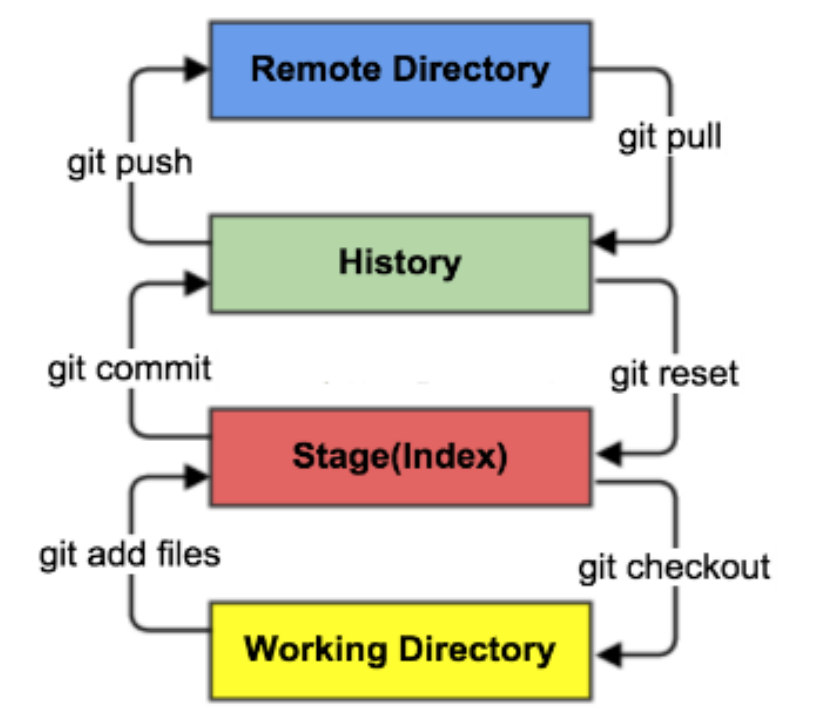


# 3、Git 环境配置

<font size=4 style="font-weight:bold;background:yellow;">下载地址</font>

Git 官网：https://git-scm.com/

淘宝镜像：http://npm.taobao.org/mirrors/git-for-windows/

安装之后会自动配置环境变量，无需再额外配置。

<font size=4 style="font-weight:bold;background:yellow;">Git 的一些组件</font>

- **Git Bash：**Unix 与 Linux 风格的命令行，使用最多，推荐最多。

- **Git CMD：**Windows 风格的命令行。

- **Git GUI：**图形界面的 Git，不建议初学者使用，尽量先熟悉常用命令。

<font size=4 style="font-weight:bold;background:yellow;">常用的 Linux 命令</font>

```bash
cd			# 改变目录
cd.. 		# 回退到上一个目录，直接cd进入默认目录
pwd 		# 显示当前所在的目录路径
ls/ll		# 都是列出当前目录中的所有文件，ll列出的内容更为详细

reset		# 重新初始化终端/清屏
clear		# 清屏
history		# 查看命令历史
help		# 帮助
exit		# 退出

touch		# 新建一个文件，如 touch index.js 就会在当前目录下新建一个index.js文件
rm			# 删除一个文件，rm index.js 就会把index.js文件删除
mkdir		# 新建一个目录,就是新建一个文件夹
rm -r		# 删除一个文件夹, rm -r src 删除src目录
mv			# mv index.html src，移动文件，index.html是要移动的文件，src是目标文件夹，这样写必须保证文件和目标文件夹在同一目录下

rm -rf /	# 切勿在linux系统中尝试，会删除电脑中的全部文件！
```

<font size=4 style="font-weight:bold;background:yellow;">Git 相关的配置文件</font>

- **`D:\Environment\Git\etc\gitconfig`**：Git 安装目录下的 gitconfig。

- **`C:\Users\Administrator\ .gitconfig`**：只适用于当前登录用户的配置。

```bash
git config -l	# 查看Git的配置文件，system和global的配置一起显示
git config --system --list	# 查看系统的配置，--system：系统级别的配置文件
git config --global --list	# 查看当前用户的配置，--global：用户级别的配置文件
```

<font size=4 style="font-weight:bold;background:yellow;">设置用户名与邮箱</font>

当安装 Git 后首先要做的事情是设置用户名称和 email 地址，这是非常重要的，因为每次 Git 提交都会使用该信息，它被永远的嵌入到了提交中。

传递了`--global` 参数后只需设置一次，以后无需再设置，如果希望在一个特定的项目中使用不同的名称或 e-mail 地址，你可以在该项目中去掉 `--global`  选项运行该命令。 总之 `--global` 为全局配置，不是为某个项目的特定配置。

```bash
git config --global user.name "haining820"
git config --global user.email "hn0820@qq.com"	# 配置完之后在C:\Users\Administrator\ .gitconfig 中可以查看配置内容
git config user.name		# 回车，查看用户名
git config user.email		# 回车，查看用户邮箱
```

<font size=4 style="font-weight:bold;background:yellow;">配置 SSH 免密登录</font>

- 设置本机绑定 SSH 公钥，实现免密码登录，可以在 Github/Gitee/Gitlab 上设置中进行添加。

- rsa：加密算法，官方推荐，也可以使用其他算法。

- 输入以下命令后连敲三次回车，生成 ssh 公钥，生成位置 `C:\Users\yuhaiyang\.ssh`，`.pub` 是公钥，另一个是私钥，将`.pub`保存到网站对应设置的地方即可。

  ```bash
  ssh-keygen -t rsa -C "邮箱"	
  ```

# 4、Git 项目搭建

<font size=4 style="font-weight:bold;background:yellow;">创建工作目录与常用指令</font>

工作目录一般就是希望 Git 帮助你管理的文件夹，可以是你项目的目录，也可以是一个空目录，建议不要有中文。

日常使用只要记住下图6个命令：

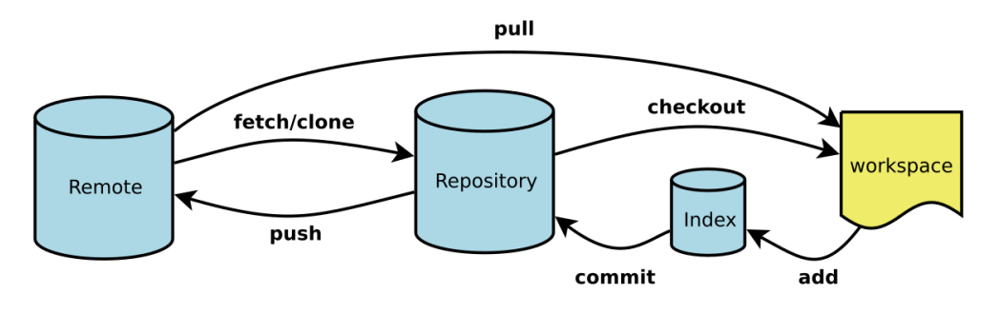

使用 Git 开发的一般流程

- 创建仓库/从远程仓库克隆
- 创建并切换到特性分支
- 创建/修改文件
- 提交工作区文件到暂存区
- 提交暂存区文件到本地仓库
- 切换到主干分支
- 合并特性分支到主干分支
- 推送本地仓库到远程仓库

## 4.1、创建本地仓库

## 4.2、Git 文件操作

<font size=4 style="font-weight:bold;background:yellow;">文件的四种状态</font>

版本控制就是对文件的版本控制，要对文件进行修改、提交等操作，首先要知道文件当前在什么状态， 不然可能会提交了现在还不想提交的文件，或者要提交的文件没提交上。

- Untracked：**未跟踪**，此文件在文件夹中，但并没有加入到 Git 库, 不参与版本控制。

  - 可通过 `git add` 状态变为 Staged。

- Unmodify：**文件已经入库，未修改**，即版本库中的文件快照内容与文件夹中完全一致。

  - 这种类型的文件有两种去处，如果它被修改，而变为 Modified。

  - 如果使用 `git rm` 移出版本库，则成为 Untracked 文件。

- Modified：文件已修改，仅仅是修改，并没有进行其他的操作，这个文件也有两个去处，

  - 通过 `git add` 可进入暂存 Staged 状态；
  - 使用 `git checkout` 则丢弃修改过，返回到 Unmodify 状态，这个 `git checkout` 即从库中取出文件，覆盖当前修改。

- Staged：暂存状态

  - 执行 `git commit` 则将修改同步到库中，这时库中的文件和本地文件又变为一致，文件为 Unmodify 状态。
  - 执行 `git reset HEAD filename` 取消暂存，文件状态为 Modified。

<font size=4 style="font-weight:bold;background:yellow;">IDEA 集成 Git</font>

首先新建 IDEA 项目，然后使用 `git clone` 将远程仓库克隆到本地另一个文件夹当中，然后将 `.git` 文件夹等其他内容移动到 IDEA 项目中即可，IDEA 可以自动识别。

# 5、gitignore

有些时候我们不想把某些文件纳入版本控制中，比如数据库文件，临时文件，设计文件等。需要强调的一点是，如果不慎在创建 .gitignore 文件之前就 push 了项目，那么即使在 .gitignore 文件中写入新的过滤规则，这些规则也不会起作用，Git 仍然会对所有文件进行版本管理。

简单来说，出现这种问题的原因就是 Git 已经开始管理这些文件了，所以无法再通过过滤规则过滤它们，因此一定要养成在项目开始就创建 .gitignore 文件的习惯，否则一旦 push，处理起来会非常麻烦。

在主目录下建立`.gitignore` 文件，此文件有如下规则

-  `#` ：注释
- 可以使用 Linux 通配符，星号 `*` 代表任意多个字符，问号 `?` 代表一个字符，方括号 `[abc]` 代表可选字符范围，大括号 `{string1,string2,...}` 代表可选的字符串等；
- 如果名称的最前面有一个感叹号 `!` ，表示例外规则，将不被忽略；
- 如果名称的最前面是一个路径分隔符 `/`，表示要忽略的文件在主目录下，而子目录中的文件不忽略。
- 如果名称的最后面是一个路径分隔符 `/`，表示要忽略的是主目录下该名称的子目录，而非文件 （默认文件或目录都忽略）。

```bash
*.txt		# 忽略所有".txt"结尾的文件 这样的话上传时就不会被选中了
!lib.txt	# 但lib.txt除外
doc/*.txt	# 会忽略doc/notes.txt但不包括doc/server/arch.txt
fd1/*		# 忽略fd1/目录下的所有文件，不管是根目录下的/fd1/，还是某个子目录/child/fd1/，都会被忽略
/fd1/*		# 仅忽略根目录下的/fd1/目录的全部内容，不包括其它目录下的fd1，如/child/fd1/
```

# 6、Git 基础命令

## 6.1、init && clone

**创建全新的仓库 && 克隆远程仓库**

- 在 Git 管理的项目的根目录中执行初始化操作，执行后可以看到，仅仅在项目目录多出了一个 `.git` 目录，关于版本等的所有信息都在这个目录里面。

    ```bash
    git init			# 在当前目录新建一个Git代码库
    ```

- 克隆已经存在的远程仓库，将远程服务器上的仓库完全镜像一份至本地。

    通常克隆下来的都会是在远程仓库的项目名，可以自定义目录，将其保存在自定义目录中。
    
    ```bash
    git clone [url]	
    git clone [url] [本地目录名]
    ```
    
    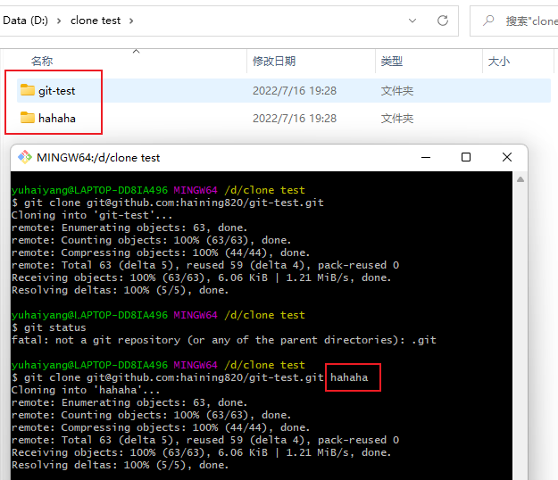

## 6.2、remote

**查看本地仓库关联的远程仓库**

- 在使用 init 初始化本地仓库时，如果想使其与远程仓库进行关联，需要使用到 git remote 命令。

    ```bash
    git init
    git remote add origin git@github.com:haining820/git-test.git	# 在本地关联远程仓库，并将其命名为origin
    git remote		# 查看远程仓库信息，使用该命令查当前仓库关联的远程仓库
    git remote -v	# 查看仓库的详细信息
    git remote rename origin o		# 将远程仓库由remote重命名为o
    git remote remove o				# 移除与远程仓库的关联
    git remote -help	# 查看使用帮助
    ```

- 如果使用 `git clone` 对远程仓库进行克隆，无需进行关联，关联的远程仓库自动命名为 origin，使用 `git remote -v` 可以查看相关信息。

## 6.3、add/reset

**工作区->暂存区->本地仓库->远程仓库**

```bash
git add .
git add hello.txt	# 将全部或指定文件由工作区提交到暂存区
```

```bash
git reset HEAD
git reset HEAD hello.txt	# 将文件由暂存区撤回到工作区，添加文件名后缀可选择指定文件，不添加则将暂存区文件文件全部撤回
```

## 6.4、commit

```bash
git commit -m "add line0"				# 将所有文件的变更都提交到本地仓库
git commit -am "add line0"				# 先add后commit，-am不能只针对某一文件使用，必须针对全体文件
git commit -m "hello2 add line0" hello2.txt		# 将指定的hello2.txt文件的变更提交到本地仓库
```

每次 commit 会根据文件内容生成一个 hash 值作为唯一 id，方便找到对应本次 commit 的文件快照，在 push 时会显示，如下图所示。

## 6.5、push

push：将本地仓库推送到远程仓库

- 本地仓库和远程仓库分支一致的情况下可以直接推。

    ```bash
    git push	# 分支一致的情况下直接推
    ```

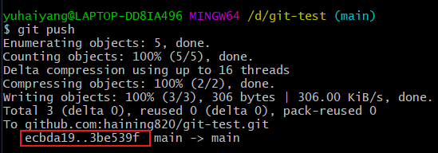

- 将本地分支切换到 branch2，此时远程仓库中没有该新分支，无法直接 push。

  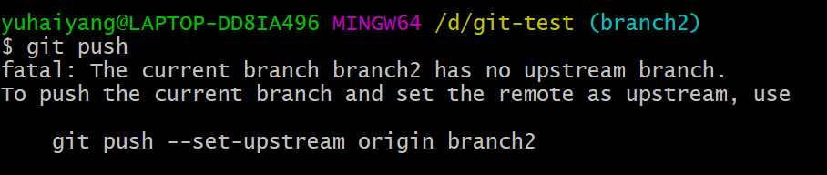

  可以使用上图提示的命令，也可以使用以下命令**将本地分支 branch2 与远程分支 origin 关联**，下次在 branch2 分支进行提交时直接使用 push 命令即可。

  ```bash
  git push --set-upstream origin branch2
  git push -u origin branch2
  ```

## 6.6、branch/checkout

- branch：管理分支
- checkout：切换分支

<font size=4 style="font-weight:bold;background:yellow;">什么是分支？</font>

**分支：**“平行宇宙”，多个分支可以让代码同时有多个版本，互不冲突！

**master 主分支应该非常稳定，用来发布新版本，一般情况下不允许在上面工作，工作时一般情况下在其他分支比如新建 dev 分支上工作，当工作完成后要发布时或者 dev 分支代码稳定后可以合并到主分支 master 上来。**

<font size=4 style="font-weight:bold;background:yellow;">branch</font>

```bash
git branch						# 列出所有本地分支以及目前所在的分支
git branch branch-name			# 新建一个分支，但依然停留在当前分支
git branch -d branch-name		# 删除分支
git branch -v	# 查看各分支详细信息，分支名、最近提交内容、版本号
git branch -r	# 列出所有远程分支
```

<font size=4 style="font-weight:bold;background:yellow;">checkout</font>

```bash
git checkout branch-name		# 直接切换到现有的分支
git checkout -b branch-name		# 新建一个分支并切换到该分支
git checkout -- hello.txt		# 慎用！会用最近的一个提交版本进行覆盖覆盖，对该文件的所有本地修改都会消失
git checkout + 版本号 + 文件名	# 回到某次提交，在不同的commit之间来回切换

# HEAD表示最近的一次commit，加一个波浪线表示上次commit
git checkout HEAD~ hello.txt	# 回到上次提交
git checkout HEAD~2 hello.txt	# 回到上上次提交
git checkout HEAD~3 hello.txt	# 回到上上上次提交
...
git checkout HEAD hello.txt		# 回到最近一次提交
```

## 6.7、status/log/reflog

<font size=4 style="font-weight:bold;background:yellow;">git status</font>

```bash
git status	# 查看当前仓库状态
```

<font size=4 style="font-weight:bold;background:yellow;">git log</font>

- 查看所有 commit 的日志，远程仓库本地仓库各一份，可查看所有 commit 的完整 id，下图对应上图的 `ecbda19..3be539f`；
- 查看提交人 Auther、提交时间 Date；
- 查看提交的备注信息。 

```bash
git log		# 记录提交日志，远程仓库本地仓库各一份
git log --graph
git log --graph --oneline	# 以图表形式显示log，oneline显示简要信息，不加该参数显示信息更详细
```

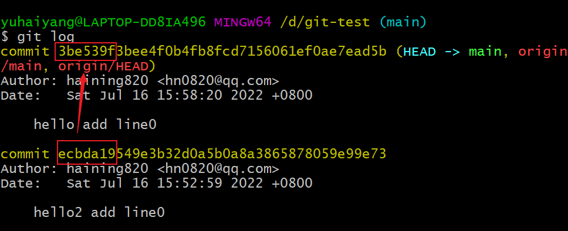

<font size=4 style="font-weight:bold;background:yellow;">git reflog</font>

记录所有分支的所有操作，只储存在使用者本地仓库，注意与 `git log` 的区别。

```bash
git reflog		# 记录所有分支的所有操作，只储存在使用者本地仓库，注意与git log的区别
```

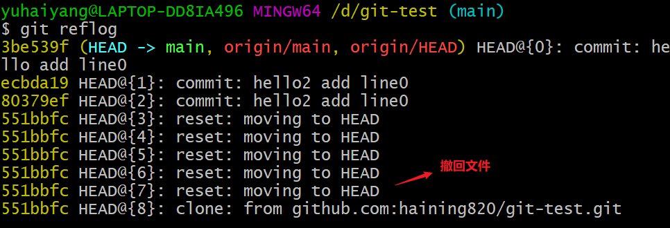

比如使用 `git checkout -b branch2` 切换到 branch2 分支，切换后 log 的信息没有变化，而 reflog 中会有切换分支的日志记录。

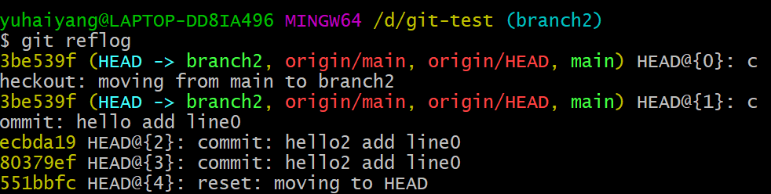

## 6.8、config

<font size=4 style="font-weight:bold;background:yellow;">git config</font>

可以更改提交的用户名和信息，如果在这里设置用名和信息，会覆盖之前的 global 设置，去掉之后又会重新使用之前的 global 设置进行 commit。

```bash
vi .git/config		# 查看git的配置文件
git config -e		#  查看git配置文件
git config --add user.name + 用户名
git config --add user.email + 用户email	# 添加用户名和email
```

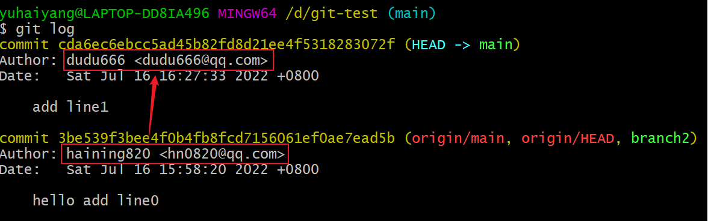

## 6.9、diff

**`diff`**：显示不同提交，不同工作区域，不同分支之间的差别。

```bash
git diff
git diff --cacahed
git diff --staged
git diff + commit1id + commit2id
git diff + branch1 + branch2
```

- **`git diff`**：显示工作区和暂存区之间的差别。

  在 hello.txt 中新增一行，此时还未加入暂存区，使用 `git diff` 命令可以查看出当前工作区和暂存区之间的差别，在使用 add 命令进行提交后工作区与暂存区内容一致，使用 diff 命令后无任何提示。

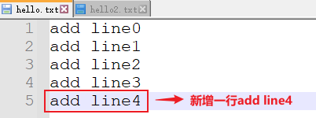

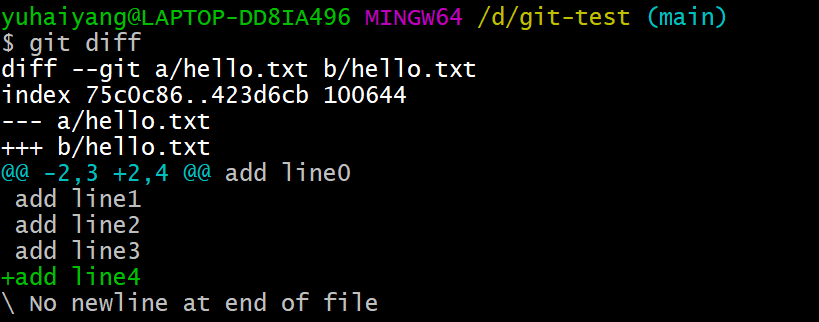

- `git diff --cacahed`，`git diff --staged`：显示暂存区与本地仓库之间的差别。

  使用 commit 命令将暂存区提交到本地仓库，使用 diff 命令后无任何提示。

  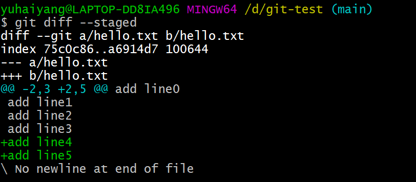
  
- **diff 对比 commit 之间的差异**：因为每次 commit 都有一个对应的 id，可以使用 diff 命令查看指定两次 commit  之间的差异，仅需复制前几位 id 即可，注意 id 顺序的不同对比的结果也会不同（commitA 相对于 commitB / commitB 相对于 commitA）。

  ```bash
  git diff 562b0da3 a249400807
  git diff a249400807 562b0da3
  ```

  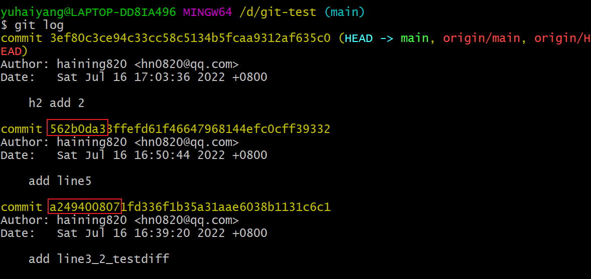

  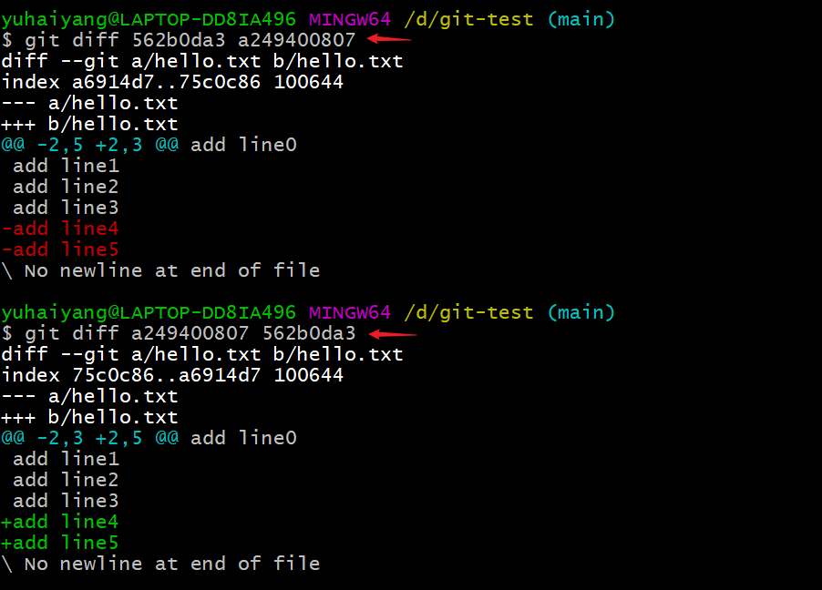

- **diff 对比 branch 之间的差异**

  ```bash
  git diff branch2 main
  ```

  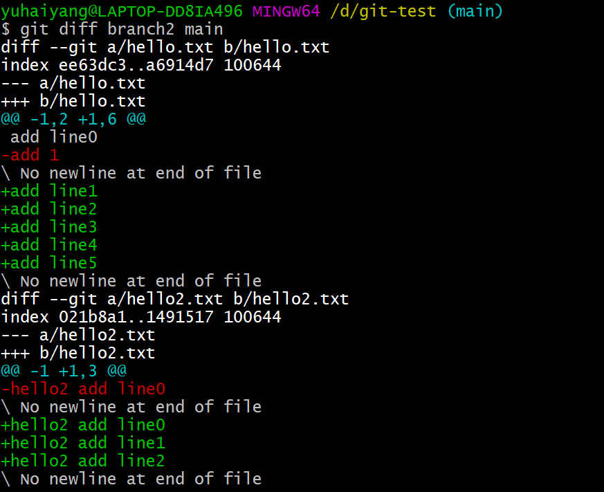

# 7、编辑 commit

## 7.1、fetch/merge/pull

```bash
git fetch
git merge
git pull
```

pull 是 fetch 和 merge 的合并，先执行 fetch 再执行 merge。

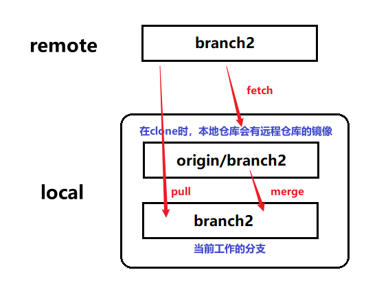

<font size=4 style="font-weight:bold;background:yellow;">测试</font>

- 新建文件夹 git-test2，再 clone 一份远程仓库，切换到 branch2 分支，更改 hello.txt，新加一行 add 2，然后 commit、push；

  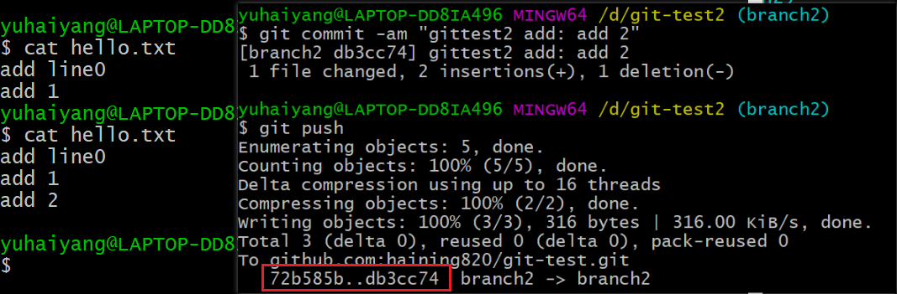

- 此时远程仓库中是有 add 2 的，但是 test1 中还没有，使用 `git fetch `将远程仓库的 branch2 拉到本地仓库 origin/branch2 中，可以观察到：暂存区中的 hello.txt 的内容并没有变化；

  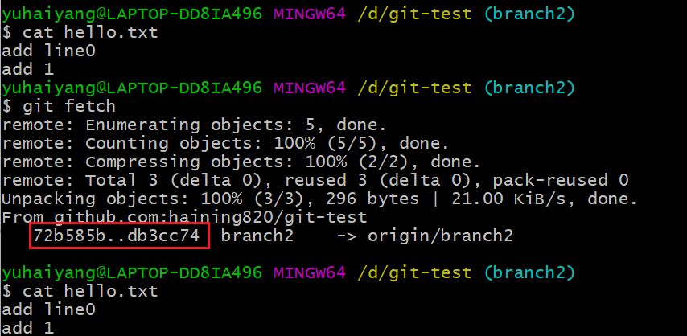

- 使用 `git merge` 将分支 origin/branch2，branch2 合并，新增的内容出现了。

  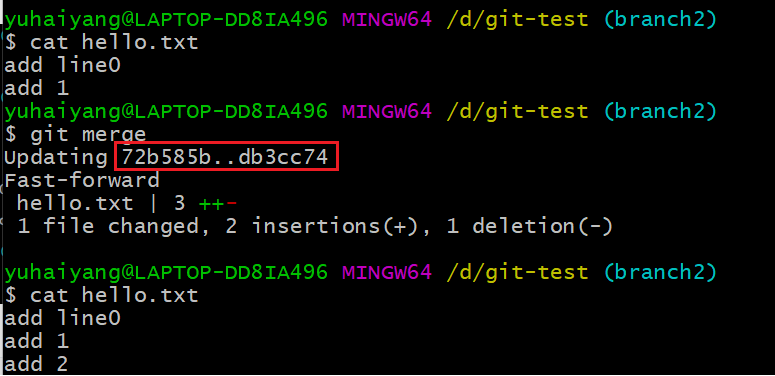

- 观察上面三张图，可以发现 test2 中push 时的 id 在 test 中 fetch 和 merge 时都出现了。

- `git pull` 命令同理。

## 7.2、reset

**reset：**重置 HEAD 到指定状态。

```bash
git reset HEAD			# 默认-mixed
git reset --mixed HEAD
git reset --hard HEAD
git reset --soft HEAD~
```


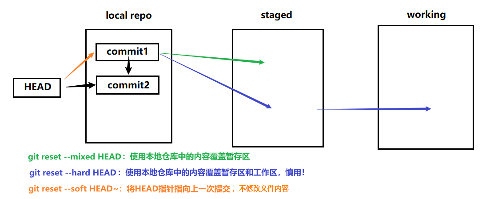

## 7.3、revert/reset

**revert：**撤销一些已经存在的提交，在 gitlog 中查询可以发现 revert 操作会被当成是一次单独的提交保存起来。

只能撤销到上次提交，在测试时撤销上上次提交时出现了冲突，需要处理冲突。

```bash
git revert + 需要撤销的版本号
```

reset：删除提交，这个撤销不会被当成是一次提交，会将这个版本号之后所有的提交都从 gitlog 删除掉，不推荐 。

```bash
git reset --hard + 需要撤销的版本的上一个版本的版本号
```

## 7.4、cherry-pick

**cherry-pick：**将某次提交合并到当前分支。

问题导入：在某 dev 分支上正在开发新的功能，并且有了几次 commitA、commitB... ，但是主分支上的程序出现了 bug，需要进行修复，在该 dev 分支上进行 bug 修复后进行了 commitE，此时想要只将修复 bug 的 commitE 合并到 master 分支上，而新开发的 commitA、commitB... 等还不够成熟，不能进行合并，使用 merge 命令就会全部合并，这时就要用到 cherry-pick 命令。

```bash
git cherry-pick + commitId		# 回到主分支使用cherry-pick修复bug
```

有时在使用 cherry-pick 命令时两个分支都对文件进行了修改，就会出现冲突，需要对冲突进行处理，处理冲突后可以使用如下命令继续合并。

```bash
git cherry-pick --continue
```

## 7.5、rebase

**rebase：**把一个分支的修改合并到当前分支，与 merge 十分相似，但是合并的方式不同。

- merge 是直接新建一个 merge 将两个分支合并，git 提交历史会有分叉和合并；
- rebase 会将 commit 重新再次应用，提交历史会比较整洁。

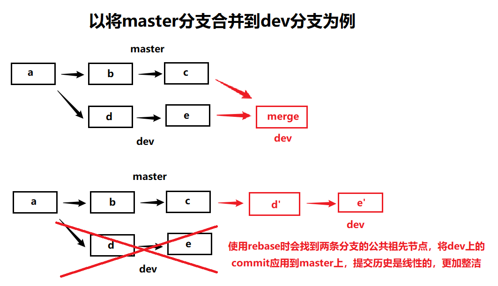

```bash
git rebase -i branch2	# 合并到主分支上
git rebase --continue	# 处理冲突后继续rebase
git rebase --abort		# 放弃rebase
```

# 8、冲突处理

**`git merge`** 还可用于不同分支之间的合并，比如当前在 branch2 分支上进行开发，当代码稳定运行可以合并时，切换到主分支上，使用 merge 命令将 branch2 分支合并到主分支上。

```bash
git checkout main
git merge branch2
```

在合并或者 push 代码时，本地仓库和远程仓库中内容不一致可能会遇到冲突，需要对冲突进行处理合并代码，在命令行提示 `main(分支名)|MERGING` 的时候，就需要打开冲突文件处理冲突内容后再进行 add、commit 合并分支、push 的操作。

当然，也有可能是我们粗心大意写差了，远程仓库中的原版代码更好，这时就可以使用以下命令取消合并，在本地修改过来，避免多次的无意义 push。

```bash
git merge --abort	# 取消合并，最简单的方法
```

但是大多数时候不能对冲突视而不见，而是要进行处理！

<font size=4 style="font-weight:bold;background:yellow;">测试1</font>

前提准备：main、branch2 合并完毕，修改 branch2 hello.txt 中已经合并完的内容并 push 制造冲突，然后再次尝试合并。

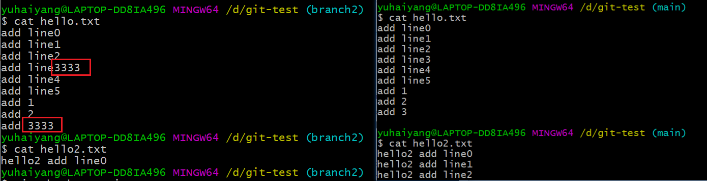

- 切换到 main 分支，尝试合并，出现冲突，此时打开 hello.txt，对冲突进行处理，保留需要的内容，然后使用 add 命令查看状态；

  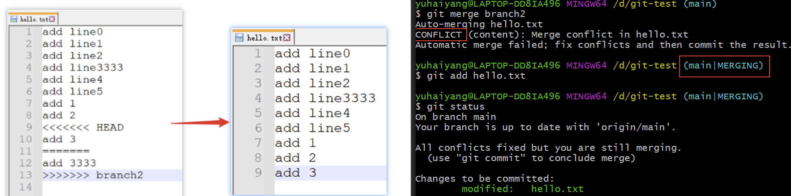

- 然后使用 `git commit` 进行提交，可以添加合并分支的备注信息，添加后 `:wq` 保存退出；

  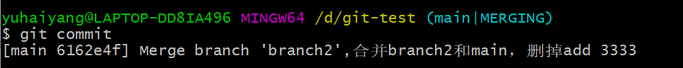

- 最后使用 push 命令提交到远程仓库，冲突解决完成！

<font size=4 style="font-weight:bold;background:yellow;">测试2</font>

前提准备：经过刚才的分支合并，在 test 和 test2 中都 pull 下最新版本的代码，在 test2 中修改某一行并进行 commit、push，在 test 中修改同样地方进行 push 会有冲突出现。

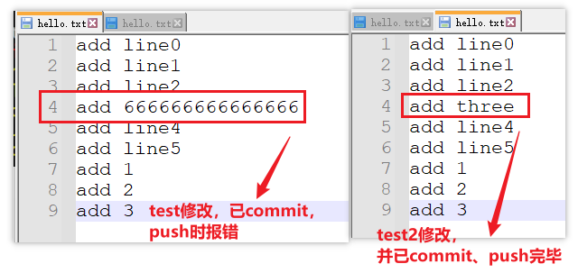

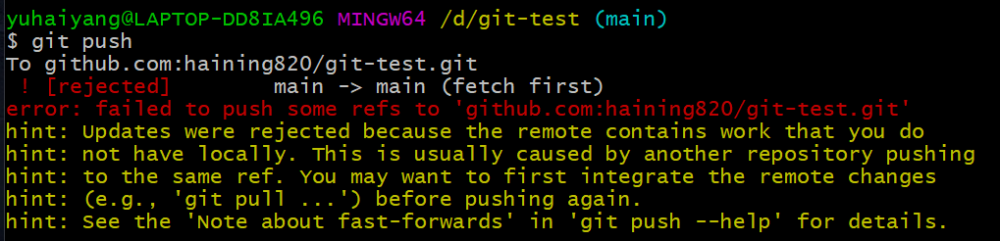

使用 git pull 拉取冲突代码，修改后 add、commit、push，步骤与之前相同。

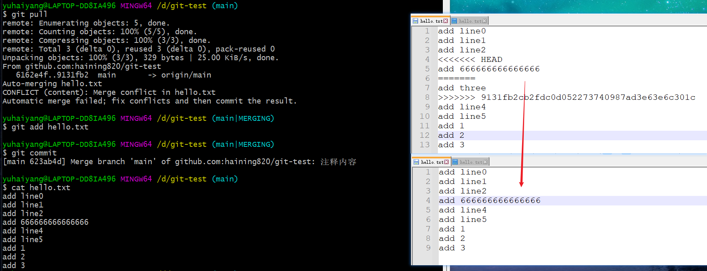

# 9、其他命令合集

```bash
git config --global core.quotepath false  # 去除中文乱码 
```


