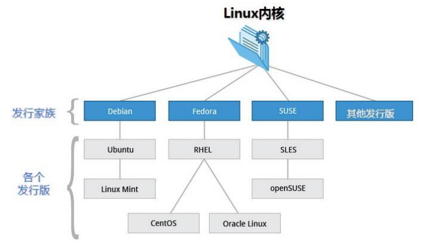

Linux：一切皆文件，读，写，权限。

> Linux 简介

Linux 内核最初只是由芬兰人林纳斯·托瓦兹（Linus Torvalds）在赫尔辛基大学上学时出于个人爱好而 编写的。

Linux 是一套免费使用和自由传播的类 Unix 操作系统，是一个基于 POSIX（可移植操作系统接口） 和 UNIX 的多用户、多任务、支持多线程和多 CPU 的操作系统。

<!--more-->

Linux 能运行主要的 UNIX 工具软件、应用程序和网络协议。它支持 32 位和 64 位硬件。Linux 继承了 Unix 以网络为核心的设计思想，是一个性能稳定的多用户网络操作系统。

> Linux 发行版

Linux 发行版简单来说就是将 Linux 内核与应用软件做一个打包。

阿里云服务器公网 IP 地址

47.93.30.25

Test
