# 1、Mybatis 框架设计

>  Mybatis 官方文档地址：https://mybatis.org/mybatis-3/zh/index.html

Mybatis 分为接口层、数据处理层和基础支撑层。

- 接口层：使用 mapper 接口与 mapper.xml 进行映射，不用实现接口就可以调用；

<!--more-->

- 数据处理层

  - 通过传入的参数构建动态 sql 语句；

  - 执行 sql，将查询结果封装成 `List<E>`；

  - 初始化：以一个 sql 的执行为例，首先是加载 mybatis 的配置文件，解析 xml 配置，然后是构建 sqlSessionFactory 执行。

    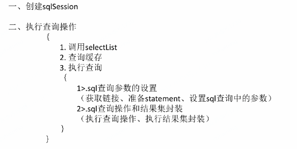

- 基础支撑层

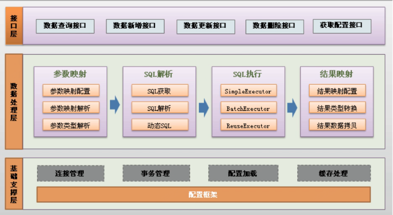

# 2、Hello MyBatis!

## 2.1、新建 maven 项目

新建 maven 项目，在父项目中的 pom.xml 中配置`mysql`、`mybatis` 相关依赖：

```xml
<dependencies>
    <!--mysql驱动-->
    <dependency>
        <groupId>mysql</groupId>
        <artifactId>mysql-connector-java</artifactId>
        <version>5.1.47</version>
    </dependency>
    
    <!--mybatis-->
    <!-- https://mvnrepository.com/artifact/org.mybatis/mybatis -->
    <dependency>
        <groupId>org.mybatis</groupId>
        <artifactId>mybatis</artifactId>
        <version>3.5.2</version>
    </dependency>
</dependencies>
```

配置资源导出问题：

```xml
<!--在build中配置resources，防止资源导出失败-->
<build>
    <resources>
        <resource>
            <directory>src/main/resources</directory>
            <includes>
                <include>**/*.properties</include>
                <include>**/*.xml</include>
            </includes>
            <filtering>true</filtering>
        </resource>
        <resource>
            <directory>src/main/java</directory>
            <includes>
                <include>**/*.properties</include>
                <include>**/*.xml</include>
            </includes>
            <filtering>true</filtering>
        </resource>
    </resources>
</build>
```

## 2.2、新建数据库，配置 IDEA

创建一个名字为 mybatis，属性有 id、name、pwd 三项的表。

```sql
CREATE DATABASE `mybatis`;

USE `mybatis`;

CREATE TABLE `user`(
  `id` INT(20) NOT NULL PRIMARY KEY,
  `name` VARCHAR(30) DEFAULT NULL,
  `pwd` VARCHAR(30) DEFAULT NULL
)ENGINE=INNODB DEFAULT CHARSET=utf8;

INSERT INTO `user`(`id`,`name`,`pwd`) VALUES 
(1,'海洋','123456'),
(2,'张三','123456'),
(3,'李四','123890')
```

在 IDEA 中配置 MySQL，输入用户名、密码、端口号等信息进行连接。

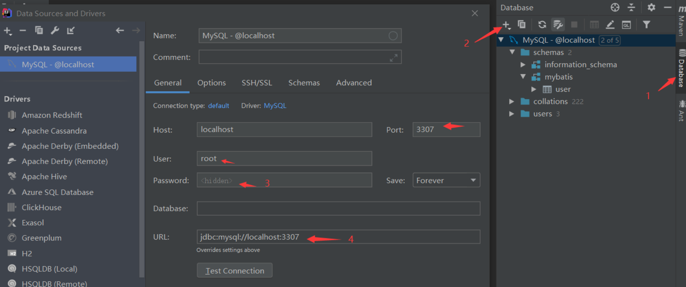

选中项目需要的数据库并且设置时区，避免后面可能的报错。

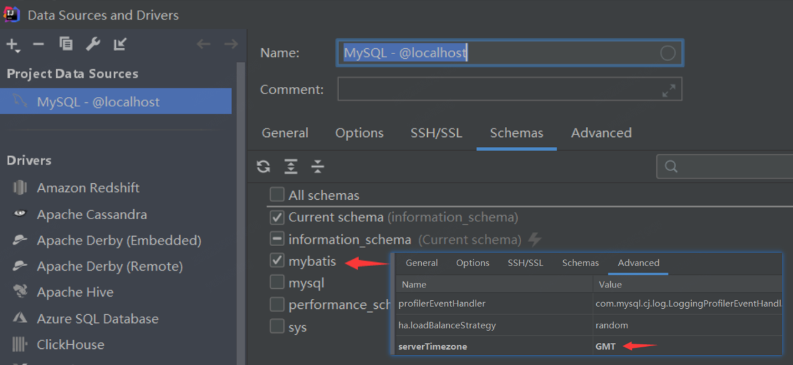

## 2.3、实体类与数据访问 Dao 层

<font size=4 style="font-weight:bold;background:yellow;">实体类</font>

实体类中的对象属性要与数据库中的各个字段一一对应。

```java
package com.haining820.pojo;

public class User {		// 实体类
    private int id;
    private String name;
    private String pwd;
    /*
    	省略有参/无参构造以及get/set/toString方法
    */
}
```

<font size=4 style="font-weight:bold;background:yellow;">Dao 层</font>

数据访问层，全称为 **Data Access Object**，用来访问数据库实现数据的持久化（把内存中的数据永久保存到硬盘中），dao 层属于一种比较底层，比较基础的操作，具体到对于某个表、某个实体的增删改查。

```java
// 操作数据库的UserMapper接口
public interface UserMapper {
    List<User> getUserList();
}
```

## 2.4、UserMapper/mybatis-config.xml

<font size=4 style="font-weight:bold;background:yellow;">UserMapper.xml</font>

xml 文件的名称与数据访问层的接口名称相同，类比于接口的实现类，里面编写与接口对应的 sql 业务语句。

- 传统的 MyBatis 配置 SQL 语句方式就是使用 XML 文件进行配置的，但是这种方式不能很好地支持面向接口编程的理念。

- 为了支持面向接口的编程，MyBatis 引入了Mapper 接口的概念，面向接口的引入，用户只需要在接口上添加必要的注解即可，不用再去配置 XML 文件了。

- 但是，目前的 MyBatis 只是对注解配置 SQL 语句提供了有限的支持，某些高级功能还是要依赖 XML 配置文件配置 SQL 语句。

```xml
<?xml version="1.0" encoding="UTF8" ?>
<!DOCTYPE mapper
        PUBLIC "-//mybatis.org//DTD Mapper 3.0//EN"
        "http://mybatis.org/dtd/mybatis-3-mapper.dtd">
<!--namespace=绑定一个Dao/Mapper接口-->
<mapper namespace="com.haining820.dao.UserMapper">
    
    <select id="getUserList" resultType="com.haining820.pojo.User">
        select * from mybatis.user
    </select>
    
</mapper>
```

<font size=4 style="font-weight:bold;background:yellow;">mybatis-config.xml</font>

配置文件，里面储存了数据库驱动，数据库用户名密码等信息。

```xml
<?xml version="1.0" encoding="UTF8" ?>
<!DOCTYPE configuration
        PUBLIC "-//mybatis.org//DTD Config 3.0//EN"
        "http://mybatis.org/dtd/mybatis-3-config.dtd">
<!--configuration核心配置文件-->
<configuration>

    <environments default="development">
        <environment id="development">
            <transactionManager type="JDBC"/>
            <dataSource type="POOLED">
                <property name="driver" value="com.mysql.jdbc.Driver"/>
                <property name="url" value="jdbc:mysql://localhost:3307/mybatis?useSSL=false&amp;useUnicode=true&amp;characterEncoding=UTF-8"/>
                <property name="username" value="root"/>
                <property name="password" value="root"/>
            </dataSource>
        </environment>
    </environments>

    <!--每一个Mapper.xml都需要在mybatis核心配置文件中注册！-->
    <mappers>
        <mapper resource="com/haining820/dao/UserMapper.xml"/>
        <!--<mapper class="com.haining820.mapper.UserMapper"/>-->
    </mappers>

</configuration>
```

## 2.5、MyBatisUtils 工具类

若想使用 MyBatis，第一步就是要获取 `sqlSessionFactory` 对象，在这个工具类中，是通过 `SqlSessionFactoryBuilder` 加载 mybatis-config.xml 文件的输入流来获取的。

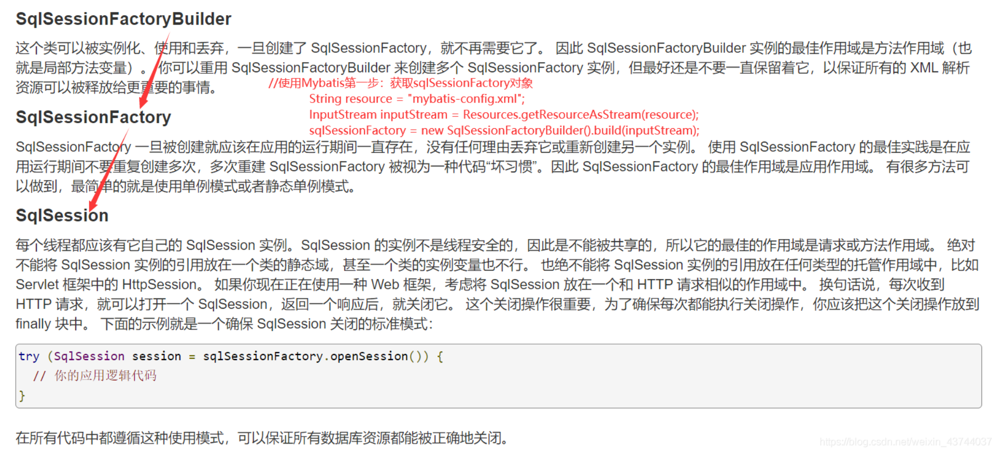

```java
// sqlSessionFactory-->sqlSession
public class MybatisUtils {
    private static SqlSessionFactory sqlSessionFactory;

    static{
        try {
            //使用Mybatis第一步：获取sqlSessionFactory对象
            String resource = "mybatis-config.xml";
            InputStream inputStream = Resources.getResourceAsStream(resource);
            sqlSessionFactory = new SqlSessionFactoryBuilder().build(inputStream);
        } catch (IOException e) {
            e.printStackTrace();
        }
    }

    // 有了SqlSessionFactory，就可以从中获得SqlSession 的实例了。
    // SqlSession完全包含了面向数据库执行SQL命令所需的所有方法。
    public static SqlSession getSqlSession(){
        return sqlSessionFactory.openSession(/*true*/);	// 自动提交事务可以加参数true
    }
}
```

## 2.6、使用 test 类进行测试

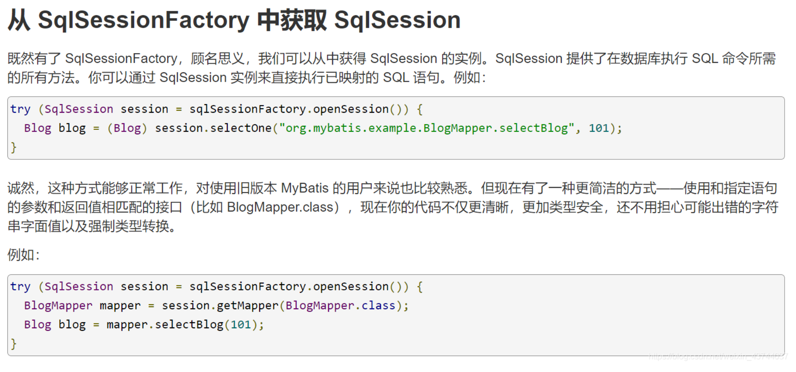

```java
public class UserDaoTest {
    @Test
    public void test(){
        // 获得sqlSession对象
        SqlSession sqlSession = MybatisUtils.getSqlSession();

        // 方式一:getMapper
        UserDao userDao = sqlSession.getMapper(UserDao.class);
        List<User> userList = userDao.getUserList();
        // 方式二
//        List<User> userList = sqlSession.selectList("com.haining820.dao.UserDao.getUserList");

        for (User user : userList) {
            System.out.println(user);
        }	// 显示数据库中储存的数据

        sqlSession.close();	 // 关闭sqlSession
    }
}
```

出现的问题：将 mybatis-config.xml 文件中的 `useSSL=true` 改为 `useSSL=false` 即可。

```
org.apache.ibatis.exceptions.PersistenceException: 
### Error querying database.  Cause: com.mysql.jdbc.exceptions.jdbc4.CommunicationsException: Communications link failure
```

## 2.7、增删改查

<font size=4 style="font-weight:bold;background:yellow;">编写接口</font>

```java
public interface UserMapper {
    List<User> getUserList();
    User getUserById(int id);
    int addUser(User user);
    int updateUser(User user);
    int deleteUser(int id);		// CRUD
}
```

<font size=4 style="font-weight:bold;background:yellow;">编写接口对应的 mapper</font>

```xml
<select id="getUserById" parameterType="int" resultType="com.haining820.pojo.User">
    select * from mybatis.user where id = #{id}
</select>

<!--对象中的属性可以自己取出来-->
<insert id="addUser" parameterType="com.haining820.pojo.User">
    insert into mybatis.user (id,name,pwd) values (#{id},#{name},#{pwd})
</insert>

<update id="updateUser" parameterType="com.haining820.pojo.User" >
    update mybatis.user set  name=#{name},pwd=#{pwd} where id=#{id}
</update>

<delete id="deleteUser" parameterType="int">
    delete from mybatis.user where id=#{id}
</delete>
```

<font size=4 style="font-weight:bold;background:yellow;">测试</font>

注意进行增删改操作时需要提交事务

```java
@Test
public void getUserById(){
    SqlSession sqlSession = MybatisUtils.getSqlSession();
    UserMapper mapper = sqlSession.getMapper(UserMapper.class);

    User user = mapper.getUserById(1);
    System.out.println(user);

    sqlSession.close();
}

@Test	// 增删改需要提交事务
public void addUser(){
    SqlSession sqlSession = MybatisUtils.getSqlSession();
    UserMapper mapper = sqlSession.getMapper(UserMapper.class);

    User newUser = new User(6, "周杰伦", "666");
    mapper.addUser(newUser);

    sqlSession.commit();	// 提交事务
    sqlSession.close();
}

@Test
public void updateUser(){
    SqlSession sqlSession = MybatisUtils.getSqlSession();
    UserMapper mapper = sqlSession.getMapper(UserMapper.class);

    mapper.updateUser(new User(1,"刘德华","888"));

    sqlSession.commit();
    sqlSession.close();
}

@Test
public void deleteUser(){
    SqlSession sqlSession = MybatisUtils.getSqlSession();
    UserMapper mapper = sqlSession.getMapper(UserMapper.class);

    mapper.deleteUser(6);

    sqlSession.commit();
    sqlSession.close();
}
```

<font size=4 style="font-weight:bold;background:yellow;">模糊查询</font>

```java
List<User> getUserLike(String value);	// 模糊查询
```

```xml
<select id="getUserLike" resultType="com.haining820.pojo.User">
    select * from mybatis.user where name like #{value}
</select>
```

```java
@Test
public void getUserLike(){
    SqlSession sqlSession = MybatisUtils.getSqlSession();
    UserMapper mapper = sqlSession.getMapper(UserMapper.class);
    List<User> userList = mapper.getUserLike("%李%");	// %s通配符

    for (User user : userList) {
        System.out.println(user);
    }

    sqlSession.close();
}
```

## 2.8、ResultMap

**如何解决属性名和字段名不一致的问题？**

<font size=4 style="font-weight:bold;background:yellow;">问题描述</font>

创建的用户实体类时如果类对象的属性名没有和数据库中的对应的属性名一模一样，在进行数据查询时会导致**会找不到需要查询的数据**。

比如以下实体类和 sql，按照 id 查询一个用户，密码字段在查询时会显示为null。

```java
public class User {
    private int id;
    private String name;
    private String password;	// 数据库中的字段是pwd
}
```

```xml
<mapper namespace="com.haining820.dao.UserMapper">
    <select id="getUserById" resultType="com.haining820.pojo.User">
        select * from mybatis.user where id = #{id}
    </select>
</mapper>
```

<font size=4 style="font-weight:bold;background:yellow;">解决方案</font>

- **起别名**

    ```xml
    <select id="getUserById" resultType="com.haining820.pojo.User">
        select id,name,pwd as password from mybatis.user where id = #{id}
    </select>
    ```

- **使用 ResultMap 结果集映射**

  使用 ResultMap 标签可以在实体类和数据库的字段之间建立映射，在写 sql 语句时可以使用 resultMap 替代 resultType。

    ```xml
    <mapper namespace="com.haining820.dao.UserMapper">

    <!--结果集映射-->
    <resultMap id="UserMap" type="User">
        <!--id和name与数据库中的名字相同,可以不用改-->
        <!--<result column="id" property="id"/>-->
        <!--<result column="name" property="name"/>-->
        <result column="pwd" property="password"/>
    </resultMap>

    <select id="getUserById" resultMap="UserMap">
        select * from mybatis.user where id = #{id}
    </select>

    </mapper>
    ```

## 2.9、`#{}` 和 `${}` 的区别

不同之处主要在于解析时的不同

- `#{}` 在解析时会解析成 `?`

  - `#{}`用来传入参数，sql在解析的时候会加上`" "`，当成字符串来解析
  - `#{}`能够很大程度上防止sql注入，尽量使用`#{}`。

-  `${} ` 会直接进行变量的替换

  当表的属性或表名作为参数传递给 sql 语句的时候可以使用 `${} ` ，比如某表数据量很大，每个月可以生成几千万条数据，按月分表（每个月一张表），当想要查询这些数据的时候，比如使用表 `table[YYYYMM]`，其中的 `YYYYMM` 可以使用 `${}` 传递（拼接表名不用担心 sql 注入）。

- https://blog.csdn.net/qian_qian_123/article/details/92844194

# 3、mybatis-config.xml 解读

在 MyBatis 的配置文件中，每个标签都是有规定的顺序的，不能随意改动。

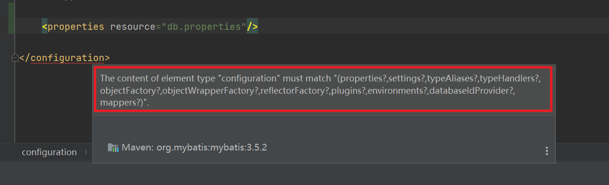


## 3.1、properties

**通过 properties 属性可以实现对配置文件的引用**。

- 首先编写一个配置文件 db.properties；

  ```properties
  driver=com.mysql.jdbc.Driver
  url=jdbc:mysql://localhost:3307/mybatis?useSSL=false&useUnicode=true&characterEncoding=UTF-8
  username=root
  password=root
  ```

- 然后在 `mybatis-config.xml` 文件中引入外部配置文件；

  ```xml
  <!--引入外部配置文件-->	
  <properties resource="db.properties"/>
  ```

  也可以在 db.properties 配置文件中不记录用户名和密码，在 mybatis-config.xml 文件引用配置文件的地方进行补充；

  ```xml
  <!--也可以这样引入外部配置文件-->
  <properties resource="db.properties">
      <property name="username" value="root"/>
      <property name="password" value="123"/>
  </properties>
  ```

  如果在 properties 文件和 xml 文件中有同一个字段，会优先使用 properties  文件的字段。

  - 比如当前在 mybatis-config.xml 文件中配置的 password 为 `123` ，**在 db.properties 中的密码是 `root`，**会优先使用 db.properties 中的正确密码，可以登录成功；

  - 如果其他条件不变，db.properties 文件中的密码改为 `123`，则无法成功登录，因为该文件中的字段优先使用。
  - 若在两个配置文件中的密码采用不同的字段名，这样不存在冲突，哪个匹配上就用哪个。

- 在 environments 中就可以使用 db.properties 文件中的关键字替换原来的配置，实现将配置单独存储，外部配置，动态替换；

  ```xml
  <environments default="development">
      <environment id="development">
          <transactionManager type="JDBC"/>
          <dataSource type="POOLED">
              <property name="driver" value="${driver}"/>
              <property name="url" value="${url}"/>
              <property name="username" value="${username}"/>
              <property name="password" value="${password}"/>
          </dataSource>
      </environment>
  </environments>
  ```

## 3.2、settings

**settings 是 Mybatis 中极为重要的调整设置，它们会改变 MyBatis 的运行时的行为。**

**logImpl（日志工厂）**

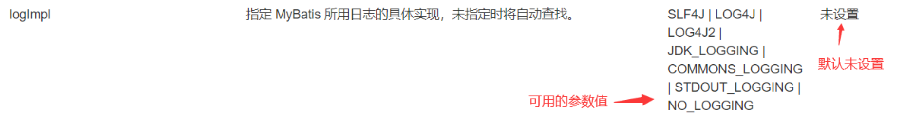

日志工厂：如果一个数据库操作，出现了异常需要排错，日志就是最好的助手！在 Mybatis 中具体使用哪一个日志实现，可以在设置中进行设定。

日志工厂的有效值如下：

```
SLF4J 
LOG4J
LOG4J2
JDK_LOGGING
COMMONS_LOGGING
STDOUT_LOGGING
NO_LOGGING
```

<font size=4 style="font-weight:bold;background:yellow;">STDOUT_LOGGING 标准日志输出</font>

```xml
<settings>
    <!--标准的日志工厂实现-->
    <setting name="logImpl" value="STDOUT_LOGGING"/>
</settings>
```

在 mybatis-config.xml 中加入相关设置，输出后会新增以下日志信息：

```java
Opening JDBC Connection			// 打开连接
Created connection 385337537. 	// 建立连接
Setting autocommit to false on JDBC Connection [com.mysql.jdbc.JDBC4Connection@16f7c8c1]
==>  Preparing: select * from mybatis.user where id = ?		// sql语句
==> Parameters: 1(Integer)		// getUserById的参数
<==    Columns: id, name, pwd
<==        Row: 1, 刘德华, 888
<==      Total: 1
User{id=1, name='刘德华', password='888'}
Resetting autocommit to true on JDBC Connection [com.mysql.jdbc.JDBC4Connection@16f7c8c1]
Closing JDBC Connection [com.mysql.jdbc.JDBC4Connection@16f7c8c1]	// 关闭连接
Returned connection 385337537 to pool.		// 将连接归还给数据库
```

<font size=4 style="font-weight:bold;background:yellow;">log4j 日志输出</font>

- 首先在 maven 中导入 log4j 的包；

  ```xml
  <!-- https://mvnrepository.com/artifact/log4j/log4j -->
  <dependency>
      <groupId>log4j</groupId>
      <artifactId>log4j</artifactId>
      <version>1.2.17</version>
  </dependency>
  ```

- 新建 log4j.properties 文件

  ```properties
  #将等级为DEBUG的日志信息输出到console和file这两个目的地，console和file的定义在下面的代码
  log4j.rootLogger=DEBUG,console,file
  
  #控制台输出的相关设置
  log4j.appender.console=org.apache.log4j.ConsoleAppender
  log4j.appender.console.Target=System.out
  log4j.appender.console.Threshold=DEBUG
  log4j.appender.console.layout=org.apache.log4j.PatternLayout
  log4j.appender.console.layout.ConversionPattern=[%c]-%m%n
  
  #文件输出的相关设置
  log4j.appender.file=org.apache.log4j.RollingFileAppender
  log4j.appender.file.File=./log/haining820.log
  log4j.appender.file.MaxFileSize=10mb
  log4j.appender.file.Threshold=DEBUG
  log4j.appender.file.layout=org.apache.log4j.PatternLayout
  log4j.appender.file.layout.ConversionPattern=[%p][%d{yy-MM-dd}][%c]%m%n
  
  #日志输出级别
  log4j.logger.org.mybatis=DEBUG
  log4j.logger.java.sql=DEBUG
  log4j.logger.java.sql.Statement=DEBUG
  log4j.logger.java.sql.ResultSet=DEBUG
  log4j.logger.java.sql.PreparedStatement=DEBUG
  ```

- 在 setting 中进行配置；

  ```xml
  <settings>
      <!--标准的日志工厂实现-->
      <!--<setting name="logImpl" value="STDOUT_LOGGING"/>-->
      <setting name="logImpl" value="LOG4J"/>
  </settings>
  ```

- 运行结果

  ```java
  	[org.apache.ibatis.logging.LogFactory]-Logging initialized using 'class org.apache.ibatis.logging.log4j.Log4jImpl' adapter.
  	[org.apache.ibatis.logging.LogFactory]-Logging initialized using 'class org.apache.ibatis.logging.log4j.Log4jImpl' adapter.
  	[org.apache.ibatis.datasource.pooled.PooledDataSource]-PooledDataSource forcefully closed/removed all connections.
  	[org.apache.ibatis.datasource.pooled.PooledDataSource]-PooledDataSource forcefully closed/removed all connections.
  	[org.apache.ibatis.datasource.pooled.PooledDataSource]-PooledDataSource forcefully closed/removed all connections.
  	[org.apache.ibatis.datasource.pooled.PooledDataSource]-PooledDataSource forcefully closed/removed all connections.
  	[com.haining820.dao.UserDaoTest]-进入getUserById方法成功
  	[org.apache.ibatis.transaction.jdbc.JdbcTransaction]-Opening JDBC Connection
  	[org.apache.ibatis.datasource.pooled.PooledDataSource]-Created connection 520022247.
  	[org.apache.ibatis.transaction.jdbc.JdbcTransaction]-Setting autocommit to false on JDBC Connection [com.mysql.jdbc.JDBC4Connection@1efee8e7]
  	[com.haining820.dao.UserMapper.getUserById]-==>  Preparing: select * from mybatis.user where id = ? 
  	[com.haining820.dao.UserMapper.getUserById]-==> Parameters: 1(Integer)
  	[com.haining820.dao.UserMapper.getUserById]-<==      Total: 1
  	User{id=1, name='王冰冰', password='666'}
  	[org.apache.ibatis.transaction.jdbc.JdbcTransaction]-Resetting autocommit to true on JDBC Connection [com.mysql.jdbc.JDBC4Connection@1efee8e7]
  	[org.apache.ibatis.transaction.jdbc.JdbcTransaction]-Closing JDBC Connection [com.mysql.jdbc.JDBC4Connection@1efee8e7]
  	[org.apache.ibatis.datasource.pooled.PooledDataSource]-Returned connection 520022247 to pool.
  ```

- log4j 的日志级别

  ```java
  import org.apache.log4j.Logger;		// 在要使用Log4j 的类中导包 
  static Logger logger = Logger.getLogger(UserDaoTest.class);		// 创建日志对象,参数为当前类的class
  @Test
  public void TestLog4j(){
      logger.info("info:进入了log4j");
      logger.debug("debug:进入了log4j");
      logger.error("error:进入了log4j");
  }	// 设置日志级别
  ```

## 3.3、typeAliases

- **类型别名，typeAliases 是为 Java 类型设置一个短的名字，它存在的意义仅在于用来减少类完全限定名的冗余。**

    ```xml
    <!--可以给实体类起别名-->
    <typeAliases>
        <typeAlias type="com.haining820.pojo.User" alias="User"/>
    </typeAliases>
    ```

    在 mapper 文件中写类名的时候可以使用指定的别名。

    ```xml
    <!--在配置mapper时就可以用User代替com.haining820.pojo.User-->
    <select id="getUserList" resultType="User">
        select * from mybatis.user
    </select>
    ```

- **也可以指定一个包名，这样的话扫描实体类的包，类的默认别名就为这个类的类名，首字母小写。**

    ```xml
    <typeAliases>
        <package name="com.haining820.pojo"/>
    </typeAliases>
    ```

    在 mapper 文件中写类名的时候可以使用小写。

    ```xml
    <select id="getUserList" resultType="user">
        select * from mybatis.user
    </select>
    ```

- 使用场景

    - 在实体类比较少的时候，使用第一种方式；如果实体类十分多，建议使用第二种。
    - 第一种方法可以自定义命名，第二种则不能；如果非要用，还可以用注解进行命名。

        ```java
        @Alias("user666")
        public class User {}
        ```

## 3.4、environments

MyBatis 可以配置成适应多种环境，这种机制有助于将 SQL 映射应用于多种数据库之中， 现实情况下有多种理由需要这么做。例如，开发、测试和生产环境需要有不同的配置；或者想在具有相同 Schema 的多个生产数据库中使用相同的 SQL 映射...

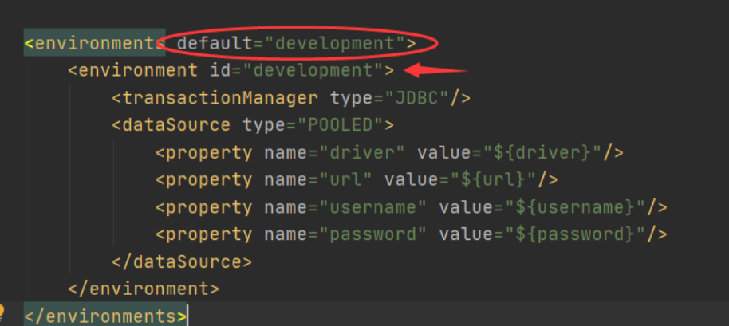

- 可以配置多个环境，选择默认需要的环境 ID，比如 `default="development"`，需要注意的是尽管可以配置多个环境，但每个 SqlSessionFactory 实例只能选择一种环境；

- 为每个 environment 元素定义的环境 ID，比如 `id="development"`；

- 事务管理器 transactionManager 的配置，比如 `type="JDBC"`（默认）

  **Mybatis 的事务管理分为两种形式：**

  - 使用 JDBC 的事务管理机制：利用 java.sql.Connection 对象完成对事务的 commit、rollback、close 等；
  - 使用 MANAGED 的事务管理机制：这种机制下 mybatis 自身不会去实现事务的管理，而是让程序的容器（如 JBOSS、Weblogic）来实现对事务的管理。

  ```properties
  <!--在 MyBatis 中有两种类型的事务管理器-->
  type="[JDBC|MANAGED]"
  ```

- 数据源 dataSource 的配置，比如 `type="POOLED"` （数据库连接池，连接数据库，连接用完可以回收）

  - 由于创建一个数据库连接所占用的资源比较大，对于数据吞吐量大和访问量非常大的应用而言，连接池的设计就显得非常重要。
  - 需要频繁地跟数据库交互的应用程序，可以在创建了 Connection 对象，并操作完数据库后，可以不释放掉资源，而是将它放到内存中，当下次需要操作数据库时，可以直接从内存中取出 Connection 对象，不需要再创建了，这样就极大地节省了创建 Connection 对象的资源消耗。我们将在内存中存放 Connection 对象的容器称之为连接池（Connection Pool）。
  - 由于内存也是有限和宝贵的，这又对我们对内存中的 Connection 对象怎么有效地维护提出了很高的要求。所以就需要一套连接池管理机制。
  
  ```properties
  <!--在 MyBatis 中有三种内建的数据源类型-->
  type="[UNPOOLED|POOLED|JNDI]"
  ```

## 3.5、mappers

每一个 mapper.xml 都需要在 mybatis 核心配置文件中注册，注册绑定 mapper 文件有以下三种方法：

```xml
<mappers>
    <!--方法1,推荐-->
    <mapper resource="com/haining820/dao/UserMapper.xml"/>
    <!--方法2-->
    <!--<mapper class="com.haining820.dao.UserMapper"/>-->
    <!--方法3-->
    <!--<package name="com.haining820.dao"/>-->
</mappers>
```

**方法2、3注意：**

- 接口和 Mapper 配置文件必须同名！

- 接口和 Mapper 配置文件必须在同一个包下！

# 4、注解

## 4.1、@Param

parameterType 和 @Param：

- 查询语句中只有单个参数，无需 @Param 注解：在 mapper 中指定 parameterType；
- 多个参数，无需 @Param 注解：将参数封装成 map 对象，mapper 文件中的属性值（`#{}` 中的内容）和 map 的 key 值一致；
- 使用 @Param 注解，mapper 文件中的属性值和 @Param 中的名称一致，不需要 parameterType。
  - **基本类型**的参数或者 **String 类型**，需要加上，**引用类型**不需要加；
  - 如果只有一个基本类型的话，可以忽略，但是建议加上。

## 4.2、如何实现注解

- 在类的接口函数上方添加 sql 语句直接实现

  ```java
   public interface UserMapper {
      @Select("select * from user")
      List<User> getUsers();
  
      @Select("select * from mybatis.user where id = #{id}")
      User getUserById(@Param("id") int id);
  
      @Insert("insert into mybatis.user(id,name,pwd) values (#{id},#{name},#{pwd})")
      int addUser(User user);
  
      @Update("update mybatis.user set name=#{name}, pwd=#{pwd} where id=#{id}")
      int updateUser(User user);
  
      @Delete("delete from mybatis.user where id=#{uid}")
      int deleteUser(@Param("uid") int id);
  }
  ```

- 在 mybatis-config.xml 核心配置文件中绑定接口

  ```xml
  <mappers>
      <mapper class="com.haining820.dao.UserMapper"/>
  </mappers>
  ```

- 在 MyBatisUtils.class 中设置自动提交为 true

  ```java
  public static SqlSession getSqlSession(){
      return sqlSessionFactory.openSession(true);
  }	// 这样在进行增删改查时就不用额外提交事务了
  ```

## 4.3、基于注解实现 CRUD

 ```java
 	@Test
     public void test(){
         SqlSession sqlSession = MybatisUtils.getSqlSession();
         UserMapper mapper = sqlSession.getMapper(UserMapper.class);
 
 //        List<User> users = mapper.getUsers();
 //        for (User user : users) {
 //            System.out.println(user);
 //        }  // 查询所有用户
 //        mapper.addUser(new User(8, "古力娜扎", "123456"));
         mapper.deleteUser(5);
 //        mapper.updateUser(new User(4, "王二麻子", "123456"));
 //        mapper.getUserById(7);
 
 //        sqlSession.commit();  // 设置自动提交事务后就不用再commit了
         sqlSession.close();
     }
 ```

# 5、一对多和多对一

## 5.1、什么是一对多和多对一

拿老师和学生举例：

- 一个老师可以有多个学生，对于老师这边，就是一对多，即一个老师拥有一群学生（集合）！

- 多个学生只能有一个老师，对于学生这边，就是多对一，即多个学生只有一个老师！

## 5.2、一对多的实现

<font size=4 style="font-weight:bold;background:yellow;">创建实体类</font>

```java
@Data
public class Student {	// 学生实体类
    private int id;
    private String name;
    private int tid;
}
```

```java
@Data
public class Teacher {	// 老师实体类
    private int id;
    private String name;
    private List<Student> students;	// 一个老师对应多个学生
}
```

```java
public interface TeacherMapper {
    Teacher getTeacher(@Param("tid") int id);
    Teacher getTeacher2(@Param("tid") int id);
}
```

<font size=4 style="font-weight:bold;background:yellow;">按照结果嵌套处理</font>

```xml
<select id="getTeacher" resultMap="TeacherStudent">
    select s.id sid,s.name sname,t.id tid,t.name tname
    from student s,teacher t
    where s.tid = t.id and t.id=#{tid}
</select>

<resultMap id="TeacherStudent" type="Teacher">
    <result property="id" column="tid"/>
    <result property="name" column="tname"/>
    <!--collection: 一对多-->
    <collection property="students" ofType="Student">
        <result property="id" column="sid"/>
        <result property="name" column="sname"/>
        <result property="tid" column="tid"/>
    </collection>
</resultMap>
```

<font size=4 style="font-weight:bold;background:yellow;">按照查询嵌套处理</font>

```xml
<select id="getTeacher2" resultMap="TeacherStudent2">
    select * from teacher where id=#{tid}
</select>

<resultMap id="TeacherStudent2" type="Teacher">
    <!--在子查询办法中由于再次使用了id，老师id变成0了，加上下面这行进行映射即可解决-->
    <!--尽量要映射全-->
    <result property="id" column="id"/>
    <!--collection: 一对多-->
    <collection property="students" javaType="ArrayList" ofType="Student" select="getStudentByTid" column="id"/>
</resultMap>

<select id="getStudentByTid" resultType="Student">
    select * from student where tid=#{tid}
</select>
```

<font size=4 style="font-weight:bold;background:yellow;">测试</font>

```java
@Test
public void test(){	// test2()
    SqlSession sqlSession = MybatisUtils.getSqlSession();
    TeacherMapper mapper = sqlSession.getMapper(TeacherMapper.class);

    Teacher teacher = mapper.getTeacher(1);	// mapper.getTeacher2(1)
    System.out.println(teacher);

    sqlSession.close();
}
```

```java
Teacher(id=1, name=秦老师, students=[Student(id=1, name=小明, tid=1), Student(id=2, name=小红, tid=1), Student(id=3, name=小张, tid=1), Student(id=4, name=小李, tid=1), Student(id=5, name=小王, tid=1)])
```

## 5.3、多对一的实现

<font size=4 style="font-weight:bold;background:yellow;">创建实体类</font>

```java
@Data
public class Student {	// 学生实体类
    private int id;
    private String name;
    private Teacher teacher;	// 学生关联老师
}
```

```java
@Data
public class Teacher {	// 老师实体类
    private int id;
    private String name;
}
```

```java
public interface StudentMapper {
    public List<Student> getStudent();
    public List<Student> getStudent2();		// 查询学生以及对应的老师信息
}
```

<font size=4 style="font-weight:bold;background:yellow;">按照结果嵌套处理</font>

```xml
<resultMap id="StudentTeacher" type="Student">
    <result property="id" column="sid"/>
    <result property="name" column="sname"/>
    <!--association: 多对一-->
    <association property="teacher" javaType="Teacher">
        <result property="id" column="tid"/>
        <result property="name" column="tname"/>
    </association>
</resultMap>

<!--按照结果查询嵌套处理-->
<select id="getStudent" resultMap="StudentTeacher">
    select s.id sid,s.name sname,t.id tid,t.name tname
    from student s,teacher t
    where s.tid=t.id
</select>
```

<font size=4 style="font-weight:bold;background:yellow;">按照查询嵌套处理</font>

```xml
<select id="getStudent2" resultMap="StudentTeacher2">
    select * from student;
</select>

<!--查询所有学生信息,根据查询出来的tid,再去查询对应的老师(子查询)-->
<resultMap id="StudentTeacher2" type="Student">
    <result property="id" column="id"/>
    <result property="name" column="name"/>
    <!--association: 多对一-->
    <association property="teacher" column="tid" javaType="Teacher" select="getTeacher"/>
</resultMap>

<select id="getTeacher" resultType="Teacher">
    select * from teacher where id=#{tid};
</select>
```

<font size=4 style="font-weight:bold;background:yellow;">测试</font>

```java
@Test
public void testStudent(){	// testStudent2()
    SqlSession sqlSession = MybatisUtils.getSqlSession();
    StudentMapper mapper = sqlSession.getMapper(StudentMapper.class);

    List<Student> studentList = mapper.getStudent();	// mapper.getStudent2();
    for (Student student : studentList) {
        System.out.println(student);
    }
    sqlSession.close();
}
```

```java
Student(id=1, name=小明, teacher=Teacher(id=1, name=秦老师))
Student(id=2, name=小红, teacher=Teacher(id=1, name=秦老师))
Student(id=3, name=小张, teacher=Teacher(id=1, name=秦老师))
Student(id=4, name=小李, teacher=Teacher(id=1, name=秦老师))
Student(id=5, name=小王, teacher=Teacher(id=1, name=秦老师))
```

## 5.4、总结

- **两种查询实现的方式是不一样的，从日志中就可以看出。**
  - 结果嵌套是一条 sql 语句直接查出结果，嵌套是在 sql 内部完成的；
  
  - 查询嵌套是分别运行两条 sql 语句，查询后对各自的结果再次进行嵌套。
  
- **集合 -> collection 【一对多】**

- **关联 -> association 【多对一】**

- **javaType 和 ofType**

  - JavaType 用来指定实体类中属性的类型

  - ofType 用来指定映射到 List 或者集合中的 pojo 类型，泛型中的约束类型！

# 6、动态 SQL

## 6.0、准备

<font size=4 style="font-weight:bold;background:yellow;">什么是动态 SQL？</font>

动态 SQL 就是在拼接 SQL 语句时，只要保证 SQL 的正确性，按照 SQL 的格式，去排列组合就可以了。

建议先在 MySQL 中写出完整的SQL，再对应的去修改成动态 SQL 实现通用即可。

其实动态 sql 语句的编写往往就是一个拼接的问题，为了保证拼接准确，最好首先把原生 sql 语句写出来，然后再通过 mybatis 动态sql 对照着改，防止出错，多在实践中使用才是熟练掌握它的技巧。

<font size=4 style="font-weight:bold;background:yellow;">环境搭建</font>

- 数据库建表
    ```sql
    CREATE TABLE `blog` (
      `id` varchar(50) NOT NULL COMMENT '博客id',
      `title` varchar(100) NOT NULL COMMENT '博客标题',
      `author` varchar(30) NOT NULL COMMENT '博客作者',
      `create_time` datetime NOT NULL COMMENT '创建时间',
      `views` int(30) NOT NULL COMMENT '浏览量'
    ) ENGINE=InnoDB DEFAULT CHARSET=utf8
    ```
- 创建实体类
    ```java
    @Data
    public class Blog {
        private String id;
        private String title;
        private String author;
        private Date createTime;  //属性名和字段名不一致
        private int views;
    }
    ```
- 编写实体类对应的 mapper 接口和对应的 mapper.xml 文件

<font size=4 style="font-weight:bold;background:yellow;">插入数据</font>

- 编写接口函数
    ```java
    int addBlog(Blog blog);		// 插入数据
    ```
    
- 配置接口
    ```xml
    <insert id="addBlog" parameterType="Blog">
        insert into mybatis.blog(id, title, author, create_time, views)
        values (#{id}, #{title}, #{author}, #{createTime}, #{views});
    </insert>
    ```
    
- 编写工具类
    ```java
    public class IdUtils {
        public static String getId(){
            return UUID.randomUUID().toString().replaceAll("\\.","-");
        }  // 随机生成用户id
    }
    ```
    
- 创建测试类，写入数据。
    ```java
    @Test
    public void addInitBlog(){
        SqlSession sqlSession = MybatisUtils.getSqlSession();
        BlogMapper mapper = sqlSession.getMapper(BlogMapper.class);
    
        Blog blog = new Blog();
    
        blog.setAuthor("hyyu");
        blog.setCreateTime(new Date());
        blog.setViews(9999);
    
        blog.setId(IdUtils.getId());
        blog.setTitle("Mybatis");
        mapper.addBlog(blog);
    
        blog.setId(IdUtils.getId());
        blog.setTitle("Java");
        mapper.addBlog(blog);
    
        blog.setId(IdUtils.getId());
        blog.setTitle("Spring");
        mapper.addBlog(blog);
    
        blog.setId(IdUtils.getId());
        blog.setTitle("微服务");
        mapper.addBlog(blog);
    
        sqlSession.close();
    }
    ```
    
    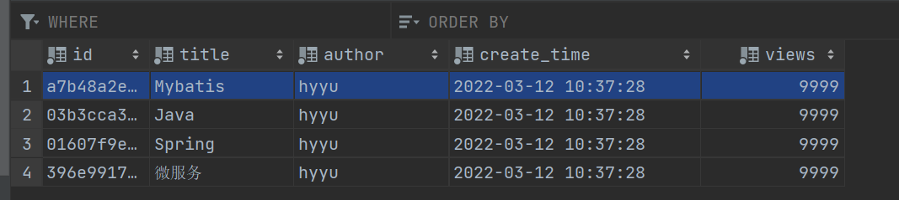

## 6.1、if
<font size=4 style="font-weight:bold;background:yellow;">编写接口函数</font>

```java
List<Blog> queryBlogIF(Map map);	// 查询博客
```

<font size=4 style="font-weight:bold;background:yellow;">配置接口</font>

```xml
<select id="queryBlogIF" parameterType="map" resultType="Blog">
    select * from mybatis.blog where 1=1
    <if test="title != null">
        and title = #{title}
    </if>
    <if test="author != null">
        and author = #{author}
    </if>
</select>
```

- 解释一下这段语句：与编程语言中的 `if` 类似, 如果 `title` 不为空，就在查询语句后追加上 `title` 的属性，author 同理，都不为空就都进行追加，这样查询出来的结果就是符合所给 `title` 和 `author` 双重条件的结果；

- 拼接中的连接词 `1=1` 和 `and` 都是有必要加的

  ```sql
  select * from mybatis.blog where 1=1 
  and title = #{title}
  and author = #{author}
  ```

  这段 sql 只是简单地将上面三句拼接在一起，如果不加上这些连接词的话实际在运行中可能会出现由拼接导致的运行残缺不全的 sql 的情况（如下所示），这种方法存在一定的局限性，后边的关键字 `where` 可以很好的解决这里出现的问题。

  ```sql
  select * from mybatis.blog where
  select * from mybatis.blog where 1=1 title = ?
  ```

<font size=4 style="font-weight:bold;background:yellow;">创建测试类</font>

```java
@Test
public void queryBlogIF(){
    SqlSession sqlSession = MybatisUtils.getSqlSession();
    BlogMapper mapper = sqlSession.getMapper(BlogMapper.class);

    HashMap map = new HashMap();
    map.put("author","hyyu");
    List<Blog> blogs = mapper.queryBlogIF(map);
    for (Blog blog : blogs) {
        System.out.println(blog);
    }

    sqlSession.close();
}
```

<font size=4 style="font-weight:bold;background:yellow;">运行结果</font>

```java
Opening JDBC Connection
Created connection 867398280.
// 在这段运行日志的结果中可以很好的看出"简单拼接"的特性
==>  Preparing: select * from mybatis.blog where 1=1 and author = ? 
==> Parameters: hyyu(String)
<==    Columns: id, title, author, create_time, views
<==        Row: a7b48a2e-4e6f-4ea9-a328-0e3f80815b52, Mybatis, hyyu, 2022-03-12 10:37:28.0, 9999
<==        Row: 03b3cca3-e830-408d-a18d-9f566bb99e4c, Java, hyyu, 2022-03-12 10:37:28.0, 9999
<==        Row: 01607f9e-f8c3-4195-b1cc-a31b62aec73f, Spring, hyyu, 2022-03-12 10:37:28.0, 9999
<==        Row: 396e9917-3047-4c4b-a0e4-fb66ec3ea3c3, 微服务, hyyu, 2022-03-12 10:37:28.0, 9999
<==      Total: 4
Blog(id=a7b48a2e-4e6f-4ea9-a328-0e3f80815b52, title=Mybatis, author=hyyu, createTime=Sat Mar 12 10:37:28 CST 2022, views=9999)
Blog(id=03b3cca3-e830-408d-a18d-9f566bb99e4c, title=Java, author=hyyu, createTime=Sat Mar 12 10:37:28 CST 2022, views=9999)
Blog(id=01607f9e-f8c3-4195-b1cc-a31b62aec73f, title=Spring, author=hyyu, createTime=Sat Mar 12 10:37:28 CST 2022, views=9999)
Blog(id=396e9917-3047-4c4b-a0e4-fb66ec3ea3c3, title=微服务, author=hyyu, createTime=Sat Mar 12 10:37:28 CST 2022, views=9999)
Closing JDBC Connection [com.mysql.jdbc.JDBC4Connection@33b37288]
Returned connection 867398280 to pool.
```


## 6.2、where
<font size=4 style="font-weight:bold;background:yellow;">编写接口函数</font>

同样是查询博客。

```java
List<Blog> queryBlogIF(Map map);	// 查询博客
```

<font size=4 style="font-weight:bold;background:yellow;">配置接口</font>

```xml
<select id="queryBlogIF" parameterType="map" resultType="Blog">
    select * from blog
    <where>
        <if test="title!=null">
            and title=#{title}
        </if>
        <if test="author!=null">
            and author=#{author}
        </if>
    </where>
</select>
```

增加了 `where` 关键字后，可以注意到主查询语句后没有了 `where 1=1` 这样的语句，容易理解的是原来的`where` 被 `<where></where>` 这一对标签替代了，那么 `and` 拼接问题是如何解决的呢？

- 在[官方文档](https://mybatis.org/mybatis-3/zh/dynamic-sql.html)中，对 `where` 的介绍是这样的：**`where` 元素只会在子元素返回任何内容的情况下才插入 “WHERE” 子句。而且，若子句的开头为 “AND” 或 “OR”，`where` 元素也会将它们去除。**

- 以 `queryBlogIF` 为例，如果 `title` 条件和 `author` 条件都不满足，那么查询语句中的 `where` 将被自动去掉；

  ```sql
  select * from blog
  ```

  如果 `title` 条件和 `author` 条件满足一个或都满足的话，查询语句 `where` 后必然会有一个 `and`，这里的第一个 `and` 会被自动去掉，sql 语句就可以正常的进行查询；

  ```sql
  select * from blog where and title=? and author=?
  ```

- 需要注意的是，`where `关键字并不会增加 `and`，还是以 `queryBlogIF` 为例，`title` 前边的 `and` 其实是可以省略的，因为只要查的话它就是第一个，而 `author` 前边的 `and` 则不可以省略

  - 如果 `title` 是空的话 `author` 是第一个，有无 `and` 无所谓；
  - 一旦 `title` 不为空，查询语句就会变成下面这样， `author` 前边的 `and` 不会自动添加，这是一条错误的语句。
  
      ```sql
      select * from blog WHERE title=? author=?
      ```

<font size=4 style="font-weight:bold;background:yellow;">创建测试类</font>

```java
@Test
public void queryBlogIF(){
    SqlSession sqlSession = MybatisUtils.getSqlSession();
    BlogMapper mapper = sqlSession.getMapper(BlogMapper.class);

    HashMap map = new HashMap();
    map.put("title","Java");
    map.put("author","hyyu");
    List<Blog> blogs = mapper.queryBlogIF(map);
    for (Blog blog : blogs) {
        System.out.println(blog);
    }
    sqlSession.close();
}
```

<font size=4 style="font-weight:bold;background:yellow;">运行结果</font>

```java
Opening JDBC Connection
Created connection 1485697819.
// 可以注意到在实际查询中title前边的and被去掉了
==>  Preparing: select * from blog WHERE title=? and author=? 
==> Parameters: Java(String), hyyu(String)
<==    Columns: id, title, author, create_time, views
<==        Row: 03b3cca3-e830-408d-a18d-9f566bb99e4c, Java, hyyu, 2022-03-12 10:37:28.0, 9999
<==      Total: 1
Blog(id=03b3cca3-e830-408d-a18d-9f566bb99e4c, title=Java, author=hyyu, createTime=Sat Mar 12 10:37:28 CST 2022, views=9999)
Closing JDBC Connection [com.mysql.jdbc.JDBC4Connection@588df31b]
Returned connection 1485697819 to pool.
```

## 6.3、SQL 片段

使用 SQL 片段可以将一些功能的部分抽取出来，方便复用。

**步骤**

- 使用 SQL 标签抽取公共的部分；
- 在需要使用的地方使用include标签引用即可。

**注意**

- 最好基于单表来定义 SQL 片段；
- SQL 片段内不要存在 `where` 标签。

<font size=4 style="font-weight:bold;background:yellow;">配置接口</font>

基于上边 `if` 关键字的使用可以将配置接口再次优化，提取出查询语句一部分，用相应的 `id` 取代，达到可以复用的目的，使用效果与之前相同。

```xml
<sql id="if-title-author">
    <if test="title!=null">
        and title=#{title}
    </if>
    <if test="author!=null">
        and author=#{author}
    </if>
</sql>

<select id="queryBlogIF" parameterType="map" resultType="Blog">
    select * from blog
    <where>
        <!--这里的refid是上边已经配置好的sql片段中的id-->
        <include refid="if-title-author"/>
    </where>
</select>
```

## 6.4、set
<font size=4 style="font-weight:bold;background:yellow;">编写接口函数</font>

```java
int updateBlog(Map map);	// 更新博客
```

<font size=4 style="font-weight:bold;background:yellow;">配置接口</font>

- `set` 元素可以用于动态包含需要更新的列，忽略其它不更新的列；
- `set `元素与 `where` 元素功能类似，可以删除额外的逗号 “ `,` ” ，确保sql语句可执行；
- 同样需要注意的是只能删逗号，不能添加逗号；
- 下面的语句中 `title` 和 `author` 至少有一个不为空，否则sql语句无法运行会报错。

```xml
<update id="updateBlog" parameterType="map">
    update blog
    <set>
        <if test="title!=null">
            title=#{title},
        </if>
        <if test="author!=null">
            author=#{author},
        </if>
    </set>
    where id=#{id}
</update>
```

<font size=4 style="font-weight:bold;background:yellow;">创建测试类</font>

修改一项 uuid 为 1，便于查找。

```java
@Test
public void queryBlogIF(){
    SqlSession sqlSession = MybatisUtils.getSqlSession();
    BlogMapper mapper = sqlSession.getMapper(BlogMapper.class);

    HashMap map = new HashMap();
    map.put("title","Java666");
    map.put("id","1");
    mapper.updateBlog(map);  // 用map进行更新

    sqlSession.close();
}
```
<font size=4 style="font-weight:bold;background:yellow;">运行结果</font>

```java
Opening JDBC Connection
Created connection 19986569.
// 自动去掉逗号","
==>  Preparing: update blog SET title=? where id=? 
==> Parameters: Java666(String), 1(String)
<==    Updates: 1
Closing JDBC Connection [com.mysql.jdbc.JDBC4Connection@130f889]
Returned connection 19986569 to pool.
```
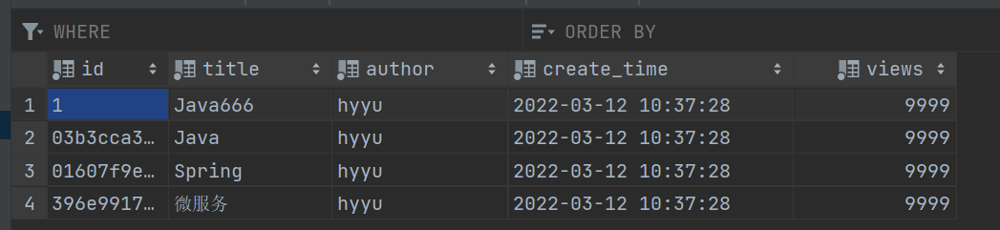

## 6.5、trim

`where` 和 `set` 能够自动删除 `and` 和 `,` 都是基于 `trim` 实现的。

`trim` 比较复杂，下面这个 `trim` 的实现与 `where` 等价。

```xml
<trim prefix="WHERE" prefixOverrides="AND |OR ">
  ...
</trim>
```
这个`trim`的实现与`set`等价。
```xml
<trim prefix="SET" suffixOverrides=",">
  ...
</trim>
```


## 6.6、choose/when/otherwise
<font size=4 style="font-weight:bold;background:yellow;">编写接口函数</font>

```java
List<Blog> queryBlogChoose(Map map);	// 查询
```
<font size=4 style="font-weight:bold;background:yellow;">配置接口</font>

- 功能类似于 `switch...case...`
- 也有中断机制，只要进去了一个 `when`，执行后就直接跳出结束，类似 `break`。

```xml
<select id="queryBlogChoose" parameterType="map" resultType="Blog">
    select * from blog
    <where>
        <choose>
            <when test="title!=null">
                title=#{title}
            </when>
            <when test="author!=null">
                and author=#{author}
            </when>
            <otherwise>
                and views=#{views}
            </otherwise>
        </choose>
    </where>
</select>
```
<font size=4 style="font-weight:bold;background:yellow;">创建测试类</font>

```java
@Test
public void queryBlogIF(){
    SqlSession sqlSession = MybatisUtils.getSqlSession();
    BlogMapper mapper = sqlSession.getMapper(BlogMapper.class);

    HashMap map = new HashMap();
    map.put("author","yuhaiyang");
    map.put("title","Java666");
    map.put("views","999");
    // 这里的map中的属性都有了，然而在实际执行时只会查询符合title条件的结果，与其他条件无关
    List<Blog> blogs = mapper.queryBlogChoose(map);
    for (Blog blog : blogs) {
        System.out.println(blog);
    }
    sqlSession.close();
}
```
<font size=4 style="font-weight:bold;background:yellow;">运行结果</font>

```java
Opening JDBC Connection
Created connection 1485697819.
// 只有title,与其他属性无关
==>  Preparing: select * from blog WHERE title=? 
==> Parameters: Java666(String)
<==    Columns: id, title, author, create_time, views
<==        Row: 1, Java666, hyyu, 2022-03-12 10:37:28.0, 9999
<==      Total: 1
Blog(id=1, title=Java666, author=hyyu, createTime=Sat Mar 12 10:37:28 CST 2022, views=9999)
Closing JDBC Connection [com.mysql.jdbc.JDBC4Connection@588df31b]
Returned connection 1485697819 to pool.
```
## 6.7、foreach
<font size=4 style="font-weight:bold;background:yellow;">编写接口函数</font>

```java
List<Blog> queryBlogForeach(Map map);	// 查询第1/2/3号博客
```
<font size=4 style="font-weight:bold;background:yellow;">配置接口</font>

```xml
<select id="queryBlogForeach" parameterType="map" resultType="Blog">
    select * from blog
    <where>
        <foreach collection="ids" item="id" open="(" close=")" separator="or">
            id=#{id}
        </foreach>
    </where>
</select>
```

- 对 `ids` 中的 `id` 遍历后进行拼接，拼接的结果为` ( id=1 or id=2 or id=3 )` ；

  ```xml
  <foreach collection="ids" item="id" open="(" close=")" separator="or">
  ```

- 所以实际执行的 SQL 语句是

  ```sql
  select * from blog WHERE ( id=1 or id=2 or id=3 )
  ```

- 经测试，`separator="or"` 和 `separator=" or "` 运行后执行的 SQL 语句是相同的，所以 `foreach` 会自动增加空格。

<font size=4 style="font-weight:bold;background:yellow;">创建测试类</font>

```java
@Test
public void queryBlogForeach(){
    SqlSession sqlSession = MybatisUtils.getSqlSession();
    BlogMapper mapper = sqlSession.getMapper(BlogMapper.class);
    
    ArrayList<String> ids = new ArrayList<>();
    ids.add("1");
    ids.add("2");
    ids.add("3");

    HashMap map = new HashMap();
    map.put("ids",ids);
    List<Blog> blogs = mapper.queryBlogForeach(map);

    for (Blog blog : blogs) {
        System.out.println(blog);
    }
    sqlSession.close();
}
```
<font size=4 style="font-weight:bold;background:yellow;">运行结果</font>

```java
Opening JDBC Connection
Created connection 1948863195.
==>  Preparing: select * from blog WHERE ( id=? or id=? or id=? ) 
==> Parameters: 1(String), 2(String), 3(String)
<==    Columns: id, title, author, create_time, views
<==        Row: 1, Java666, hyyu, 2022-03-12 10:37:28.0, 9999
<==      Total: 1
Blog(id=1, title=Java666, author=hyyu, createTime=Sat Mar 12 10:37:28 CST 2022, views=9999)
Closing JDBC Connection [com.mysql.jdbc.JDBC4Connection@74294adb]
Returned connection 1948863195 to pool.
```

# 7、缓存

## 7.0、什么是缓存

为了提高数据利用率和减小服务器和数据库的压力，MyBatis会对于--些查询提供数据缓存，
在允许的时间间隔内，对于完全相同的查询，会直接将缓存结果返回给用户，而不用再到
数据库中查找。

在进行数据库的查询时，每次查询都要重新连接数据库，十分消耗资源，可以把查询的结果放在缓存中，当下一次再次查询相同数据时就可以直接从缓存里查找，就不用再连接数据库了。

**什么是缓存（Cache）？**

- 存在内存中的临时数据。
- 将用户经常查询的数据放在缓存（内存）中，用户去查询数据就不用从磁盘上（关系型数据库数据文件）查询，从缓存中查询，从而提高查询效率，解决了高并发系统的性能问题。

**为什么使用缓存？**

减少和数据库的交互次数，减少系统开销，提高系统效率。

**什么样的数据能使用缓存？**

经常查询并且不经常改变的数据。

<font size=4 style="font-weight:bold;background:yellow;">Mybatis 的缓存</font>

- Mybatis 包含一个非常强大的查询缓存特性，它可以非常方便地定制和配置缓存，缓存可以极大的提升查询效率。

- Mybatis 系统中默认定义了两级缓存：**一级缓存** 和 **二级缓存**
  - 默认情况下，只有一级缓存开启（SqlSession级别的缓存，也称为本地缓存）；
  - 二级缓存需要手动开启和配置，他是基于 namespace 级别的缓存；
  - 为了提高扩展性，MyBatis定义了缓存接口 Cache。我们可以通过实现 Cache 接口来自定义二级缓存。
  
 - 执行一个查找过程中各级缓存的使用顺序

   ```
   1、先看二级缓存中有没有需要的数据
   2、再看一级缓存中有没有需要的数据
   3、都没有，查询数据库
   ```

## 7.1、Mybatis 的一级缓存

<font size=4 style="font-weight:bold;background:yellow;">关于一级缓存</font>

- 一级缓存也叫本地缓存，与数据库同一次会话期间查询到的数据会放在一级缓存中，是 SqlSession 级别的缓存，以后如果需要获取相同的数据，直接从缓存中拿，不用再去查询数据库；
- 一级缓存默认是开启的，无法关闭，只在一次 SqlSession 中有效，也就是拿到连接到关闭连接这个区间段；
- 一级缓存就是一个 Map。

<font size=4 style="font-weight:bold;background:yellow;">测试</font>

- 开启日志：在 `mybatis-config.xml` 中配置 `settings`；
	```xml
	<settings>
	    <!--标准的日志工厂实现-->
	    <setting name="logImpl" value="STDOUT_LOGGING"/>
	</settings>
	```
- 测试在一个 Session 中查询两次相同记录
	```java
	@Test
	public void test() {
	    SqlSession sqlSession = MybatisUtils.getSqlSession();
	    UserMapper mapper = sqlSession.getMapper(UserMapper.class);
	    
	    User user = mapper.queryUserById(1);
	    System.out.println(user);
	    
	    System.out.println("==================================");
	    
	    User user2 = mapper.queryUserById(1);
	    System.out.println(user2);	// user与user2是同一个对象
	    
	    sqlSession.close();
	}
	```
- 查看日志输出
	```java
	Opening JDBC Connection
	Created connection 1873859565.
	// 可以注意到select语句在这里只执行了一次
	// 这是因为第二次执行相同查询时,直接从一级缓存中获取到了查询的结果
	==>  Preparing: select * from mybatis.user where id = ? 
	==> Parameters: 1(Integer)
	<==    Columns: id, name, pwd
	<==        Row: 1, 王冰冰, 666
	<==      Total: 1
	User(id=1, name=王冰冰, pwd=666)
	==================================
	User(id=1, name=王冰冰, pwd=666)
	Closing JDBC Connection [com.mysql.jdbc.JDBC4Connection@6fb0d3ed]
	Returned connection 1873859565 to pool.
	```

<font size=4 style="font-weight:bold;background:yellow;">在以下情况缓存会失效</font>

- 在不同的 sqlSession 中进行查询，运行后会发现发送了两条 sql 语句；

- sqlSession 相同，查询条件不同，当前缓存中不存在这个数据，会发送两条 sql 语句，正常现象；

- sqlSession 相同，两次查询之间进行了**增删改**操作，可能会改变原来的数据，必定会刷新缓存；

- sqlSession 相同，手动清理缓存 。

  ```java
  sqlSession.clearCache();
  ```

## 7.3、Mybatis 的二级缓存

<font size=4 style="font-weight:bold;background:yellow;">关于二级缓存</font>

- 二级缓存也叫全局缓存，一级缓存作用域太低了，所以诞生了二级缓存。

- 基于 `namespace` 级别的缓存，一个名称空间，对应一个二级缓存。

  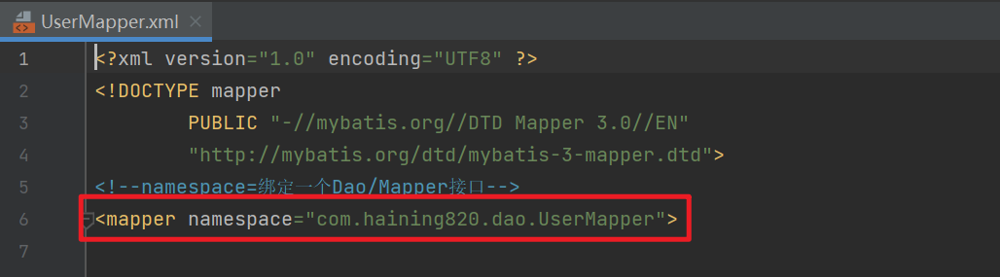

<font size=4 style="font-weight:bold;background:yellow;">工作机制</font>

- 一个会话查询一条数据，这个数据就会被放在当前会话的一级缓存中；
- 如果当前会话关闭了，这个会话对应的一级缓存就没了；但是目的是会话关闭了，一级缓存中的数据被保存到二级缓存中；
- 在新的会话中查询信息，就可以从二级缓存中获取内容；
- 不同的 `mapper` 查出的数据会放在自己对应的缓存（map）中。

<font size=4 style="font-weight:bold;background:yellow;">测试</font>

- 显式开启全局缓存：在`mybatis-config.xml`中配置`settings`

	```xml
	<settings>
      <!--显示的开启全局缓存-->
	    <setting name="cacheEnabled" value="true"/>
	</settings>
	```
	
- 在要使用二级缓存的 xml 文件 UserMapper.xml 中开启缓存
	```xml
	<!--在当前Mapper.xml中使用二级缓存-->
	<cache/>
	```
	也可以自定义参数，这个配置创建了一个 FIFO 缓存，每隔 60 秒刷新，最多可以存储结果对象或列表的 512 个引用，而且返回的对象被认为是只读的，因此对它们进行修改可能会在不同线程中的调用者产生冲突。
	```xml
	<!--在当前Mapper.xml中使用二级缓存-->
	<cache  eviction="FIFO"
	       flushInterval="60000"
	       size="512"
	       readOnly="true"/>
	```
	
	`Cache`的设置中，如果仅设置 `<cache/>` 或设置 `readOnly="false"` 的话会报错，需要先将实体类序列化后才能正常运行。
	
	```java
	public class User implements Serializable {
	    private int id;
	    private String name;
	    private String pwd;
	}
	```
	
- 创建测试类，在两个 sqlSession 中进行同一个查找。
	```java
	@Test
	public void test() {
	    SqlSession sqlSession = MybatisUtils.getSqlSession();
	    UserMapper mapper = sqlSession.getMapper(UserMapper.class);
	
	    User user = mapper.queryUserById(1);
	    System.out.println(user);
	    sqlSession.close();
	
	    SqlSession sqlSession2 = MybatisUtils.getSqlSession();
	    UserMapper mapper2 = sqlSession2.getMapper(UserMapper.class);
	
	    User user2 = mapper2.queryUserById(1);
	    System.out.println(user2);
	    sqlSession2.close();
	}
	```
	
- 查看日志
	```java
	Cache Hit Ratio [com.haining820.dao.UserMapper]: 0.0	// 首先在一级缓存中进行查找
	Opening JDBC Connection
	Created connection 2124046270.
	==>  Preparing: select * from mybatis.user where id = ? 
	==> Parameters: 1(Integer)
	<==    Columns: id, name, pwd
	<==        Row: 1, 王冰冰, 666
	<==      Total: 1
	User(id=1, name=王冰冰, pwd=666)	// 第一次查询完毕，将一级缓存放入二级缓存中
	Closing JDBC Connection [com.mysql.jdbc.JDBC4Connection@7e9a5fbe]
	Returned connection 2124046270 to pool.
	Cache Hit Ratio [com.haining820.dao.UserMapper]: 0.5	// 在二级缓存中查找成功
	User(id=1, name=王冰冰, pwd=666)
	```

<font size=4 style="font-weight:bold;background:yellow;">总结</font>

- 所有的数据都会先放在一级缓存中
- 只要开启了二级缓存，在同一个 Mapper 下就有效，可以在二级缓存中拿到数据；
- 只有当会话提交，或者关闭的时候，一级缓存中的数据才会提交到二级缓存中。

## 7.4、自定义缓存 ehcache
Ehcache 是一种广泛使用的开源 Java 分布式缓存，主要面向通用缓存。

<font size=4 style="font-weight:bold;background:yellow;">测试</font>

- 首先导入依赖

    ```xml
    <!-- https://mvnrepository.com/artifact/org.mybatis.caches/mybatis-ehcache -->
    <dependency>
        <groupId>org.mybatis.caches</groupId>
        <artifactId>mybatis-ehcache</artifactId>
        <version>1.1.0</version>
    </dependency>
    ```
- 在mapper中指定缓存的实现
    ```xml
    <!--在当前Mapper.xml中使用二级缓存-->
    <cache type="org.mybatis.caches.ehcache.EhcacheCache"/>
    ```
- 创建`ehcache.xml`文件，使用效果与之前相同。
    ```xml
    <?xml version="1.0" encoding="UTF-8"?>
    <ehcache xmlns:xsi="http://www.w3.org/2001/XMLSchema-instance"
             xsi:noNamespaceSchemaLocation="http://ehcache.org/ehcache.xsd"
             updateCheck="false">
        <!--
           diskStore：为缓存路径，ehcache分为内存和磁盘两级，此属性定义磁盘的缓存位置。参数解释如下：
           user.home – 用户主目录
           user.dir  – 用户当前工作目录
           java.io.tmpdir – 默认临时文件路径
         -->
        <diskStore path="./tmpdir/Tmp_EhCache"/>
    
        <defaultCache
                eternal="false"
                maxElementsInMemory="10000"
                overflowToDisk="false"
                diskPersistent="false"
                timeToIdleSeconds="1800"
                timeToLiveSeconds="259200"
                memoryStoreEvictionPolicy="LRU"/>
    
        <cache
                name="cloud_user"
                eternal="false"
                maxElementsInMemory="5000"
                overflowToDisk="false"
                diskPersistent="false"
                timeToIdleSeconds="1800"
                timeToLiveSeconds="1800"
                memoryStoreEvictionPolicy="LRU"/>
    </ehcache>
    ```

<font size=4 style="font-weight:bold;background:yellow;">关于参数的说明</font>

**defaultCache**：默认缓存策略，当ehcache找不到定义的缓存时，则使用这个缓存策略。只能定义一个。


**name**：缓存名称。

**maxElementsInMemory**：缓存最大数目。

**maxElementsOnDisk**：硬盘最大缓存个数。


**eternal**：对象是否永久有效，一但设置了，timeout将不起作用。

**overflowToDisk**：当系统宕机时是否保存到磁盘。


**timeToIdleSeconds**：设置对象在失效前的允许闲置时间（单位：秒）。仅当eternal=false对象不是永久有效时使用，可选属性，默认值是0，也就是可闲置时间无穷大。

**timeToLiveSeconds**：设置对象在失效前允许存活时间（单位：秒）。最大时间介于创建时间和失效时间之间。仅当eternal=false对象不是永久有效时使用，默认是0.，也就是对象存活时间无穷大。


**diskPersistent**：是否缓存虚拟机重启期数据 Whether the disk store persists between restarts of the Virtual Machine. The default value is false.

**diskSpoolBufferSizeMB**：这个参数设置DiskStore（磁盘缓存）的缓存区大小。默认是30MB。每个Cache都应该有自己的一个缓冲区。

**diskExpiryThreadIntervalSeconds**：磁盘失效线程运行时间间隔，默认是120秒。

**memoryStoreEvictionPolicy**：当达到maxElementsInMemory限制时，Ehcache将会根据指定的策略去清理内存。默认策略是LRU（最近最少使用）。你可以设置为FIFO（先进先出）或是LFU（较少使用）。

**clearOnFlush**：内存数量最大时是否清除。


**memoryStoreEvictionPolicy**：可选策略有：LRU（最近最少使用，默认策略）、FIFO（先进先出）、LFU（最少访问次数）。

- LRU，Least Recently Used，最近最少使用的，缓存的元素有一个时间戳，当缓存容量满了，而又需要腾出地方来缓存新的元素的时候，那么现有缓存元素中时间戳离当前时间最远的元素将被清出缓存。

- FIFO，first in first out，这个是大家最熟的，先进先出。

- LFU， Less Frequently Used，就是上面例子中使用的策略，直白一点就是讲一直以来最少被使用的。如上面所讲，缓存的元素有一个hit属性，hit值最小的将会被清出缓存。

# 8、MyBatis-Spring

## 8.1、回顾 Mybatis

导入相关 jar 包：junit、mybatis、mysql 数据库、spring 相关、spring-jdbc、aop 织入、**mybatis-spring**，编写配置文件。

编写实体类，编写核心配置文件。

```java
@Data
public class User {
    private int id;
    private String name;
    private String pwd;
}
```

编写接口

```java
public interface UserMapper {
    public List<User> selectUser();
}
```

编写与接口对应的 Mapper.xml

```xml
<?xml version="1.0" encoding="UTF8" ?>
<!DOCTYPE mapper
        PUBLIC "-//mybatis.org//DTD Config 3.0//EN"
        "http://mybatis.org/dtd/mybatis-3-mapper.dtd">
<mapper namespace="com.haining820.mapper.UserMapper">
    
    <select id="selectUser" resultType="user">
        select * from mybatis.user;
    </select>
    
</mapper>
```

测试类：在没有 Spring 帮助注入前，需要手动从 Mybatis 配置文件中获取 SqlSession 对象，在之前学习 Mybatis 时这个过程被封装成了工具类，这里直接全部实现了。

```java
@Test
public void test() throws IOException {
    String resources = "mybatis-config.xml";
    InputStream inputStream = Resources.getResourceAsStream(resources);
    SqlSessionFactory sqlSessionFactory = new SqlSessionFactoryBuilder().build(inputStream);
    SqlSession sqlSession = sqlSessionFactory.openSession(/*true*/);	// 自动提交事务可以加一个参数true

    UserMapper mapper = sqlSession.getMapper(UserMapper.class);
    List<User> userList = mapper.selectUser();
    for (User user : userList) {
        System.out.println(user);
    }
}
```

## 8.2、Mybatis-Spring

**什么是 [MyBatis-Spring](https://mybatis.org/spring/zh/index.html) ？**

MyBatis-Spring 会帮助你将 MyBatis 代码无缝地整合到 Spring 中。它将允许 MyBatis 参与到 Spring 的事务管理之中，创建映射器 mapper 和 SqlSession 并注入到 bean 中，以及将 Mybatis 的异常转换为 Spring 的 `DataAccessException`。 最终，可以做到应用代码不依赖于 MyBatis，Spring 或 MyBatis-Spring。

<font size=4 style="font-weight:bold;background:yellow;">整合方式一</font>

- 建立 spring-dao.xml，编写数据源配置

  DataSource：不管采用何种持久化技术，都需要定义数据源。Spring中提供了4种不同形式的数据源配置方式：

  spring 自带的数据源（DriverManagerDataSource）、DBCP 数据源、C3P0数据源，JNDI数据源。

  这里使用 Spring 的数据源替换 mybatis-config.xml 的配置，Spring 提供了  `org.springframework.jdbc.datasource` 。（spring-jdbc 依赖）

  ```xml
  <bean id="dataSource" class="org.springframework.jdbc.datasource.DriverManagerDataSource">
      <property name="driverClassName" value="com.mysql.jdbc.Driver"/>
      <property name="url" value="jdbc:mysql://localhost:3307/mybatis?useSSL=false&amp;useUnicode=true&amp;characterEncoding=UTF-8"/>
      <property name="username" value="root"/>
      <property name="password" value="root"/>
  </bean>
  ```

- SqlSessionFactory

  ```xml
  <!--SqlSessionFactory-->
  <bean id="sqlSessionFactory" class="org.mybatis.spring.SqlSessionFactoryBean">
      <property name="dataSource" ref="dataSource" />
      <!--绑定MyBatis配置文件（其实可以完全不需要Mybatis配置文件，全部都在这里配置）-->
      <property name="configLocation" value="classpath:mybatis-config.xml"/>
      <property name="mapperLocations" value="classpath:com/haining820/mapper/*.xml"/>
  </bean>
  ```


- MapperScannerConfigurer：扫描储存接口类的包的位置

  ```xml
  <bean class="org.mybatis.spring.mapper.MapperScannerConfigurer">
      <property name="basePackage" value="com.qunar.qfc.dao"/>
      <property name="sqlSessionFactoryBeanName" value="sqlSessionFactory"/>
  </bean>
  ```

- SqlSessionFactoryTemplate

  ```xml
  <!--SqlSessionTemplate就是之前使用的SqlSession-->
  <bean id="sqlSession" class="org.mybatis.spring.SqlSessionTemplate">
      <!--只能使用构造器注入，因为SqlSessionTemplate没有set方法（看源码）-->
      <constructor-arg index="0" ref="sqlSessionFactory"/>
  </bean>
  ```

- 给接口加实现类

  ```java
  // 没有实现类就无法注入一个bean
  public class UserMapperImpl implements UserMapper {
  
      // 原来所有的操作都是用SqlSession来执行，现在都使用SqlSessionTemplate
      private SqlSessionTemplate sqlSession;
  
      public void setSqlSession(SqlSessionTemplate sqlSession) {
          this.sqlSession = sqlSession;
      }
  
      public List<User> selectUser() {
          UserMapper mapper = sqlSession.getMapper(UserMapper.class);
          List<User> userList = mapper.selectUser();
          return userList;
      }
  }
  ```

- 将自己写的实现类注入到 Spring 中

  ```xml
  <import resource="spring-dao.xml"/>
  <bean id="userMapper" class="com.haining820.mapper.UserMapperImpl">
      <property name="sqlSession" ref="sqlSession"/>
  </bean>
  ```

- 测试使用

  ```java
  @Test
  public void test2() {
      ApplicationContext context = new ClassPathXmlApplicationContext("applicationContext.xml");
      UserMapper userMapper = context.getBean("userMapper", UserMapper.class);
      List<User> userList = userMapper.selectUser();
      for (User user : userList) {
          System.out.println(user);
      }
  }
  ```

<font size=4 style="font-weight:bold;background:yellow;">整合方式二</font>

**在方式一的基础上使用 `SqlSessionDaoSupport` 进行整合**

- 给接口加实现类

  Mybatis-Spring 提供了抽象类 `SqlSessionDaoSupport`，与方式一最大的区别就是可以直接调用 `getSqlSession()` 方法获取 SqlSessionTemplate（SqlSession）对象，不用再对 SqlSessionTemplate 进行注入。

  ```java
  public class UserMapperImpl2 extends SqlSessionDaoSupport implements UserMapper{
      public List<User> selectUser() {
          return getSqlSession().getMapper(UserMapper.class).selectUser();
      }
  }
  ```

- 虽然不用再注入 SqlSessionTemplate（SqlSession）对象了，但是要为父类 SqlSessionDaoSupport 注入 sqlSessionFactory。

  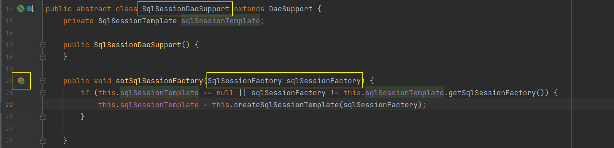

  ```xml
  <bean id="userMapper2" class="com.haining820.mapper.UserMapperImpl2">
      <!--父类SqlSessionDaoSupport需要sqlSessionFactory-->
      <property name="sqlSessionFactory" ref="sqlSessionFactory"/>
  </bean>
  ```

  这样一来，配置文件中就可以直接省略 SqlSessionTemplate（SqlSession）的配置，只需配置好 dataSource 和 sqlSessionFactory 即可。

  ```
  方式一：SqlSessionFactoryBean -> sqlSessionFactory -> SqlSessionTemplate（SqlSession）-> UserMapperImpl
  方式二：SqlSessionFactoryBean -> sqlSessionFactory -> UserMapperImpl2
  ```

- 测试：代码与方式一相同。

  ```java
  @Test
  public void test3() {
      ApplicationContext context = new ClassPathXmlApplicationContext("applicationContext.xml");
      UserMapper userMapper = context.getBean("userMapper2", UserMapper.class);
      List<User> userList = userMapper.selectUser();
      for (User user : userList) {
          System.out.println(user);
      }
  }
  ```

#  9、Mybatis 高级特性

##  9.1、TypeHandler

> 比如当前实体类中的对象类型是 Money（公司库中自建的用于存储钱的类型），但是在数据库中可能是一些别的类型如 decimal 等，在进行数据库 CRUD 时就要进行类型转换。

TypeHandler：类型处理器

转换

- 默认的类型处理器
- 自定义类型处理器
  - 实现 `public interface TypeHandler<T>`
  - 继承 `BaseTypeHandler<T>`

<font size=4 style="font-weight:bold;background:yellow;">使用 BaseTypeHandler</font>

创建实现类继承 BaseTypeHandler，重写方法。

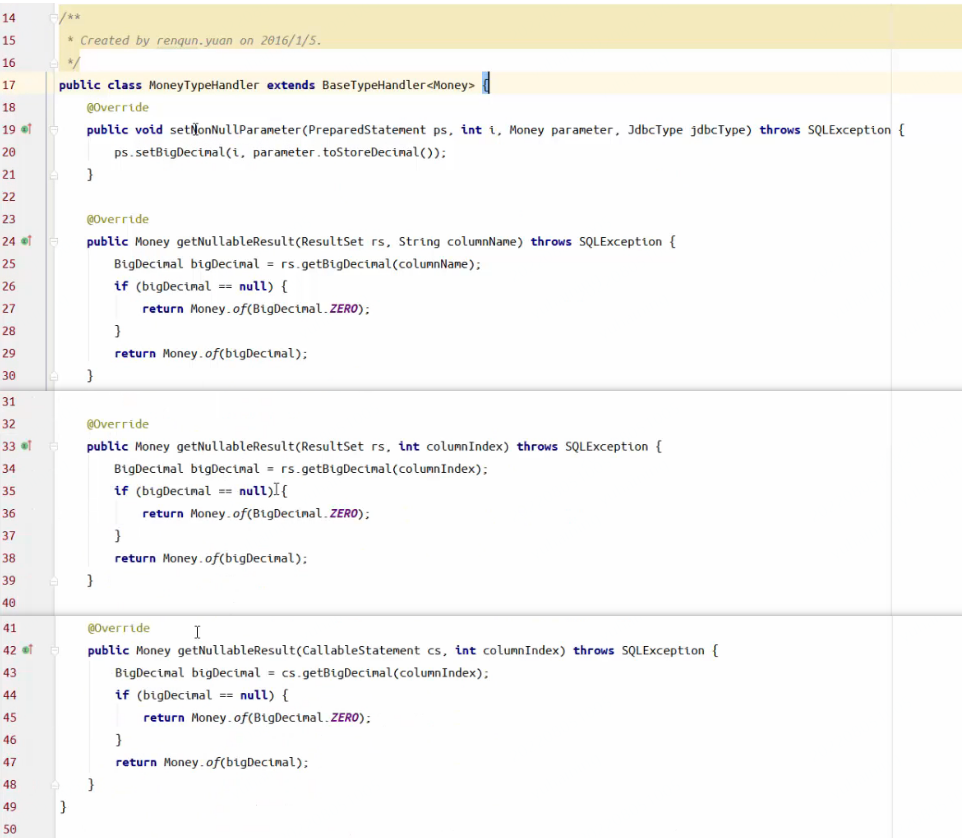

在 mybatis-config.xml 中配置 `<typeHandlers>`  标签，设置实现类的完全路径名和需要转换的类型。

```xml
<typeHandlers>
    <typeHandler handler="com.qunar.qfc.utils.MoneyHandler" javaType="qunar.api.pojo.Money"/>
</typeHandlers>
```

## 9.2、Intercptor

<font size=4 style="font-weight:bold;background:yellow;">允许拦截的类</font>

```java
- Executor (update, query, flushStatements, commit, rollback,getTransaction, close, isClosed)
- ParameterHandler (getParameterObject, setParameters)
- ResultSetHandler (handleResultSets,handleOutputParameters)
- StatementHandler (prepare, parameterize, batch, update,query)
```

<font size=4 style="font-weight:bold;background:yellow;">慢 sql 的拦截</font>

拦截器，可以进行过滤操作，比如设置时间参数，计算 sql 执行时间，当执行时间超过时间参数后就会打印日志记录慢 sql（只是举例，生产环境中一般不用，有许多其他相同功能的工具）。

- 实现接口 `Interceptor`
- 指定需要拦截的方法 `@Intercepts`（允许拦截的类中的一些方法）

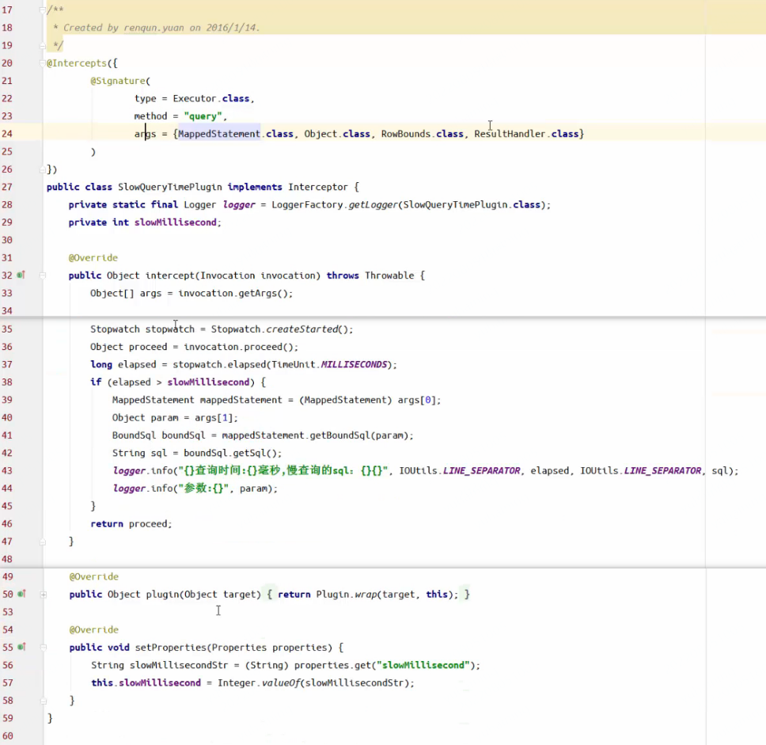


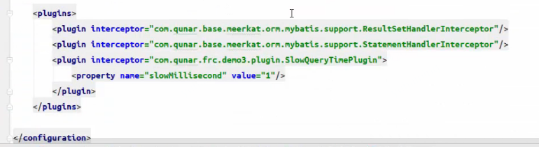

# 10、小结：MyBatis参数的传递

```java
public class HotelInfoModel {
    private Integer id;
    private String hotelName;
    private String city;
    private Money price;
    private LevelEnum levelEnum;
    // ...
}
```

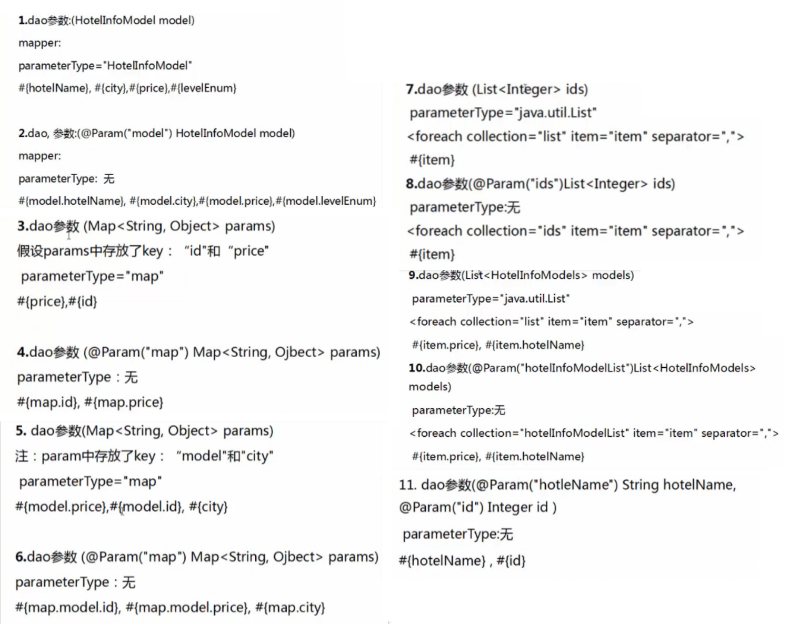

规范：

- 考虑事务的边界，事务范围越小越好，事务越大占用的数据库资源越多；
- 使用高效的sql 语句；
- 使用数据库连接池；
- 每张数据库表对应一个 mapper 文件；

