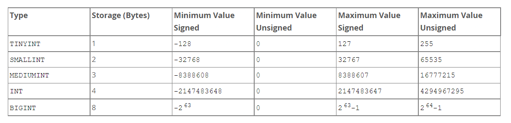
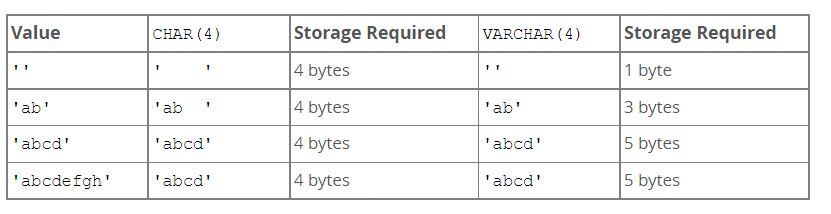
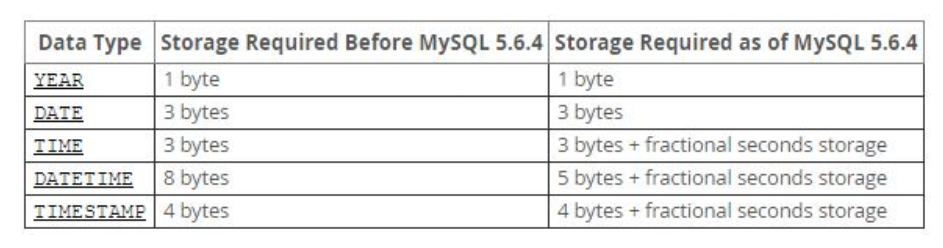
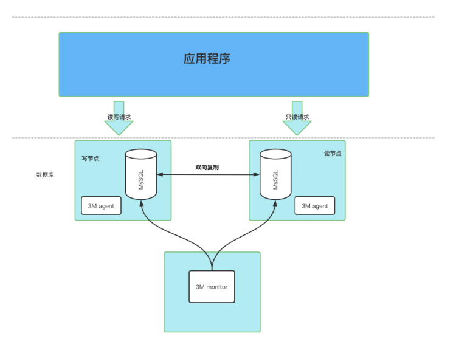
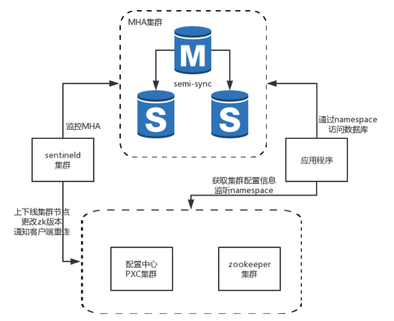
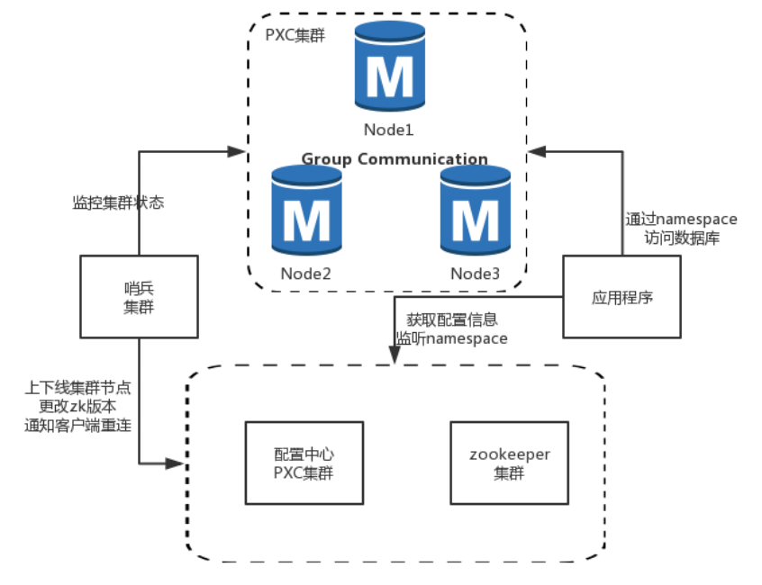
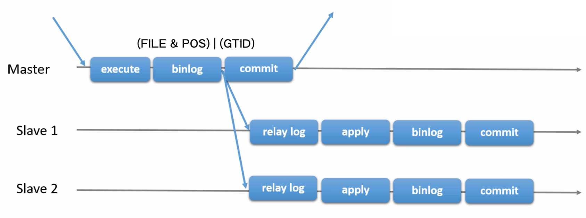
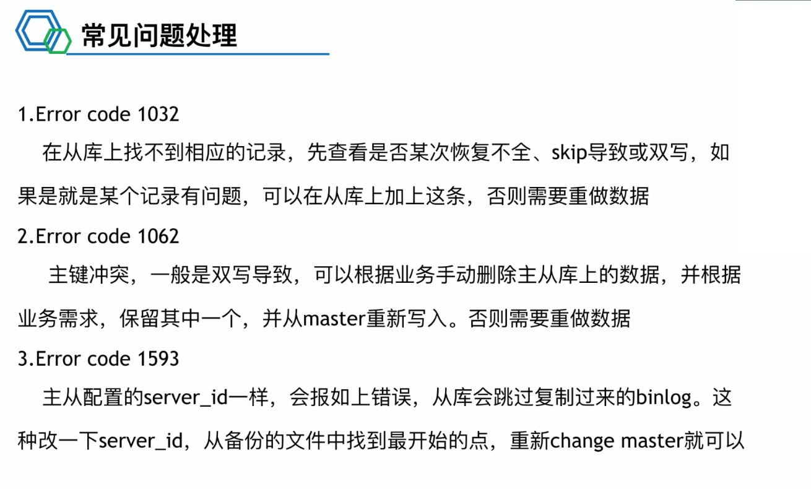
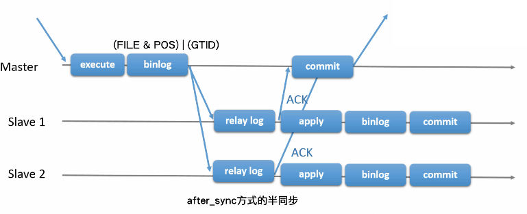

# 1、数据库

SQL 只是一个操作数据库的语言，属于编程语言的一种，而数据库是一个很大范畴的概念。

**数据库的分类**

- 数据库根据数据结构可分为**关系型数据库**和**非关系型数据库**；
- 非关系型数据库中根据应用场景又可分为：键值数据库（Redis）、列存储数据库（Kudu）、面向文档数据库（MongoDB ）、图形数据库

<!--more-->

<font size=4 style="font-weight:bold;background:yellow;">数据库三大范式</font>

第一范式：每个列都不可以再拆分，属性不可分割。

第二范式：在第一范式的基础上，非主键列完全依赖于主键，而不能是依赖于主键的一部分，要有主键，其他字段都依赖于主键。

第三范式：在第二范式的基础上，非主键列只依赖于主键，不依赖于其他非主键，消除传递依赖,消除冗余，就是各种信息只在一个地方存储，不出现在多张表中。

在设计数据库结构的时候，要尽量遵守三范式，如果不遵守，必须有足够的理由。比如性能。事实上我们经常会为了性能而妥协数据库的设计。

# 2、SQL 语句

查看当前 mysql 进程的情况

```bash
ps -ef|grep mysql
```

## 2.0、show

<font size=4 style="font-weight:bold;background:yellow;">show</font>

```sql
status			-- 显示目前状态
use mywork;		-- 选择使用mywork数据库
show tables;	-- 查看所有表
show create table t1;		-- 查看表定义
desc tablename;       		-- 以表格形式展示
show create database test1;	-- 查看数据库定义
show engines;	-- 显示支持的存储引擎
show index from student\G	-- 查看student表索引信息（\G表示按列显示，后不加分号）
show columns from student;	-- 查看student表的列信息
show table status like 'student'\G	-- 查看student表数据，索引所占空间，平均行长，行数等信息

show session variables like '%char%';	-- 查看包含char变量的当前会话值（session可省略）
show global variables like 'character_set_client'; -- 查看该变量的全局值（可能与当前会话中不一样）
```

```
mysql> show session variables like '%char%';
+--------------------------------------+----------------------------+
| Variable_name                        | Value                      |
+--------------------------------------+----------------------------+
| character_set_client                 | utf8                       |
| character_set_connection             | utf8                       |
| character_set_database               | utf8                       |
| character_set_filesystem             | binary                     |
| character_set_results                | utf8                       |
| character_set_server                 | latin1                     |
| character_set_system                 | utf8                       |
| character_sets_dir                   | /usr/share/mysql/charsets/ |
| validate_password_special_char_count | 1                          |
+--------------------------------------+----------------------------+
9 rows in set (0.00 sec)

mysql> show global variables like 'character_set_client';
+----------------------+--------+
| Variable_name        | Value  |
+----------------------+--------+
| character_set_client | latin1 |
+----------------------+--------+
1 row in set (0.00 sec)
```

## 2.1、DDL

DDL，Data Definition Language，数据库定义语言。

<font size=4 style="font-weight:bold;background:yellow;">create</font>

新建数据库和表

```sql
create database mywork;		-- 创建数据库mywork
create database if NOT EXISTS mywork;	-- 如果不存在就创建，避免出现错误
```

```
mysql> create database mywork;
ERROR 1007 (HY000): Can't create database 'mywork'; database exists
mysql> create database if not exists mywork;
Query OK, 1 row affected, 1 warning (0.00 sec)
```

```sql
create database empsys default character set=utf8mb4;	-- 指定字符集创建数据库empsys
create table t4(id int,name varchar(10));		   -- 创建表格
```

<font size=4 style="font-weight:bold;background:yellow;">rename</font>

```sql
rename table testrename to test;	-- 重命名testrenmae表为test
```

<font size=4 style="font-weight:bold;background:yellow;">drop</font>

<font color='red' style="font-weight:bold;">危险</font>，不可回滚，一般开发同学没有该权限。

```sql
drop table test;		-- 删除test表
```

<font size=4 style="font-weight:bold;background:yellow;">truncate</font>

将全表内容清空，不可回滚，性能比 delete 好。

```sql
truncate table test;	-- 将test表中的内容清空
```

<font size=4 style="font-weight:bold;background:yellow;">alter</font>

不可回滚

```sql
alter table student convert to character set utf8mb4;	-- 修改student表使用的字符集
```

add

```sql
alter table student add column address varchar(50);		-- 向student表增加字段address
```

modify/change

```sql
alter table student modify column address varchar(33);	-- 修改student表address字段的类型
alter table t52 change column city city varchar(30);	-- 使用change需要写两次字段名
```

```sql
alter table student modify column address varchar(33),add gender int;
alter table student change column address address varchar(22),add address2 varchar(44);		-- 可以组合使用
```

drop

```sql
alter table student drop column address2;	-- 删除某一列
```

在网上找到的 alter 命令合集

```sql
-- 修改表名
alter table test_a rename to sys_app;
-- 修改表注释
alter table sys_application comment ‘系统信息表’;
-- 修改字段类型和注释
alter table sys_application modify column app_name varchar(20) COMMENT ‘应用的名称’;
-- 修改字段类型
alter table sys_application modify column app_name text;
-- 设置字段允许为空
alter table sys_application modify column description varchar(255) null COMMENT ‘应用描述’;
-- 增加一个字段，设好数据类型，且不为空，添加注释
alert table sys_application add url varchar(255) not null comment ‘应用访问地址’;
-- 增删加主键
alter table t_app add aid int(5) not null ,add primary key (aid);
alter table table_name drop primary key;
-- 增加自增主键
alter table t_app add aid int(5) not null auto_increment ,add primary key (aid);	-- 设置为自增必须是主键，多个主键只能有一个自增
-- 修改为自增主键
alter table t_app modify column aid int(5) auto_increment ;
-- 修改字段名字(要重新指定该字段的类型)
alter table t_app change name
app_name varchar(20) not null;
-- 删除字段
alter table t_app drop aid;
-- 在某个字段后增加字段
alter table t_app add column gateway_id int not null default 0 AFTER aid； #(在哪个字段后面添加)
-- 调整字段顺序
alter table t_app change gateway_id gateway_id int not null after aid ; #(注意gateway_id出现了2次)
```

## 2.2、DML

DML，Data Manipulation Language，数据操作语言（增删改查）。

<font size=4 style="font-weight:bold;background:yellow;">select</font>

```sql
select * from t1;
select name from t1 where id =5;
select * from t1,t2 where t1.id=t2.id;	/* 两表连接 */
select * from t1 join t2 on ti.id=t2.id where name='bob';	/*内连接*/
select * from t1 left join t2 on ti.id=t2.id where name='bob';	/*左外连接*/
select * from t1 right join t2 on ti.id=t2.id where name='bob';	/*右外连接*/
```

<font size=4 style="font-weight:bold;background:yellow;">insert</font>

```sql
insert into t1(id,name,addr) values(200,'yhy',222);
insert into t1(id,name,addr) values(200,'yhy',222),(300,'xmm',333);
```

<font size=4 style="font-weight:bold;background:yellow;">update</font>

```sql
update t1 set name='lss' where id =11;
```

<font size=4 style="font-weight:bold;background:yellow;">delete</font>

```sql
delete from t1 where id<10 and id>2;
```

# 3、MySQL 的变量类型

MySQL 5.7 官方文档变量类型部分：https://dev.mysql.com/doc/refman/5.7/en/data-types.html

## 3.1、数字类型

<font size=4 style="font-weight:bold;background:yellow;">int</font>

MySQL 支持 SQL 标准整数类型 `INTEGER`（或`INT`）和 `SMALLINT`，作为标准的扩展，MySQL 还支持整数类型 `TINYINT`、`MEDIUMINT`和 `BIGINT`，下表显示了每种整数类型所需的存储空间和范围。



<font size=4 style="font-weight:bold;background:yellow;">decimal</font>

储存精确的数字值，对数据准确性要求高用 decimal。

`decimal(5,2)`：5 表示整数小数加一起的位数，2表示小数位数，那么 `decimal(5,2)` 表示的范围就是 `-999.99 ~ 999.99`。

- `DECIMAL(M)` 就相当于 `DECIMAL(M,0)`；
- `DECIMAL` 就相当于 `DECIMAL(M,0)`；

- `DECIMAL` 中可以放置的最大值是 65，`M`的默认值是 10，举例如下：

```sql
alter table student add column salary decimal;
alter table student add column salary1 decimal(9);
alter table student add column salary2 decimal(11,3);
```

```
mysql> show create table student\G
*************************** 1. row ***************************
       Table: student
Create Table: CREATE TABLE `student` (
  `id` int(5) NOT NULL AUTO_INCREMENT,
  `name` varchar(10) DEFAULT NULL,
  `age` int(11) DEFAULT NULL,
  `address` varchar(22) DEFAULT NULL,
  `gender` int(11) DEFAULT NULL,
  `salary` decimal(10,0) DEFAULT NULL,
  `salary1` decimal(9,0) DEFAULT NULL,
  `salary2` decimal(11,3) DEFAULT NULL,
  PRIMARY KEY (`id`)
) ENGINE=InnoDB AUTO_INCREMENT=4 DEFAULT CHARSET=utf8mb4
1 row in set (0.00 sec)
```

<font size=4 style="font-weight:bold;background:yellow;">float/double</font>

- float：单精度，使用四个字节存储；
- double：双精度，使用八个字节存储。

浮点数在计算的过程中会有损失，类似 decimal，float 和 double 也可以在后边添加 `(M,D)` 以表示精度，计算规则相同，MySQL 在计算的过程对超出精度的部分中会进行舍入处理，举例如下：

在测试过程中，尝试将 `(M,D)`设置为 `(8,5)`，插入相同数据后结果是 999.00006。

```sql
alter table student add column testfloat float(7,4);
insert into student(testfloat) values(999.00009);	-- 插入的结果是999.0001
```

## 3.2、字符串类型

<font size=4 style="font-weight:bold;background:yellow;">char/varchar</font>

- char：长度不变，定义为 4 无论如何都占 4；

  - char 在存储时右边会由空格填补，在检索时又会被去掉。

  ```sql
  mysql> CREATE TABLE vc (v VARCHAR(4), c CHAR(4));
  Query OK, 0 rows affected (0.01 sec)
  
  mysql> INSERT INTO vc VALUES ('ab  ', 'ab  ');
  Query OK, 1 row affected (0.00 sec)
  
  mysql> SELECT CONCAT('(', v, ')'), CONCAT('(', c, ')') FROM vc;
  +---------------------+---------------------+
  | CONCAT('(', v, ')') | CONCAT('(', c, ')') |
  +---------------------+---------------------+
  | (ab  )              | (ab)                |
  +---------------------+---------------------+
  1 row in set (0.06 sec)
  ```

- varchar：变长类型

  - `VARCHAR`值在存储时不会被填充，在存储和检索值时保留尾随空格。
- 采用额外的 1 ~ 2 个字节记录实际长度；当实际长度小于等于 255 时，额外占用 1 个字节去存储实际长度，大于 255 时，则额外使用 2 个字节。
  
  - 大部分情况下可以用 varchar 代替 char。



存储在表最后一行中的值 仅在不使用严格 SQL 模式时适用；如果启用了严格模式，超过列长度的值不会被存储，并且会产生错误。

<font size=4 style="font-weight:bold;background:yellow;">BLOB/TEXT</font>

- 长度更长，存储的内容更多；
- 建立索引只能建立前缀索引，不能建立整个字符的索引；
- 不能设置 not null 和默认值。

<font size=4 style="font-weight:bold;background:yellow;">ENUM</font>

## 3.3、日期

<font size=4 style="font-weight:bold;background:yellow;">DATE</font>

年份日期：'1000-01-01' to '9999-12-31'

<font size=4 style="font-weight:bold;background:yellow;">DATETIME</font>

年份日期时间：'1000-01-01 00:00:00' to '9999-12-31 23:59:59'

<font size=4 style="font-weight:bold;background:yellow;">TIMESTAP</font>

'1970-01-01 00:00:01' UTC to '2038-01-19 03:14:07' UTC



# 4、索引

**索引（Index）是帮助 MySQL 高效获取数据的数据结构。**

- 优化数据访问；

  索引是一种数据结构，用于帮助我们在大量数据中快速定位到我们想要查找的数据。可以加快查的速度，但是会增加容量，降低增，删，改的速度。

- 数据库索引，是数据库管理系统中一个排序的数据结构，以协助快速查询、更新数据库表中数据。索引的实现通常使用 B 树及其变种 B+ 树。

- 索引在小数据量的时候，用处不大，但是在大数据量的时候，区别十分明显。

  更通俗的说，索引就相当于目录。为了方便查找书中的内容，通过对内容建立索引形成目录。索引是一个文件，它是要占据物理空间的。

<font size=4 style="font-weight:bold;background:yellow;">索引优缺点</font>

索引的优点

- 可以大大加快数据的检索速度，这也是创建索引的最主要的原因。
- 通过使用索引，可以在查询的过程中，使用优化隐藏器，提高系统的性能。

索引的缺点

- 时间方面：创建索引和维护索引要耗费时间，具体地，当对表中的数据进行增加、删除和修改的时候，索引也要动态的维护，会降低增/改/删的执行效率；
- 空间方面：索引需要占物理空间。

## 4.1、索引的分类

<font size=4 style="font-weight:bold;background:yellow;">按功能逻辑，索引分为 4 种</font>

- 普通索引

  ```sql
   KEY `idx_room_id` (`room_id`);		-- 普通索引
  ```

  - 最基本的索引类型，没有任何限制，唯一作用就是加快系统对数据的访问速度；
  - 这类索引可以创建在任何数据类型中，其值是否唯一和非空，由字段本身的完整性约束条件决定；
  - 适合于经常作为查询条件的列，用作表连接的列；
  - 创建时注意索引的基数，较低的话一般不适合创建索引（比如性别）。

- 唯一索引

  ```sql
   UNIQUE KEY `uniq_telephone` (`telephone`);		-- 唯一索引
  ```

  - 主要为了避免数据出现重复；
  -  也能加快数据访问速度；
  - 值必须是唯一的，但**允许有空值**，出现多个空值不会产生冲突；
  - 在一张数据表里面可以有<font color='red' style="font-weight:bold;">多个</font>唯一索引。

- 主键索引

  **主键索引就是一种特殊的唯一性索引，在唯一索引的基础上增加了<font color='red' style="font-weight:bold;">不为空</font>的约束**，一张表中最多<font color='red' style="font-weight:bold;">只有一个</font>主键索引，通常在创建表时一起创建。

- 前缀索引

  ```sql
  KEY `idx_describ` (`room_describe`(10))		--前缀索引
  ```

  - 对键值的前几位（一部分）建立索引；
  - 适合于字段比较长，而且前几个字段有很大的区分度的属性；
  - 不能在 order by 或者 group by 中触发前缀索引，也不能把它们用于覆盖索引。
  - 关系到前缀索引长度的选择的一个重要参数是：索引的区分度，区分度越高，键值的重复度越少，由于长度引起的回表就会越少；不过区分度越高，索引长度越长，越占用空间，所以需要根据业务衡量可以接受的损失比例`m%`,当 `distinct(left(key))/distinct(key)>m%` 的基础上长度越小越好；

<font size=4 style="font-weight:bold;background:yellow;">按作用字段个数，索引分为 2 种</font>

- 单列索引

  在表中的某个字段上创建索引，单列索引只根据该字段进行索引，单列索引可以使普通索引，也可以使唯一性索引，还可以使全文索引。只要保证该索引只对应一个字段即可，一个表可以多个单列索引。

- 联合索引（复合索引、组合索引）

  ```sql
  KEY `idx_create_update` (`create_time`,`update_time`);		--联合索引
  ```
  
  - 多个列共同组成一个索引；
  - 适用于某几个特定列经常联合作为查询条件的情况；
  - 该索引指向创建时对应的多个字段，可以通过这几个字段进行查询，**但是只有查询条件中使用了这些字段中的第一个字段时才会被使用。**例如，在表中的字段 id、name 和 gender 上创建一个联合索引 idx_id_name_gender，只有在查询条件中使用了字段 id 时该索引才会被使用，使用联合索引时遵循最左边前缀组和的原则。

<font size=4 style="font-weight:bold;background:yellow;">按物理实现方式 ，索引分为 2 种</font>

MySQL索引按叶子节点存储的是否为完整表数据分为：聚簇索引、二级索引（辅助索引）。

- 聚簇索引

  聚簇索引的每个叶子节点存储了一行完整的表数据，叶子节点间按 id 列递增连接，可以方便地进行顺序检索。

  - **InnoDB 表要求必须有聚簇索引**

    - 默认在主键字段上建立聚簇索引；
    - 在没有主键字段的情况下，表的第一个非空的唯一索引将被建立为聚簇索引；
    - 在前两者都没有的情况下，InnoDB 将自动生成一个隐式的自增 id 列，并在此列上建立聚簇索引。

  - **以MyISAM为存储引擎的表不存在聚簇索引**

    MyISAM 表中的主键索引和非主键索引的结构是一样的，索引的叶子节点不存储表数据，存放的是表数据的地址。所以 MyISAM 表可以没有主键。MyISAM 表的数据和索引是分开存储的。MyISAM 表的主键索引和非主键索引的区别仅在于主键索引的 B+tree 上的 key 必须符合主键的限制，非主键索引 B+tree 上的 key 只要符合相应字段的特性就可以了。

- 辅助索引、非聚簇索引、二级索引

  - 辅助索引的叶子节点并不存储一行完整的表数据，而是存储了聚簇索引所在列的值。
  - 回表查询：由于辅助索引的叶子节点不存储完整的表数据，索引当通过辅助索引查询到聚簇索引列值后，还需要回到聚簇索引也就是表数据本身进一步获取数据。

## 4.2、索引的底层实现

## 4.3、索引创建原则

如何创建好索引呢？ 哪些列经常作为where条件？ 哪些列经常用于order by？ 哪些列会和其他表进行关联？ 准备创建索引的列的基数是否较高？

- 经常作为where条件的列建议创建索引；
- 和其他表具有关联关系的列建议创建索引；
- 能用普通索引不用唯一索引；
- 能用单列索引不用联合索引；
- 单键索引，选择针对当前query过滤性更好的索引；
- 联合索引，where条件中过滤性最好的放在最左侧；
- 尽可能选择覆盖索引，避免回表；
- 通过分析统计信息和调整query的写法来达到选择合适索引的目的。

## 4.5、索引失效 

- 使用联合索引时不满足最左匹配原则；

- 使用 `select *` 全表扫描；

- 在索引列上有计算或者使用函数；

- 字段类型不同，比如索引的字段类型是 varchar，但是在搜索的时候使用数字却没有加引号；

- 将列与列之间进行对比；

  ```sql
  select name from user where age<height;
  ```

- 查询条件中使用 or；

  ```sql
  select name from user where code>'100' or 150<height;
  ```

- order by

  比如现有索引

  ```sql
  key 'idx_code_age_name'('code','age','name')
  ```

  在查询时应使用

  ```sql
  select * from user where code= '101' order by name,age;	-- ❌
  select * from user where code= '101' order by age,name;	-- 修改顺序使其与联合索引顺序相符
  ```

- 查询时在 like 左边使用 %；

## 4.6、索引的选择性和覆盖索引

<font size=4 style="font-weight:bold;background:yellow;">索引的选择性</font>

- 索引的 “ 选择性 ” 是指在该索引列里存储不同值的数目和记录数的比。比如某个表的记录数是 1000 条，而该表的索引列的值只有 900 个不同的值（有 100 个是相同或是空）。这样索引的可选择性为 900/1000 为 0.9 ，这样效果就不好。

- 最好的索引可选择性（如主键索引）是 1.0 ，索引的可选择性是衡量索引的利用率的方法，比如在极端的情况下，一个表记录数是 1000 ，而索引列的值只有 10 个不同的值，则索引的可选择性很差（只有 0.01），这样的情形使用全表扫描要比采用索引还好。

- **索引选择性越高，说明不重复的索引值占比越高，查询效率越快。**

```sql
SELECT COUNT(DISTINCT author_id) / COUNT(*) FROM book;
show index from book;		-- 查看索引选择性
```

<font size=4 style="font-weight:bold;background:yellow;">覆盖索引</font>

覆盖索引不是索引类型，<font color='red' style="font-weight:bold;">指的是 select 的数据列只用从索引中就能够取得，不需要回表进行二次查询</font>，也就是说查询列要被所使用的索引覆盖。对于 InnoDB 表的二级索引，如果索引能覆盖到查询的列，那么就可以避免对主键索引的二次查询。

不是所有类型的索引都可以成为覆盖索引。覆盖索引要存储索引列的值，而哈希索引、全文索引不存储索引列的值，所以 MySQL 使用 B+ 树索引做覆盖索引。

# 5、sql 的执行

**在 sql 前加上 explain 关键字即可解释该 sql**

SQL 执行计划解释该条 SQL 一步一步怎么执行，在执行中哪些使用索引、哪些进行全表扫描，以及执行顺序等。 通过了解 SQL 的执行计划可以判断 SQL 执行效率，对数据库的影响等。 EXPLAIN 适用于 SELECT、DELETE、 INSERT、REPLACE 和 UPDATE 语句。

<font size=4 style="font-weight:bold;background:yellow;">explain 结果中的参数</font>

- id：表示被操作的顺序；id值大，先被执行，若id值相同，执行顺序从上到下；

- select_type：查询中每个 select 子句的类型

  - SIMPLE：简单查询，不包含 UNION 或者子查询；
  - PRIMARY：查询中如果包含子查询或其他部分，外层的 SELECT 将被标记为 PRIMARY ；
  - SUBQUERY：子查询中的第一个 SELECT；
  - UNION：在 UNION 语句中，UNION 之后出现的 SELECT；
  - DERIVED：在 FROM 中出现的子查询将被标记为 DERIVED；
  - UNION RESULT：UNION 查询的结果 SQL执行计划。

- table：被操作对象的名字，通常是表名；

- partitions：匹配分区信息（非分区表为NULL）；

- type：查询执行的类型，描述了查询是如何执行的；

  所有值的顺序从最优到最差排序为：

  ```
  system > const > eq_ref > ref > fulltext > ref_or_null > index_merge > unique_subquery > index_subquery > range > index > ALL
  ```

  - const：表中最多只有一行匹配的记录，常用于使用主键或唯一索引的所有字段作为查询条件；
  - eq_ref：当连表查询时，前一张表的行在当前这张表中只有一行与之对应。是除了 system 与 const 之 外最好的 join 方式，常用于使用主键或唯一索引的所有字段作为连表条件；
  - ref：使用普通索引作为查询条件，查询结果可能找到多个符合条件的行；
  - index_merge：当查询条件使用了多个索引时，表示开启了 Index Merge 优化，此时执行计划中的 key 列列出了使用到的索引；
  - range：对索引列进行范围查询，执行计划中的 key 列表示哪个索引被使用了；
  - index：全索引扫描，与 ALL 类似，只不过扫描的是索引，而索引一般在内存中，速度更快。
  - ALL：全表扫描

- possible_keys：可能被使用的索引；

- key：真实使用的索引 ；

- key_len：索引键长度，单位字节；

- ref：表之间的引用；

- rows：扫描的行数（估计值）；

- filtered：符合过滤条件数据的占比；

- Extra：重要的补充信息；

  - Using filesort ：使用文件完成排序；
  - Using index：可直接在索引中获取需要的信息。若同时出现 Using where 表明索引还被用来过滤筛选；没有出现，表明只是用来了读取数据；
  - Using index condition：尝试只使用索引来获取数据，即能用索引就用；
  - Using index for group-by：使用索引优化GROUPBY或者DISTINCT操作，避免额外的磁盘 操作；
  - Using temporary：用临时表存储中间结果，常用于 GROUP BY或者 ORDER BY操作；
  - Using where：使用了where条件；
  - Using join buffer (Block Nested Loop)：连表查询的方式，表示当被驱动表没有使用索引 的时候，MySQL 会先将驱动表读出来放到 join buffer 中，再遍历被驱动表与驱动表进行查 询。 这里提醒下，当 Extra 列包含 Using filesort 或 Using temporary 时，MySQL 的性能可能 会存在问题，需要尽可能避免。

# 6、MySQL 的引擎

MySQL 默认引擎 InnoDB

## 6.1、MySQL 的存储引擎

- InnoDB 引擎：InnoDB 引擎提供了对数据库 ACID 事务的支持。并且还提供了行级锁和外键的约束。它的设计的目标就是处理大数据容量的数据库系统。
- MyIASM 引擎（原本 Mysql 的默认引擎）：不提供事务的支持，也不支持行级锁和外键。
- MEMORY 引擎：所有的数据都在内存中，数据的处理速度快，但是安全性不高。

# 7、事务

## 7.1、ACID

事务的 ACID 原则

- 原子性： 事务是最小的执行单位，不允许分割。事务的原子性确保动作要么全部完成，要么完全不起作用；
- 一致性： 执行事务前后，数据保持一致，多个事务对同一个数据读取的结果是相同的；
- 隔离性： 并发访问数据库时，一个用户的事务不被其他事务所干扰，各并发事务之间数据库是独立的；
- 持久性： 一个事务被提交之后。它对数据库中数据的改变是持久的，即使数据库发生故障也不应该对其有任何影响。

## 7.2、脏读幻读不可重复读

- 脏读：⼀个事务读取了另⼀个事务未提交的数据，而这个数据是有可能回滚的。即这个事务读取的数据是不正确的。
- 不可重复读：一个事务的两次查询的结果数据不一致，这可能是两次查询过程中间其他事务修改了原有的数据，即该事务在读的过程中数据被修改了。
- 幻读：在一个事务的两次查询中数据不一致，例如有一个事务查询了几列(Row)数据，而另一个事务却在此时插入了新的几列数据，先前的事务在接下来的查询中，就会发现有几列数据是它先前所没有的。

## 7.3、事务的隔离级别

为了达到事务的四大特性，数据库定义了4种不同的事务隔离级别，由低到高依次为 **读未提交**、**读已提交**、**可重复读**、**可串行化**，这四个级别可以逐个解决脏读、不可重复读、幻读这几类问题。

- 读未提交 (read-uncommitted)： 最低的隔离级别，允许读取尚未提交的数据变更，可能会导致脏读、幻读或不可重复读。
- 读已提交 (read-commited)： 允许读取并发事务已经提交的数据，可以阻止脏读，但是幻读或不可重复读仍有可能发生。
- 可重复读 (repeatable-read)： 对同一字段的多次读取结果都是一致的，除非数据是被本身事务自己所修改，可以阻止脏读和不可重复读，但幻读仍有可能发生。
- 可串行化 (serializable)： 最高的隔离级别，完全服从ACID的隔离级别。所有的事务依次逐个执行，这样事务之间就完全不可能产生干扰，也就是说，该级别可以防止脏读、不可重复读以及幻读。

| 隔离级别 | 脏读 | 不可重复读 | 幻读 |
| :------: | :--: | :--------: | :--: |
| 读未提交 |  √   |     √      |  √   |
| 读已提交 |  ×   |     √      |  √   |
| 可重复读 |  ×   |     ×      |  √   |
| 可串行化 |  ×   |     ×      |  ×   |

Oracle 和 SQLServer 默认采用的隔离级别是**读已提交**，Mysql 默认采用的隔离级别是**可重复读**。

事务隔离机制的实现基于锁机制和并发调度。其中并发调度使用的是MVVC（多版本并发控制），通过保存修改的旧版本信息来支持并发一致性读和回滚等特性。

因为隔离级别越低，事务请求的锁越少，所以大部分数据库系统的隔离级别都是**读已提交**，InnoDB 存储引擎默认使用**可重复读**，并不会有任何性能损失。

InnoDB 存储引擎在**分布式事务**的情况下一般会用到**可串行化**隔离级别。

# 8、MySQL 集群架构

## 8.1、3M

- 数据库是主从架构； 
- 使用 3M moniter 和 agent 管理； 
- 连接方式使用 VIP 连接，支持读写分离；
- 现在新增的数据库已经不再用这种架构了，存留的都是一些以前的老数据库。


- 一个节点负责写，另一节点负责读；
- 3M monitor 监控两个 mysql 实例的存活状态，挂了之后 vip 会转到另一个节点上，该节点同时负责读和写。



## 8.2、QMHA

- 数据库是主从结构，一主两从，通过 binlog 同步；
- sentineld 哨兵管理，定期发送请求，监控主从节点的存活状态；
  - 主节点挂掉/响应不到，从两个从节点中选出一个作为新的主节点
- 连接方式使用 namespace，支持读写分离。



## 8.3、PXC

- 是一种节点对等的，multi-master 架构，三个节点对等，支持同时写入，但是实际上在线上时人为分了权限，比如 node1 写，node2、node3 读。
- 哨兵管理； 
- 连接方式使用 namespace，支持读写分离。




# 9、异步复制

## 9.1、异步复制由来

起初 MySQL 都是单点数据库，单点数据库的问题如下

- 一数据丢失风险大；
- 读写无法分离，单点承受力有限；
- 无法快速进行 Failover；
- 随着业务的需求增多，无法横向扩展；
- 压力过大，无法备份数据。

## 9.2、异步复制原理

<font size=4 style="font-weight:bold;background:yellow;">主从复制中的 Thread</font>

Binlog：Binlog 可以理解为，开发执行的 SQL 语句（增删改、DDL）按照<font color='red' style="font-weight:bold;">提交的先后顺序（不是执行）</font>在 MySQL 内部生成的日志。Binlog 可以在数据回滚及异步复制时使用。

存储格式：由 binlog_format 控制

- row：会存储全部的行信息，例如 update 一个列，也会存储全部的记录，记录列顺序是表结构的列顺序，binlog 文件会很大。
- statement：记录执行的 SQL 语句信息，binlog 会小一些。
- mixed：该模式不建议设置，混合模式，会根据不同的情况生成 statement 或者 row。

Relaylog：Relaylog 是通过异步复制 Master 中的 Binlog，并生成 Slave 的执行日志，其中内部也是按照 SQL 提交的先后顺序存储。

**主库**

binlog dump thread:

当从库连接主库的时候，会发送 binlog event并持有该 event 的 lock，发送完（IO thread 读到后）释放该 event 的 lock。

**从库**

I/O thread：当读到主库发送的 binlog event，会生成 relaylog。

SQL thread：读 relaylog，并在从库上执行。





## 9.3、半同步复制

半同步复制的由来

- 由于传统复制是异步，当主库出现 crash 的时候，会有一部分已提交的事务，无法异步复制到从库，会导致数据丢失，而半同步能解决这部分问题；
- 半同步复制只是在相对于异步复制来说，能够更少的避免数据丢失（一个事务）；
- 为了保证数据上的完整，会牺牲一部分性能（接收确认的 TCP / IP 往返时间）；
- 插件式的，安装简单。



## 9.4、GTID


# 10、MySQL 中的锁

## 10.1、MySQL 的锁

当数据库有并发事务的时候，可能会产生数据的不一致，这时候需要一些机制来保证访问的次序，锁机制就是这样的一个机制。

就像酒店的房间，如果大家随意进出，就会出现多人抢夺同一个房间的情况，而在房间上装上锁，申请到钥匙的人才可以入住并且将房间锁起来，其他人只有等他使用完毕才可以再次使用。

## 10.2、隔离级别与锁的关系

在 Read Uncommitted 级别下，读取数据不需要加共享锁，这样就不会跟被修改的数据上的排他锁冲突

在 Read Committed 级别下，读操作需要加共享锁，但是在语句执行完以后释放共享锁；

在 Repeatable Read 级别下，读操作需要加共享锁，但是在事务提交之前并不释放共享锁，也就是必须等待事务执行完毕以后才释放共享锁。

Serializable 是限制性最强的隔离级别，因为该级别锁定整个范围的键，并一直持有锁，直到事务完成。

## 10.3、锁的分类

**按照锁的粒度分数据库锁有哪些？**

在关系型数据库中，可以按照锁的粒度把数据库锁分为行级锁（INNODB 引擎）、表级锁（MYISAM 引擎）和页级锁（BDB 引擎）。

MyISAM 和 InnoDB 存储引擎使用的锁：

- MyISAM 采用表级锁（table-level locking）。
- InnoDB 支持行级锁（row-level locking）和表级锁，默认为行级锁。

**从锁的类别上分MySQL都有哪些锁呢？**

从锁的类别上来讲，有 **共享锁** 和 **排他锁**。

- 共享锁：又叫做读锁，当用户要进行数据的读取时，对数据加上共享锁。共享锁可以同时加上多个。

- 排他锁：又叫做写锁，当用户要进行数据的写入时，对数据加上排他锁。排他锁只可以加一个，他和其他的排他锁，共享锁都相斥。

> 用上面的例子来说就是用户的行为有两种，
>
> 一种是来看房，多个用户一起看房是可以接受的。 
>
> 一种是真正的入住一晚，在这期间，无论是想入住的还是想看房的都不可以。

锁的粒度取决于具体的存储引擎，InnoDB 实现了行级锁，页级锁，表级锁。他们的加锁开销从大到小，并发能力也是从大到小。

## 10.4、**行级锁，表级锁和页级锁对比**

**行级锁**

行级锁是 MySQL  中锁定粒度最细的一种锁，表示只针对当前操作的行进行加锁。行级锁能大大减少数据库操作的冲突。其加锁粒度最小，但加锁的开销也最大。行级锁分为 **共享锁** 和 **排他锁**。

特点：开销大，加锁慢；会出现死锁；锁定粒度最小，发生锁冲突的概率最低，并发度也最高。

**表级锁**

表级锁是 MySQL 中锁定粒度最大的一种锁，表示对当前操作的整张表加锁，它实现简单，资源消耗较少，被大部分 MySQL 引擎支持。最常使用的 MYISAM 与 INNODB 都支持表级锁定。表级锁定分为表共享读锁（共享锁）与表独占写锁（排他锁）。

特点：开销小，加锁快；不会出现死锁；锁定粒度大，发出锁冲突的概率最高，并发度最低。

**页级锁**

页级锁是 MySQL 中锁定粒度介于行级锁和表级锁中间的一种锁。表级锁速度快，但冲突多，行级冲突少，但速度慢。所以取了折衷的页级，一次锁定相邻的一组记录。

特点：开销和加锁时间界于表锁和行锁之间；会出现死锁；锁定粒度界于表锁和行锁之间，并发度一般。

## 

## 10.6、MySQL 中 InnoDB 引擎的行锁

答：InnoDB是基于索引来完成行锁

例：select * from tab_with_index where id = 1 for update;

for update 可以根据条件来完成行锁锁定，并且 id 是有索引键的列，如果 id 不是索引键那么InnoDB将完成表锁，并发将无从谈起

**InnoDB存储引擎的锁的算法有三种**

- Record lock：单个行记录上的锁。
- Gap lock：间隙锁，锁定一个范围，不包括记录本身。
- Next-key lock：record+gap 锁定一个范围，包含记录本身。

## 10.7、死锁

死锁是指两个或多个事务在同一资源上相互占用，并请求锁定对方的资源，从而导致恶性循环的现象。

**常见的解决死锁的方法**

1、如果不同程序会并发存取多个表，尽量约定以相同的顺序访问表，可以大大降低死锁机会。

2、在同一个事务中，尽可能做到一次锁定所需要的所有资源，减少死锁产生概率；

3、对于非常容易产生死锁的业务部分，可以尝试使用升级锁定颗粒度，通过表级锁定来减少死锁产生的概率。

如果业务处理不好可以用分布式事务锁或者使用乐观锁

## 10.8、乐观锁与悲观锁

数据库管理系统（DBMS）中的并发控制的任务是确保在多个事务同时存取数据库中同一数据时不破坏事务的隔离性和统一性以及数据库的统一性。乐观并发控制（乐观锁）和悲观并发控制（悲观锁）是并发控制主要采用的技术手段。

- 悲观锁：假定会发生并发冲突，屏蔽一切可能违反数据完整性的操作。在查询完数据的时候就把事务锁起来，直到提交事务。

  实现方式：使用数据库中的锁机制

- 乐观锁：假设不会发生并发冲突，只在提交操作时检查是否违反数据完整性。在修改数据的时候把事务锁起来，通过version的方式来进行锁定。

  实现方式：乐观锁一般会使用版本号机制或CAS算法实现。

**两种锁的使用场景**

从上面对两种锁的介绍，我们知道两种锁各有优缺点，不可认为一种好于另一种，像乐观锁适用于写比较少的情况下（多读场景），即冲突真的很少发生的时候，这样可以省去了锁的开销，加大了系统的整个吞吐量。

但如果是多写的情况，一般会经常产生冲突，这就会导致上层应用会不断的进行 retry，这样反倒是降低了性能，所以一般多写的场景下用悲观锁就比较合适。