# 1、NoSQL 概述

## 1.1、发展历史

**（一）单机 MySQL 年代**

90年代，网站的访问量不大，单个数据库已经足够。静态网页使用较多，服务器没有太大的的压力。（DAL：Data Access Layer，数据库访问层）

<!--more-->

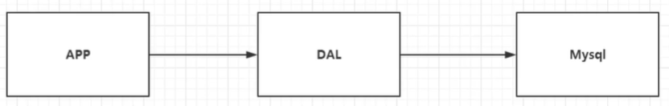

在这种情况下，一个网站的瓶颈：

1、数据量如果太大的话，一台机器会放不下。

2、数据的索引（B+ Tree），一台机器也会放不下。

3、访问量（读写混合），一个服务器承受不了。

三种情况出现其一，就需要进行升级！

**（二）Memcached（缓存）+ MySQL + 垂直拆分（读写分离）**

一个网站在80%的情况下都是在读数据，每次都查询数据库十分的麻烦！想要减轻数据库的压力，可以使用缓存保证效率。

发展过程：优化数据结构和索引 --> 文件缓存（多台机器之间不能共享，IO 压力大） --> Memcached（当时最热门的技术）

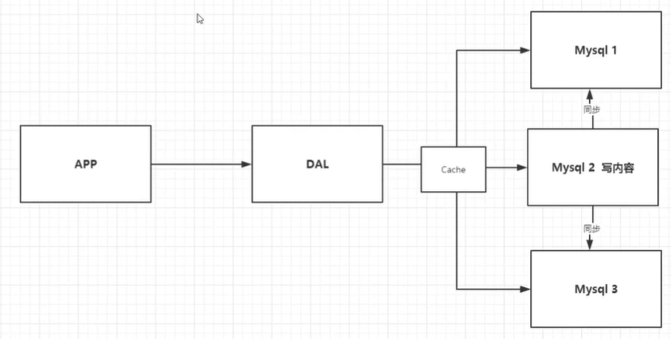

**（三）分库分表 + 水平拆分**

技术和业务在发展的同时

<font size=4 style="font-weight:bold;background:yellow;">数据库本质：读、写</font>

原有的 MyISAM：表锁，影响效率！高并发下会出现严重的锁问题。

转向 InnoDB：行锁

逐渐使用分库分表来解决写的压力。

MySQL 集群，很好地满足了那个年代所有的需求。

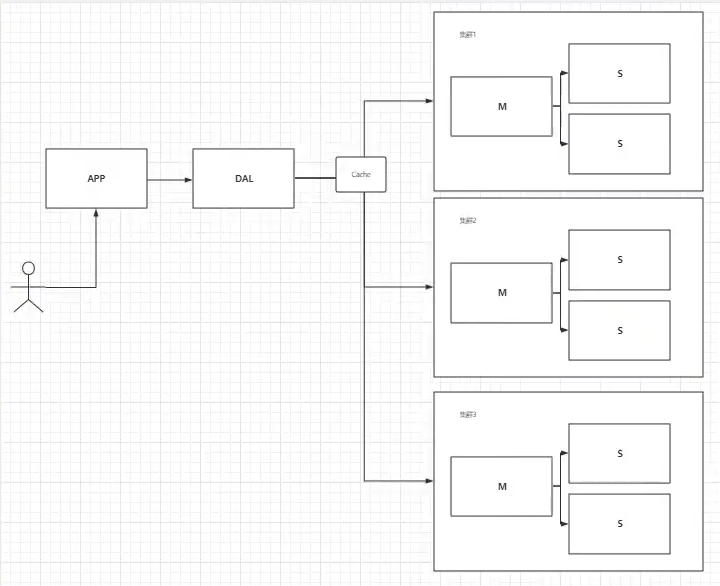

**（四）如今**

2010 ~ 2020 ，技术爆炸，世界发生了翻天覆地的变化，各种数据层出不穷。

MySQL 等关系型数据库逐渐就不够用了，数据很多，变化很快！

有的用 MySQL 存储一些比较大的文件、博客、图片等，数据库很大，效率低！如果有一种数据库专门处理这些数据，MySQL 的压力就会减小（研究如何处理这些问题），大数据 IO 压力下，表几乎没法更大（1亿数据加一列）。

**目前的一个基本的互联网项目**

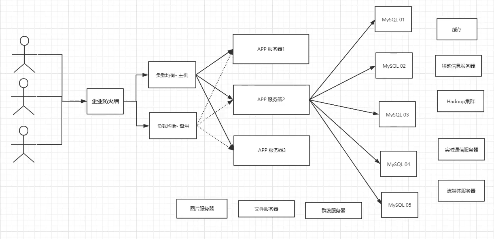

## 1.2、什么是 NoSQL？

> 用户个人信息、社交网络信息、地理位置、用户自身数据、日志数据等等数据爆发性增长，没有办法使用关系型数据库。这时候就要使用 NoSQL 数据库解决这些问题！

NoSQL = Not Only SQL（不仅仅是SQL）

关系型数据库：表格，行、列

NoSQL 泛指非关系型数据库，随着 web 2.0 互联网的诞生，传统的关系型数据库很难对付 web 2.0 时代！尤其是超大规模的高并发社区，会暴露出来很多难以克服的问题，NoSQL 在当今大数据的环境下的发展十分迅速，Redis 是发展最快的也是必须要掌握的一个技术！

有很多用户数据，例如个人信息，社交网络，地理位置等，这些数据的存储不需要一个固定的格式，不需要多余的操作就可以进行横向扩展！`Map<String,Object>` 使用键值对进行控制！

<font size=4 style="font-weight:bold;background:yellow;">NoSQL 特点</font>

- 方便扩展（数据之间没有关系，容易扩展）
- 大数据量高性能（Redis 一秒可以读11万次，写8万次，NoSQL 的缓存是一种细粒度的缓存，性能比较高！）
- 数据类型多样（不需要事先设计数据库，随取随用，如果是数据量十分大的话，就不好设计了）。

- 传统 RDBMS（关系型数据库）VS NoSQL

  ```
  传统的 RDBMS
  - 高度组织化结构化数据
  - 结构化查询语言（SQL）
  - 数据和关系都存储在单独的表中
  - 数据操纵语言，数据定义语言
  - 严格的一致性
  - 基础事务
  - ...
  ```

  ```
  NoSQL
  - 代表着不仅仅是SQL
  - 没有固定的查询语言
  - 键值对存储，列存储，文档存储，图形数据库(社交关系)
  - 最终一致性
  - CAP定理和BASE(异地多活)
  - 高性能，高可用性 和 高扩展性
  - ...
  ```

大数据时代的3V ： 主要是对问题的描述 		1、海量 Volume	2、多样 Variety	3、实时 Velocity 

互联网需求的3高 ： 主要是对程序的要求		1、高并发	2、高可扩	3、高性能

真正的实践：NoSQL + RDBMS 一起使用		技术没有高低贵贱之分

<font size=4 style="font-weight:bold;background:yellow;">NoSQL 的四大分类</font>

**KV 键值对**

- 新浪：Reids
- 美团：Redis + Tair
- 阿里，百度：Reidis + Memecache

**文档型数据库（bson 格式 和 json 一样）**

- MongoDB
  - MongoDB 是一个基于分布式文件储存的数据库，由 C++ 编写，主要用来处理大量文档。
  - MongoDB 是一个**介于关系数据库和非关系数据库之间的产品**，是非关系数据库当中功能最丰 富，最像关系数据库的。

- ConthDB

**列存储数据库**

- HBase
- 分布式文件系统

**图形关系数据库**

不是存储图形，而是用于存放关系，比如：朋友圈社交网络，广告推荐。

**各个数据库的对比**


# 2、Redis 入门

## 2.1、Redis 概述

<font size=4 style="font-weight:bold;background:yellow;">Redis 是什么？</font>

- Redis（**Re**mote **Di**ctionary **S**erver），远程字典服务！

- Redis 是一个开源的、使用 C 语言编写、支持网络、可基于内存、可持久化的日志型、Key-Value 数据库，并提供多种语言的 API。

- Redis  会周期性的把更新的数据写入磁盘或者把修改操作写入追加的记录文件，并且在此基础上实现了 master-slave（主从）同步。
- 免费，开源，是当下最门的 NoSQL 数据库之一，也被称之为结构化数据库。

<font size=4 style="font-weight:bold;background:yellow;">Redis 特点</font>

Redis 与其他 key-value 缓存产品相比有以下三个特点

- Redis 支持数据的持久化，可以将内存中的数据保持在磁盘中，重启的时候可以再次加载进行使用。在内存中，数据断电即失，所以持久化很重要。

- Redis 不仅仅支持简单的 key-value 类型的数据，同时还提供 list、set、zset、hash 等数据结构的存储。

- Redis 支持数据的备份，即 master-slave 模式的数据备份。

<font size=4 style="font-weight:bold;background:yellow;">Redis 能干什么？</font>

- 缓存数据：利用缓存提升数据获取速度，利用过期时间，灵活淘汰数据；

- 排行榜：销售排行、热度排行、社交数据；

- 计数器（浏览量）：商品浏览数量、好友数量、围观人数；

- 分布式锁：秒杀、全局锁；

- Session存储：存储 Session；

- 简单消息队列：解耦系统，异步处理任务。

<font size=4 style="font-weight:bold;background:yellow;">Redis 的特性</font>

多样的数据类型、持久化、集群、事务

<font size=4 style="font-weight:bold;background:yellow;">资料</font>

- 官网：https://redis.io/

- 中文网：http://www.redis.cn
- Redis命令参考：http://redisdoc.com/index.html
- https://try.redis.io/

- Redis 推荐在 Linux 服务器上搭建，基于 Linux 学习。 

  windows 安装：https://github.com/microsoftarchive/redis/releases/tag/win-3.2.100

## 2.2、安装

**Windows 安装**

下载地址：https://github.com/dmajkic/redis/downloads

Windows 下使用 redis 确实简单，但是 redis 推荐我们使用 Linux 去进行实际开发。


**Linux 安装**

1、将安装包移动到 /opt 目录下进行解压

```bash
# 解压得到redis文件
tar -zxvf redis-6.2.5.tar.gz
# 安装gcc环境
yum install gcc-c++
gcc -v
make
make
make install
# 安装完成
```

2、redis 默认安装路径：/usr/local/bin，进入到该路径中继续操作。

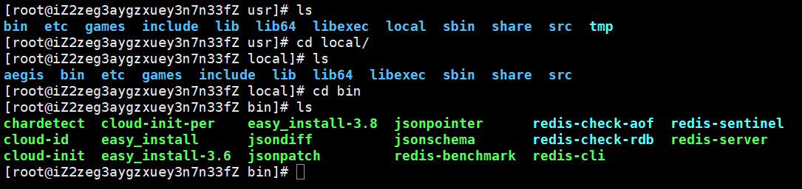

```bash
# 在bin目录下新建yconfig文件夹，将redis安装包中的redis.config文件移动到该文件夹中
# 之后使用这个配置文件进行启动
mkdir yconfig
cp /opt/redis-6.2.5/redis.conf yconfig
```

3、redis 默认不是后台启动的，需要修改配置文件！

```bash
vim redis.config
#将 daemonize no 改为 daemonize yes，实现后台启动
```

4、启动 redis 服务

```bash
# 回到 /usr/local/bin 目录
# 用修改后的配置文件启动
redis-server yconfig/redis.conf	# 输入后没有提示
# 检查是否启动成功，使用redis-cli进行连接
[root@iZ2zeg3aygzxuey3n7n33fZ bin]# redis-cli -p 6379
127.0.0.1:6379> ping
PONG	# 输入ping，返回 PONG，说明启动成功
127.0.0.1:6379> set name yuhaiyang
OK
127.0.0.1:6379> get name
"yuhaiyang"
127.0.0.1:6379> keys *
1) "name"
```

5、查看当前 redis 服务是否开启。

```bash
ps -ef|grep redis
```

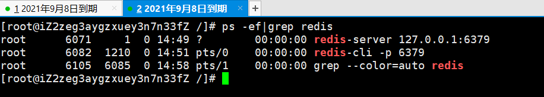

6、关闭 redis 服务

```bash
127.0.0.1:6379> shutdown
not connected> exit
```


## 2.3、性能测试

**redis-benchmark** 是一个官方自带的压力测试工具。

命令参数

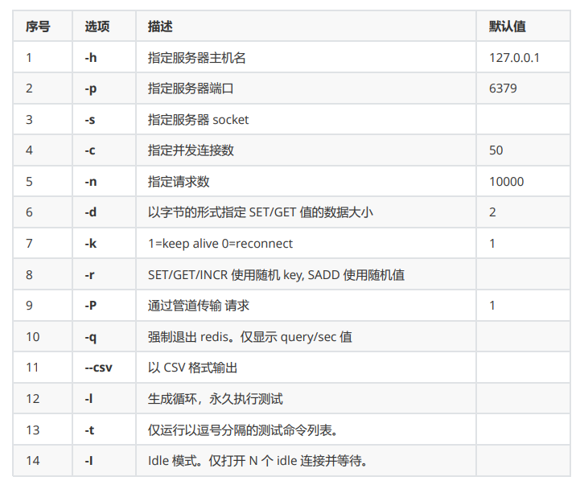

```bash
# 测试：100个并发连接 10W个请求
redis-benchmark -h localhost -p 6379 -c 100 -n 100000
```

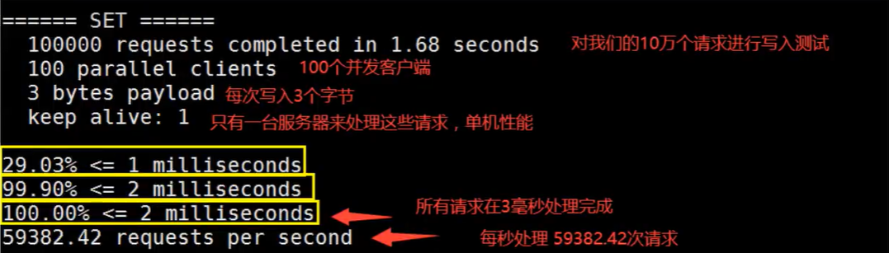

## 2.4、基础知识

- **redis 默认有16个数据库，在 redis.conf 中可以看到相关配置。**

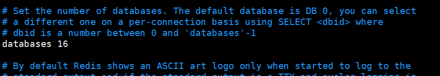

- **默认使用第0个数据库，可以使用 select 进行切换。**

  > redis 为什么使用6379作为端口号？
  >
  > 6379 是在手机按键上 MERZ 对应的号码，MERZ 是意大利歌女 Alessia Merz 的名字。

  ```bash
  [root@iZ2zeg3aygzxuey3n7n33fZ bin]	# redis-cli -p 6379
  127.0.0.1:6379> select 3	# 切换数据库
  OK
  127.0.0.1:6379[3]> dbsize	# 查看数据库大小
  (integer) 0
  ##################################################################################
  127.0.0.1:6379> select 1
  OK
  127.0.0.1:6379[1]> set name yuhaiyang666
  OK
  127.0.0.1:6379[1]> get name
  "yuhaiyang666"
  127.0.0.1:6379[1]> dbsize
  (integer) 1
  ##################################################################################
  127.0.0.1:6379[1]> keys *	# 查看数据库所有的key
  1) "name"
  127.0.0.1:6379[1]> flushdb	# 清除当前数据库，使用flushall清除全部数据库的内容
  OK
  127.0.0.1:6379[1]> keys *
  (empty array)
  ```

- **redis 是单线程的！**

  redis 是很快的，基于内存操作，CPU 不是 redis 的性能瓶颈，redis 的瓶颈是根据机器内存和网络带宽决定的，既然可以使用单线程实现，那就用单线程实现即可。

  **redis 为什么单线程还这么快？**

  redis 是由 C 语言编写的，官方提供的数据为10w+的 QPS（每秒查询），这个完全不比同样是使用 key-value 的 Memecache 差！

- **误区**

  1、高性能能服务器一定是多线程的吗？不是

  2、多线程一定比单线程效率高？不是

  速度：CPU > 内存 > 硬盘（CPU 速度虽然快，但是会有上下文切换，会消耗资源！内存则没有。）

  核心：

  - **redis 是将所有数据全部放在内存当中的，使用单线程进行操作的效率就是最高的！**

  - 使用多线程的话 CPU 上下文会切换，是耗时操作！对于内存系统来说，如果没有上下文切换，效率就是最高的！

  - redis 使用单个 CPU，一块内存，多次读写都是在一个 CPU 上的，所以在基于内存存储的情况下，这就是最佳的方案。

# 3、五大基本数据类型

## 3.0、Redis-key

```bash
###################################################################################
# flushdb		# 清除当前数据库的内容
# flushall		# 清除全内部数据库内容
# set			# 新增key
# keys *		# 查看所有的key
127.0.0.1:6379> flushall
OK
127.0.0.1:6379> keys *
(empty array)
127.0.0.1:6379> set name yuhaiyang666
OK
127.0.0.1:6379> set age 18
OK
###################################################################################
# exists	# 判断key是否存在
127.0.0.1:6379> keys *
1) "age"
2) "name"
127.0.0.1:6379> exists name
(integer) 1
127.0.0.1:6379> exists age1
(integer) 0
###################################################################################
# move		# 移动key
127.0.0.1:6379> keys *
1) "age"
2) "name"
127.0.0.1:6379> move age 1		# 将key移动到1号数据库（当前库是0号数据库）
(integer) 1
127.0.0.1:6379> keys *
1) "name"
###################################################################################
# EXPIRE	# 设置key的过期时间为10秒，10秒后自动删除，单位为秒
127.0.0.1:6379> EXPIRE age 10
(integer) 1
# ttl 		# 查看当前key的剩余时间（ttl->time to live）
127.0.0.1:6379> ttl age
(integer) 7
127.0.0.1:6379> ttl age
(integer) 4
127.0.0.1:6379> ttl age
(integer) 1
127.0.0.1:6379> ttl age
(integer) -2
127.0.0.1:6379> keys *
1) "name"	# key超时，已被自动删除
###############################################################################
# TYPE		# 查看当前key的类型
127.0.0.1:6379> TYPE name
string
127.0.0.1:6379> set age 66
OK
127.0.0.1:6379> keys *
1) "age"
2) "name"
127.0.0.1:6379> TYPE age
string
```

在官网上查看 redis 的命令：http://www.redis.cn/commands.html

## 3.1、String

String 的应用：key-value 中的 value 除了是字符还可以是数字。可以用于计数器、统计多单位的数量、粉丝数、对象缓存存储。

```bash
#################################################################
# 基础操作
127.0.0.1:6379> SET key1 v1		# 设置key
OK
127.0.0.1:6379> EXISTS key1		# 判断key是否存在
(integer) 1
127.0.0.1:6379> GET key1		# 获得key
"v1"
127.0.0.1:6379> keys *			# 获得所有的key
1) "key1"
#################################################################
# APPEND	# 追加，追加字符串时，如果字符串不存在，就相当于setkey
# STRLEN	# 获取字符串长度
127.0.0.1:6379> APPEND key1 "HELLO"		# 追加字符串
(integer) 7
127.0.0.1:6379> GET key1
"v1HELLO"
127.0.0.1:6379> STRLEN key1				# 获取字符串的长度
(integer) 7
127.0.0.1:6379> keys *
1) "key1"
127.0.0.1:6379> APPEND name "zhangsan"	# 当字符串存在时会追加字符串
(integer) 8
127.0.0.1:6379> keys *
1) "name"
2) "key1"
#################################################################
# INCR/DECR					# 自增/自减1，返回自增/自减后的结果
# INCRBY/DECRBY+key+step	# 设置步长自增/自减
127.0.0.1:6379> SET views 0
OK
127.0.0.1:6379> GET views
"0"
127.0.0.1:6379> INCR views		# 自增1
(integer) 1
127.0.0.1:6379> INCR views
(integer) 2
127.0.0.1:6379> DECR views		# 自减1
(integer) 1
127.0.0.1:6379> DECR views
(integer) 0
127.0.0.1:6379> DECR views
(integer) -1
127.0.0.1:6379> INCRBY views 10		# 设置步长，指定增量
(integer) 9							# -1+10
127.0.0.1:6379> DECRBY views 5
(integer) 4							# 9-5
127.0.0.1:6379> get views
"4"
#################################################################
# GETRANGE+key+区间	# 截取指定区间内的字符（左闭右闭），返回截取结果。
127.0.0.1:6379> SET key1 "hello,yuhaiyang"
OK
127.0.0.1:6379> GETRANGE key1 0 3	# 截取字符串 [0,3]
"hell"
127.0.0.1:6379> GETRANGE key1 0 -1	# 返回全部字符串
"hello,yuhaiyang" 
#################################################################
# SETRANGE			# 替换指定位置开始的字符串（包括指定位置上的字符）
127.0.0.1:6379> SET key2 abcdefg
OK
127.0.0.1:6379> SETRANGE key2 1 xx	# 替换
(integer) 7
127.0.0.1:6379> GET key2
"axxdefg"
#################################################################
# setex (set with expire)	# 设置过期事件
127.0.0.1:6379> setex key3 30 "hello"	# 设置key3的值为hello，30秒后过期
OK
127.0.0.1:6379> ttl key3
(integer) 25
127.0.0.1:6379> get key3
"hello"
127.0.0.1:6379> ttl key3	# key3的值已过期
(integer) -2
# setnx (set if not exist)	# 不存在则创建，存在则创建失败（在分布式锁中会用到）
127.0.0.1:6379> setnx mykey "redis"		# 如果mykey不存在，创建mykey
(integer) 1
127.0.0.1:6379> keys *
1) "mykey"
2) "key2"
3) "key1"
127.0.0.1:6379> setnx mykey "MongoDB"	# 如果mykey存在，创建失败
(integer) 0
127.0.0.1:6379> get mykey
"redis"
#################################################################
# mset/mget		# 同时设置/获取多个值
127.0.0.1:6379> mset k1 v1 k2 v2 k3 v3
OK
127.0.0.1:6379> keys *
1) "k3"
2) "k2"
3) "k1"
127.0.0.1:6379> mget k1 k2 k3 
1) "v1"
2) "v2"
3) "v3"
# msetnx		# 如果不存在就创建多个值
127.0.0.1:6379> msetnx k1 v1 k4 v4	# msetnx 是一个原子性的操作，要么一起成功，要么一起失败！
(integer) 0
127.0.0.1:6379> keys *
1) "k3"
2) "k2"
3) "k1"
#################################################################
# 用String储存对象
# set user:{id}:{field}		# 将属性分开设置	
127.0.0.1:6379> mset user:1:name zhangsan user:1:age 18
OK
127.0.0.1:6379> keys *
1) "user:1:name"
2) "user:1:age"
127.0.0.1:6379> mget user:1:name user:1:age
1) "zhangsan"
2) "18"
# set user:1 {name:zhangsan,age:3}		# 将属性合并设置，用json字符串保存一个对象
127.0.0.1:6379> set user:1 {name:zhangsan,age:3}
OK
127.0.0.1:6379> keys *
1) "user:1"
2) "user:1:name"
3) "user:1:age"
127.0.0.1:6379> get user:1
"{name:zhangsan,age:3}"
#################################################################
# getset	# 先get然后再set
127.0.0.1:6379> getset db "redis"	# 如果不存在值，返回nil
(nil)
127.0.0.1:6379> get db
"redis"
127.0.0.1:6379> getset db "MongoDB"	# 如果存在值，获取原来的值，并设置新的值（更新）
"redis"
127.0.0.1:6379> get db
"MongoDB"
```

## 3.2、List

List 是一种基本数据类型，在 redis 里面，List 可以作为栈，队列，阻塞队列。

redis 中所有的 list 命令都以 `l` 开头。

List 的应用

- List 实际上是一个链表，before/after node、left、right 都可以插入值。
- 如果 key 不存在，创建新的链表。
- 如果 key 存在，新增内容。
- 如果移除了所有的值，变成了空链表，也代表不存在！
- 在两边进行插入或者改动，效率最高；对中间的元素，效率会低一些。
- 消息队列：LPUSH -> RPOP	栈：LPUSH，LPOP

```bash
#################################################################
# LPUSH		# 将值插入到列表头部（左）
127.0.0.1:6379> LPUSH list one	# 将值插入列表头部（左）
(integer) 1						# 返回值为当前列表的大小
127.0.0.1:6379> LPUSH list two
(integer) 2
127.0.0.1:6379> LPUSH list three
(integer) 3
################################################################
# LRANGE	# 通过区间获取list中的值
127.0.0.1:6379> LRANGE list 0 -1	# 获取list中全部的值
1) "three"
2) "two"
3) "one"
127.0.0.1:6379> LRANGE list 0 1		# 通过区间获取具体的值
1) "three"
2) "two"
###############################################################
# RPUSH		# 将值插入列表尾部（右）
127.0.0.1:6379> RPUSH list right11	# 将值插入列表尾部（右）
(integer) 4
127.0.0.1:6379> LRANGE list 0 -1
1) "three"
2) "two"
3) "one"
4) "right11"
#################################################################
# LPOP/RPOP	# 移除list中的元素
127.0.0.1:6379> LPOP list	# 移除list的第一个元素
"thre"
127.0.0.1:6379> RPOP list	# 移除list的最后一个元素
"right11"
127.0.0.1:6379> LRANGE list 0 -1
1) "two"
2) "one"
#################################################################
# LINDEX	# 通过下标获取值
127.0.0.1:6379> LINDEX list 1	# 通过下标获取值
"one"
127.0.0.1:6379> LINDEX list 0
"two"
#################################################################
# LLEN		# 获取列表的长度
127.0.0.1:6379> LLEN list
(integer) 2
#################################################################
# LREM		# 移除指定个数的value（l-remove）
127.0.0.1:6379> flushall
OK
127.0.0.1:6379> LPUSH list one
(integer) 1
127.0.0.1:6379> LPUSH list two
(integer) 2
127.0.0.1:6379> LPUSH list three
(integer) 3
127.0.0.1:6379> LPUSH list three
(integer) 4
127.0.0.1:6379> LRANGE list 0 -1
1) "three"
2) "three"
3) "two"
4) "one"
127.0.0.1:6379> LREM list 1 one		# 移除list集合中指定个数的value，精确匹配
(integer) 1
127.0.0.1:6379> LRANGE list 0 -1
1) "three"
2) "three"
3) "two"
127.0.0.1:6379> LREM list 1 three	# 移除一个three
(integer) 1
127.0.0.1:6379> LRANGE list 0 -1
1) "three"
2) "two"
127.0.0.1:6379> LPUSH list three	# 再放一个three
(integer) 3
127.0.0.1:6379> LRANGE list 0 -1
1) "three"
2) "three"
3) "two"
127.0.0.1:6379> LREM list 2 three	# 移除两个three
(integer) 2
127.0.0.1:6379> LRANGE list 0 -1
1) "two"
#################################################################
# trim		# 截取，只保留一部分元素
127.0.0.1:6379> FLUSHDB
OK
127.0.0.1:6379> RPUSH mylist "hello1"
(integer) 1
127.0.0.1:6379> RPUSH mylist "hello2"
(integer) 2
127.0.0.1:6379> RPUSH mylist "hello3"
(integer) 3
127.0.0.1:6379> RPUSH mylist "hello4"
(integer) 4
127.0.0.1:6379> LTRIM mylist 1 2	# 通过下标截取指定的长度，这个list已被改变了
OK
127.0.0.1:6379> LRANGE mylist 0 -1
1) "hello2"
2) "hello3"
#################################################################
# RPOPLPUSH		# 移除原列表的最后一个元素（rpop），并将其放到新的列表中（lpush）并返回
127.0.0.1:6379> RPOPLPUSH mylist myOtherList	#原列表为hello，hello1~hello4
"hello4"
127.0.0.1:6379> LRANGE mylist 0 -1	# 查看原列表
1) "hello"
2) "hello1"
3) "hello2"
4) "hello3"
127.0.0.1:6379> LRANGE myOtherList 0 -1	# 查看目标列表
1) "hello4"
#################################################################
# LSET		# 将列表中指定下标的值更新为另一个值
127.0.0.1:6379> EXISTS list			# 判断列表是否存在
(integer) 0							# 不存在
127.0.0.1:6379> LSET list 0 item	#如果不存在，更新会报错
(error) ERR no such key
127.0.0.1:6379> LPUSH list value1	# 新建列表
(integer) 1
127.0.0.1:6379> LRANGE list 0 -1
1) "value1"
127.0.0.1:6379> LSET list 0 item	# 如果存在，更新当前下标的值
OK
127.0.0.1:6379> LRANGE list 0 -1
1) "item"
127.0.0.1:6379> LSET list 1 other	# 越界会报错
(error) ERR index out of range
#################################################################
# LINSERT	# 将某个具体的value插入到列表中某个元素的前面或者后面（after/before）
127.0.0.1:6379> FLUSHDB
OK
127.0.0.1:6379> RPUSH mylist "hello"
(integer) 1
127.0.0.1:6379> RPUSH mylist "world"
(integer) 2
127.0.0.1:6379> LRANGE mylist 0 -1
1) "hello"
2) "world"
127.0.0.1:6379> LINSERT mylist before "worl1d" "my"
(integer) -1
127.0.0.1:6379> LINSERT mylist before "world" "my"	# 插入到某个元素前面
(integer) 3
127.0.0.1:6379> LRANGE mylist 0 -1
1) "hello"
2) "my"
3) "world"
127.0.0.1:6379> LINSERT mylist after "world" "666" # 插入到某个元素后面
(integer) 4
127.0.0.1:6379> LRANGE mylist 0 -1
1) "hello"
2) "my"
3) "world"
4) "666"
```

## 3.3、Set

Set 储存的值不能重复。

Set 的应用：A用户将所有关注的人放在一个set集合中，对集合进行求交集的操作。微博、B站的共同关注，共同爱好，推荐好友。

```bash
#################################################################
# SADD		# 将一个或多个成员元素加入到集合中，不能重复
127.0.0.1:6379> FLUSHDB
OK
127.0.0.1:6379> SADD myset "hello"
(integer) 1
127.0.0.1:6379> SADD myset "kuangshen"
(integer) 1
127.0.0.1:6379> SADD myset "kuangshen"		# 重复元素，加入失败
(integer) 0
#################################################################
# SMEMBERS	# 返回集合中的所有的成员。
127.0.0.1:6379> SMEMBERS myset
1) "kuangshen"
2) "hello"
#################################################################
# SISMEMBER	# 判断某一个值是否在集合中。
127.0.0.1:6379> SISMEMBER myset "hello"
(integer) 1
127.0.0.1:6379> SISMEMBER myset "world"
(integer) 0
#################################################################
# SCARD	# 获取集合里面的元素个数
127.0.0.1:6379> SCARD myset
(integer) 2
#################################################################
# SREM	# 移除set中的指定元素（s+remove）
127.0.0.1:6379> SREM myset "kuangshen"
(integer) 1
127.0.0.1:6379> SMEMBERS myset
1) "hello"
#################################################################
# SRANDMEMEBER	# 命令用于返回集合中的一个随机元素。
127.0.0.1:6379> SMEMBERS myset
1) "kuangshen"
2) "world"
3) "hello"
127.0.0.1:6379> SRANDMEMBER myset		# 随机抽选出一个元素
"hello"
127.0.0.1:6379> SRANDMEMBER myset 2		# 随机抽选出指定个数的元素
1) "world"
2) "kuangshen"
127.0.0.1:6379> SRANDMEMBER myset 2
1) "kuangshen"
2) "hello"
#################################################################
# SPOP	# 随机移除集合中的元素
127.0.0.1:6379> SMEMBERS myset
1) "kuangshen"
2) "world"
3) "hello"
127.0.0.1:6379> SPOP myset
"world"
127.0.0.1:6379> SPOP myset
"kuangshen"
127.0.0.1:6379> SPOP myset
"hello"
#################################################################
# SMOVE SOURCE DESTINATION MEMBER	# 将一个指定的值移动到另外的一个set中
127.0.0.1:6379> SADD myset "hello"
(integer) 1
127.0.0.1:6379> SADD myset "world"
(integer) 1
127.0.0.1:6379> SADD myset "kuangshen"		# 向set1中添加元素
(integer) 1
127.0.0.1:6379> SADD myset2 "set2"			# 向set2中添加元素
(integer) 1
127.0.0.1:6379> SMOVE myset myset2 "kuangshen"	# 移动
(integer) 1
127.0.0.1:6379> SMEMBERS myset
1) "world"
2) "hello"
127.0.0.1:6379> SMEMBERS myset2
1) "kuangshen"
2) "set2"
##################################################################
# SDIFF		# 差集
# SINTER	# 交集
# SUNION	# 并集
127.0.0.1:6379> SADD key1 "a"
(integer) 1
127.0.0.1:6379> SADD key1 "b"
(integer) 1
127.0.0.1:6379> SADD key1 "c"
(integer) 1
127.0.0.1:6379> SADD key2 "c"
(integer) 1
127.0.0.1:6379> SADD key2 "d"
(integer) 1
127.0.0.1:6379> SADD key2 "e"		# 创建用于测试的key1和key2
(integer) 1
127.0.0.1:6379> SDIFF key1 key2 	# 差集
1) "a"
2) "b"
127.0.0.1:6379> SINTER key1 key2	# 交集
1) "c"
127.0.0.1:6379> SUNION key1 key2 	# 并集
1) "a"
2) "b"
3) "c"
4) "e"
5) "d"
```

## 3.4、Hash

同样是 key-value 的存储形式，只不过 value 是一个键值对。`key(myhash)-(key(field1)-vlaue,key(field2)-value...)`

Hash 的应用：用于存储用户信息之类的经常变动的信息。Hash 更适合对象的存储，String 更适合字符串的存储。

```bash
###################################################################
# HSET/HGET	# 为哈希表中的字段赋值
127.0.0.1:6379> FLUSHDB
OK
127.0.0.1:6379> HSET myhash field1 "kuangshen"
(integer) 1
127.0.0.1:6379> HGET myhash field1
"kuangshen"
# HMSET		# 同时将多个field-value对设置到哈希表中。会覆盖哈希表中已存在的字段
127.0.0.1:6379> HMSET myhash field1 "Hello" field2 "World"
OK
# HMGET		# 同时获取一个或多个key对应的值
127.0.0.1:6379> HMGET myhash field1 field2
1) "Hello"
2) "World
# HGETALL	# 用于返回哈希表中，所有的字段和值
127.0.0.1:6379> HGETALL myhash
1) "field1"
2) "Hello"
3) "field2"
4) "World
# HDEL		# 删除哈希表指定的key，对应的value也一并删除
127.0.0.1:6379> HDEL myhash field1
(integer) 1
127.0.0.1:6379> HGETALL myhash
1) "field2"
2) "World"
###################################################################
# HLEN		# 获取哈希表中字段的数量
127.0.0.1:6379> FLUSHDB
OK
127.0.0.1:6379> HMSET myhash field1 "Hello" field2 "World"
OK
127.0.0.1:6379> HGETALL myhash
1) "field1"
2) "Hello"
3) "field2"
4) "World
127.0.0.1:6379> HLEN myhash
(integer) 2
####################################################################
# HEXISTS	# 判断哈希表的指定字段是否存在
127.0.0.1:6379> HEXISTS myhash field1
(integer) 1
127.0.0.1:6379> HEXISTS myhash field3
(integer) 0
####################################################################
# HKEYS		# 获取哈希表中的所有field
# HVALS		# 获取哈希表中的所有value
127.0.0.1:6379> HKEYS myhash
1) "field2"
2) "field1"
127.0.0.1:6379> HVALS myhash
1) "World"
2) "Hello"
####################################################################
# HINCRBY	# 为哈希表中的字段值加上指定增量值
127.0.0.1:6379> HSET myhash field 5
(integer) 1
127.0.0.1:6379> HINCRBY myhash field 1		# 5+1
(integer) 6
127.0.0.1:6379> HINCRBY myhash field -1		# 6-1
(integer) 5
127.0.0.1:6379> HINCRBY myhash field -10	# 5-10
(integer) -5
####################################################################
# HSETNX	# 为哈希表中不存在的的字段赋值
127.0.0.1:6379> HSETNX myhash field1 "hello"	# 如果不存在，可以创建
(integer) 1
127.0.0.1:6379> HSETNX myhash field1 "world"	# 如果存在，无法创建
(integer) 0
127.0.0.1:6379> HGET myhash field1
"hello"
```

## 3.5、Zset

Zset：有序集合，在 set 的基础上增加了一个值。

Zset 的应用：set 的排序，存储班级成绩表，工资表；普通消息 1，重要消息 2，带权重进行判断；排行榜的实现 topN。

```bash
####################################################################
# ZADD		# 将一个或多个成员元素及其分数值加入到有序集当中。
127.0.0.1:6379> ZADD myzset 1 "one"
(integer) 1
127.0.0.1:6379> ZADD myzset 2 "two" 3 "three"
(integer) 2
####################################################################
# ZRANGE+key+start+stop		# 从小到大返回有序集中，指定区间内的成员
# 参数start和stop都是基于零的索引，即0是第一个元素，1是第二个元素，以此类推。 它们也可以是负数，表示从有序集合的末尾的偏移量，其中-1是有序集合的最后一个元素，-2是倒数第二个元素，等等。
# start和stop都是全包含的区间，因此例如ZRANGE myzset 0 1将会返回有序集合的第一个和第二个元素。
127.0.0.1:6379> ZRANGE myzset 0 -1
1) "one"
2) "two"
3) "three"
####################################################################
# ZRANGEBYSCOERE+key+min+max		# 从小到大返回有序集合中指定score区间的成员列表。
# +inf表示正无穷+∞，-inf表示负无穷-∞。
127.0.0.1:6379> ZADD salary 22500 yuhaiyang
(integer) 1
127.0.0.1:6379> ZADD salary 10000 zhangsan
(integer) 1
127.0.0.1:6379> ZADD salary 20000 lisi						# 添加三个成员
(integer) 1
127.0.0.1:6379> ZRANGEBYSCORE salary -inf +inf 				# 按score值从小到大的顺序显示成员
1) "zhangsan"
2) "lisi"
3) "yuhaiyang"
127.0.0.1:6379> ZRANGEBYSCORE salary -inf +inf WITHSCORES 	# 从小到大显示成员并且将score值也一并显示出来
1) "zhangsan"
2) 10000.0
3) "lisi"
4) 20000.0
5) "yuhaiyang"
6) 22500.0
127.0.0.1:6379> ZRANGEBYSCORE salary -inf 20000 WITHSCORES	# 从小到大显示score值小于等于2500的成员
1) "zhangsan"
2) 10000.0
3) "lisi"
4) 20000.0
####################################################################
# ZREVRANGE			# 从大到小返回有序集中，指定区间内的成员
127.0.0.1:6379> ZREVRANGE salary 0 -1 WITHSCORES 		# 从大到小显示所有成员
1) "yuhaiyang"
2) 22500.0
3) "lisi"
4) 20000.0
5) "zhangsan"
6) 10000.0
# ZREVRANGEBYSCORE	# 从大到小返回有序集合中指定score区间的成员列表。
127.0.0.1:6379> ZREVRANGEBYSCORE salary +inf -inf		# 按score值从大到小的顺序显示成员
1) "yuhaiyang"
2) "lisi"
3) "zhangsan"
####################################################################
# ZREM		# 移除有序集中的一个或多个成员
127.0.0.1:6379> ZRANGE salary 0 -1
1) "zhangsan"
2) "lisi"
3) "yuhaiyang"
127.0.0.1:6379> ZREM salary yuhaiyang
(integer) 1
127.0.0.1:6379> ZRANGE salary 0 -1
1) "zhangsan"
2) "lisi"
####################################################################
# ZCARD		# 命令用于计算集合中元素的数量。
127.0.0.1:6379> ZCARD salary
(integer) 2
####################################################################
# ZCOUNT	# 获取有序集合中指定score区间的成员数量（左闭右闭）。
127.0.0.1:6379> ZADD myzset 1 "hello"
(integer) 1
127.0.0.1:6379> ZADD myzset 2 "world" 3 "yhh"
(integer) 2
127.0.0.1:6379> ZCOUNT myzset 1 3
(integer) 3
127.0.0.1:6379> ZCOUNT myzset 1 2
(integer) 2
####################################################################
# ZRANK		# 将集合按照score从小到大的顺序排列，返回指定成员的排名
127.0.0.1:6379> ZRANGE salary 0 -1 WITHSCORES # 显示所有成员及其 score 值
1) "zhangsan"
2) 10000.0
3) "lisi"
4) 20000.0
5) "yuhaiyang"
6) 22500.0
127.0.0.1:6379> ZRANK salary yuhaiyang	# yuhaiyang第三名
(integer) 2
127.0.0.1:6379> ZRANK salary zhangsan 	# zhangsan第一名
(integer) 0
####################################################################
# ZREVRANK	# 将集合按照score从大到小的顺序排列，返回指定成员的排名
127.0.0.1:6379> ZREVRANK salary yuhaiyang	# yuhaiyang第一名
(integer) 0
127.0.0.1:6379> ZREVRANK salary zhangsan 	# zhangsan第三名
(integer) 2
```

## 3.6、BigKey

BigKey：大小或元素数量超过一定数量的 Key。

Redis 是使用单线程读写数据，bigkey 的读写操作会阻塞线程，降低 Redis 的处理效率。所以在使用 Redis 时，关于 value 的设计规范，非常重要的一点就是避免 bigkey。

**bigkey 通常有两种情况**

- 情况一：键值对的值大小本身就很大，例如 value 为 1MB 的 String 类型数据。为了避免 String 类型的 bigkey，在业务层，要尽量把 String 类型的数据大小控制在 10KB 以下。
- 情况二：键值对的值是集合类型，集合元素个数非常多，例如包含 100 万个元素的 Hash 集合类型数据。为了避免集合类型的 bigkey，尽量把集合类型的元素个数控制在 5000个以下。

<font size=4 style="font-weight:bold;background:yellow;">BigKey 存在的问题</font>

- 会导致请求阻塞；
- 对带宽和磁盘 IO 造成压力；
- 不易拆分。

# 4、三种特殊的数据类型

## 4.1、Geospatial

redis 的 Geo 是在 redis 3.2 版本推出的，这个功能可以推算地理位置信息，比如计算两地之间的距离，方圆几公里之内的人等。

Geo 只有六个命令：GEOADD、GEODIST、GEOHASH、GEOPOS、GEPORADIUS、GEPORADIUSBYMEMBER。

- **GEOADD：添加地理位置。**

  规则：地球两极无法直接添加，一般会下载数据，通过 Java 程序一次性导入。

  有效的经度从-180度到180度，有效的纬度从-85.05112878度到85.05112878度。当坐标位置超出上述指定范围时，该命令将会返回一个错误。

  ```bash
  # GEOADD	# 添加地理位置
  127.0.0.1:6379> GEOADD china:city 116.23 40.22 北京
  (integer) 1
  127.0.0.1:6379> GEOADD china:city 121.48 31.40 上海 113.88 22.55 深圳 120.21 30.20 杭州
  (integer) 3
  127.0.0.1:6379> GEOADD china:city 106.54 29.40 重庆 108.93 34.23 西安 114.02 30.58 武汉
  (integer) 3
  ```

- **GEOPOS：获取指定城市的经纬度。**

  ```bash
  # GEOPOS	# 获取指定城市的经纬度
  127.0.0.1:6379> geopos china:city 北京
  1) 1) "116.23000055551528931"
     2) "40.2200010338739844"
  127.0.0.1:6379> geopos china:city 上海 重庆
  1) 1) "121.48000091314315796"
     2) "31.40000025319353938"
  2) 1) "106.54000014066696167"
     2) "29.39999880018641676"
  127.0.0.1:6379> geopos china:city 新疆
  1) (nil)
  ```

- **GEODIST：计算两个位置之间的距离。**

  m：米	km：千米	mi：英里	ft：英尺

  ```bash
  # GEODIST	# 计算两人之间的距离
  127.0.0.1:6379> geodist china:city 北京 上海
  "1088785.4302"
  127.0.0.1:6379> geodist china:city 北京 上海 km		# 查看北京到上海的直线距离，使用km表示
  "1088.7854"
  127.0.0.1:6379> geodist china:city 重庆 北京 km
  "1491.6716"
  ```

- **GEORADIUS：以指定经纬度坐标为中心，找出某一半径内的元素。**

  思考：如何获取 “附近的人” ？答：获取附近所有人的定位，通过半径来查询。

  格式（详情见[官方文档](http://www.redis.cn/commands.html)）：`georadius key longitude latitude radius m|km|ft|mi [withcoord] [withdist] [withhash] [asc|desc] [count count]`

  ```bash
  # GEORADIUS	# 以给定的经纬度为中心，找出某一半径内的成员。
  # 在china:city中寻找中心经纬度(100,30)半径为1000km范围内的城市。
  127.0.0.1:6379> georadius china:city 100 30 1000 km
  1) "重庆"
  2) "西安"
  # withdist	# 返回位置名称和到中心的距离
  127.0.0.1:6379> georadius china:city 100 30 1000 km withdist
  1) 1) "重庆"
     2) "635.2850"
  1) 1) "西安"
     2) "963.3171"
  # withcoord	#返回位置名称和经纬度
  127.0.0.1:6379> georadius china:city 100 30 1000 km withcoord
  1) 1) "重庆"
     2) 1) "106.54000014066696167"
        2) "29.39999880018641676"
  2) 1) "西安"
     2) 1) "108.92999857664108276"
        2) "34.23000121926852302"
  # 多个限定条件叠加
  127.0.0.1:6379> georadius china:city 100 30 1000 km withcoord withdist count 1
  1) 1) "重庆"
     2) "635.2850"
     3) 1) "106.54000014066696167"
        2) "29.39999880018641676"
  127.0.0.1:6379> georadius china:city 100 30 1000 km withcoord withdist count 2
  1) 1) "重庆"
     2) "635.2850"
     3) 1) "106.54000014066696167"
        2) "29.39999880018641676"
  2) 1) "西安"
     2) "963.3171"
     3) 1) "108.92999857664108276"
        2) "34.23000121926852302"
  ```

- **GEPORADIUSBYMEMBER：以指定元素为中心，找出某一半径内的元素。**

  用法与 GEORADIUS 相同，只不过中心点由坐标变成了元素。

- **GEOHASH：返回一个或多个元素的 GEOHASH 表示。**

  将经纬度转换为一个一维的11位的哈希字符串，两个字符串越像则说明两个地点越接近。

  ```bash
  127.0.0.1:6379> geohash china:city 北京 重庆
  1) "wx4sucu47r0"
  2) "wm5z22h53v0"
  127.0.0.1:6379> geohash china:city 北京 上海
  1) "wx4sucu47r0"
  2) "wtw6sk5n300"
  ```

- **Geo 的底层原理**

  Geo 的底层就是 Zset，可以使用 Zset 的命令来操作 Geo！比如删除 Geo：

  ```bash
  127.0.0.1:6379> geoadd china:city 116.23 40.22 beijing
  1
  127.0.0.1:6379> zrange china:city 0 -1 		# 查看全部的元素
  1) "重庆"
  2) "西安"
  3) "深圳"
  4) "武汉"
  5) "杭州"
  6) "上海"
  7) "beijing"
  8) "北京"
  127.0.0.1:6379> zrem china:city beijing	 	# 移除元素
  1
  127.0.0.1:6379> zrem china:city 北京
  1
  127.0.0.1:6379> zrange china:city 0 -1
  1) "重庆"
  2) "西安"
  3) "深圳"
  4) "武汉"
  5) "杭州"
  6) "上海"
  ```


## 4.2、Hyperloglog

> **什么是基数？**一个集合中不重复的元素个数。
>
> 比如数据集`{1,3,5,7,8,7}`，这个数据集的基数集就是`{1,3,5,7,8}`，基数为5。

**Hyperloglog**：在 Redis 2.8.9 版本中更新的数据结构，可在较小的误差范围（0.81%）内快速计算基数。

- 优点

  占用的内存固定，储存2^64 个不同的元素，只需要占用12KB的内存。较大数据量时如果允许容错的话，可以使用 Hyperloglog，不允许的话可以使用 set。

- 应用

  计算网页的 UV（Unique Visitor，一个人多次访问同一个网站，但还是算作一个人）。

  传统的方式用 set 保存用户的 id，然后统计 set 中的元素数量进行计算。这种方式如果保存大量用户 id 就会比较麻烦，因为最终的目的是计数，而不是保存用户 id。

- 使用

  PFADD：向 Hyperloglog 中添加指定元素。

  PFCOUNT：返回给定 HyperLogLog 的基数估算值。

  PFMERGE：将多个 HyperLogLog 合并为一个 HyperLogLog，并集计算。

```bash
127.0.0.1:6379> PFADD mykey a b c d e f g h i j	# 创建第一组元素
(integer) 1
127.0.0.1:6379> PFCOUNT mykey	# 统计mykey的基数
(integer) 10
127.0.0.1:6379> PFADD mykey2 i j z x c v b n m
(integer) 1
127.0.0.1:6379> PFMERGE mykey3 mykey mykey2	# 取mykey和mykey2的并集
OK
127.0.0.1:6379> PFCOUNT mykey3	# 计算并集的基数
(integer) 15
```

## 4.3、Bitmaps

> 在开发中，可能会遇到这种情况：需要统计用户的某些信息，活跃/不活跃、登录/未登录；记录用户一年的打卡情况，打卡是1， 未打卡是0，如果使用普通的 key-value存储，则要记录 365条记录。
>
> 如果用户量很大，需要的空间也会很大，所以 Redis 提供了 Bitmap 位图这种数据结构，Bitmaps 就是通过操作二进制位来进行记录，将打卡情况记为 0 和 1；如果要记录 365 天的打卡情况，使用 Bitmaps 表示的形式大概如下：0101000111000111... ...，这样十分节约内存 ，365 天相当于 365 bit，又 1 字节 = 8 bit，所以相当于使用 46 个字节即可。 
>
> Bitmaps 就是通过一个 bit 位来表示某个元素对应的值或者状态, 其中的 key 就是对应元素本身，实际上 Bitmaps 的底层也是通过对字符串的操作来实现。
>
> Redis 从 2.2 版本之后新增了 SETBIT、GETBIT、BITCOUNT 等几个 Bitmaps 相关命令。

统计用户信息，活跃/不活跃、登录/未登录、打卡（两个状态），操作二进制位进行计数。

```bash
# 使用bitmap记录周一到周日的打卡情况
# 周一-1 周二-0 周三-0 周四-1 周五-1 周六-0 周天-0 （1打卡，0未打卡）
# SETBIT key offset value	# 设置key的第offset位为value (1或0)
127.0.0.1:6379> SETBIT sign 0 1
(integer) 0
127.0.0.1:6379> SETBIT sign 1 0
(integer) 0
127.0.0.1:6379> SETBIT sign 2 0
(integer) 0
127.0.0.1:6379> SETBIT sign 3 1
(integer) 0
127.0.0.1:6379> SETBIT sign 4 1
(integer) 0
127.0.0.1:6379> SETBIT sign 5 0
(integer) 0
127.0.0.1:6379> SETBIT sign 6 0
(integer) 0
# GETBIT key offset			# 获取key的第offset位上的值，没设置过的默认返回0
127.0.0.1:6379> getbit sign 3 	# 查看周四是否打卡
(integer) 1
127.0.0.1:6379> getbit sign 6 	# 查看周七是否打卡
(integer) 0
# BITCOUNT key [start,end]	# 统计key上位为1的个数
127.0.0.1:6379> bitcount sign	# 统计这周的打卡记录
(integer) 3
```

# 5、事务

Redis 事务：一组命令的集合，一个事务中的所有命令都会被序列化，在事务的执行过程中会按照顺序执行。

**一次性、顺序性、排他性**	执行一系列的命令，保证命令能够安全执行完毕。

**Redis 的事务没有隔离级别的概念**，所有的命令在事务中，并没有直接执行，只有在发起执行命令的时候才会开始执行！

Redis 的单条命令是原子性的，但是 Redis 的事务不保证原子性。

## 5.1、执行事务

Redis 事务的三个阶段：

- 开启事务：`multi`
- 命令入队：命令入队时没有执行，exec 后才开始按顺序执行。
- 执行事务：`exec`

```bash
> multi		# 开启事务
OK
> set k1 v1
QUEUED		# 命令队列
> set k2 v2
QUEUED
> get k2
QUEUED
> set k3 v3
QUEUED
> exec		# 执行事务
1) OK
2) OK
3) "v2"
4) OK		# 每个事务在执行后就消失了，想要再次使用需要再次开启
```

## 5.2、放弃事务

```bash
> multi		# 开启事务
OK
> set k1 v1
QUEUED
> set k2 v2
QUEUED
> set k4 v4
QUEUED
> discard	# 取消事务
OK
> get k4	# 事务中的命令队列都不会执行
(nil)
```

## 5.3、编译型异常

编译型异常：代码有问题（类比 Java），命令有问题，事务中的所有命令都不会被执行！

```bash
> multi
OK
> set k1 v1
QUEUED
> set k2 v2
QUEUED
> getset k2	# 错误的命令
(error) wrong number of arguments for 'getset' command
QUEUED
> set k4 v4
QUEUED
> exec		# 执行事务的时候报错
(error) EXECABORT Transaction discarded because of previous errors.
> get k4	# 所有的命令都不会被执行
(nil)
```

## 5.4、运行时异常

运行时异常：如果事务队列中存在语法型错误（比如1/0），那么在执行命令时其他的命令可以正常执行，错误命令抛出异常（**所以没有原子性**）。

```bash
 > set k1 "v1"
OK
> multi
OK
> incr k1	# incr只能对数字进行操作，执行的时候会失败。
QUEUED
> set k2 v2
QUEUED
> set k3 v3
QUEUED
> get k3
QUEUED
> exec		# 虽然第一条命令报错了，但是事务仍然执行成功！
1) ERR value is not an integer or out of range
2) OK
3) OK
4) "v3"
> get k2
"v2"
```

# 6、Redis 实现乐观锁

**悲观锁**

- 概念：认为任何时候都可能出问题，无论干什么都会上🔒，非常影响性能。

**乐观锁**

- 概念：认为什么时候都不会出现问题，所以不会上🔒！在更新数据的时候会判断在该期间内是否有人修改过数据。（MySQL 用一个 version 字段进行判断，获取 verison，更新的时候比较version）

**Redis 的监视测试**

测试多线程修改对象的值，使用 watch 充当 Redis 的乐观锁。

```bash
> set money 100
OK
> set out 0
OK
> watch money	# 监视money对象
OK
> multi			# 事务正常结束，期间数据没有发生变动，执行成功！
OK
> decrby money 20
QUEUED
> incrby out 20
QUEUED
> exec			# 一旦事务成功后监控就会取消掉，想要再次使用需要重新监控。
1) (integer) 80
2) (integer) 20
```

如果事务执行期间有其他事务混入，事务会执行失败！可以使用 `unwatch` 解锁，取消监视对象，重新获取锁（放弃旧 version，获得新 version），再次执行事务。

watch 不管事务执行是否成功，执行结束之后都会自动解锁，不需要 `unwatch`。如果执行 exec 或者 discard， 则不需要手动执行 unwatch。

```bash
# 窗口一
> watch money	# 监视money
OK
> MULTI
OK
> decrby money 20
QUEUED
> incrby out 20 	
QUEUED
> exec 			# 输入完毕后，执行事务二修改money的值，事务会执行失败！
(nil)
###########################################################
# 窗口二
127.0.0.1:6379> get money
"80"
127.0.0.1:6379> set money 100
OK
############################################################
# 窗口一：出现问题后放弃监视，然后重来！
# 127.0.0.1:6379> unwatch 	# 可以不用 unwatch
# OK	# 解锁，放弃监视
127.0.0.1:6379> watch money	# 重新监视
OK
127.0.0.1:6379> multi
OK
127.0.0.1:6379> decrby money 20
QUEUED
127.0.0.1:6379> incrby out 20
QUEUED
127.0.0.1:6379> exec # 成功！
1) (integer) 980
2) (integer) 40
```

# 7、Jedis

Jedis：使用 Java 操作 Redis 的一个中间件。

- 导入对应依赖

  ```xml
  <!-- https://mvnrepository.com/artifact/redis.clients/jedis -->
  <dependency>
      <groupId>redis.clients</groupId>
      <artifactId>jedis</artifactId>
      <version>3.2.0</version>
  </dependency>
  <!--fastjson-->
  <dependency>
      <groupId>com.alibaba</groupId>
      <artifactId>fastjson</artifactId>
      <version>1.2.60</version>
  </dependency>
  ```

- 使用步骤：连接数据库->操作->断开连接

  ```java
  package com.haining820;
  
  import redis.clients.jedis.Jedis;
  
  public class TestPing {
      public static void main(String[] args) {
          // new Jedis对象
          Jedis jedis = new Jedis("127.0.0.1",6379);
          // Jedis的所有命令就是之前学习的所有指令
          System.out.println(jedis.ping());   // 输出 PONG
      }
  }
  ```

- 常用 API：String，List，Set，Hash，Zset，函数与之前的命令完全一样，正常使用即可。

  ```java
  package com.haining820;
  
  import redis.clients.jedis.Jedis;
  
  import java.util.Set;
  
  public class TestKey {
      public static void main(String[] args) {
          Jedis jedis = new Jedis("127.0.0.1", 6379);
          System.out.println("清空数据：" + jedis.flushDB());
          System.out.println("判断某个键是否存在：" + jedis.exists("username"));
          System.out.println("新增<'username','yuhaiyang'>的键值对：" + jedis.set("username", "yuhaiyang"));
          System.out.println("新增<'password','password'>的键值对：" + jedis.set("password", " password"));
          System.out.print("系统中所有的键如下：");
          Set<String> keys = jedis.keys("*");
          System.out.println(keys);
          System.out.println("删除键password:" + jedis.del("password"));
          System.out.println("判断键password是否存在：" + jedis.exists("password"));
          System.out.println("查看键username所存储的值的类型：" + jedis.type("username"));
          System.out.println("随机返回key空间的一个：" + jedis.randomKey());
          System.out.println("重命名key：" + jedis.rename("username", "newname"));
          System.out.println("取出改后的name：" + jedis.get("newname"));
          System.out.println("按索引查询：" + jedis.select(0));
          System.out.println("删除当前选择数据库中的所有key：" + jedis.flushDB());
          System.out.println("返回当前数据库中key的数目：" + jedis.dbSize());
          System.out.println("删除所有数据库中的所有key：" + jedis.flushAll());
      }
  }
  ```
  
- Jedis 整合事务

  ```java
  package com.haining820;
  
  import com.alibaba.fastjson.JSONObject;
  import redis.clients.jedis.Jedis;
  import redis.clients.jedis.Transaction;
  
  public class TestTx {
      public static void main(String[] args) {
          Jedis jedis = new Jedis("127.0.0.1", 6379);
          jedis.flushDB();
          JSONObject jsonObject = new JSONObject();
          jsonObject.put("name", "yuhaiyang");
          jsonObject.put("age", "18");
          // 开启事务
          Transaction multi = jedis.multi();
          String s = jsonObject.toJSONString();
          try {
              multi.set("user1", s);
              multi.set("user2", s);
              int i = 1/0;    // 代码抛出异常，事务执行失败
              multi.exec();   // 执行事务
          } catch (Exception e) {
              multi.discard();    // 放弃事务
              e.printStackTrace();
          } finally {
              System.out.println(jedis.get("user1"));
              System.out.println(jedis.get("user2"));
              jedis.close();  // 关闭连接
          }
      }
  }
  ```

# 8、SpringBoot 整合 Redis

jedis：直连 redis，多个线程同时操作时不安全；避免这种不安全的情况需要使用 jedis pool 连接池。BIO

lettuce：底层使用 netty，实例可以在多个线程中共享。NIO

常用的操作都可以通过 redisTemplate 使用

# 9、Redis.conf 配置详解

# 10、Redis 的持久化

**Redis 是内存数据库，如果不将内存中的数据库状态保存到磁盘，那么一旦服务器进程退出，服务器中的数据库状态也会消失。所以Redis 提供了持久化功能！**

## 10.1、RDB（Redis DataBase）

RDB 会在指定的时间间隔内将内存中的数据快照集体写入磁盘中，也就是 snapshot 快照，恢复时会将快照文件直接读取到内存中。Redis 会单独创建（fork）一个子进程来进行持久化，会先将数据写入到一个临时文件中，待持久化过程都结束了，再用这个临时文上次持久化好的文件。

整个过程中，主进程是不进行任何  IO 操作的，这就确保了极高的性能。如果需要进行大规模数据的恢复，且对于数据恢复的完整性不是非常敏感，那 RDB 方式要比 AOF 方式更加的高效。关系数据库的缺点是最后一次持久化后的数据可能丢失，持久化默认的方式就是 RDB，一般情况下不需要修改这个配置！

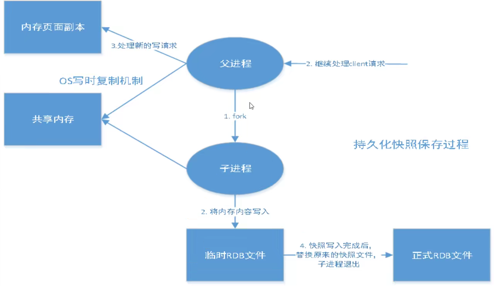

Redis 是内存数据库，数据是断电即失的，要设置自动保存快照的时间，在规定时间内执行了多少次操作则会进行自动保存，储存到 `.rdb` 文件、`.aof` 文件中，在配置文件中进行配置，有时在生产环境中会将这个文件备份。以下是 redis 配置文件中与快照 SNAPSHOTTING 相关的内容。

```bash
################################ SNAPSHOTTING  ################################
save 900 1		# 在900s（15min）内，至少有1个key进行了修改，就要进行持久化操作
save 300 10		# 在300s（5min）内，至少有10个key进行了了修改...
save 60 10000	# 在60s内，至少有10000个key进行了了修改...

# 持久化出现错误后是否继续工作
stop-writes-on-bgsave-error yes

# 是否采用LZF的压缩方式压缩rdb文件，默认为yes；
# 压缩需要消耗一定的CPU资源，如果为了节省CPU时间，可以关闭该选项，但会导致数据库文件变的巨大。
rdbcompression yes

# 自RDB版本5起CRC64校验和被放置在文件的末尾，这使得文件更能抵抗损坏。
# 但在保存和加载RDB文件时，性能会受到影响（约10%），因此您可以禁用它以获得最大性能。
# 保存rdb文件时是否进行错误的校验
rdbchecksum yes

# 默认rdb文件名为dump.rdb
dbfilename dump.rdb

# rdb文件的存放目录，默认为当前目录
dir ./
```

**产生 `.rdb` 文件的触发机制**

- save 规则满足的情况下，自动生成 `.rdb` 文件；
- 执行了 `FLUSHALL` ，也会生成；
- 推出 redis，也会自动生成 。

**如何恢复 `.rdb` 文件**

- 将 `.rdb` 文件放在 redis 启动目录即可，redis 在启动时会自动检查该文件并恢复其中的数据。

- 查看 `.rdb` 文件的存放位置

  ```bash
  > config get dir
  1) "dir"
  2) "/usr/local/bin"	# 如果这个目录下存在dump.rdb文件，redis启动后就会自动恢复其中的数据
  ```

**RDB 的优点**

- 适合大规模数据恢复；
- 对数据的完整性要求不高（比如 `save 60 10000`，在59s时有10000个数据进行修改，然后突然宕机，数据会全部丢失！）

**RDB 的缺点**

- 需要一定时间间隔进行操作，如果 redis 意外宕机了，最后一次修改的数据就没有了；
- fork 进程时，会占用一定的内存空间。

## 10.2、AOF（Append Only File）

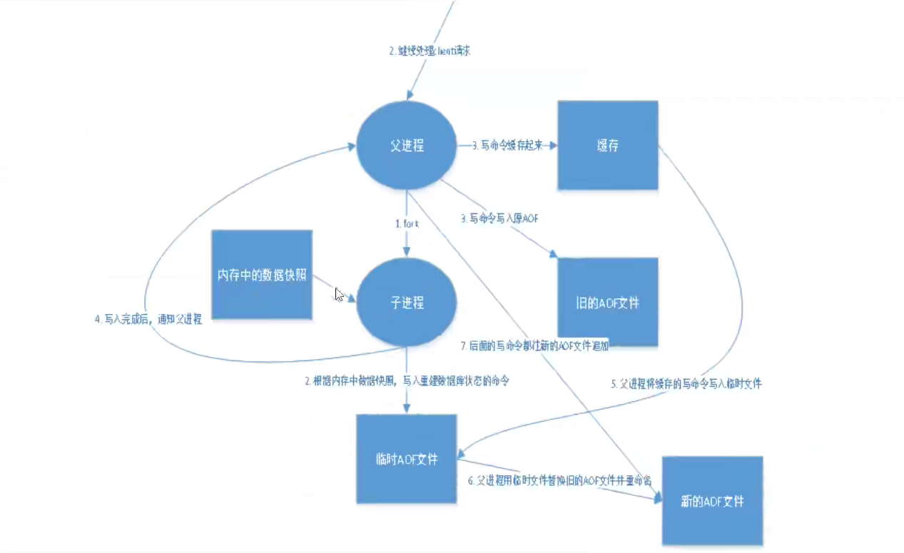

AOF 将所有命令都记录下来，恢复的时候把这些命令全部再执行一遍。

AOF 以日志的形式来记录每个写操作（不记录读操作），只允许追加文件但不可以改写文件。redis 在启动之初就会读取该文件重新构造数据，即 redis 重启的话就会根据日志文件的内容将写指令从前到后执行一次以完成数据的恢复工作。

AOF 保存的文件是 `appendonly.aof` 文件，默认是不开启的，需要手动进行配置，只需要将 append only 改为 yes，重启 redis 生效。如果 aof 文件有错误，redis 是无法启动的，需要对配置文件进行修复，redis 提供了一个工具 `redis-check-aof --fix`。

故意破坏 `appendonly.aof` 文件，输入 `redis-check-aof --fix appendonly.aof` 即可修复。

以下是 redis 配置文件中与 AOF 相关的内容。

```bash
############################## APPEND ONLY MODE ###############################

# AOF是另一种持久化模式，提供了更好的持久性。
# 例如，使用默认数据fsync策略（请参阅配置文件的后面部分），Redis可能会在服务器断电之类的重大事件中丢失一秒钟的写入，或者在Redis进程本身发生错误时丢失一次写入，但操作系统仍能正常运行。
# AOF和RDB持久性可以同时启用而不会出现问题。
appendonly no	# AOF默认不开启

# 默认aof持久化文件名为appendonly.aof
appendfilename "appendonly.aof"

# appendfsync always	# 每次修改都会同步，速度比较慢，消耗性能，最安全。
appendfsync everysec	# 每秒执行一次同步，也能会丢失这一秒的数据，其余二者的折中。
# appendfsync no		# 不执行，操作系统自己同步数据，速度最快。

# AOF文件持续增长而过大时，会fork出一条新进程来将文件重写（也是先写临时文件最后再rename），遍历新进程的内存中数据。
# 重写aof文件的操作，并没有读取旧的aof文件，这点和快照有点类似。
no-appendfsync-on-rewrite no	# 重写

# AOF采用文件追加方式，文件会越来越大，为避免出现此种情况，新增了重写机制。
# 当AOF文件的大小超过所设定的阈值时，Redis就会启动AOF文件的内容压缩，只保留可以恢复数据的最小指令集，可以使用命令bgrewriteaof。
# Redis会记录上次重写时的AOF大小，默认配置是当AOF文件大小是上次rewrite后大小的已被且文件大于64M的触发。
# AOF默认是文件的无限制追加，文件会越来越大，所以需要重写。
auto-aof-rewrite-percentage 100
auto-aof-rewrite-min-size 64mb		# 文件的最大容量
```

**AOF 的优点**

- 每一次修改都同步，文件的完整性更好；
- 每秒同步一次，可能会丢失一秒的数据；
- 从不同步，效率最高。

**AOF 的缺点**

- 相对于数据文件来说，AOF 远大于 RDB，修复的速度也比 RDB 慢；
- AOF 的运行效率也比 RDB 慢，所以 redis 默认的持久化配置时 RDB。

## 10.3、总结

1、RDB 持久化方式能够在指定的时间间隔内对你的数据进行快照存储

2、AOF 持久化方式记录每次对服务器写的操作，当服务器重启的时候会重新执行这些命令来恢复原始的数据，AOF 命令以 Redis 协议追加保存每次写的操作到文件末尾，Redis 还能对 AOF 文件进行后台重 写，使得 AOF 文件的体积不至于过大。

3、如果只做缓存的话，数据仅在服务器运行的时候存在，也可以不使用任何持久化。

4、同时开启两种持久化方式

- 在这种情况下，当 redis 重启的时候会优先载入 AOF 文件来恢复原始的数据，因为在通常情况下 AOF 文件保存的数据集要比 RDB 文件保存的数据集要完整。
- RDB 的数据不实时，同时使用两者时服务器重启也只会找 AOF 文件，那要不要只使用 AOF 呢？作者建议不要，因为 RDB 更适合用于备份数据库（AOF 在不断变化不好备份），快速重启，而且不会有 AOF 可能潜在的Bug，留着作为一个万一的手段。

5、性能建议

- 因为 RDB 文件只用作后备用途，建议只在 Slave 上持久化 RDB 文件，而且只要15分钟备份一次就够了，只保留 `save 900 1` 这条规则。
- 如果 Enable AOF ，好处是在最恶劣情况下也只会丢失不超过两秒数据，启动脚本较简单只load 自己的 AOF 文件就可以了，代价一是带来了持续的 IO，二是 AOF rewrite 的最后将 rewrite 过程中产 生的新数据写到新文件造成的阻塞几乎是不可避免的。只要硬盘许可，应该尽量减少 AOF rewrite 的频率，AOF 重写的基础大小默认值 64M 太小了，可以设到5G以上，默认超过原大小100%大小重 写可以改到适当的数值。
- 如果不Enable AOF ，仅靠 Master-Slave Repllcation 实现高可用性也可以，能省掉一大笔IO，也减少了 rewrite 时带来的系统波动。代价是如果 Master/Slave 同时倒掉（断电），会丢失十几分钟的数据， 启动脚本也要比较两个 Master/Slave 中的 RDB文件，载入较新的那个，微博就是这种架构。

# 11、Redis 发布订阅

Redis 发布订阅（pub/sub）是一种消息通信模式：发送者（pub）发送信息，订阅者（sub）接收信息，比如微信公众号，微博关注系统等。

Redis 客户端可以订阅任意数量的频道。

消息发送者->频道->消息订阅者

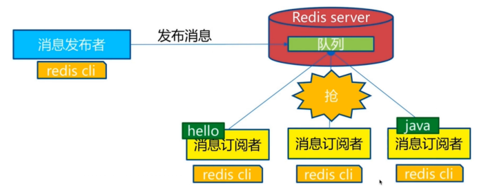

客户端 client2、client5、client1 订阅频道 channel1：

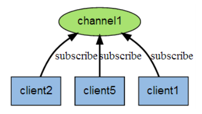

当有新消息通过 PUBLISH 命令发送给频道 channel1 时， 这个消息就会被发送给订阅它的三个客户端：

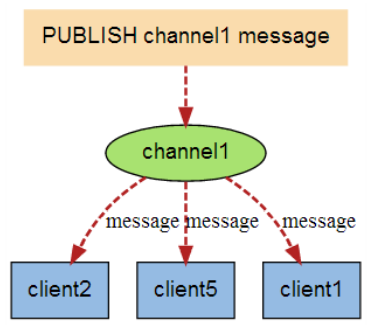

与订阅相关的操作

```bash
SUBSCRIBE channel[channels...]		# 订阅给定的一个或多个频道的信息
UNSUBSCRIBE channel[channels...]	# 取消订阅
PUBLISH channel message				# 将信息发送到指定的频道

PSUBSCRIBE pattern[patterns...]		# 订阅一个或多个符合给定模式的频道
PUNSUBSCRIBE pattern[patterns...]	# 退订所有给定模式的频道
PUBSUB subcommand argument[arguements...]	# 查看订阅与发布系统状态
```

```bash
# 订阅频道redisChat
127.0.0.1:6379> SUBSCRIBE redisChat
Reading messages... (press Ctrl-C to quit)
1) "subscribe"
2) "redisChat"
3) (integer) 1
```

```bash
# 重新打开一个redis客户端，在redisChat发布消息，订阅者会收到消息。
127.0.0.1:6379> PUBLISH redisChat "Hello,Redis"
(integer) 1
127.0.0.1:6379> PUBLISH redisChat "Hello，Kuangshen"
(integer) 1
# 订阅者的客户端会显示如下消息
1) "message"
2) "redisChat"
3) "Hello,Redis"
1) "message"
2) "redisChat"
3) "Hello，Kuangshen"
```

> Redis 是使用 C 语言实现的，通过分析 Redis 源码里的 pubsub.c 文件，可以了解发布和订阅机制的底层实现，籍此加深对 Redis 的理解。 

Redis 通过 PUBLISH 、SUBSCRIBE 和 PSUBSCRIBE 等命令实现发布和订阅功能。

通过 SUBSCRIBE 命令订阅某频道后，redis-server 里维护了一个字典，字典的键就是一个个 channel ，而字典的值则是一个链表，链表中保存了所有订阅这个 channel 的客户端。

SUBSCRIBE 命令的关键，就是将客户端添加到给定 channel 的订阅链表中。 

通过 PUBLISH 命令向订阅者发送消息，redis-server 会使用给定的频道作为键，在它所维护的 channel 字典中查找记录了订阅这个频道的所有客户端的链表，遍历这个链表，将消息发布给所有订阅者。

Pub/Sub 从字面上理解就是发布（Publish）与订阅（Subscribe），在 Redis 中，你可以设定对某一个 key 值进行消息发布及消息订阅，当一个 key 值上进行了消息发布后，所有订阅它的客户端都会收到相应的消息。这一功能最明显的用法就是用作实时消息系统，比如普通的即时聊天，群聊等功能。稍微复杂的场景会使用消息中间件MQ。

# 13、Redis 的主从复制

<font size=4 style="font-weight:bold;background:yellow;">什么是主从复制？</font>

- 主从复制，就是将一台 redis 服务器的数据，复制到其他的 Redis 服务器。前者称之为**主节点（master/leader）**，后者称为**从节点（slave/follower）**。
- **数据的复制是单向的，只能由主节点到从节点，master 以写为主，slave 以读为主。**

- **在默认情况下，每台 redis 服务器都是主节点**，且一个主节点可以有多个从节点（或没有从节点），但一个从节点只有一个主节点。

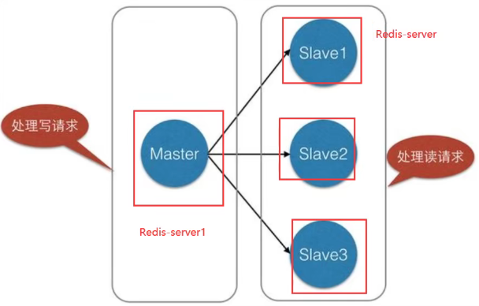

<font size=4 style="font-weight:bold;background:yellow;">主从复制有哪些作用？</font>

- 数据冗余：主从复制实现了数据的热备份，是持久化之外的一种数据冗余方式。

- 故障恢复：当主节点出现问题时，从节点可以继续提供服务，实现快速的故障恢复；实际上是一种服务的冗余。
- 负载均衡：在**主从复制**的基础上，配合**读写分离**，可以由主节点提供写服务，由从节点提供读服务（应用在写数据时连接主节点，读数据时连接从节点），可以分担服务器负载，尤其是在**写少读多**的情景下，通过多个节点分担读负载，可以大大提高 redis 服务器的并发量。

- 高可用（集群）基石：除上述作用外，主从复制还是哨兵和集群能够实施的基础，因此说主从复制是 redis 高可用的基石。

> 电商网站中的商品，一般都是一次上传，无数次浏览的，也是 ”写少读多“。
>
> 主从复制，读写分离！在架构中经常使用，最低配要求一主二从。

<font size=4 style="font-weight:bold;background:yellow;">想要将 redis 运用于工程项目中，为什么不能只使用一台 redis？</font>

> 在真实的项目中不可能使用单机 redis，在公司中必须使用主从复制。

- 从结构上，单个 redis 服务器会发生单点故障；一台服务器需要处理所有的请求负载，压力太大；
- 从容量上，单个 redis 服务器的内存容量有限，就算一台 redis 服务器的容量为256G，也不能将所有内存用作 redis 储存内存，一般来说，**单台 redis 的最大使用内存不应该超过20G。**

## 13.1、环境配置

```bash
> info replication	# 查看当前库信息
# Replicaiton
role:master			# 角色 master
connected_slaves:0	# 从机数量 0
```

复制三个配置文件，然后修改对应的信息。

1、端口	2、pid 名字	3、log 日志名	4、dump.rdb 的名字、

修改完毕后启动三个 redis 服务器，可以通过进程信息查看。

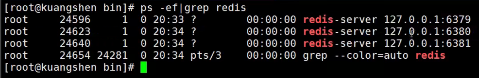

一主二从：主 79；从 80 81

```bash
> SLAVEOF 127.0.0.1 6379	# 找自己的主机
OK
```

真实的主从配置应该在配置文件中配置，这样的话配置就是永久的。这里使用命令配置，是暂时的。

主机可以写，从机不能写；主机中的所有数据都会自动的被从机保存。在从机中无法写数据：

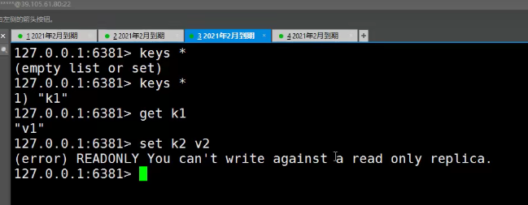

主机断了，就无法写数据了，从机依然连接在主机上；这个时候主机回来了从机依然可以直接获取到主机中新写入的信息。

如果使用命令行配置的主从，如果从机重启了就会再次变为主机；只要变为从机，数据立即就会从主机中获取回来！

<font size=4 style="font-weight:bold;background:yellow;">复制原理</font>

slave 启动成功连接到 master 后会发送一个 sync 同步命令，master 接到命令后会启动后台的存盘进程，同时收集所有接收到的用于修改数据的命令，在后台进程执行完毕后，master 将传送整个数据文件到 slave 中，并且完成一次完全同步。

全量复制：slave 服务器在接收到数据库文件后，将其存盘并加载到内存中。

增量复制：master 继续将新的所有收集到的修改命令依次传给 slave，完成同步。

只要是重新连接到 master，将会自动执行一次全量复制，数据一定可以在从机中看到。

## 13.2、宕机后主机的配置

毛毛虫🐛，层层链路，上一个 master 连接下一个 slave，这个时候也能完成主从复制，79 set 之后80和81也能 get 到，80仍是从节点，无法 set。

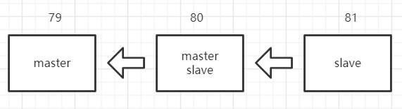

> 那么层层链路的结构下，如果 master 断开的话，可以选择出新的 master 吗？

可以手动选择新的 master，输入以下指令后，当前 slave 成为新的 master，就算原有的 master 修复了也不会改变，可以形容为 ”谋朝篡位“！需要重新手动配置。

```bash
SLAVEOF no one	# 使自己成为 master
```

## 13.3、哨兵模式

> 主从切换技术：当主机宕机后，需要手动把一台从服务器切换为主服务器，需要人工干预，费时费力，还会造成一段时间内的服务不可用。这种方式不可行，更多的时候优先考虑的是哨兵模式。

<font size=4 style="font-weight:bold;background:yellow;">什么是哨兵模式？</font>

Redis 从2.8开始正式提供 Sentinel（哨兵）架构来解决主从切换的问题（自动版的谋权篡位），可以监控后台主机是否出现故障，如果出现故障了可以根据投票数自动的将从库转换为主库。

哨兵模式是一种特殊的模式，redis 提供了哨兵的命令，哨兵是一个独立的进程，作为进程，哨兵可以独立运行。

<font size=4 style="font-weight:bold;background:yellow;">原理</font>

哨兵通过发送命令，等待 redis 服务器响应，从而对多个 redis 实例进行监控。

这里的哨兵有两个作用

- 通过发送命令，让 redis 服务器返回其运行状态，包括 master 和 slaver，进行监控。
- 当哨兵检测到 master 宕机，会自动将 slaver 切换为 master，然后通过发布订阅的模式通知其他从服务器修改配置文件，切换主机。

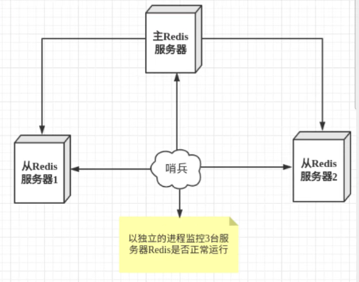

一个哨兵进程对 redis 服务器进行监控，可能会出现问题，为此可以使用多个哨兵进行监控；各个哨兵之间还会互相监控，这样就形成了多哨兵模式。

以下图为例，假设主服务器宕机，哨兵1先检测到这个结果，系统不会马上重新选举，可能仅仅是哨兵1主观认为服务器不可用，这个现象叫做**主观下线**；当后边的哨兵也检测到主服务器不可用并且数量达到一定值时，哨兵之间就会进行一次投票，投票的结果由一个哨兵发起，进行 failover 故障转移操作。切换成功后，就会通过发布订阅模式，让各个哨兵把自己监控的从服务器切换主机，这个现象称之为**客观下线**。

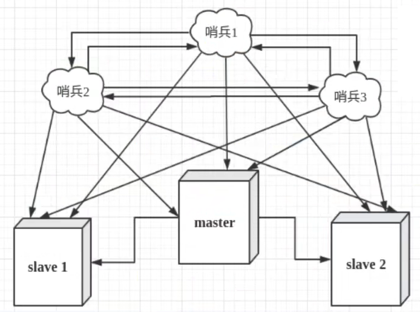

```bash
# 1.新建sentinel.conf
# 最后的1代表主机挂了会投票看看让谁接替成为主机，票数最多的就会成为主机!
sentinel monitor myredis 127.0.0.1 6379 1
# 2.启动哨兵
redis-sentinel kconfig/sentinel.config
# 3.如果master出现问题了，这时候就会在从机中随机选择一个服务器（有一个投票算法）！
# 4.如果master此时恢复了，只能归并到新的master下作为slaver！
```

<font size=4 style="font-weight:bold;background:yellow;">哨兵模式的优点</font>

- 哨兵集群，基于主从复制模式，拥有主从配置的所有优点；
- 主从可以切换，故障可以转移，系统的可用性更好；
- 哨兵模式就是主从模式的升级，从手动到自动，更加健壮！

<font size=4 style="font-weight:bold;background:yellow;">哨兵模式的缺点</font>

- redis 在线扩容比较困难，集群容量一旦到达上限，在线扩容就会十分麻烦；
- 实现哨兵模式的配置很麻烦，有很多种选择。

哨兵模式的全部配置

```bash
# Example sentinel.conf

# 哨兵sentinel实例运行的端口 默认26379
port 26379		# 如果有哨兵集群，还需要配置每个哨兵的端口。

# 哨兵sentinel的工作目录
dir /tmp

# 哨兵sentinel监控的redis主节点的 ip port
# master-name 可以自己命名的主节点名字 只能由字母A-z、数字0-9 、这三个字符".-_"组成。
# quorum 配置多少个sentinel哨兵统一认为master主节点失联 那么这时客观上认为主节点失联了
# sentinel monitor <master-name> <ip> <redis-port> <quorum>
sentinel monitor mymaster 127.0.0.1 6379 2

# 当在Redis实例中开启了requirepass foobared 授权密码 这样所有连接Redis实例的客户端都要提供密码
# 设置哨兵sentinel 连接主从的密码 注意必须为主从设置一样的验证密码
# sentinel auth-pass <master-name> <password>
sentinel auth-pass mymaster MySUPER--secret-0123passw0rd

# 指定多少毫秒之后 主节点没有应答哨兵sentinel 此时 哨兵主观上认为主节点下线 默认30秒
# sentinel down-after-milliseconds <master-name> <milliseconds>
sentinel down-after-milliseconds mymaster 30000

# 这个配置项指定了在发生failover主备切换时最多可以有多少个slave同时对新的master进行同步，
# 这个数字越小，完成failover所需的时间就越长，
# 但是如果这个数字越大，就意味着越 多的slave因为replication而不可用。
# 可以通过将这个值设为 1 来保证每次只有一个slave 处于不能处理命令请求的状态。
# sentinel parallel-syncs <master-name> <numslaves>
sentinel parallel-syncs mymaster 1

# 故障转移的超时时间 failover-timeout 可以用在以下这些方面：
# 1.同一个sentinel对同一个master两次failover之间的间隔时间。
# 2.当一个slave从一个错误的master那里同步数据开始计算时间。直到slave被纠正为向正确的master那里同步数据时。
# 3.当想要取消一个正在进行的failover所需要的时间。
# 4.当进行failover时，配置所有slaves指向新的master所需的最大时间。不过，即使过了这个超时，slaves依然会被正确配置为指向master，但是就不按parallel-syncs所配置的规则来了
# 默认三分钟
# sentinel failover-timeout <master-name> <milliseconds>
sentinel failover-timeout mymaster 180000

# SCRIPTS EXECUTION
# 配置当某一事件发生时所需要执行的脚本，可以通过脚本来通知管理员，例如当系统运行不正常时发邮件通知相关人员。
# 对于脚本的运行结果有以下规则：
# 若脚本执行后返回1，那么该脚本稍后将会被再次执行，重复次数目前默认为10
# 若脚本执行后返回2，或者比2更高的一个返回值，脚本将不会重复执行。
# 如果脚本在执行过程中由于收到系统中断信号被终止了，则同返回值为1时的行为相同。
# 一个脚本的最大执行时间为60s，如果超过这个时间，脚本将会被一个SIGKILL信号终止，之后重新执行。

# 通知型脚本:当sentinel有任何警告级别的事件发生时（比如说redis实例的主观失效和客观失效等等），将会去调用这个脚本，这时这个脚本应该通过邮件，SMS等方式去通知系统管理员关于系统不正常运行的信息。调用该脚本时，将传给脚本两个参数，一个是事件的类型，一个是事件的描述。如果sentinel.conf配置文件中配置了这个脚本路径，那么必须保证这个脚本存在于这个路径，并且是可执行的，否则sentinel无法正常启动成功。
# 通知脚本（shell编程）
# sentinel notification-script <master-name> <script-path>
sentinel notification-script mymaster /var/redis/notify.sh

# 客户端重新配置主节点参数脚本
# 当一个master由于failover而发生改变时，这个脚本将会被调用，通知相关的客户端关于master地址已经发生改变的信息。
# 以下参数将会在调用脚本时传给脚本:
# <master-name> <role> <state> <from-ip> <from-port> <to-ip> <to-port>
# 目前<state>总是“failover”,
# <role>是“leader”或者“observer”中的一个。
# 参数 from-ip, from-port, to-ip, to-port是用来和旧的master和新的master(即旧的slave)通信的
# 这个脚本应该是通用的，能被多次调用，不是针对性的。
# sentinel client-reconfig-script <master-name> <script-path>
sentinel client-reconfig-script mymaster /var/redis/reconfig.sh		# 一般都是运维配置
```

# 14、缓存问题

> Redis 缓存的使用，极大地提升了应用程序的性能和效率，特别是数值查询方面。同时，Redis 也带来了一些问题，其中，最要害的就是数据的一致性问题，严格意义上讲，这个问题无解。如果对数据一致性要求很高，就不能使用缓存。
>
> 另外一些典型的问题就是缓存穿透，缓存雪崩和缓存击穿。目前业界也都有比较流行的解决方案。

## 14.1、缓存读写问题

<font size=4 style="font-weight:bold;background:yellow;">正常流程</font>

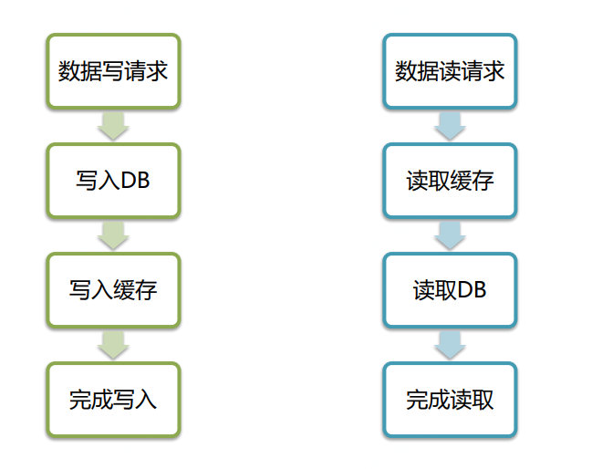

<font size=4 style="font-weight:bold;background:yellow;">DB 出现故障</font>

如果在向 DB 写入的过程中出现故障，会将数据先写入队列，然后写入缓存，等待 DB 恢复后再恢复写入。

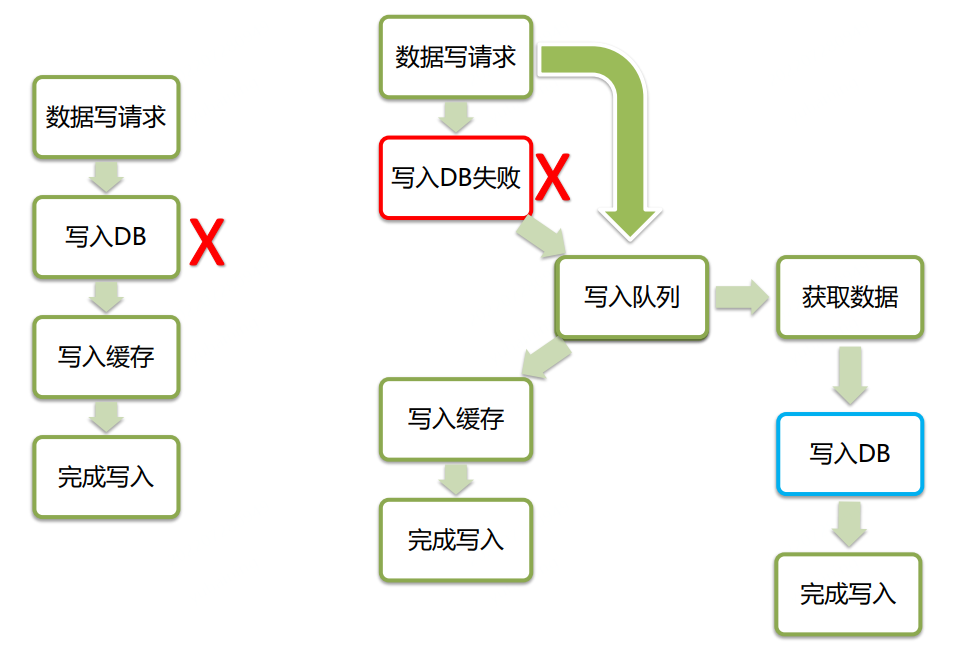

<font size=4 style="font-weight:bold;background:yellow;">缓存不一致</font>

**对于缓存 cache：**

- cache 存在则 cache 与 DB 相同；
- cache 不存在，则 DB 中最新。

**出现以下场景的解决方案：**

- 随机选出一些数据，多次重试；
- 将 key 的过期时间调短；
- 使用队列、版本号等其他方式。

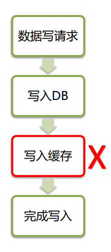

<font size=4 style="font-weight:bold;background:yellow;">cache 读取问题</font>

**原因**

- 缓存无效或不可访问；
- 热点的 key 过期了；
- 访问到了无效的 key。

<font size=4 style="font-weight:bold;background:yellow;">解决方案</font>

- 业务层熔断/限流，保护 DB；
- 缓存多副本，设置多级缓存，采用多机房的方式容灾；
- 在 key 上进行优化，设置 base + 随机时间戳，对于不变的 key 可以设置较长时间戳。
- 在处理无效的 key 上：
  - 对非法的 key 予以特殊标志；
  - 在请求入口进行拦截；
  - 使用 Bloomfilter 过滤无效的 key。

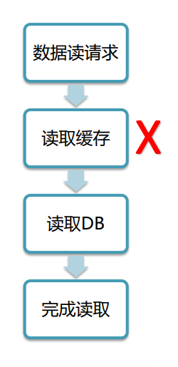

## 14.1、缓存穿透

<font size=4 style="font-weight:bold;background:yellow;">缓存穿透的概念</font>

用户想要查询一个数据，发现 redis 内存数据库没有，也就是缓存没有命中，于是向持久层数据库查询。发现也没有，于是本次查询失败。当用户很多的时候，缓存都没有命中（比如秒杀），于是都去请求了持久层数据库。这会给持久层数据库造成很大的压力，这时候就相当于出现了缓存穿透。

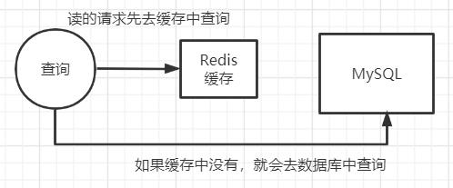

<font size=4 style="font-weight:bold;background:yellow;">解决方案</font>

1、布隆过滤器：布隆过滤器是一种数据结构，对所有可能查询的参数以 hash 形式存储，在控制层先进行校验，不符合则丢弃，从而减小了对底层存储系统的查询压力。（导个包即可）

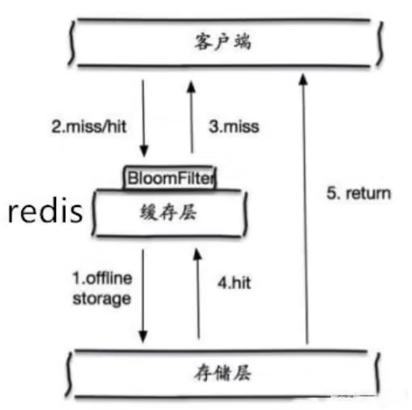

2、缓存空对象

- 概念：当存储层不命中后，即使返回的空对象也将其缓存起来，同时会设置一个过期时间，之后再访问这个数据将会从缓存中获取，保护了后端数据源。

- 存在的问题
  - 如果空值能够被缓存起来，这就意味着缓存需要更多的空间存储更多的键，因为这当中可能会有很多的空值的键；
  - 即使对空值设置了过期时间，还是会存在缓存层和存储层的数据会有一段时间窗口的不一致，这对于需要保持一致性的业务会有影响。

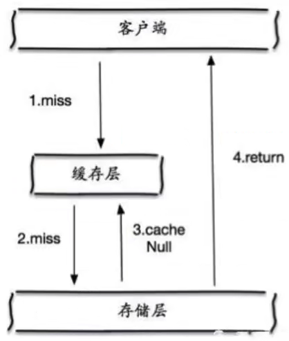

## 14.2、缓存击穿

> 要注意缓存穿透和缓存击穿的区别

<font size=4 style="font-weight:bold;background:yellow;">缓存击穿的概念</font>

查得太多太频繁，缓存过期。

缓存击穿，是指一个 key 非常热点，在不停的扛着大并发，大并发集中对这一个点进行访问，当这个 key 在失效的瞬间，持续的大并发就穿破缓存，直接请求数据库，就像在一 个屏障上凿开了一个洞。（如微博服务器宕机）

当某个 key 在过期的瞬间，有大量的请求并发访问，这类数据一般是热点数据，由于缓存过期，会同时访问数据库来查询最新数据，并且回写缓存，会导使数据库瞬间压力过大。

<font size=4 style="font-weight:bold;background:yellow;">解决方案</font>

- 设置热点数据永不过期

  从缓存层面来看，没有设置过期时间，所以不会出现热点 key 过期后产生的问题。 

- 加互斥锁 

  分布式锁：使用分布式锁，保证对于每个 key 同一个时间只有一个线程去查询后端服务，其他线程没有获得分布式锁的权限，会排在后边等待。这种方式将高并发的压力转移到了分布式锁，因此对分布式锁的考验很大。

## 14.3、缓存雪崩

<font size=4 style="font-weight:bold;background:yellow;">缓存雪崩的概念</font>

缓存雪崩，是指在某一个时间段内，缓存集中过期失效，redis 宕机！

比如双十一零点，很快就会迎来一波抢购，这波商品时间比较集中的放入了缓存，假设缓存时间为一小时，那么到了凌晨一点钟的时候，这批商品的缓存就都过期了。对这批商品的访问查询，就都落到了数据库上。对数据库会产生周期性的压力波峰。所有的请求都会到达存储层，存储层的调用会爆增，导致存储层也挂掉。

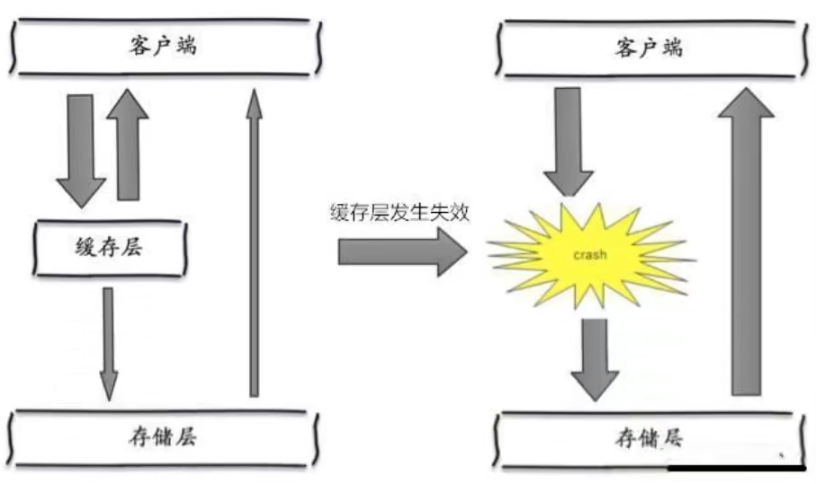

其实集中过期，倒不是非常致命，比较致命的缓存雪崩，是缓存服务器某个节点宕机或断网。因为自然形成的缓存雪崩，一定是在某个时间段集中创建缓存，这个时候，数据库也是可以顶住压力的。无非就是对数据库产生周期性的压力而已。而缓存服务节点的宕机，对数据库服务器造成的压力是不可预知的，很有可能瞬间就把数据库压垮。

双十一：停掉一些服务，保证主要服务可用。（比如关闭退款功能）

## 14.4、解决方案

**redis 高可用**

这个思想的含义是，既然 redis 有可能挂掉，那我多增设几台 redis，这样一台挂掉之后其他的还可以继续工作，其实就是搭建的集群。

**限流降级**

这个解决方案的思想是，在缓存失效后，通过加锁或者队列来控制读数据库写缓存的线程数量。比如对某个 key 只允许一个线程查询数据和写缓存，其他线程等待。

**数据预热**

数据加热的含义就是在正式部署之前，我先把可能的数据先预先访问一遍，这样部分可能大量访问的数据就会加载到缓存中。在即将发生大并发访问前手动触发加载缓存不同的 key，设置不同的过期时间，让缓存失效的时间点尽量均匀。

# 15、Redis 的架构

**Redis 常见架构有三种：RedisCluster、RedisProxy、RedisClientProxy。**

<font size=4 style="font-weight:bold;background:yellow;">RedisCluster</font>

**原理**

- 按 slot 将数据分成 16384 个 slot；
- 每个 Redis 分片负责一部分 slot ；
- Redis 分片之间通过 Gossip 协议进行通讯；
- 每个节点有全部 slot 拓扑分布。

 **优势**

- 官方出品并提供集群管理工具；
- 支持动态扩缩容。

**劣势**

- Key 迁移是阻塞，效率低下;
- Redis 节点存储 Slot-Key 关系占用较多内存。

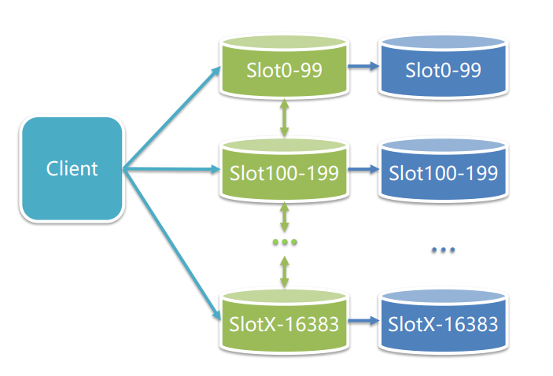

<font size=4 style="font-weight:bold;background:yellow;">RedisProxy</font>

**原理**：Client 向 Proxy 发送请求，Proxy 解析根据路由向目标 Redis 分发请求，最后将 Redis 直接结果返回给Client。

**优势**

- 业务访问更便捷
- 节点伸缩更简单
- Redis 分片逻辑与 Client 访问逻辑解耦

**劣势**：Proxy 中转存在性能损耗，比如 Redis 进行查询并返回结果只需要 0.1s，但是数据传送到 redis 还需要一定的时间。

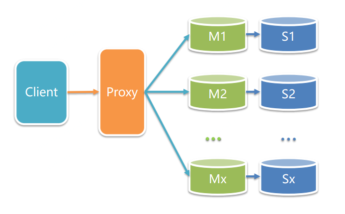

<font size=4 style="font-weight:bold;background:yellow;">RedisClientProxy</font>

**原理**：把 Proxy 直接放到 Client 上，Client 存储 Key 和分片的路由表， 访问 Key 前会通过路由表查询 Key 所在的目标分片。

**优势**

- Client 直接访问 Redis，性能高；（解决了 RedisProxy 中转的性能损耗问题）
- 支持动态扩缩容。

**劣势**：需要 SDK 支持。

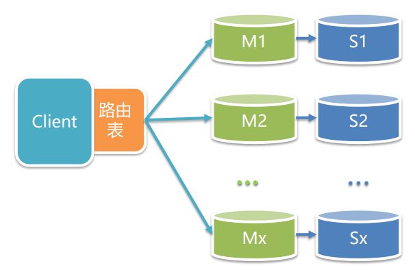

<font size=4 style="font-weight:bold;background:yellow;">三种架构方式的总结</font>

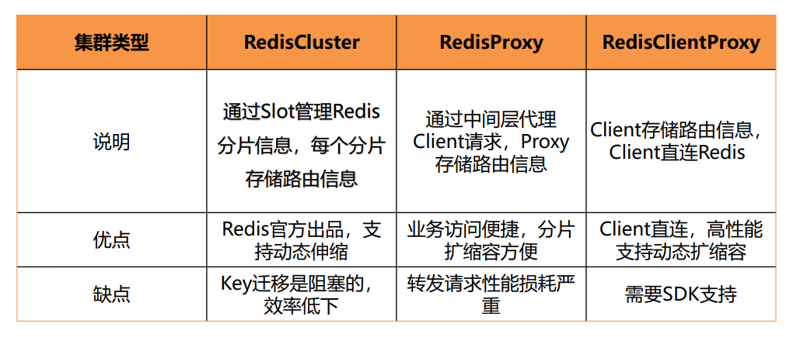

<font size=4 style="font-weight:bold;background:yellow;">Qunar Redis</font>

使用 ClientProxy 模式，依赖 Zookeeper 和配置中心，分片使用 Sentinel 集群保证高可用。

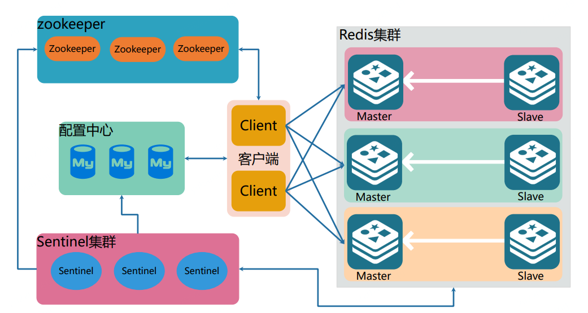

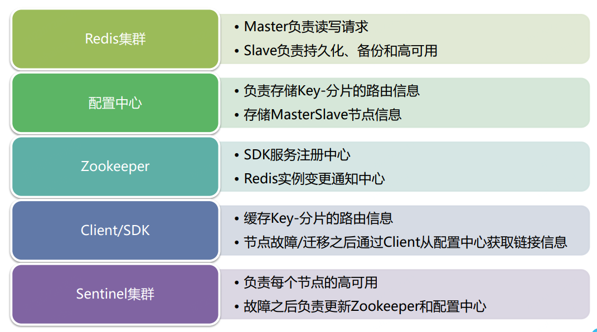

# 16、Redis 面试题

## 16.1、Redis是什么？简述它的优缺点？

Redis本质上是一个Key-Value类型的内存数据库，很像Memcached，整个数据库加载在内存当中操作，定期通过异步操作把数据库中的数据flush到硬盘上进行保存。

因为是纯内存操作，Redis的性能非常出色，每秒可以处理超过 10万次读写操作，是已知性能最快的Key-Value 数据库。

**优点**：

- 读写性能极高， Redis能读的速度是110000次/s，写的速度是81000次/s。
- 支持数据持久化，支持AOF和RDB两种持久化方式。
- 支持事务， Redis的所有操作都是原子性的，意思就是要么成功执行要么失败完全不执行。单个操作是原子性的。多个操作也支持事务，即原子性，通过MULTI和EXEC指令包起来。
- 数据结构丰富，除了支持string类型的value外，还支持hash、set、zset、list等数据结构。
- 支持主从复制，主机会自动将数据同步到从机，可以进行读写分离。
- 丰富的特性 – Redis还支持 publish/subscribe， 通知， key 过期等特性。

**缺点**：

- 数据库容量受到物理内存的限制，不能用作海量数据的高性能读写，因此Redis适合的场景主要局限在较小数据量的高性能操作和运算上。

## 16.2、Redis 为什么这么快？

- 内存存储：Redis是使用内存(in-memeroy)存储，没有磁盘IO上的开销。数据存在内存中，类似于 HashMap，HashMap 的优势就是查找和操作的时间复杂度都是O(1)。

- 单线程实现（Redis 6.0以前）：Redis使用单个线程处理请求，避免了多个线程之间线程切换和锁资源争用的开销。注意：单线程是指的是在核心网络模型中，网络请求模块使用一个线程来处理，即一个线程处理所有网络请求。

- 非阻塞IO：Redis使用多路复用IO技术，将epoll作为I/O多路复用技术的实现，再加上Redis自身的事件处理模型将epoll中的连接、读写、关闭都转换为事件，不在网络I/O上浪费过多的时间。

- 优化的数据结构：Redis有诸多可以直接应用的优化数据结构的实现，应用层可以直接使用原生的数据结构提升性能。

- 使用底层模型不同：Redis直接自己构建了 VM (虚拟内存)机制 ，因为一般的系统调用系统函数的话，会浪费一定的时间去移动和请求。

  > Redis的VM(虚拟内存)机制就是暂时把不经常访问的数据(冷数据)从内存交换到磁盘中，从而腾出宝贵的内存空间用于其它需要访问的数据(热数据)。通过VM功能可以实现冷热数据分离，使热数据仍在内存中、冷数据保存到磁盘。这样就可以避免因为内存不足而造成访问速度下降的问题。
  >
  > Redis提高数据库容量的办法有两种：一种是可以将数据分割到多个RedisServer上；另一种是使用虚拟内存把那些不经常访问的数据交换到磁盘上。**需要特别注意的是Redis并没有使用OS提供的Swap，而是自己实现。**

## 16.3、Redis 相比 Memcached 有哪些优势？

- 数据类型：Memcached所有的值均是简单的字符串，Redis支持更为丰富的数据类型，支持string(字符串)，list(列表)，Set(集合)、Sorted Set(有序集合)、Hash(哈希)等。

- 持久化：Redis支持数据落地持久化存储，可以将内存中的数据保持在磁盘中，重启的时候可以再次加载进行使用。Memcached不支持数据持久存储 。

- 集群模式：Redis提供主从同步机制，以及 Cluster集群部署能力，能够提供高可用服务。Memcached没有原生的集群模式，需要依靠客户端来实现往集群中分片写入数据

- 性能对比：Redis的速度比Memcached快很多。

- 网络IO模型：Redis使用单线程的多路 IO 复用模型，Memcached使用多线程的非阻塞IO模式。

- Redis支持服务器端的数据操作：Redis相比Memcached来说，拥有更多的数据结构和并支持更丰富的数据操作，通常在Memcached里，你需要将数据拿到客户端来进行类似的修改再set回去。

  这大大增加了网络IO的次数和数据体积。在Redis中，这些复杂的操作通常和一般的GET/SET一样高效。所以，如果需要缓存能够支持更复杂的结构和操作，那么Redis会是不错的选择。

## 16.4、Redis的常用场景有哪些?

**1、缓存**

缓存现在几乎是所有中大型网站都在用的必杀技，合理的利用缓存不仅能够提升网站访问速度，还能大大降低数据库的压力。Redis提供了键过期功能，也提供了灵活的键淘汰策略，所以，现在Redis用在缓存的场合非常多。

**2、排行榜**

很多网站都有排行榜应用的，如京东的月度销量榜单、商品按时间的上新排行榜等。Redis提供的有序集合数据类构能实现各种复杂的排行榜应用。

**3、计数器**

什么是计数器，如电商网站商品的浏览量、视频网站视频的播放数等。为了保证数据实时效，每次浏览都得给+1，并发量高时如果每次都请求数据库操作无疑是种挑战和压力。Redis提供的incr命令来实现计数器功能，内存操作，性能非常好，非常适用于这些计数场景。

**4、分布式会话**

集群模式下，在应用不多的情况下一般使用容器自带的session复制功能就能满足，当应用增多相对复杂的系统中，一般都会搭建以Redis等内存数据库为中心的session服务，session不再由容器管理，而是由session服务及内存数据库管理。

**5、分布式锁**

在很多互联网公司中都使用了分布式技术，分布式技术带来的技术挑战是对同一个资源的并发访问，如全局ID、减库存、秒杀等场景，并发量不大的场景可以使用数据库的悲观锁、乐观锁来实现，但在并发量高的场合中，利用数据库锁来控制资源的并发访问是不太理想的，大大影响了数据库的性能。可以利用Redis的setnx功能来编写分布式的锁，如果设置返回1说明获取锁成功，否则获取锁失败，实际应用中要考虑的细节要更多。

**6、 社交网络**

点赞、踩、关注/被关注、共同好友等是社交网站的基本功能，社交网站的访问量通常来说比较大，而且传统的关系数据库类型不适合存储这种类型的数据，Redis提供的哈希、集合等数据结构能很方便的的实现这些功能。如在微博中的共同好友，通过Redis的set能够很方便得出。

**7、最新列表**

Redis列表结构，LPUSH可以在列表头部插入一个内容ID作为关键字，LTRIM可用来限制列表的数量，这样列表永远为N个ID，无需查询最新的列表，直接根据ID去到对应的内容页即可。

**8、消息系统**

消息队列是大型网站必用中间件，如ActiveMQ、RabbitMQ、Kafka等流行的消息队列中间件，主要用于业务解耦、流量削峰及异步处理实时性低的业务。Redis提供了发布/订阅及阻塞队列功能，能实现一个简单的消息队列系统。另外，这个不能和专业的消息中间件相比。

## 16.5、 Redis 的数据类型有哪些？

有五种常用数据类型：String、Hash、Set、List、SortedSet。以及三种特殊的数据类型：Bitmap、HyperLogLog、Geospatial ，其中HyperLogLog、Bitmap的底层都是 String 数据类型，Geospatial 的底层是 Sorted Set 数据类型。

**五种常用的数据类型**：

1、String：String是最常用的一种数据类型，普通的key- value 存储都可以归为此类。其中Value既可以是数字也可以是字符串。使用场景：常规key-value缓存应用。常规计数: 微博数， 粉丝数。

2、Hash：Hash 是一个键值(key => value)对集合。Redishash 是一个 string 类型的 field 和 value 的映射表，hash 特别适合用于存储对象，并且可以像数据库中update一个属性一样只修改某一项属性值。

3、Set：Set是一个无序的天然去重的集合，即Key-Set。此外还提供了交集、并集等一系列直接操作集合的方法，对于求共同好友、共同关注什么的功能实现特别方便。

4、List：List是一个有序可重复的集合，其遵循FIFO的原则，底层是依赖双向链表实现的，因此支持正向、反向双重查找。通过List，我们可以很方面的获得类似于最新回复这类的功能实现。

5、SortedSet：类似于java中的TreeSet，是Set的可排序版。此外还支持优先级排序，维护了一个score的参数来实现。适用于排行榜和带权重的消息队列等场景。

**三种特殊的数据类型**：

1、Bitmap：位图，Bitmap想象成一个以位为单位数组，数组中的每个单元只能存0或者1，数组的下标在Bitmap中叫做偏移量。使用Bitmap实现统计功能，更省空间。如果只需要统计数据的二值状态，例如商品有没有、用户在不在等，就可以使用 Bitmap，因为它只用一个 bit 位就能表示 0 或 1。

2、Hyperloglog。HyperLogLog 是一种用于统计基数的数据集合类型，HyperLogLog 的优点是，在输入元素的数量或者体积非常非常大

时，计算基数所需的空间总是固定 的、并且是很小的。每个 HyperLogLog 键只需要花费 12 KB 内存，就可以计算接近 2^64 个不同元素的基 数。

场景：统计网页的UV（即Unique Visitor，不重复访客，一个人访问某个网站多次，但是还是只计算为一次）。

要注意，HyperLogLog 的统计规则是基于概率完成的，所以它给出的统计结果是有一定误差的，标准误算率是 0.81%。

3、Geospatial ：主要用于存储地理位置信息，并对存储的信息进行操作，适用场景如朋友的定位、附近的人、打车距离计算等。

## 16.6、Redis 为何选择单线程？

在Redisv6.0以前，Redis的核心网络模型选择用单线程来实现。先来看下官方的回答：

> It's not very frequent that CPU becomes your bottleneck with Redis， as usually Redisis either memory or network bound. For instance， using pipelining Redisrunning on an average Linux system can deliver even 1 million requests per second， so if your application mainly uses O(N) or O(log(N)) commands， it is hardly going to use too much CPU.

核心意思就是，对于一个 DB 来说，CPU 通常不会是瓶颈，因为大多数请求不会是 CPU 密集型的，而是 I/O 密集型。

具体到 Redis的话，如果不考虑 RDB/AOF 等持久化方案，Redis是完全的纯内存操作，执行速度是非常快的，因此这部分操作通常不会是性能瓶颈，Redis真正的性能瓶颈在于网络 I/O，也就是客户端和服务端之间的网络传输延迟，因此 Redis选择了单线程的 I/O 多路复用来实现它的核心网络模型。

实际上更加具体的选择单线程的原因如下：

- 避免过多的上下文切换开销：如果是单线程则可以规避进程内频繁的线程切换开销，因为程序始终运行在进程中单个线程内，没有多线程切换的场景。
- 避免同步机制的开销：如果 Redis选择多线程模型，又因为 Redis是一个数据库，那么势必涉及到底层数据同步的问题，则必然会引入某些同步机制，比如锁，而我们知道 Redis不仅仅提供了简单的 key-value 数据结构，还有 list、set 和 hash 等等其他丰富的数据结构，而不同的数据结构对同步访问的加锁粒度又不尽相同，可能会导致在操作数据过程中带来很多加锁解锁的开销，增加程序复杂度的同时还会降低性能。
- 简单可维护：如果 Redis使用多线程模式，那么所有的底层数据结构都必须实现成线程安全的，这无疑又使得 Redis的实现变得更加复杂。

总而言之，Redis选择单线程可以说是多方博弈之后的一种权衡：在保证足够的性能表现之下，使用单线程保持代码的简单和可维护性。

## 16.7、Redis 真的是单线程？

讨论 这个问题前，先看下 Redis的版本中两个重要的节点：

1. Redis 4.0（引入多线程处理异步任务）
2. Redis 6.0（正式在网络模型中实现 I/O 多线程）

所以，网络上说的Redis是单线程，通常是指在Redis 6.0之前，其核心网络模型使用的是单线程；而Redis的异步任务使用的仍是多线程。

> Redis在 4.0 版本的时候就已经引入了的多线程来做一些异步操作，此举主要针对的是那些非常耗时的命令，通过将这些命令的执行进行异步化，避免阻塞单线程的事件循环。
>
> 在 Redis 4.0 之后增加了一些的非阻塞命令如 `UNLINK`、`FLUSHALL ASYNC`、`FLUSHDB ASYNC`。

## 16.8、Redis v6.0 为何引入多线程？

很简单，就是 Redis的网络 I/O 瓶颈已经越来越明显了。

随着互联网的飞速发展，互联网业务系统所要处理的线上流量越来越大，Redis的单线程模式会导致系统消耗很多 CPU 时间在网络 I/O 上从而降低吞吐量，要提升 Redis的性能有两个方向：

- 优化网络 I/O 模块
- 提高机器内存读写的速度

后者依赖于硬件的发展，暂时无解。所以只能从前者下手，网络 I/O 的优化又可以分为两个方向：

- 零拷贝技术或者 DPDK 技术
- 利用多核优势

零拷贝技术有其局限性，无法完全适配 Redis这一类复杂的网络 I/O 场景，更多网络 I/O 对 CPU 时间的消耗和 Linux 零拷贝技术。而 DPDK 技术通过旁路网卡 I/O 绕过内核协议栈的方式又太过于复杂以及需要内核甚至是硬件的支持。

因此，利用多核优势成为了优化网络 I/O 性价比最高的方案。

## 16.9、Redis 过期键的删除策略？

**Redis 的过期删除策略就是：惰性删除和定期删除两种策略配合使用。**

**惰性删除**：Redis的惰性删除策略由`db.c/expireIfNeeded`函数实现，所有键读写命令执行之前都会调用 `expireIfNeeded`函数对其进行检查，如果过期，则删除该键，然后执行键不存在的操作；未过期则不作操作，继续执行原有的命令。

**定期删除**：由 `Redis.c/activeExpireCycle` 函数实现，函数以一定的频率运行，每次运行时，都从一定数量的数据库中取出一定数量的随机键进行检查，并删除其中的过期键。

附：删除 key 常见的三种处理方式。

**1、定时删除**

在设置某个key 的过期时间同时，我们创建一个定时器，让定时器在该过期时间到来时，立即执行对其进行删除的操作。

优点：定时删除对内存是最友好的，能够保存内存的key一旦过期就能立即从内存中删除。

缺点：对CPU最不友好，在过期键比较多的时候，删除过期键会占用一部分 CPU 时间，对服务器的响应时间和吞吐量造成影响。

**2、惰性删除**

设置该key 过期时间后，我们不去管它，当需要该key时，我们在检查其是否过期，如果过期，我们就删掉它，反之返回该key。

优点：对 CPU友好，我们只会在使用该键时才会进行过期检查，对于很多用不到的key不用浪费时间进行过期检查。

缺点：对内存不友好，如果一个键已经过期，但是一直没有使用，那么该键就会一直存在内存中，如果数据库中有很多这种使用不到的过期键，这些键便永远不会被删除，内存永远不会释放。从而造成内存泄漏。

**3、定期删除**

每隔一段时间，我们就对一些key进行检查，删除里面过期的key。

优点：可以通过限制删除操作执行的时长和频率来减少删除操作对 CPU 的影响。另外定期删除，也能有效释放过期键占用的内存。

缺点：难以确定删除操作执行的时长和频率。如果执行的太频繁，定期删除策略变得和定时删除策略一样，对CPU不友好。如果执行的太少，那又和惰性删除一样了，过期键占用的内存不会及时得到释放。另外最重要的是，在获取某个键时，如果某个键的过期时间已经到了，但是还没执行定期删除，那么就会返回这个键的值，这是业务不能忍受的错误。

## 16.10、Redis 内存淘汰机制？

当现有内存大于 maxmemory 时，便会触发Redis主动淘汰内存方式，有如下几种淘汰方式：

**Redis 4.0前提供 6种数据淘汰策略**：

- volatile-lru：利用LRU算法移除设置过过期时间的key (LRU:最近使用 Least Recently Used )
- allkeys-lru：当内存不足以容纳新写入数据时，在键空间中，移除最近最少使用的key（这个是最常用的）
- volatile-ttl：从已设置过期时间的数据集（server.db[i].expires）中挑选将要过期的数据淘汰
- volatile-random：从已设置过期时间的数据集（server.db[i].expires）中任意选择数据淘汰
- allkeys-random：从数据集（server.db[i].dict）中任意选择数据淘汰
- no-eviction：禁止驱逐数据，也就是说当内存不足以容纳新写入数据时，新写入操作会报错。这个应该没人使用吧！

**Redis 4.0后增加以下两种**：

- volatile-lfu：从已设置过期时间的数据集(server.db[i].expires)中挑选最不经常使用的数据淘汰(LFU(Least Frequently Used)算法，也就是最频繁被访问的数据将来最有可能被访问到)
- allkeys-lfu：当内存不足以容纳新写入数据时，在键空间中，移除最不经常使用的key。

## 16.11、Redis 持久化机制？

为了能够重用Redis数据，或者防止系统故障，我们需要将Redis中的数据写入到磁盘空间中，即持久化。Redis提供了两种不同的持久化方法可以将数据存储在磁盘中，一种叫快照`RDB`，另一种叫只追加文件`AOF`。

**RDB**

在指定的时间间隔内将内存中的数据集快照写入磁盘(`Snapshot`)，它恢复时是将快照文件直接读到内存里。

**优势**：适合大规模的数据恢复；对数据完整性和一致性要求不高

**劣势**：在一定间隔时间做一次备份，所以如果Redis意外`down`掉的话，就会丢失最后一次快照后的所有修改。

**AOF**

以日志的形式来记录每个写操作，将Redis执行过的所有写指令记录下来(读操作不记录)，只许追加文件但不可以改写文件，Redis启动之初会读取该文件重新构建数据，换言之，Redis重启的话就根据日志文件的内容将写指令从前到后执行一次以完成数据的恢复工作。

AOF采用文件追加方式，文件会越来越大，为避免出现此种情况，新增了重写机制，当AOF文件的大小超过所设定的阈值时， Redis就会启动AOF文件的内容压缩，只保留可以恢复数据的最小指令集。

**优势**

- 每修改同步：`appendfsync always` 同步持久化，每次发生数据变更会被立即记录到磁盘，性能较差但数据完整性比较好。
- 每秒同步：`appendfsync everysec` 异步操作，每秒记录，如果一秒内宕机，有数据丢失。
- 不同步：`appendfsync no`  从不同步。

**劣势**

- 相同数据集的数据而言`aof`文件要远大于`rdb`文件，恢复速度慢于`rdb。`
- `aof`运行效率要慢于`rdb`，每秒同步策略效率较好，不同步效率和`rdb`相同。

**如何选择RDB和AOF**

- 如果是数据不那么敏感，且可以从其他地方重新生成补回的，那么可以关闭持久化。
- 如果是数据比较重要，不想再从其他地方获取，且可以承受数分钟的数据丢失，比如缓存等，那么可以只使用RDB。
- 如果是用做内存数据库，要使用Redis的持久化，建议是RDB和AOF都开启，或者定期执行bgsave做快照备份，RDB方式更适合做数据的备份，AOF可以保证数据的不丢失。

**Redis4.0 对于持久化机制的优化**

Redis4.0相对与3.X版本其中一个比较大的变化是4.0添加了新的混合持久化方式。

简单的说：新的AOF文件前半段是RDB格式的全量数据后半段是AOF格式的增量数据，如下图：

**优势**：混合持久化结合了RDB持久化 和 AOF 持久化的优点， 由于绝大部分都是RDB格式，加载速度快，同时结合AOF，增量的数据以AOF方式保存了，数据更少的丢失。

**劣势**：兼容性差，一旦开启了混合持久化，在4.0之前版本都不识别该aof文件，同时由于前部分是RDB格式，阅读性较差。

