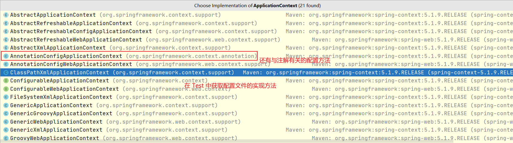
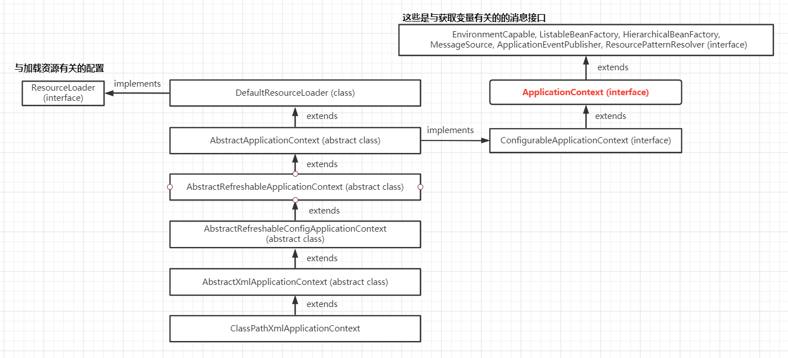
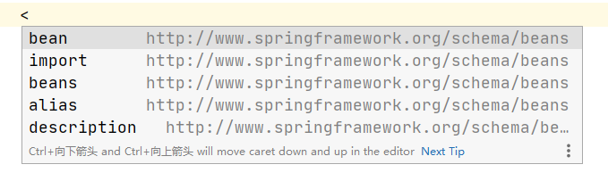
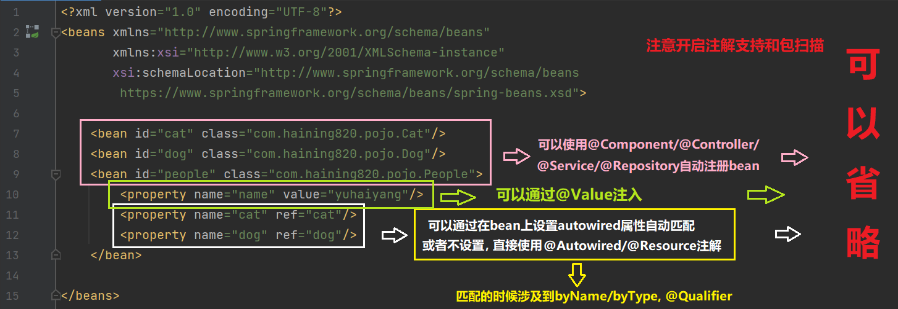
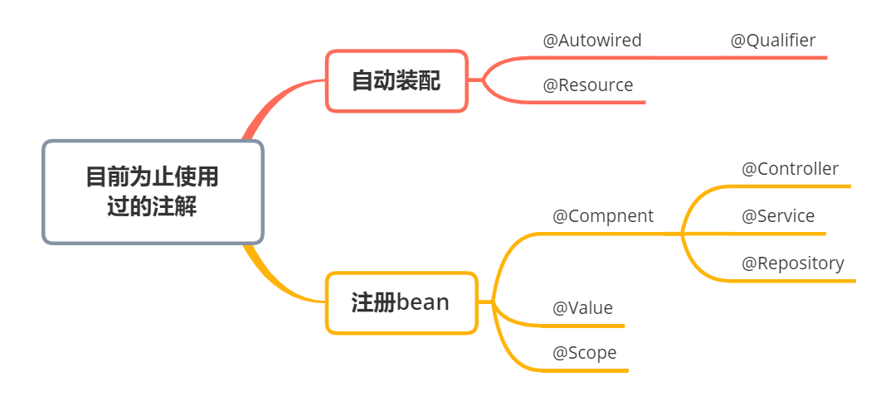
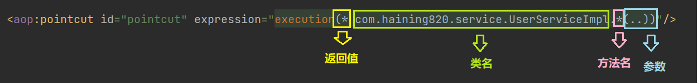

# 1、Spring 概述

<font size=4 style="font-weight:bold;background:yellow;">Spring 简介</font>

Spring，春天，顾名思义，给软件行业带来了春天。2002年，Rod Jahnson 首次推出了Spring 框架雏形 interface21 框架。Spring 框架以 interface21 框架为基础，经过重新设计，在 2004 年 3 月 24 日发布了 1.0 正式版。Spring Framework 的创始人是 Rod Johnson，他是悉尼大学的博士，然而他的专业不是计算机，而是音乐学。Spring 的理念是使现有技术更加实用，它本身就是一个大杂烩，整合了现有的框架技术。

SSH：Struct2 + Spring + Hibernate     SSM：SpringMVC + Spring + Mybatis

<!--more-->

<font size=4 style="font-weight:bold;background:yellow;">特点</font>

- Spring 是一个开源的，免费的框架（容器）。
- Spring 是一个轻量级的，非入侵式的框架，引入 Spring 不会改变原项目代码。
- **控制反转（IoC，inversion of controller），面向切面编程（AOP）。**
- 支持事务，支持框架整合。

总结：**Spring 是一个轻量级的控制反转（IoC）和面向切面（AOP）的容器（框架）。**

<font size=4 style="font-weight:bold;background:yellow;">官方文档</font>

中文文档：https://www.docs4dev.com/docs/zh/spring-framework/5.1.3.RELEASE/reference

英文文档：https://docs.spring.io/spring-framework/docs/5.2.0.RELEASE/spring-framework-reference/core.html#spring-core

# 2、IoC 理论推导

## 2.1、问题导入

首先新建一个空白的 maven 项目，在使用 Spring 之前，需要导入相关依赖。

```xml
<!-- https://mvnrepository.com/artifact/org.springframework/spring-webmvc -->
<dependency>
    <groupId>org.springframework</groupId>
    <artifactId>spring-webmvc</artifactId>
    <version>5.2.0.RELEASE</version>
</dependency>
<!-- https://mvnrepository.com/artifact/org.springframework/spring-webmvc -->
<dependency>
    <groupId>org.springframework</groupId>
    <artifactId>spring-jdbc</artifactId>
    <version>5.2.0.RELEASE</version>
</dependency>
```

<font size=4 style="font-weight:bold;background:yellow;">dao 层</font>

- 新建 `UserDao` 接口（Mapper）。

  ```java
  public interface UserDao {
      void getUser();
  }
  ```

- 新建 `UserDaoImpl` 实现类（如果用 MyBatis 的话就相当于 xml 文件）。

  ```java
  public class UserDaoImpl implements UserDao{
      public void getUser() {
          System.out.println("默认获取用户的数据!");
      }
  }
  ```

==**service 层<font size=4 style="font-weight:bold;background:yellow;">

- 新建 `UserService` 业务接口，service 层调用 dao 层。

  ```java
  public interface UserService {
      void getUser();
  }
  ```

- 新建 `UserServiceImpl` 业务实现类，想要实现 `getUser()` 需要使用 `UserDaoImpl` 实现类。

  ```java
  public class UserServiceImpl implements UserService{
      private UserDao userDao = new UserDapImpl();
      public void getUser() {
          userDao.getUser();
      }
  }
  ```

<font size=4 style="font-weight:bold;background:yellow;">假设要新增需求</font>

- 如果新增 `UserDao` 的实现类 `MysqlUserDaoImpl`（使用其他方式实现 getUser 功能）。

  ```java
  public class MysqlUserDaoImpl implements UserDao{
      public void getUser() {
          System.out.println("MySQL获取用户数据!");
      }
  }
  ```

- 若想使用 `MysqlUserDaoImpl` 的话，就必须要修改 service 层的实现类中对应的实现，**这样一来就需要修改原有代码！**

  ```java
  public class UserServiceImpl implements UserService {
  	private UserDao userDao = new MysqlUserDaoImpl();	// 需要修改service层
      public void getUser() {
      	userDao.getUser();
      }
  }
  ```

**假设用户有新需求，再增加新的实现方式的话的话就要再次进行修改... **

**这种方法就不适用了，每次变动都要修改大量代码，设计的耦合性太高，牵一发而动全身。**


## 2.2、IoC 本质

想要解决上面问题，可以在需要用到接口实现的地方不直接实现，而是留出一个接口，利用 set 进行注入，程序会发生革命性的变化！

```java
public class UserServiceImpl implements UserService{
    
    private UserDao userDao;
    
    // 利用set进行动态实现值的注入
    public void setUserDao(UserDao userDao){
        this.userDao = userDao;
    }

    public void getUser() {
        userDao.getUser();
    }
}
```

之前，程序主动创建对象，控制权在程序猿的手上。使用 set 注入之后，**程序不再具有主动性，而是变成了被动的接受对象！**这种思想从本质上解决了问题，程序猿不用再去管理对象的创建了，程序不用再进行修改，系统的耦合性大大降低，可以更专注在业务的实现上！这就是 IoC 的原型。

**IoC 是 Spring 框架的核心内容**，**Spring 可以使用多种方式实现 IoC，可以使用 xml 配置，也可以使用注解， 新版本的 Spring 也可以零配置实现 IoC。**采用 xml 方式配置 Bean 的时候，Bean 的定义信息是和实现分离的，而采用注解的方式可以把两者合为 一体，Bean 的定义信息直接以注解的形式定义在实现类中，从而达到了零配置的目的。Spring 容器在初始化时先读取配置文件，根据配置文件或元数据创建与组织对象存入容器中，程序使用时再从 IoC 容器中取出需要的对象。


在 Spring 中实现控制反转的是 IoC 容器，实现方法是依赖注入 DI（Dependency Injection）。

**控制反转 IoC（Inversion of Control），是所有框架通用的一种设计思想，不只在 Spring 中存在。**

IoC 是目的，DI 是手段。IoC  是指让生成类的方式由传统方式（new）反过来，即程序员不调用 new，需要类的时候由框架注入（DI），两者是同一件事不同层面的解读。

在没有 IoC 的程序中，使用面向对象编程，对象的创建与对象间的依赖关系完全硬编码在程序中，对象的创建由程序自己控制，控制反转后将对象的创建转移给第三方，所谓控制反转就是：**获得依赖对象的方式反转了。**

<font color='red' style="font-weight:bold;">所谓 IoC，就是对象由 Spring 创建，管理，装配！</font>


# 3、Hello Spring !

<font size=4 style="font-weight:bold;background:yellow;">导入依赖</font>

```xml
<!-- https://mvnrepository.com/artifact/org.springframework/spring-webmvc -->
<dependency>
    <groupId>org.springframework</groupId>
    <artifactId>spring-webmvc</artifactId>
    <version>5.2.0.RELEASE</version>
</dependency>
```

<font size=4 style="font-weight:bold;background:yellow;">创建 Hello.class</font>

```java
public class Hello {
    private String name;

    public String getName() {
        return name;
    }
    public void setName(String name) {
        this.name = name;
    }	// property注入，一定要有set方法！
    
    @Override
    public String toString() {
        return "Hello{" +
                "name='" + name + '\'' +
                '}';
    }
}
```

<font size=4 style="font-weight:bold;background:yellow;">创建 beans.xml 配置文件</font>

传统创建对象的方式

```java
// 类型 变量名 = new 类型();
Hello hello = new Hello();
```

使用 Spring 创建对象时，在 Spring 中这些都称为 bean，格式如下。

- id -> 变量名，class -> new 的对象

- property 相当于给对象中的属性设定一个值，将该值通过 set 方法注入，所以必须要有 set 方法！

```xml
<?xml version="1.0" encoding="UTF-8"?>
<beans xmlns="http://www.springframework.org/schema/beans"
       xmlns:xsi="http://www.w3.org/2001/XMLSchema-instance"
       xsi:schemaLocation="http://www.springframework.org/schema/beans
        https://www.springframework.org/schema/beans/spring-beans.xsd">
    
    <bean id="hello" class="com.haining820.pojo.Hello">
        <property name="name" value="Spring"/>
    </bean>

</beans>
```

<font size=4 style="font-weight:bold;background:yellow;">创建测试类 MyTest.class</font>

```java
public class MyTest {
    public static void main(String[] args) {
        // 获取Spring的上下文对象
        ApplicationContext context = new ClassPathXmlApplicationContext("beans.xml");
        // 程序的对象现在都在Spring中进行管理，要使用的话直接去里面取出来就可以了
        Hello hello = (Hello) context.getBean("hello");
        System.out.println(hello.toString());
    }
}
```

<font size=4 style="font-weight:bold;background:yellow;">问题</font>

- `Hello` 对象是谁创建的？

  **`Hello` 对象是由 Spring 创建的，在测试类中并没有进行 `new Hello()` 的操作。**

- `Hello` 对象的属性是怎么设置的？

  **`Hello` 对象的属性是由 Spring 容器设置的。**

- 控制反转

  - **控制：谁来控制对象的创建，传统应用程序的对象是由程序本身控制创建的，使用 Spring 后，对象是由 Spring 来创建的。**
  - **反转：程序本身不创建对象，而变成被动的接收对象。**
  - **依赖注入：就是利用<a style='color:red'> set 方法</a> 来进行注入的。**

- 关于 IoC

  IoC 是一种编程思想，由主动的编程变成被动的接收。现在彻底不用再程序中去改动了，要实现不同的操作，**只需要在 xml 配置文件中进行修改。**

- 在测试类中，获取 Spring 的上下文对象是在这句代码中实现的。

  ```java
  ApplicationContext context = new ClassPathXmlApplicationContext("beans.xml");
  ```

  **那么 `ClassPathXmlApplicationContext` 类是怎么获得 `ApplicationContext` 对象的？**

  浏览一下底层源码，可以发现包含了很多层，Spring 已经帮助我们封装好了，所以用起来很方便。

  

  

## 3.1、用 Spring 解决问题导入

```xml
<?xml version="1.0" encoding="UTF-8"?>
<beans xmlns="http://www.springframework.org/schema/beans"
       xmlns:xsi="http://www.w3.org/2001/XMLSchema-instance"
       xsi:schemaLocation="http://www.springframework.org/schema/beans
        https://www.springframework.org/schema/beans/spring-beans.xsd">

    <bean id="normalImpl" class="com.haining820.dao.UserDaoImpl"/>
    <bean id="mysqlImpl" class="com.haining820.dao.MysqlUserDaoImpl"/>
    <bean id="oracleImpl" class="com.haining820.dao.OracleUserDaoImpl"/>

    <bean id="userServiceImpl" class="com.haining820.service.UserServiceImpl">
        <property name="userDao" ref="oracleImpl"/>
    </bean>

</beans>
```

```java
public class MyTest {
    public static void main(String[] args) {
//        UserServiceImpl service = new UserServiceImpl();
//        service.setUserDao(new UserDaoImpl());
//        service.getUser();
//        service.setUserDao(new MysqlUserDaoImpl());
//        service.getUser();
//        service.setUserDao(new OracleUserDaoImpl());
//        service.getUser();	// 之前的用set方法解决
        
        // 获取Spring的容器
        ApplicationContext context = new ClassPathXmlApplicationContext("beans.xml");
        // 容器在手，天下我有！需要什么就直接get！
        UserService service = (UserService) context.getBean("userServiceImpl");
        service.getUser();
    }
}
```

# 4、IoC 创建对象的方式

</font>无参构造创建对象（默认） <font size=4 style="font-weight:bold;background:yellow;">**`<property>`**

在类中，无参构造一般被省略，可以直接使用；如果自己创建了有参构造，那么就只有有参构造，不再有无参构造；要想使用无参构造，必须显式的写出来。

在设置 property 属性的时候不同对象的设置方式也不同。

- value：具体的值，基本数据类型。（如上面的 HelloSpring）

- ref：引用 Spring 容器中创建好的对象。（如上面解决问题导入时的引用）

```xml
<!--value-->
<bean id="hello" class="com.haining820.pojo.Hello">
    <property name="name" value="Spring"/>
</bean>

<!--ref-->
<bean id="normalImpl" class="com.haining820.dao.UserDaoImpl"/>
<bean id="mysqlImpl" class="com.haining820.dao.MysqlUserDaoImpl"/>
<bean id="oracleImpl" class="com.haining820.dao.OracleUserDaoImpl"/>
<bean id="userServiceImpl" class="com.haining820.service.UserServiceImpl">
    <property name="userDao" ref="oracleImpl"/>
</bean>
```

</font>有参构造创造对象（三种方法）<font size=4 style="font-weight:bold;background:yellow;"> **`<constructor-arg>`**

向类中添加有参构造方法，测试使用有参构造创建对象。

- 下标赋值

  ```xml
  <bean id="user" class="com.haining820.pojo.User">
      <constructor-arg index="0" value="于海洋666"/>
  </bean>
  ```

- 通过参数名设置

  ```xml
  <bean id="user" class="com.haining820.pojo.User">
      <constructor-arg name="name" value="yuhaiyang888"/>
  </bean>
  ```

- 通过类型创建，基本类型如 `int` 可以直接写，引用类型必须将限定名写死，如 `java.lang.String`。不建议使用，有多个同类型参数就不直观了，会默认按照从上到下的顺序赋值。

  ```xml
  <bean id="user" class="com.haining820.pojo.User">
      <constructor-arg type="java.lang.String" value="yuhaiyang6666"/>
  </bean>
  ```

</font>在配置文件加载的时候，容器中管理的所有对象就已经创建好了!<font size=4 style="font-weight:bold;background:yellow;">

- 可以在实体类的无参构造中加入输出语句进行验证；

- 根据 bean 的名称获取对象时多次获取同一个 bean 得到的是相同的对象（单例）。

```java
public void test() {
    // 在加载配置文件时，配置文件中所有的类就已经被初始化了
    // 注意“所有”这一词，无论后文是否getBean，没有get的对象也一并被创建了！
    // 可以只保留这一句话运行就可以输出语句
    ApplicationContext context = new ClassPathXmlApplicationContext("applicationContext.xml");
    UserService service = (UserService) context.getBean("userServiceImpl");
    UserService service2 = (UserService) context.getBean("userServiceImpl");
    System.out.println(service == service2);    // true
    service.getUser();
}
```

# 5、依赖注入

**依赖注入（Dependency Injection，DI）**

- 依赖：指 bean 对象的创建依赖于容器，bean 对象的依赖资源；
- 注入：指 bean 对象所依赖的资源，由容器来设置和装配。

## 5.1、构造器注入

## 5.2、set 注入

**实体类一定要有 set 方法！**

<font size=4 style="font-weight:bold;background:yellow;">新建复杂类型</font>

```java
public class Address {	// 省略get/set
    private String address;
}
```

```java
public class Student {	// 省略get/set
    private String name;		// value
    private Address address;	// ref
    private String[] books;
    private List<String> hobbies;
    private Map<String,String> card;
    private Set<String> games;
    private String wife;
    private Properties info;
}
```

**==beans.xml==**

**对 Address 类进行普通值注入**

```xml
<bean id="address" class="com.haining820.pojo.Address">
    <property name="address" value="绥化"/>
</bean>
```

**对 Student 类进行复杂类型注入**

- 普通值注入，value

  ```xml
  <bean id="student" class="com.haining820.pojo.Student">
  	<property name="name" value="于海洋"/>
  ```

- bean 注入，ref

  ```xml
  	<property name="address" ref="address"/>
  ```

- 数组注入，array

  ```xml
      <property name="books">
          <array>
              <value>魔法石</value>
              <value>密室</value>
              <value>阿兹卡班的囚徒</value>
              <value>火焰杯</value>
          </array>
      </property>
  ```

- list 注入

  ```xml
      <property name="hobbies">
          <list>
              <value>唱</value>
              <value>跳</value>
              <value>rap</value>
              <value>篮球</value>
          </list>
      </property>
  ```

- map 注入

  ```xml
      <property name="card">
          <map>
              <entry key="身份证" value="111111222222223333"/>
              <entry key="银行卡" value="213154684984944894"/>
          </map>
      </property>
  ```

- set 注入

  ```xml
  <property name="games">
      <set>
          <value>Cyberpunk2077</value>
          <value>CSGO</value>
          <value>PlantVSZombies</value>
      </set>
  </property>
  ```

- null 注入

  ```xml
  	<property name="wife" value=""/>		<!--空串，自闭合-->
  ```

  ```xml
      <property name="wife">
          <null/>		<!--null-->
      </property>
  ```

- properties 注入

  ```xml
      <property name="info">
          <props>
              <prop key="学号">20181001235</prop>
              <prop key="姓名">于海洋</prop>
              <prop key="姓别">男</prop>
              <prop key="username">root</prop>
              <prop key="password">root</prop>
          </props>
      </property>
  </bean>
  ```

<font size=4 style="font-weight:bold;background:yellow;">测试</font>

```java
@Test
public void test1(){
    ApplicationContext context = new ClassPathXmlApplicationContext("beans.xml");
    Student student = (Student) context.getBean("student");
    System.out.println(student.toString());
}
```

## 5.3、拓展方式注入

[还可以使用p命名空间和c命名空间进行注入](https://docs.spring.io/spring-framework/docs/5.2.0.RELEASE/spring-framework-reference/core.html#beans-p-namespace)，p 命名空间本质还是 set 注入，c 命名空间本质还是构造器注入。

使用 p 命名空间注入实体类需要有无参构造方法，使用 c 命名空间注入实体类需要有有参构造方法（默认无参构造就没有了，若想继续使用p命名空间注入，需要补充无参构造方法）。

p 命名和 c 命名不能直接使用，需要导入 xml 约束。

```xml
xmlns:p="http://www.springframework.org/schema/p"
xmlns:c="http://www.springframework.org/schema/c"
```

```xml
<?xml version="1.0" encoding="UTF-8"?>
<beans xmlns="http://www.springframework.org/schema/beans"
       xmlns:xsi="http://www.w3.org/2001/XMLSchema-instance"

       xmlns:p="http://www.springframework.org/schema/p"
       xmlns:c="http://www.springframework.org/schema/c"

       xsi:schemaLocation="http://www.springframework.org/schema/beans
                           https://www.springframework.org/schema/beans/spring-beans.xsd">

    <!--不加构造方法(默认无参构造)/加无参构造方法-->
    <!--p命名空间注入,可以直接注入属性的值,property-->
    <bean id="user" class="com.haining820.pojo.User" p:name="于海洋" p:age="18"/>

    <!--c命名空间注入,通过构造器注入,实体类要有有参构造方法,constructs-args-->
    <bean id="user2" class="com.haining820.pojo.User" c:name="于海洋" c:age="21"/>

</beans>
```

<font size=4 style="font-weight:bold;background:yellow;">测试</font>

```java
@Test
public void test2(){
    ApplicationContext context = new ClassPathXmlApplicationContext("userBeans.xml");
    User user = context.getBean("user2", User.class);	// 在后边显式声明类型就不用强转了
    System.out.println(user.toString());
}
```

## 5.4、bean 的作用域


- singleton 模式（Spring 默认机制）：单例模式下对象全局唯一，不存在多个对象。关闭工厂 ，所有的对象都会销毁。

  ```xml
  <!--官方解释-->
  <bean id="accountService" class="com.something.DefaultAccountService"/>
  <!-- 下面这句的效果和上面一样,因为singleton模式是默认的 -->
  <bean id="accountService" class="com.something.DefaultAccountService" scope="singleton"/>
  ```


- prototype 模式：每次从容器中 get 时都会产生一个新对象。关闭工厂，所有的对象不会销毁，内部的垃圾回收机制会回收。

  ```xml
  <!--官方解释-->
  <bean id="accountService" class="com.something.DefaultAccountService" scope="prototype"/>
  ```


- 测试

  ```xml
  <bean id="user2" class="com.haining820.pojo.User" c:name="于海洋" c:age="21" scope="prototype"/>
  ```

  ```java
      @Test
      public void test2(){
          ApplicationContext context = new ClassPathXmlApplicationContext("userBeans.xml");
          // 在后边显示声明类型就不用强转了
          User user = context.getBean("user2", User.class);
          User userB = context.getBean("user2", User.class);
          System.out.println(user == userB);
          // 单例模式singleton输出为true（hashCode相等）, 原型模式prototype输出为false（hashCode不等）
      }
  ```

- 其余的request、session、 application这些只能在web开发中使用到。

# 6、Spring 的配置

Spring 的配置不多，在配置文件中输入尖括号会提示可供配置的内容。



## 6.1、alias

别名 alias 可以用于替换 bean 的 id，在 getBean 的时候可以使用别名。

```xml
<!--别名，如果添加了别名，也可以使用别名获取这个对象-->
<alias name="user" alias="userAlias"/>
```

## 6.2、bean

- id：bean 的唯一标识符，相当于对象名；

- class：bean 对象所对应的全限定名：**包名+类名**；

- name：也是别名，而且 name 可以同时取多个别名：空格、逗号、分号都可以用作 name 别名的分隔符。（其实可以替代 alias）

  ```xml
  <bean id="uesrT" class="com.haining820.pojo.UserT" name="u1 u2,u3;u4">
      <property name="name" value="yuhaiyang666"/>
  </bean>
  ```

## 6.3、import

- import 一般用于团队开发使用，可以将多个配置文件合并为一个配置文件。
- 假设项目中有多个人开发，这三个人负责不同的类开发，不同的类注册在不同的 beans 中，可以利用 import 将所有人的 beans.xml 合并为一个总的 xml（applicationContext.xml）。
- **注意，在 import 时，如果 beans 中有重复的变量命名，在下边的 import 会覆盖上边的 import 。**

```xml
<!--applicationContext.xml-->
<!--张三 beans1.xml 李四 beans2.xml 王二麻子 beans3.xml-->
<import resource="beans1.xml"/>
<import resource="beans2.xml"/>
<import resource="beans3.xml"/>
```

# 7、bean 的自动装配与注解

自动装配是 Spring 满足 bean 依赖的一种方式，Spring 会在上下文中进行寻找并自动给 bean 装配属性。

在 Spring 中有三种装配的方式：

- 在 xmI 中显式的配置（之前的配置方式）

- 在 java 中显式配置

- **隐式的自动装配 bean【重要】**

环境搭建：一个人有两个宠物！

```java
public class People {
   private Cat cat;
   private Dog dog;
   private String name;		// 省略get/set/toString
}
```

```java
public class Cat {
    public void shout(){
        System.out.println("miao~");
    }
}
```

```java
public class Dog {
    public void shout(){
        System.out.println("wang~");
    }
}
```

## 7.1、byName/byType 自动装配

<font size=4 style="font-weight:bold;background:yellow;">byName</font>

byName 会自动查找对象中所有的 set 方法后面的值，获得将 set 去掉并且首字母小写的字符串，对应 bean 的 id 进行自动装配。

不能随便修改 id，byName 会找不到对象会报 `NullPointerException`，将 `cat` 改为大写 `Cat` 也不行。`setCat -> cat`

```xml
	<bean id="Cat" class="com.haining820.pojo.Cat"/>
	<bean id="dog666" class="com.haining820.pojo.Dog"/><!--错误，无法自动装配-->
```

```xml
    <bean id="cat" class="com.haining820.pojo.Cat"/>
    <bean id="dog" class="com.haining820.pojo.Dog"/>
    <bean id="people" class="com.haining820.pojo.People" autowire="byName">
        <property name="name" value="yuhaiyang"/>
        <!--<property name="dog" ref="dog"/>-->
        <!--<property name="cat" ref="cat"/>--><!--使用byName后可以省略-->
    </bean>
```

<font size=4 style="font-weight:bold;background:yellow;">byType</font>

byType 会自动在容器的上下文中查找和自己对象属性类型相同的 bean 的 id 进行自动装配。

**byType 必须保证性的类型全局唯一才能自动装配，否则会报错！**因为不需要名字，byType 可以随意修改 id 甚至省略 id。

```xml
	<bean id="Cat" class="com.haining820.pojo.Cat"/>
    <bean id="dog666" class="com.haining820.pojo.Dog"/><!--都可以自动装配-->
```

```xml
    <bean class="com.haining820.pojo.Cat"/>
    <bean class="com.haining820.pojo.Dog"/>
    <bean id="people" class="com.haining820.pojo.People" autowire="byType">
        <property name="name" value="yuhaiyang"/>
        <!--<property name="dog" ref="dog"/>-->
        <!--<property name="cat" ref="cat"/>--><!--使用byType后可以省略-->
    </bean>
```

<font size=4 style="font-weight:bold;background:yellow;">装配后的测试</font>

```java
@Test
public void test1(){
    ApplicationContext context = new ClassPathXmlApplicationContext("beans.xml");
    People people = context.getBean("people", People.class);
    people.getCat().shout();
    people.getDog().shout();	// 输出miao~ wang~
}
```

<font size=4 style="font-weight:bold;background:yellow;">小结</font>

- 使用 byName 时，需要保证所有 bean 的 **id 唯一**，并且这个 bean 需要和自动注入的属性的 **set 方法的值**一致!
- 使用 byType 时，需要保证所有 bean 的 **class 唯一**，并且这个 bean 需要和自动注入的属性的**类型**一致!

## 7.2、注解实现自动装配

> jdk1.5 开始支持注解，Spring 2.5 开始支持注解，注解比 xml 文件更方便。
>
> `@Nullable`：字段标记了这个注解，说明这个字段可以为null

**使用注解的注意事项：导入 context 约束、配置注解的支持。**

```xml
<?xml version="1.0" encoding="UTF-8"?>
<beans xmlns="http://www.springframework.org/schema/beans"
       xmlns:xsi="http://www.w3.org/2001/XMLSchema-instance"
       
       xmlns:context="http://www.springframework.org/schema/context"
       
       xsi:schemaLocation="http://www.springframework.org/schema/beans
        https://www.springframework.org/schema/beans/spring-beans.xsd
                           
        http://www.springframework.org/schema/context
        https://www.springframework.org/schema/context/spring-context.xsd"> <!--导入context约束-->

    <!--开启对注解的支持-->
    <context:annotation-config/>

    <bean id="cat" class="com.haining820.pojo.Cat"/>
    <bean id="dog" class="com.haining820.pojo.Dog"/>
    <bean id="people" class="com.haining820.pojo.People"/>

</beans>
```

<font size=4 style="font-weight:bold;background:yellow;">使用 @Autowired 注解实现自动装配</font>

```java
public class People {
    @Autowired	// @Autowired(required = false)
    private Cat cat;
    @Autowired
    private Dog dog;
    private String name;
}
```

- 直接在属性上使用即可，也可以在 set 方法上使用；

- **使用 Autowired 后就可以不用编写 set 方法了**，前提是该自动装配的属性在 IoC 容器中存在，且符合类型 byType；

- **`@Autowired` 执行顺序：先 byType，要是有多个同类型的，就 byName；**

- `@Autowired` 的 required 属性：如果显式的定义了 Autowired 的 required 属性为 false，则这个对象可以为 null，否则不允许。

  ```java
  public @interface Autowired {
      boolean required() default true;	// 源码中required默认为true
  }
  ```

**对测试环境进行自动装配**

- beans.xml 修改 cat/dog 的 id 甚至直接删除可以成功装配，因为 `@Autowired` 自动 byType。

  ```xml
  	<bean id="cat1" class="com.haining820.pojo.Cat"/>
      <bean class="com.haining820.pojo.Dog"/>
      <bean id="people" class="com.haining820.pojo.People"/>
  ```

- 但是当有多个相同类型的 bean 的时候 byType 找不到，就要走 byName 了。

  在这里也能体现出为什么叫做 “自动” 装配，但是假如将下例的 `id="cat"` 也改了，那么自动装配就会失败，因为

  - 首先 byType 失败，因为有两个相同类型的 bean；
  - 然后 byName 失败，因为两个 bean 的 id 都不符合 byName 的要求，最后自动装配就会失败

  ```xml
  	<bean id="cat1" class="com.haining820.pojo.Cat"/>
      <bean id="cat" class="com.haining820.pojo.Cat"/> <!--byName-->
      <bean id="dog1" class="com.haining820.pojo.Dog"/> <!--byType-->
      <bean id="people" class="com.haining820.pojo.People"/> <!--byType-->
  ```

</font>使用 @Qualifier 辅助 @Autowired**==

如果 `@Autowired` 自动装配的环境比较复杂，自动装配无法通过一个注解 `@Autowired` 完成的时候、我们可以使用`@Qualifier(value="xxx")` 去配置 `@Autowired` 的使用，指定一个唯一的 bean 对象注入!

```java
public @interface Qualifier {
    String value() default "";	// 源码中value默认为空
}
```

**测试：** `@Qualifier(value="xxx")`就是用于解决上面连续失败两次的情况的。

```xml
	<bean id="cat1" class="com.haining820.pojo.Cat"/> <!--@Qualifier-->
    <bean id="cat2" class="com.haining820.pojo.Cat"/>
    <bean id="dog1" class="com.haining820.pojo.Dog"/> <!--@Qualifier-->
    <bean id="dog2" class="com.haining820.pojo.Dog"/>
    <bean id="people" class="com.haining820.pojo.People"/>
```

```java
public class People {
   @Autowired
   @Qualifier(value = "cat1")
   private Cat cat;
   @Autowired
   @Qualifier(value = "dog1")
   private Dog dog;
   private String name;
}
```

<font size=4 style="font-weight:bold;background:yellow;">使用 @Resource 注解实现自动装配</font>

```java
public class People {
    @Resource
    private Cat cat;
    @Resource
    private Dog dog;
    private String name;
}
```

`@Resource` 也有类似 `@Qualifier` 的用法

```java
String name() default "";	// 源码中name默认为空
```

```java
public class People {
   @Resource(name = "cat2")
   private Cat cat;
   @Resource(name = "dog2")
   private Dog dog;
   private String name;
}
```

<font size=4 style="font-weight:bold;background:yellow;">小结</font>

`@Autowired`和 `@Resource` 的区别

- 都是用来自动装配的，都可以放在属性字段上，执行顺序不同。
- `@Autowired` 默认通过 byType 的方式实现，先 byType 后 byName！而且必须要求这个对象存在！【常用】
- `@Resource` 默认通过 byName 的方式实现，先 byName 后 byType！如果两个都找不到，就报错！【常用】
- 在底层查找依赖的方式不同，`@Autowired` 是 Spring 自己定义的注解，`@Resource` 属于 J2EE；
- 推荐使用：@Resource 注解在字段上，且这个注解是属于 J2EE 的，<font color='red' style="font-weight:bold;">减少了与 Spring 的耦合</font>最重要的这样代码看起就比较优雅。

## 7.3、使用注解开发

在 Spring4 之后，要使用注解开发，必须保证 aop 的包已经导入了，复杂的用 xml，简单的用注解即可。


在使用注解之前，必须要导入 context 约束，开启对注解的支持，设置好包扫描！

```xml
    <!--开启对注解的支持-->
	<context:annotation-config/>
	<!--指定扫描的包，这个包下的注解就会生效-->
    <context:component-scan base-package="com.haining820.pojo"/>
```

<font size=4 style="font-weight:bold;background:yellow;">属性如何注入</font>

- `@Component`：组件，放在类上，说明这个类被 Spring 管理了，就是 bean，bean 的 id 默认为类名小写。

- `@Value("yuhaiyang")`：赋值，向属性中注入值；可以放在成员变量上，也可以放在 set 方法上。

- `@Scope("singleton")`：作用域

```java
@Component  // <bean id="user" class="com.haining820.pojo.User"/>
@Scope("singleton")
public class User {
    @Value("yuhaiyang")     // <property name="name" value="yuhaiyng">
    public String name;

    // @Value("yuhaiyang")
    public void setName(String name) {
        this.name = name;
    }
}
```

<font size=4 style="font-weight:bold;background:yellow;">衍生的注解</font>

`@Component` 有几个衍生的注解，在 web 开发中，会按照 MVC 三层架构分层。

**这四个注解功能一样，都代表将某个类注册到 Spring 当中，装配 bean。**

- dao 层：**`@Repository`**
- service 层：**`@Service`**
- controller 层：**`@Controller`**

<font size=4 style="font-weight:bold;background:yellow;">小结</font>

**xml 与注解的使用**

- xml 更加万能，适用于任何场合，维护简单方便；
- 注解不是自己提供的类使用不了，维护相对复杂；

- 最佳实践：xml 用来管理 bean，注解只负责完成属性的注入。

## 7.4、总结

初学 Spring 的时候，对各种注解总是记混，对各种概念的理解也不够深入，还是回到创建例子：一个人，一猫一狗。人属性有姓名跟猫狗，其中姓名是基本类型，猫狗是引用类型，在使用最传统的 xml 方式配置时，配置文件是这样的。

```xml
<?xml version="1.0" encoding="UTF-8"?>
<beans xmlns="http://www.springframework.org/schema/beans"
       xmlns:xsi="http://www.w3.org/2001/XMLSchema-instance"
       xsi:schemaLocation="http://www.springframework.org/schema/beans
        https://www.springframework.org/schema/beans/spring-beans.xsd">

    <bean id="cat" class="com.haining820.pojo.Cat"/>
    <bean id="dog" class="com.haining820.pojo.Dog"/>
    <bean id="people" class="com.haining820.pojo.People">
        <property name="name" value="yuhaiyang"/>
        <property name="cat" ref="cat"/>
        <property name="dog" ref="dog"/>
    </bean>

</beans>
```

注解的使用就是逐渐替代这些 xml 配置的过程。





# 8、使用 Java 的方式配置 Spring

不使用 Spring 的 xml 配置，完全使用 Java 来做。

这种纯 Java 的配置方式，在 SpringBoot 中非常常见。


<font size=4 style="font-weight:bold;background:yellow;">实体类</font>

```java
@Component  // 配置类中加@Bean了就可以不加@Component也能运行, 因为@Bean已经注册了
public class User {
    private String name;

    public String getName() {
        return name;
    }

    @Value("yuhaiyang666")  // 属性注入值
    public void setName(String name) {
        this.name = name;
    }

    @Override
    public String toString() {
        return "User{" +
                "name='" + name + '\'' +
                '}';
    }
}
```

<font size=4 style="font-weight:bold;background:yellow;">配置类（配置文件）</font>

- `@Configuration` ：代表这是一个配置类，相当于之前的 beans.xml 配置文件。这个也会被Spring 托管，注册到容器中，因为它本质上也是 `@Component` ;
- `@ComponentScan("com.haining820.pojo") `：扫描包，顾名思义，扫描的是对应的包中的 `@Compoent` 注解；如果有的话扫描成功，bean 的 id 可以用类的小写名替代，与 `@Bean` 注解对 bean id 的命名互不冲突。
- `@Bean("beanName")`：注册一个 bean，就相当于之前写的一个 bean 标签，这个方法的返回值就相当于 bean 标签中的 class 属性，这个方法的名字就相当于 bean标签中的 id 属性。
  - `@Bean` 后边不加内容就默认使用函数名 getUser 作为 bean 的 id；
  - `@Bean` 后面加内容了就用加的别名作为 bean 的 id，原来的 id 就不能用了。
  - 配置类中加 `@Bean` 之后在实体类中不加 `@Component` 也能运行，因为 `@Bean` 已经将实体类注册了。
- `@Import(MyConfig2.class)`：引入其他配置类

```java
@Configuration
@ComponentScan("com.haining820.pojo")  
@Import(MyConfig2.class)
public class MyConfig {
    @Bean ("beanName")
    public User getUser(){
        return new User();
    }
}
```

**可以省略的情况（最好还是不要省略）**

- 在配置类中加 `@Bean`，实体类中可以不加 `@Component`，因为 `@Bean` 已经将实体类注册到 Spring 中了；
  - 如果 @Bean 后无别名，bean 的 id 就是注解下的方法名，如 getUser；
  - 如果 @Bean 后有别名，bean 的 id 是该别名，方法名就把不能再用了。
- 实体类中加 `@Component`，在配置类中添加包扫描 `@ComponentScan`，可以不用加 `@Bean`；
  - 不加 `@Bean`，bean 的 id 是类名的小写，如 user；
  - 加 `@Bean`，bean 的 id 命名既可以用 getUser（注解后面有命名就用后面的），也可以用 user。

<font size=4 style="font-weight:bold;background:yellow;">测试类</font>

如果完全使用了配置类方式去做，就只能通过 `AnnotationConfig`上下文来获取容器，通过配置类的 class 文件加载。

```java
@Test
public void test1(){
    ApplicationContext context = new AnnotationConfigApplicationContext(MyConfig.class);
    User user = context.getBean("getUser", User.class);
}
```

# 9、代理模式

AOP：面向切面编程（Aspect Oriented Programming）

**为什么要学习代理模式？**

因为这就是 Spring AOP的底层。【SpringAOP 和 SpringMVC】

**代理模式的分类：**静态代理、动态代理


## 10.1、静态代理

<font size=4 style="font-weight:bold;background:yellow;">角色分析</font>

- 抽象角色：一般使用接口或者抽象类解决
- 真实角色：被代理的角色
- 代理角色：代理真实角色，代理真实角色后，一般会做一些附属的操作
- 客户：访问代理对象的人


<font size=4 style="font-weight:bold;background:yellow;">代码步骤</font>

- 接口

  ```java
  public interface Rent {		// 抽象角色：租房
  	public void rent();
  }
  ```
  
- 真实角色

  ```java
  public class Host implements Rent{	// 真实角色: 房东，房东要出租房子
      public void rent() {
      	System.out.println("房屋出租");
      }
  }
  ```
  
- 代理角色

  ```java
  public class Proxy implements Rent {
  	private Host host;
      
      public Proxy(){
      }
      
      public Proxy(Host host){
          this.host = host;
      }
      
      public void rent(){
          seeHouse();
          host.rent();
          hetong();
          fare();
      }
      public void seeHouse(){		// 看房
      	System.out.println("带房客看房");
      }
      public void heTong(){		// 签合同
      	System.out.println("签合同");
      }
      public void fare(){			// 收中介费
      	System.out.println("收中介费");
      }
  }
  ```

- 客户端访问代理角色

  ```java
  public class Client {	// 租客
  public static void main(String[] args) {
          Host host = new Host();			// 房东要租房
          Proxy proxy = new Proxy(host);	// 代理帮房东租房，代理还会有一些附属操作
          proxy.rent();	// 租房直接找中介
      }
  }
  ```

<font size=4 style="font-weight:bold;background:yellow;">代理模式的好处</font>

- 可以使真实角色的操作更加纯粹，不用去关注一些公共的业务！
- 公共业务就交给代理角色，实现了业务的分工！
- 公共业务发生扩展的时候，方便集中管理！

<font size=4 style="font-weight:bold;background:yellow;">缺点</font>

- 一个真实角色就会产生一个代理角色，代码量翻倍，开发效率会降低。

## 10.2、加深理解

- 接口

  ```java
  public interface UserService {
      void add();
      void update();
      void delete();
      void query();
  }	// 增删改查
  ```

- 真实角色

  ```java
  public class UserServiceImpl implements UserService{
      public void add() {
          System.out.println("add");
      }
  
      public void update() {
          System.out.println("update");
      }
  
      public void delete() {
          System.out.println("delete");
      }
  
      public void query() {
          System.out.println("query");
      }
  }
  ```

- 代理角色：如果想**增加一个日志的功能**，不要在原来的代码上进行改动，要新增一个代理类。

  ```java
  public class UserServiceProxy implements UserService{
  
      UserServiceImpl service = new UserServiceImpl();
  
      public void log(String msg){
          System.out.println("[debug]执行"+msg+"方法");
      }
  
      public UserServiceProxy(UserServiceImpl service) {
          this.service = service;
      }
  
      public void add() {
          log("add");
          service.add();
      }
  
      public void update() {
          log("update");
          service.update();
      }
  
      public void delete() {
          log("delete");
          service.delete();
      }
  
      public void query() {
          log("query");
          service.query();
      }
  }
  ```

- 客户端访问代理角色

  ```java
  public class Client {
      public static void main(String[] args) {
          UserServiceImpl service = new UserServiceImpl();
  //        service.add();
          UserServiceProxy proxy = new UserServiceProxy(service);
          proxy.add();
      }
  }
  ```

## 10.3、动态代理

- 动态代理和静态代理的角色组成一样（抽象角色，真实角色，代理角色）。

- 动态代理的代理类是动态生成的，不是直接写好的。

- 动态代理分为两大类：基于接口的动态代理，基于类的动态代理。

  - 基于接口：JDK 的动态代理

  - 基于类：cglib

  - java 字节码：JAVAssist

<font size=4 style="font-weight:bold;background:yellow;">实现 JDK 的动态代理</font>

**首先需要了解两个类**

- `Proxy`：代理

  Proxy 提供用于创建动态代理类和实例的静态方法，它还是由这些方法创建的所有动态代理类的超类。

- `InvocationHandler`：调用处理程序

  InvocationHandler 是代理实例的调用处理程序实现的接口。
  每个代理实例都具有一个关联的调用处理程序。对代理实例调用方法时，将对方法调用进行编码并将其指派到它的调用处理程序的 `invoke()` 方法。

<font size=4 style="font-weight:bold;background:yellow;">动态代理的好处</font>

- 可以使真实角色的操作更加纯粹，不用去关注一些公共的业务！
- 公共业务就交给代理角色，实现了业务的分工！
- 公共业务发生扩展的时候，方便集中管理！

- 一个动态代理类代理的是一个接口，一般就是对应的一类业务！
- 一个动态代理类可以代理多个类，只要是实现了同一接口即可！不用像之前的静态代理一样反复写代理类，减少代码量！

<font size=4 style="font-weight:bold;background:yellow;">测试</font>

**UserService 接口**

```java
public interface UserService {
    void add();
    void update();
    void delete();
    void query();
}	// 增删改查
```

**ProxyInvocationHandler.class**

```java
// 用这个类自动生成代理类,代理调用处理
public class ProxyInvocationHandler implements InvocationHandler {
    private Object target;	// 被代理的接口

    public void setTarget(Object target) {
        this.target = target;
    }

    public Object getProxy(){	// 生成代理类
        return Proxy.newProxyInstance(this.getClass().getClassLoader(),target.getClass().getInterfaces(),this);
    }

    // 处理代理实例上的方法调用并返回结果
    public Object invoke(Object proxy, Method method, Object[] args) throws Throwable {
        log(method.getName());
        // 动态代理的本质就是通过反射来实现
        Object invoke = method.invoke(target,args);	// 执行代理对象上的方法
        return invoke;
    }

    public void log(String msg){
        System.out.println("[debug]执行"+msg+"方法");
    }
}
```

**Client.class**

```java
public class Client {
    public static void main(String[] args) {
        UserServiceImpl userServiceImpl = new UserServiceImpl();	// 真实角色
        ProxyInvocationHandler pih = new ProxyInvocationHandler();	// 代理角色，不存在
        pih.setTarget(userServiceImpl);		// 设置要代理的对象
        // 动态生成代理类，getProxy返回的对象用接口接收
        UserService proxy = (UserService) pih.getProxy();
        proxy.add();
        proxy.delete();
        proxy.update();
        proxy.query();
       /**
         * [debug]执行add方法
         * add
         * [debug]执行delete方法
         * delete
         * [debug]执行update方法
         * update
         * [debug]执行query方法
         * query
         */
    }
}
```

# 10、AOP

## 10.1、什么是 AOP

AOP（Aspect Oriented Programming）：面向切面编程，通过预编译方式和运行期动态代理实现程序功能的统一维护的一种技术。AOP 是 OOP（面向对象） 的延续，是软件开发中的一个热点，也是 Spring 框架中的 一个重要内容，是函数式编程的一种衍生范型。利用 AOP 可以对业务逻辑的各个部分进行隔离，**从而使得业务逻辑各部分之间的耦合度降低，提高程序的可重用性，同时提高了开发的效率**。


## 10.2、AOP 在 Spring 中的作用

提供声明式事务，允许用户自定义切面。

- 横切关注点：跨越应用程序多个模块的方法或功能。即是，与我们业务逻辑无关的，但是我们需要关注的部分，就是横切关注点。如日志，安全，缓存，事务等等 .... 
- 切面（Aspect）：横切关注点被模块化的特殊对象。即，它是一个类。 **Log**
- 通知（Advice）：切面必须要完成的工作，动态横切代码。即，它是类中的一个方法。 **Log 中的方法**
- 目标（Target）：被通知对象。 **接口**
- 代理（Proxy）：向目标对象应用通知之后创建的对象。 **代理类**
- 切入点（PointCut）：切面通知执行的 “地点” 的定义。
- 连接点（JointPoint）：与切入点匹配的执行点，横切发生的地方。 **在哪里执行**


SpringAOP 中，通过 Advice 定义横切逻辑，Aop 在 不改变原有代码的情况下，去增加新的功能。Spring 中支持 5 种类型的 Advice 如下。

|   通知类型   |        连接点        |                    实现接口                     |
| :----------: | :------------------: | :---------------------------------------------: |
|   前置通知   |        方法前        |   org.springframework.aop.MethodBeforeAdvice    |
|   后置通知   |        方法后        |  org.springframework.aop.AfterReturningAdvice   |
|   环绕通知   |       方法前后       |   org.aopalliance.intercept.MethodInterceptor   |
| 异常抛出通知 |     方法抛出异常     |      org.springframework.aop.ThrowsAdvice       |
|   引介通知   | 类中增加新的方法属性 | org.springframework.aop.IntroductionInterceptor |

## 10.3、Spring API 实现 AOP

>  主要是 Sping API 接口的实现

**使用 AOP 织入，需要导入一个依赖包！**

```xml
<!-- https://mvnrepository.com/artifact/org.aspectj/aspectjweaver -->
<dependency>
    <groupId>org.aspectj</groupId>
    <artifactId>aspectjweaver</artifactId>
    <version>1.9.4</version>
</dependency>
```

**测试类：增删改查，UserService 接口和 UserServiceImpl 接口实现类。**

```java
public interface UserService {
    void add();
    void delete();
    void update();
    void select();
}
```

```java
public class UserServiceImpl implements UserService{
    public void add() {System.out.println("增加了一个用户");}
    public void delete() {System.out.println("删除了一个用户");}
    public void update() {System.out.println("更新了一个用户");}
    public void select() {System.out.println("查询了一个用户");}
}
```

**通知 Log.class（在 log 包下），这里的 `before()` 方法会在执行前会被自动调用。**

- method：要执行的目标对象的方法
- args：参数
- target：目标对象

```java
public class Log implements MethodBeforeAdvice {
    public void before(Method method, Object[] args, Object target) throws Throwable {
        System.out.println(target.getClass().getName()+"的"+method.getName()+"被执行了!");
    }
}
```

**通知 AfterLog.class（在 log 包下），这里的 `afterReturning()` 方法会在执行后会被自动调用。**

- 方法的参数相比之下多了一个返回值 `returnValue`

```java
public class AfterLog implements AfterReturningAdvice {
    public void afterReturning(Object returnValue, Method method, Object[] args, Object target) throws Throwable {
        System.out.println("执行了"+method.getName()+"方法，返回结果为:"+returnValue);
    }
}
```

**新建 applicationContext.xml，将刚才配置的类注册为 bean。**

切入点的配置

- id：切入点的 id，供后面调用；

- expression：表达式，execution 表示要执行的具体位置，用表达式表示；

  可以用 `*` 来代替，一般的顺序是方法定义的顺序：返回值、包名/类名、方法名、参数




```xml
<aop:pointcut id="pointcut" expression="execution(* com.haining820.service.UserServiceImpl.*(..))"/>
```

```xml
<?xml version="1.0" encoding="UTF-8"?>
<beans xmlns="http://www.springframework.org/schema/beans"
       xmlns:xsi="http://www.w3.org/2001/XMLSchema-instance"

       xmlns:aop="http://www.springframework.org/schema/aop"

       xsi:schemaLocation="http://www.springframework.org/schema/beans
        https://www.springframework.org/schema/beans/spring-beans.xsd
        
        http://www.springframework.org/schema/aop
        https://www.springframework.org/schema/aop/spring-aop.xsd"><!--导入aop约束-->

    <!--注册bean-->
    <bean id="userService" class="com.haining820.service.UserServiceImpl"/>
    <bean id="log" class="com.haining820.log.Log"/>
    <bean id="logAfter" class="com.haining820.log.AfterLog"/>

    <!--配置aop，需要导入约束-->
    <aop:config>
        <aop:pointcut id="pointcut" expression="execution(* com.haining820.service.UserServiceImpl.*(..))"/>
        <aop:advisor advice-ref="log" pointcut-ref="pointcut"/>
        <aop:advisor advice-ref="logAfter" pointcut-ref="pointcut"/><!--执行环绕-->
    </aop:config>
</beans>
```

**测试**

```java
@Test
public void test1(){
    ApplicationContext context = new ClassPathXmlApplicationContext("applicationContext.xml");
    // 注意：动态代理代理的是接口userService
    UserService userService = (UserService) context.getBean("userService");
    userService.delete();
}
```

```
com.haining820.service.UserServiceImpl的delete被执行了!
删除了一个用户
执行了delete方法，返回结果为:null
```

## 10.4、自定义类实现AOP

>  主要是切面的定义

**自定义需要切入的类**

```java
public class DiyPointCut {
    public void before(){
        System.out.println("==============方法执行前===============");
    }
    public void after(){
        System.out.println("==============方法执行后===============");
    }
}
```

**将 `DiyPointCut` 注册为 bean，并进行配置** 

- `aop:aspect`：切面
- `ref`：要引用的类的 bean id

```xml
<bean id="diy" class="com.haining820.diy.DiyPointCut"/>
<aop:config>
    <aop:aspect ref="diy">
        <aop:pointcut id="point" expression="execution(* com.haining820.service.UserServiceImpl.*(..))"/>
        <aop:before method="before" pointcut-ref="point"/>
        <aop:after method="after" pointcut-ref="point"/>
    </aop:aspect>
</aop:config>
```

**测试：测试类不变**

```
==============方法执行前===============
删除了一个用户
==============方法执行后===============
```

## 10.5、使用注解实现 AOP

**首先要开启注解支持**

在代理模式中提到过，代理模式的实现有两种：JDK、cglib，在注解支持开启中也有体现，配置如下，但是运行起来其实并没有区别。

- JDK：`proxy-target-class="false"`（默认）

    ```xml
    <aop:aspectj-autoproxy/>
    ```

    ```xml
    <aop:aspectj-autoproxy proxy-target-class="false"/><!--默认是false-->
    ```

- cglib：`proxy-target-class="true"`

    ```xml
    <aop:aspectj-autoproxy proxy-target-class="true"/>
    ```

**新建 AnnotationPointCut.class**

- `@Aspect`：标注该类是一个切面；
- `@Before/@After("execution(...)")`：同上，设置切入位置；
- `@Around("execution(...)")`：在环绕增强中，可以给定一个参数，代表要获取处理切入的点（连接点）

```java
@Aspect  // 标注这个类是一个切面
public class AnnotationPointCut {
    @Before("execution(* com.haining820.service.UserServiceImpl.*(..))")
    public void before(){
        System.out.println("==============方法执行前===============");
    }

    @After("execution(* com.haining820.service.UserServiceImpl.*(..))")
    public void after(){
        System.out.println("==============方法执行后===============");
    }

    // 在环绕增强中，可以给定一个参数，代表要获取处理切入的点（连接点）
    @Around("execution(* com.haining820.service.UserServiceImpl.*(..))")
    public void around(ProceedingJoinPoint jp) throws Throwable {
        System.out.println("=========环绕前==========");
        Object proceed = jp.proceed();  // 执行方法
        System.out.println("=========环绕后==========");

        Signature signature = jp.getSignature();  // 获得签名
        System.out.println("signature: "+signature);
        System.out.println(proceed);
    }
}
```

**注册 bean**

>  开启 `annotation-config` 和包扫描后也可以使用 `@Component` 注解，不用配置 bean。

```xml
<bean id="userService" class="com.haining820.service.UserServiceImpl"/>
<bean id="annotationPointCut" class="com.haining820.diy.AnnotationPointCut"/>
```

**测试**

样例不变，运行结果如下

```
=========环绕前==========
==============方法执行前===============
删除了一个用户
=========环绕后==========
signature: void com.haining820.service.UserService.delete()
null
==============方法执行后===============
```

# 12、声明式事务

## 12.1、回顾事务

把一组业务当成一个业务来做，要么都成功，要么都失败！事务在项目开发中，十分的重要，涉及到数据的一致性问题，不能马虎，确保数据的完整性和一致性。

事务的ACID原则：

- 原子性
- 一致性
- 隔离性：多个业务可能会同时操作同一个资源，要防止资源的损坏。
- 持久性：事务一旦提交，无论系统发生什么问题，结果都不会再被影响，被持久化的写入到了存储器当中。

## 12.2、Spring 中的事务管理

使用 MyBatis-Spring 进行事务管理，其中一个主要原因是它允许 MyBatis 参与到 Spring 的事务管理中，而不是给 MyBatis 创建一个新的专用事务管理器，MyBatis-Spring 借助了 Spring 中的 `DataSourceTransactionManager` 来实现事务管理。

一旦配置好了 Spring 的事务管理器，就可以在 Spring 中按平时的方式来配置事务。并且支持 `@Transactional` 注解和 AOP 风格的配置。在事务处理期间，一个单独的 `SqlSession` 对象将会被创建和使用。当事务完成时，这个 session 会以合适的方式提交或回滚。

事务配置好了以后，MyBatis-Spring 将会透明地管理事务。这样在 DAO 类中就不需要额外的代码了。

<font size=4 style="font-weight:bold;background:yellow;">声明式事务与编程式事务</font>

- 声明式事务：交由容器管理，AOP的应用。

- 编程式事务：需要在代码中修改，进行事务的管理。【会改变原来的代码】

<font size=4 style="font-weight:bold;background:yellow;">为什么需要事务？</font>

- 如果不配置事务，可能会存在数据提交不一致的情况。
- 如果不在 Spring 中去配置声明式事务，我们就需要在代码中手动配置事务！
- 事务在项目开发中十分重要，涉及到数据的一致性和完整性问题，不容马虎！

**实体类**

```java
@Data
@AllArgsConstructor
@NoArgsConstructor
public class User {
    private int id;
    private String name;
    private String pwd;
}
```

**接口**

```java
public interface UserMapper {
    public List<User> selectUser();
    public int addUser(User user);
    public int deleteUser(int id);
}
```

**接口绑定 mapper**

```xml
<mapper namespace="com.haining820.mapper.UserMapper">
    <select id="selectUser" resultType="user">
        select * from mybatis.user;
    </select>
    <insert id="addUser" parameterType="user">
        insert into mybatis.user(id,name,pwd) values (#{id},#{name},#{pwd});
    </insert>
    <delete id="deleteUser">
        delete from user where id = #{id};
    </delete>
</mapper>
```

**接口实现类**

```java
public class UserMapperImpl extends SqlSessionDaoSupport implements UserMapper {
    public List<User> selectUser() {
        User user = new User(9, "yhy", "8989889");
        UserMapper mapper = getSqlSession().getMapper(UserMapper.class);
        mapper.addUser(user);
        mapper.deleteUser(2);
        return mapper.selectUser();
    }

    public int addUser(User user) {
        return getSqlSession().getMapper(UserMapper.class).addUser(user);
    }

    public int deleteUser(int id) {
        return getSqlSession().getMapper(UserMapper.class).deleteUser(id);
    }
}
```

<font size=4 style="font-weight:bold;background:yellow;">存在的问题</font>

在上边定义接口实现类时，在查询全部用户的函数中调用了一个新增用户函数和删除用户函数，正常执行顺序是

```
新增9号 -> 删除2号 -> 查询全部用户
```

**假如在删除环节出现了问题比如给删除函数绑定的 Mapper 中的删除 SQL 语句出错，那么在实际执行中执行到删除操作时就会报错，但是新增用户的操作却已经完成了，就出现了数据提交不一致的情况。**

根据事务 ”要么都成功，要么都失败“ 的原则，这样显然是不行的。在配置了事务之后，如果删除语句有错误，那么之前的插入语句不会被执行，这样就实现了数据的一致性。

<font size=4 style="font-weight:bold;background:yellow;">在 Spring 配置文件中配置事务</font>

```xml
    <!--省略之前mybatis-spring的配置-->
    <!--配置声明式事务-->
    <bean id="transactionManager" class="org.springframework.jdbc.datasource.DataSourceTransactionManager">
        <!--<constructor-arg ref="dataSource"/>-->
        <property name="dataSource" ref="dataSource"/>
    </bean>

    <!--结合AOP实现事务的织入，配置事务的通知，tx:事务-->
    <tx:advice id="txAdvice" transaction-manager="transactionManager">
        <tx:attributes>
            <!--给哪些方法配置事务，配置事物的传播特性-->
            <!--<tx:method name="add" propagation="REQUIRED"/>-->
            <!--<tx:method name="delete" propagation="REQUIRED"/>-->
            <!--<tx:method name="query" read-only="true"/>-->
            <tx:method name="*" propagation="REQUIRED"/> <!--可以直接用所有方法-->
        </tx:attributes>
    </tx:advice>

    <!--配置事务切入-->
    <aop:config>
        <!--执行位置：mapper下边的所有类的所有方法-->
        <aop:pointcut id="txPointCut" expression="execution(* com.haining820.mapper.*.*(..))"/>
        <aop:advisor advice-ref="txAdvice" pointcut-ref="txPointCut"/>
    </aop:config>
```

结合 AOP 实现事务的织入

- 设置给哪些方法配置事务；
- 只读，read-only，可以给查询操作设置上；

- 配置事物的传播特性：propagation（默认REQUIRED），给增删改查操作可以加上 propagation 属性。

  ```
  1、REQUIRED：如果当前存在事务，则加入该事务；如果当前没有事务，则创建一个新的事务。这是最常见的选择。（默认）
  2、SUPPORTS：如果当前存在事务，则加入该事务；如果当前没有事务，则以非事务的方式继续运行。
  3、MANDATORY：支持当前事务，如果当前没有事务，就抛出异常。
  4、REQUIRES_NEW：创建一个新的事务，如果当前存在事务，则把当前事务挂起。
  5、NOT_SUPPORTED：以非事务方式执行操作，如果当前存在事务，就把当前事务挂起。
  6、NEVER：以非事务方式执行，如果当前存在事务，则抛出异常。
  7、NESTED：支持当前事务，如果当前事务存在，则执行一个嵌套事务，如果当前没有事务，就新建一个事务。
  ```

<font size=4 style="font-weight:bold;background:yellow;">测试类</font>

配置了事务之后，运行依旧报错，但是数据没有被插入。

```java
@Test
public void Test1(){
    ApplicationContext context = new ClassPathXmlApplicationContext("applicationContext.xml");
    UserMapper userMapper = context.getBean("userMapper", UserMapper.class);
    for (User user : userMapper.selectUser()) {
        System.out.println(user);
    }
}
```

## 12.3、@Transactional 注解

`@[Transactional` 是声明式事务管理编程中使用的注解。

<font size=4 style="font-weight:bold;background:yellow;">添加位置</font>

- 接口实现类或接口实现方法上，而不是接口类中；
- 访问权限：public 的方法才起作用。@Transactional 注解应该只被应用到 public 方法上，这是由 Spring AOP 的本质决定的；
- 系统设计：将标签放置在需要进行事务管理的方法上，而不是放在所有接口实现类上；
- 只读的接口不需要事务管理，由于配置了@Transactional 就需要 AOP 拦截及事务的处理，可能影响系统性能。

# 13、编程式事务

TransactionTemplate：编程式事务

## 13.1、配置

```xml
<!--配置数据源-->
<bean id="dataSource" class="org.springframework.jdbc.datasource.DriverManagerDataSource">
    <property name="driverClassName" value="com.mysql.jdbc.Driver"/>
    <property name="url"
              value="jdbc:mysql://120.48.11.138:8200/springboot_student?useSSL=false&amp;useUnicode=true&amp;characterEncoding=UTF-8"/>
    <property name="username" value="root"/>
    <property name="password" value="****"/>
</bean>
<!-- 事务管理器 -->
<bean id="transactionManager" class="org.springframework.jdbc.datasource.DataSourceTransactionManager">
    <property name="dataSource" ref="dataSource"/>
</bean>
<!-- 配置 transactionTemplate -->
<bean id="transactionTemplate" class="org.springframework.transaction.support.TransactionTemplate">
    <property name="transactionManager">
        <ref bean="transactionManager"/>
    </property>
</bean>
```

## 13.2、`TransactionTemplate`分析

`TransactionTemplate` 实现了 `TransactionOperations`、`InitializingBean` 这两个接口

```java
public class TransactionTemplate extends DefaultTransactionDefinition
		implements TransactionOperations, InitializingBean
```

其中 `TransactionOperations` 接口中只有这一个 `execute()` 方法，

```java
public interface TransactionOperations {
	<T> T execute(TransactionCallback<T> action) throws TransactionException;
}
```

`TransactionTemplate` 重写的 `execute()` 方法内容如下，这个 `execute()` 方法也是控制事务主要依赖的方法，可以看到，在出现异常或错误的时候，`TransactionTemplate` 会自动回滚，不需要进行显式的配置。

```java
@Override
public <T> T execute(TransactionCallback<T> action) throws TransactionException {
    if (this.transactionManager instanceof CallbackPreferringPlatformTransactionManager) {
        return ((CallbackPreferringPlatformTransactionManager) this.transactionManager).execute(this, action);
    }
    else {
        TransactionStatus status = this.transactionManager.getTransaction(this);
        T result;
        try {
            // 执行业务代码
            result = action.doInTransaction(status);
        }
        // 以下三个catch：有任何的错误和异常就回滚
        catch (RuntimeException ex) {
            // Transactional code threw application exception -> rollback
            rollbackOnException(status, ex);
            throw ex;
        }
        catch (Error err) {
            // Transactional code threw error -> rollback
            rollbackOnException(status, err);
            throw err;
        }
        catch (Throwable ex) {
            // Transactional code threw unexpected exception -> rollback
            rollbackOnException(status, ex);
            throw new UndeclaredThrowableException(ex, "TransactionCallback threw undeclared checked exception");
        }
        //没有异常的话就进行提交
        this.transactionManager.commit(status);
        return result;
    }
}
```

 `execute()` 方法的参数是 `TransactionCallback`，也是一个接口，该接口是一个函数式接口：

```java
public interface TransactionCallback<T> {
	T doInTransaction(TransactionStatus status);
}
```

有一个另外一个抽象类 `TransactionCallbackWithoutResult` 重写了该接口，这也是 finance-notice 项目中主要用到的方法，顾名思义，无返回值（future 中也有许多类似的设计，比如 CompletableFuture 中的 supplyAsync 与 runAsync ）。

所以当借助 `TransactionTemplate.execute()` 执行事务管理时，传入的参数有两种选择，区别是返回值的有无，根据业务来定：

- TransactionCallback
- TransactionCallbackWithoutResult

```java
public abstract class TransactionCallbackWithoutResult implements TransactionCallback<Object> {

   @Override
   public final Object doInTransaction(TransactionStatus status) {
      doInTransactionWithoutResult(status);
      return null;
   }

   protected abstract void doInTransactionWithoutResult(TransactionStatus status);
}
```

<font size=4 style="font-weight:bold;background:yellow;">Demo</font>

**测试无返回值的事务、对事务进行手动回滚、有返回值的事务**

```java
@Service
public class StudentServiceImpl implements StudentService {

    private static final Logger LOGGER = LoggerFactory.getLogger(StudentServiceImpl.class);

    @Resource(name = "transactionTemplate")
    private TransactionTemplate myTransaction;

    @Resource(name = "sqlSessionFactory")
    private SqlSessionFactory mySqlSessionFactory;

    @Override
    public void selectStudent() {}

    /**
     * 测试普通的无返回值的事务
     * 在这里重写的doInTransactionWithoutResult方法中的add和delete被组合在一起作为一组事务，是一个整体；
     * 先增加后删除，如果删除失败了，会回滚，之前的增加也会无效。
     */
    public void testTranWithoutResult() {
        SqlSession sqlSession = mySqlSessionFactory.openSession();
        StudentMapper mapper = sqlSession.getMapper(StudentMapper.class);
        myTransaction.execute(new TransactionCallbackWithoutResult() {
            @Override
            protected void doInTransactionWithoutResult(TransactionStatus status) {
                // 获取当前时间，作为学生姓名，增加学生，测试事务
                LOGGER.info("test1: add->" + mapper.addStudent(new Student(new SimpleDateFormat("yyyy-MM-dd HH:mm:ss").format(new Date()), 88)));
//                int i = 1 / 0;    // 人为的创建异常
                // 在StudentMapper.xml中的删除语句中where故意写成were，删除一定会失败，会报异常
//                LOGGER.info("test1: delete->" + mapper.deleteStudent(500));
                List<Student> list = mapper.selectStudent();
                LOGGER.info(list.toString());
            }
        });
    }

    /**
     * 测试对业务进行手动回滚
     */
    public void testTranSetRollback() {
        SqlSession sqlSession = mySqlSessionFactory.openSession();
        StudentMapper mapper = sqlSession.getMapper(StudentMapper.class);
        myTransaction.execute(new TransactionCallbackWithoutResult() {
            @Override
            protected void doInTransactionWithoutResult(TransactionStatus status) {
                LOGGER.info("test2: add->" + mapper.addStudent(new Student(new SimpleDateFormat("yyyy-MM-dd HH:mm:ss").format(new Date()), 77)));
                // 对特殊的业务设置手动回滚
                int random = new Random().nextInt();
                if (random % 2 == 0) {
                    LOGGER.error("test2: random->" + random + ", rollback");
                    status.setRollbackOnly();
                }
            }
        });
    }

    /**
     * 测试有返回值的事务
     */
    public void testTranWithResult() {
        SqlSession sqlSession = mySqlSessionFactory.openSession();
        StudentMapper mapper = sqlSession.getMapper(StudentMapper.class);
        // 使用lambda表达式简化
        Boolean flag = myTransaction.execute((status) -> {
            try {
                LOGGER.info("test3: add->" + mapper.addStudent(new Student(new SimpleDateFormat("yyyy-MM-dd HH:mm:ss").format(new Date()), 66)));
                int i = 1 / 0;    // 人为的创建异常
            } catch (Exception e) {
                // 手动设置回滚，返回false
                status.setRollbackOnly();
                return Boolean.FALSE;
            }
            return Boolean.TRUE;
        });
        if (!flag) {
            LOGGER.error("test3: transaction failed, rollback.");
        }
    }
}
```

## 11.3、DataSource

JDBC2.0 提供了 `javax.sql.DataSource` 接口，它负责建立与数据库的连接，当在应用程序中访问数据库时不必编写连接数据库的代码，直接引用 DataSource 获取数据库的连接对象即可。用于获取操作数据 Connection 对象。数据源建立多个数据库连接，这些数据库连接会保存在数据库连接池中，当需要访问数据库时，只需要从数据库连接池中获取空闲的数据库连接，当程序访问数据库结束时，数据库连接会放回数据库连接池中。DataSource 可以看作数据源，它封装了数据库参数，连接数据库，程序中操作 DataSource 对象即可对数据库进行增删改查操作。

> - 事务查传递，回滚；
>
>   propagation
>
> -  状态控制并发；

- 事务的隔离级别


数据库的并发控制：锁，时间戳，多版本

13、注解总结

<font color='red' style="font-weight:bold;">factorybean 和 beanfactory？</font>

BeanFactoryPostProcesser

BeanPostProcesser（实现该接口重写方法可以统计bean分布的信息）	// 跨 bean

initMethod、destoryMethod

Aware	// 单个 bean，作用到某个bean，赋予某种能力

## 11.4、事物的传递性

关于事务的传递性

1、调用方有事务，那么被调用方则有事务；

2、调用方没有事务，被调用方有事务，则还是没有事务；

3、事务控制 A 调用事务控制 B，如果 B 抛异常，A 处理异常，则整个事务会回滚；

4、事务控制方法中，异步方线程是没有事务控制的；