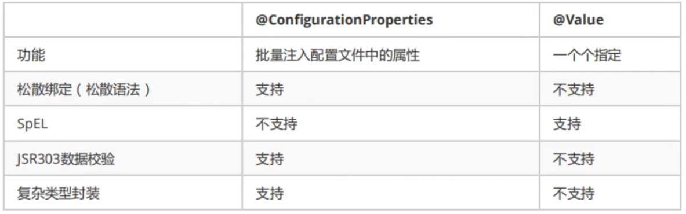
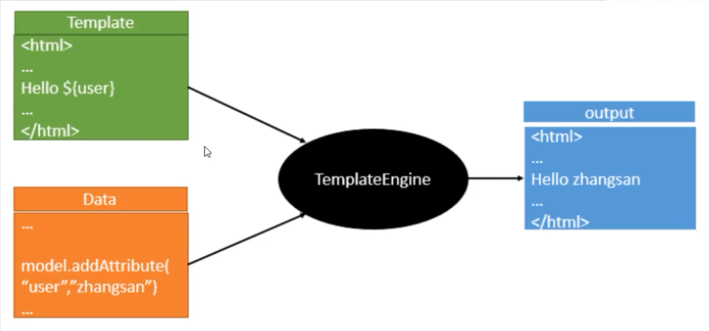

# 1、SpringBoot 与微服务

## 1.1、SpringBoot 简介

所有的技术框架的发展都遵循了一个规律：从一个复杂应用场景衍生出一种规范框架，人们只需要进行各种配置而不需要自己去实现它，这时候强大的配置功能成了优点；发展到一定程度之后，人们根据实际生产应用情况，选取其中实用功能和设计精华，重构出一些轻量级的框架；之后为了提高开发效率，嫌弃原先的各类配置过于麻烦，于是开始提倡 “约定大于配置” ，进而衍生出一些一站式的解决方案。 

<!--more-->

<font size=4 style="font-weight:bold;background:yellow;">什么是Spring Boot？</font>

随着 Spring 不断的发展，涉及的领域越来越多，项目整合开发需要配合各种各样的文件，慢慢变得复杂，违背了最初的理念，人称 ”配置地狱“ 。SpringBoot 正是在这样的一个背景下被抽象出来的开发框架，目的是更容易的使用 Spring ，更容易的集成各种常用的中间件、开源软件，简化开发。

SpringBoot 以约定大于配置的核心思想，默认的进行了很多设置，多数 SpringBoot 应用只需要很少的 Spring 配置。同时它集成了大量常用的第三方库配置，几乎可以零配置开箱即用。

Spring Boot 基于 Spring 开发，SpringBoot 本身并不提供 Spring 框架的核心特性以及扩展功能，只是用于快速、敏捷地开发新一代基于 Spring 框架的应用程序。它并不是用来替代 Spring 的解决方案，而是和 Spring 框架紧密结合用于提升 Spring 开发者体验的工具。

<font size=4 style="font-weight:bold;background:yellow;">Spring Boot的主要优点</font>

- 开箱即用，提供各种默认配置来简化项目配置，入门简单；
- 内嵌式容器简化 Web 项目；
- 没有冗余代码生成和 xml 配置的要求。

## 1.2、微服务简介

<font size=4 style="font-weight:bold;background:yellow;">什么是微服务?</font>

微服务是一种架构风格，微服务要求在开发一个应用的时候必须构建成一系列小服务的组合，可以通过 http 的方式进行互通。

<font size=4 style="font-weight:bold;background:yellow;">架构风格</font>

- MVC 三层架构：将服务分为三层，model，view，controller 层。

- MVVM 前端架构

- 微服务架构：将服务拆成一个个的微服务。每一个微服务对应原来的业务：比如将业务 userService 拆分成模块，controller 层提供接口，很多的接口部署在不同的电脑上，类似于网状结构，将原来的业务再拆分，拆分成模块。


要说微服务架构，先得说说过去的单体应用架构。

**单体应用架构**

单体应用架构（all in one）是指将一个应用的中的所有应用服务都封装在一个应用中，把数据库访问、web 访问等等各个功能放到一个 war 包内。

- **优点：**易于开发和测试；也十分方便部署；当负载能力不行需要扩展时，只需要将 war 复制多份，然后放到多个服务器上进行负载均衡。
- **缺点：**哪怕要修改一个非常小的地方，都需要停掉整个服务，重新打包、部署这个应用war包。特别是对于一个大型应用，不可能把所有内容都放在一个应用里面，如何维护，如何分工合作都是问题。

**微服务架构**

微服务架构把每个功能元素独立出来。**把独立出来的功能元素的动态组合，需要的功能元素才去拿来组合，需要多一些时可以整合多个功能元素**，所以微服务架构是对**功能元素**进行复制，而没有对**整个应用**进行复制。实现**高内聚，低耦合**！

**优点：**节省了调用资源，每个功能元素的服务都是一个可替换的、 可独立升级的软件代码。

<font size=4 style="font-weight:bold;background:yellow;">如何构建微服务？</font>

一个大型系统的微服务架构，就像一个复杂交织的神经网络，每个神经元就是一个功能元素，它们各自完成自己的功能，然后通过 http 相互请求调用。

比如一个电商系统，查缓存、连数据库、浏览页面、结账、支付等服务都是一个个独立的功能服务，都被微化了，它们作为一个个微服务共同构建了一个庞大的系统，如果修改其中的一个功能，只需要更新升级其中一个功能服务单元即可。

但是这种庞大的系统架构给部署和运维带来很大的难度，spring 为我们带来了构建大型分布式微服务的全套产品。

- 构建一个个功能独立的微服务应用单元，可以使用 SpringBoot，可以帮我们快速构建一 个应用；
- 大型分布式网络服务的调用，这部分由 SpringCloud来完成，实现分布式；
- 在分布式中间，进行流式数据计算、批处理，有 SpringCloud Data Flow。

Martin Flower 关于微服务的论文：https://www.cnblogs.com/liuning8023/p/4493156.html

# 2、Hello, SpringBoot！

<font size=4 style="font-weight:bold;background:yellow;">SpringBoot 项目的创建</font>

- 使用 SpringInitializr 网站（https://start.spring.io/），填写项目信息，在线创建下载到本地后用 IDEA 打开。

- 使用 IDEA 直接创建，选择 Spring Initializr，其实同样是从官网进行创建，IDEA 集成了这个网站。


<font size=4 style="font-weight:bold;background:yellow;">项目文件介绍</font>

`项目名+Application.java` 是 SpringBoot 的启动类，是程序的主入口， 可以直接运行：

```java
package com.haining820.hellospringboot;
import org.springframework.boot.SpringApplication;
import org.springframework.boot.autoconfigure.SpringBootApplication;

@SpringBootApplication
public class HellospringbootApplication {
    public static void main(String[] args) {
        SpringApplication.run(HellospringbootApplication.class, args);
    }
}
```

**这个类主要做了以下四件事情：**

- 推断应用的类型是普通的项目还是 Web 项目；

- 查找并加载所有可用初始化器，设置到 initializers 属性中；

- 找出所有的应用程序监听器，设置到 listeners 属性中；

- 推断并设置 main 方法的定义类，找到运行的主类；

- `main/resources` 包下的 `application.properties`：配置文件，之后会用 SpringBoot 推荐的 yaml 文件代替；

- test 包下的 `项目名+ApplicationTest.java`：测试类。

<font size=4 style="font-weight:bold;background:yellow;">编写测试接口</font>

启动类同级目录下建 controller 包，存放接口代码。运行启动类之后在浏览器中打开接口：`http://localhost:8080/hello`

```java
@RestController
public class HelloController {
    @RequestMapping("/hello")
    public String hello(){
        return "Hello,SpringBoot!";
    }
}
```

<font size=4 style="font-weight:bold;background:yellow;">依赖 pom.xml</font>

**pom.xml 由以下四个部分组成：**

- 项目元数据信息：创建时候输入的 Project Metadata 部分，也就是 Maven 项目的基本元素，包括 groupld、artifactld、version、name、description 等；
- parent：继承 spring-boot-starter-parent 的依赖管理，控制版本与打包等内容，SpringBoot 核心依赖在父工程中；
- dependencies：项目的具体依赖，spring-boot-starter 是 SpringBoot 的启动器，所有的 SpringBoot 依赖都是以 spring-boot-starter 为开头的，SpringBoot 会将所有的功能场景封装成一个个的启动器（starter），当需要使用这些功能时，只需要找到对应的 starter 即可。
  - spring-boot-starter-web：会自动导入 web 环境所有的依赖，用于实现 HTTP 接口（该依赖中包含 SpringMVC），官网对它的描述是：使用 SpringMVC 构建 Web，应用程序的入门者，使用 Tomcat 作为默认嵌入式容器； 
  - spring-boot-starter-test：用于编写单元测试的依赖包。
- build：构建配置部分。默认使用了 `spring-boot-maven-plugin`，配合 `spring-boot-starter-parent` 就可以把 SpringBoot 应用打包成 jar 来直接运行。

可以选择 maven 中的 package 将程序打包为 jar 包，得到的 jar 包仍然是一个可以独立运行的程序，在 target 文件夹中进行运行，可以使用 `java -jar '***.jar'` 不依赖 IDEA 直接运行。

<font size=4 style="font-weight:bold;background:yellow;">个性化配置</font>

- 配置端口号，可在 `application.properties` 中进行修改。

  ```properties
  # 更改项目的端口号
  server.port=8081
  ```

- 配置 SpringBoot 项目启动时的图案，在 resources 目录下新建 `banner.txt` ，将想要的图案放入即可。[ASCII 文字生成网站](https://www.bootschool.net/ascii)

# 3、SpringBoot 自动装配原理

# 4、yaml

yaml 是 Spring 推荐的配置文件格式，配置文件的作用是修改 SpringBoot 自动配置的默认值，因为 SpringBoot 的底层都已经自动配置好了，SpringBoot 配置文件的官方的配置比较多，要掌握原理。

### 4.1、yaml 语法

properties 的语法结构是 `key = value`，而 yaml 的语法结构如下，yaml 对空格的要求极其严格，用空格代表层级关系。

```yaml
# key+英文冒号+空格+value
key: value

# 普通的key-value
name: yuhaiyang

# 用yaml表示对象
student:
  name: yuhaiyang
  age: 18
  
# 表示对象的行内写法
student: {name: yuhaiyang,age: 18}

# 用yaml表示数组
pets:
  - cat
  - dog
  - pig
  
# 表示数组的行内写法
pets: [cat,dog,pig]
```

### 4.2、yaml 注入

**yaml 文件更强大的地方在于，可以给实体类直接注入匹配值！**

<font size=4 style="font-weight:bold;background:yellow;">传统注入方式</font>

编写一个实体类 Dog

```java
@Component
@Data
@AllArgsConstructor
@NoArgsConstructor
public class Dog {
    private String name;
    private Integer age;
}
```

以下是原来给 bean 注入属性值的方法，要在成员变量上使用 `@Value` 注解

```java
@Value("大黄")
private String name;
@Value("3")
private Integer age;
```

测试

```java
@SpringBootTest
class Springboot02ConfigApplicationTests {
    @Autowired
    private Dog dog;
    @Test
    void contextLoads() {
        System.out.println(dog);	// 输出结果：Dog(name=大黄, age=3)
    }
}
```

<font size=4 style="font-weight:bold;background:yellow;">yaml 方式注入</font>

将 resources 目录下的 application.properties 文件删掉，新建 application.yaml 文件。

编写一个 Person 实体类，这个实体类的属性多一些。

```java
@Component
@Data
@AllArgsConstructor
@NoArgsConstructor
public class Person {
    private String name;
    private Integer age;
    private Boolean happy;
    private Date birth;
    private Map<String,Object> maps;
    private List<Object> lists;
    private Dog dog;
}
```

使用 yaml 的方式对 Person 进行注入，对`application.yaml` 文件进行修改。

```yaml
person:
  name: yuhaiyang
  age: 18
  happy: false
  birth: 2000/09/17
  maps: {k1: v1,k2: v2}
  lists:
    - code
    - girl
    - music
  dog:
    name: 旺财
    age: 1
```

在 Person 实体类上方加入 `@ConfigurationProperties` 注解与 yaml 文件进行绑定，如果不配置直接加上后会报红（其实不影响），在依赖中加入以下内容后重启 IDEA 即可。

```xml
<!-- 导入配置文件处理器，配置文件进行绑定就会有提示，需要重启 -->
<dependency>
    <groupId>org.springframework.boot</groupId>
    <artifactId>spring-boot-configuration-processor</artifactId>
    <optional>true</optional>
</dependency>
```

`@ConfigurationProperties` 注解将配置文件中配置的每一个属性的值，映射到这个组件中，告诉 SpringBoot 将本类中所有属性和配置文件中相关的配置进行绑定。通过 **`prefix` 参数**将实体类与 yaml 文件中的 person 属性进行绑定。

```java
@ConfigurationProperties(prefix = "person")
```

<font size=4 style="font-weight:bold;background:yellow;">测试</font>

```java
@Autowired
private Person person;
@Test
void contextLoads2() {
    System.out.println(person);
}
// 输出结果：Person(name=yuhaiyang, age=18, happy=false, birth=Sun Sep 17 00:00:00 CST 2000, maps={k1=v1, k2=v2}, lists=[code, girl, music], dog=Dog(name=旺财, age=1))
```

<font size=4 style="font-weight:bold;background:yellow;">注意</font>

- 将 yaml 配置文件的 **key 值** 和 **实体类中的属性值**设置为不一样，结果中对象的属性是 null，会注入失败。`lists/list`


  - 如果 Person 有多套注入值，可以再配置一个person2，然后将使用 `@ConfigurationProperties(prefix = "person2")` 指向 person2，即可将person2 注入到 Person 对象中。


  - 配置文件中还可以使用 el 表达式。

    `${person.hello:other}_旺财` 表示的意思是：如果 yaml 文件中 person 有 hello 这一属性，则 name 为 `hello属性的值_旺财`，否则使用默认的名字 other，同样会后接旺财，即 `other_旺财`。
    
    ```java
    dog=Dog(name=other_旺财, age=1))	// person下面无hello属性
    dog=Dog(name=hahaha_旺财, age=1))	// person下面hello属性为hahaha
    ```
    
    ```yaml
    person:
      name: yuhaiyang${random.uuid} # 随机uuid
      age: ${random.int} # 随机int
      happy: false
      birth: 2000/09/17
      maps: {k1: v1,k2: v2}
      lists:
        - code
        - girl
        - music
      dog:
        name: ${person.hello:other}_旺财
        age: 1
    ```


### 4.3、properties 注入

> properties配置文件在写中文的时候，会有乱码，需要去 IDEA 中设置编码格式为UTF-8：设置中搜索 encoding 找到 File Encodings 进行配置。

新建一个类似于之前的 Dog 实体类 Cat 和 mycat.properties 配置文件。

```properties
name=小咪咪
age=100
```

在实体类上加上 `@PropertySource` 注解，并在后边的 value 表明对应的配置文件；

```java
@Component
@Data
@AllArgsConstructor
@NoArgsConstructor
@PropertySource(value = "classpath:mycat.properties")
public class Cat {
    @Value("${name}")
    private String name;
    @Value("${age}")
    private int age;
}
```

测试

```java
Cat(name=小咪咪, age=100)
```

### 4.4、对比：yaml 方式注入的优点



@Value 这个注解使用起来并不友好，需要为每个属性单独注解赋值，比较麻烦！

- `@ConfigurationProperties` 注解只需要写一次即可 ， 批量注入文件中的属性，`@Value` 则需要每个字段都添加，需要一个个指定；

- yaml 支持松散绑定：比如我的 yaml 中写的 key 值为 `last-name`，这个和 实体类中 `lastName` 是一样的，`-` 后面跟着的字母默认是大写的。

- JSR303 数据校验，我们可以在字段是增加一层过滤器验证，可以保证数据的合法性。

- 复杂类型封装，yaml 中可以封装对象，使用 `@Value` 就不支持。

**结论**

- 配置 yml 和配置 properties 都可以获取到值 ， 强烈推荐 yaml；
- 如果在某个业务中，只需要获取配置文件中的某个值，可以使用一下 `@Value`；
- 专门编写了一个 JavaBean 来和配置文件进行一一映射，就直接使用 `@ConfigurationProperties`。

### 4.5、扩展：JRS303数据校验

SpringBoot 中可以用 `@Validated` 注解来校验数据，如果数据异常则会统一抛出异常，方便异常中心统一处理。`@Email` 是让 name 只能支持 Email 格式的一个注解。

```java
@Component //注册bean
@ConfigurationProperties(prefix = "person")
@Validated //数据校验
public class Person {
    @Email(message="邮箱格式错啦!") // @Email规定name必须是邮箱格式，message是自己定义的错误提示信息。
    private String name;
}
```

`@Email` 报错的话需要加入以下依赖

```xml
<dependency>
    <groupId>org.springframework.boot</groupId>
    <artifactId>spring-boot-starter-validation</artifactId>
</dependency>
```

下面是数据校验的常见使用，除此以外，还可以自定义一些数据校验规则，在需要使用时查看源码可以看到全部可用注解及其使用方法。

```java
@NotNull(message="名字不能为空")
private String userName;
@Max(value=120,message="年龄最大不能超过120")
private int age;
// Bean Validation中内置的constraint
@Null      		// 被注释的元素必须是null
@NotNull   		// 被注释的元素必须不是null，无法查检长度为0的字符串。
@AssertTrue   	// 被注释的元素必须是true
@AssertFalse  	// 被注释的元素必须是false
@Min(value)	 	// 被注释的元素必须是一个数字，其值必须大于等于指定的最小值
@Max(value)	 	// ------------------------------小于等于指定的最大值
@Size(min, max) // 被注释的元素（Array,Collection,Map,String）的大小必须在给定的范围之内
@Past     		// 被注释的Date或Calendar对象必须在当前时间之前
@Future   		// 被注释的Date或Calendar对象必须在当前时间之后
@Pattern(value) // 被注释的元素必须符合指定的正则表达式
// Hibernate Validator附加的constraint
@Email				// 被注释的元素必须是电子邮件地址
@Length(min, max)   // 被注释的字符串大小必须在指定范围之内
@NotEmpty  			// 被注释的字符串必须非空
@Range				// 被注释的元素必须在合适的范围内
```

# 5、多环境配置

多位置的配置文件的优先级顺序如下，高优先级的配置会覆盖低优先级的配置，SpringBoot 会从这四个位置全部加载住配置文件，互补配置。

```bash
1- file:./config/		# 项目下的config目录	
2- file:./				# 项目根目录
3- classpath:/config/	# resources下的config目录
4- classpath:/			# resources根目录
```

<font size=4 style="font-weight:bold;background:yellow;">多环境配置优先级</font>

- properties

  假设有多个配置文件：`application.properties`、`application-dev.properties`、`application-test.properties`，可以在 `application.properties` 中通过以下代码对配置文件进行选择。

    ```properties
    spring.profiles.active=dev
    ```

- yaml

  可以使用 `---` 进行分割，少量配置可以这么用，多了还是要分开写。

  ```yaml
  server:
    port: 8081
  spring:
    profiles:
      active: dev
  
  ---
  server:
    port: 8082
  spring:
    profiles: dev
  
  ---
  server:
    port: 8083
  spring:
    profiles: test
  ```

# 6、SpringBoot Web 开发

## 6.1、静态资源导入

resource > static（默认） > public

在 templates 目录下的所有页面，只能通过 controller 来跳转!

## 6.2、首页和图标定制

# 8、Thymeleaf 模板引擎

Thymeleaf 官网：https://www.thymeleaf.org/ 

Thymeleaf 在Github 的主页：https://github.com/thymeleaf/thymeleaf 

Spring官方文档（注意版本）：https://docs.spring.io/spring-boot/docs/2.2.5.RELEASE/reference/htmlsingle/#using-boot-starter

模板引擎作用：写一个页面模板，这个页面模板中会有一些表达式，用于显示动态的数据；表达式中的数据与模板是分开的，数据由我们自己来组装；将模板与数据交给模板引擎，模板引擎按照数据将表达式解析，填充到指定位置，最终将数据生成一个需要的内容输出出去，这就是模板引擎。无论是 jsp 还是其他模板引擎，都是这个思想，SpringBoot 推荐的模板引擎就是 Thymeleaf 模板引擎，语法更简单，功能更强大。



需要使用 thymeleaf，导入对应依赖即可（SpringBoot 2.6.3 -> thymeleaf 3.0.14）

```xml
<dependency>
    <groupId>org.springframework.boot</groupId>
    <artifactId>spring-boot-starter-thymeleaf</artifactId>
</dependency>
```

将 html 页面 放在 templates 目录下即可

```java
// ThymeleafProperties.class
public static final String DEFAULT_PREFIX = "classpath:/templates/";
public static final String DEFAULT_SUFFIX = ".html";
```


SpringBoot 在自动配置很多组件的时候，先看容器中有没有用户自己配置的（如果用户自己配置 `@bean`），如果有就用用户配置的，如果没有就用自动配置的;如果有些组件可以存在多个，比如我们的视图解析器，就将用户配置的和自己默认的组合起来！

在 SpringBoot 中，有非常多的 `xxConfiguration` 帮助进行配置的扩展，看见这个就要注意，看看扩展了什么功能。

# 6、员工管理系统

<font size=4 style="font-weight:bold;background:yellow;">资源导入</font>

首先将页面放到 templates 目录下方，将静态资源放到 static 下方

</font>首页配置<font size=4 style="font-weight:bold;background:yellow;">

所有页面的静态资源都由 thymeleaf 接管 `th:`；所有的 url 要使用 `@{}` 符号。

</font>页面国际化<font size=4 style="font-weight:bold;background:yellow;">

- 首先确认项目的编码全部都是 utf-8（在设置搜索 encoding 查看）

- 在 resource 目录下新建 i18n 文件夹（i18n -> internationalization），配置 i18n 文件；

  新建 `login.properties` 、`login_en_US.properties`、`login_zh_CN.properties` 配置文件，系统会自动将其合并到同一个文件夹 `Resource Bundle 'login'` 当中，可以安装 Resource Bundle 插件对配置文件中的属性进行哦统一配置。

  ```properties
  login.btn=登录
  login.password=密码
  login.remember=记住我
  login.tip=请登录
  login.username=用户名
  ```

- 在 application.properties 中进行配置，指定国际化文件的位置，这样才能进行绑定识别；

  ```properties
  # 配置国际化，配置文件的真实位置
  spring.messages.basename=i18n.login
  ```

- 如果需要在项目中进行按钮自动切换语言，需要自定义国际化组件 `MyLocaleResolver` 实现 `LocaleResover` 接口，并将该组件配置到 Spring 容器中 `@Bean`注册；

  ```java
      @Override
      public Locale resolveLocale(HttpServletRequest request) {
          // 获取请求参数的国际化参数
          String language = request.getParameter("lang");
  //        System.out.println("==>"+language);
          Locale locale = Locale.getDefault();    // 如果没有就使用默认的
          if (!StringUtils.isEmpty(language)) {   // 判断请求的连接是否携带国际化参数
              // 将国际化的参数拆分成国家和地区，zh_CN->zh CN
              String[] split = language.split("_");
              locale = new Locale(split[0],split[1]);
          }
          return locale;
      }
  ```

  ```java
      // 使自定义的国际化组件生效
      @Bean
      public LocaleResolver localeResolver(){
          return new MyLocaleResolver();
      }
  ```

- `#{}` 表达式与 `th:text` 一起使用，加载数据源中的国际化消息，用于国际化。

<font size=4 style="font-weight:bold;background:yellow;">拦截器</font>

原理与国际化类似，需要自定义拦截器组件并进行注册后即可使用。

<font size=4 style="font-weight:bold;background:yellow;">展示员工列表</font>

- 因为 dashboard 与员工列表展示的顶栏和侧边栏是相同的，所以可以提取公共页面，减少代码，将公共页面部分放在新建页面 commons.html 下并单独储存，然后标签添加以下内容使其可以被抽取；

  ```html
  th:fragment="topbar"
  ```

  然后在需要该部分的页面中进行调用；还可以在调用时传递参数，在 commons 中进行识别，达到不同页面调用时对页面做出部分修改的效果；

  ```html
  <div th:replace="~{commons/commons::topbar}"></div>
  ```

- 修改表头`<th>`，使用 thymeleaf 中的 `th:each` 将 model 中的 员工查询结果 emps 遍历出来，放在 `<td>` 中显示在前端页面上。

# 6、Spring Data

**SpringBoot 整合 JDBC**

新建项目勾选 SQL 中的 JDBC API 和 MySQL Driver

# 7、Druid 数据源

```xml
<!-- https://mvnrepository.com/artifact/com.alibaba/druid -->
<dependency>
    <groupId>com.alibaba</groupId>
    <artifactId>druid</artifactId>
    <version>1.1.21</version>
</dependency>
```


使用方法：在 yml 文件中指定 datasource 的 type。


**DruidConfig **

# 8、SpringBoot-MyBatis

[官方文档](http://mybatis.org/spring-boot-starter/mybatis-spring-boot-autoconfigure/ )

[Maven仓库地址](https://mvnrepository.com/artifact/org.mybatis.spring.boot/mybatis-spring-bootstarter/2.1.1)

新建项目勾选 Spring Web 和 SQL 中的 JDBC API 和 MySQL Driver

**整合步骤**

1、导入 MyBatis 依赖 mybatis-spring-boot-starter

```xml
<dependency>
    <groupId>org.mybatis.spring.boot</groupId>
    <artifactId>mybatis-spring-boot-starter</artifactId>
    <version>2.1.1</version>
</dependency>
```

2、配置数据库连接信息（与之前的相同）

```yaml
spring:
  datasource:
  username: root
  password: 123456
    # ?serverTimezone=UTC解决时区的报错
    url: jdbc:mysql://localhost:3306/springboot?serverTimezone=UTC&useUnicode=true&characterEncoding=utf-8
    driver-class-name: com.mysql.cj.jdbc.Driver
    type: com.alibaba.druid.pool.DruidDataSource
    
    #Spring Boot 默认是不注入这些属性值的，需要自己绑定
    #druid 数据源专有配置
    initialSize: 5
    minIdle: 5
    maxActive: 20
    maxWait: 60000
    timeBetweenEvictionRunsMillis: 60000
    minEvictableIdleTimeMillis: 300000
    validationQuery: SELECT 1 FROM DUAL
    testWhileIdle: true
    testOnBorrow: false
    testOnReturn: false
    poolPreparedStatements: true
    
    #配置监控统计拦截的filters，stat:监控统计、log4j：日志记录、wall：防御sql注入
    #如果允许时报错 java.lang.ClassNotFoundException:org.apache.log4j.Priority
    #则导入 log4j 依赖即可，Maven 地址：https://mvnrepository.com/artifact/log4j/log4j
    filters: stat,wall,log4j
    maxPoolPreparedStatementPerConnectionSize: 20
    useGlobalDataSourceStat: true
    connectionProperties:druid.stat.mergeSql=true;druid.stat.slowSqlMillis=500
```

3、测试数据库的连接。

4、创建实体类。

5、创建 mapper 目录以及对应的 mapper 接口。

6、创建对应的 mapper 映射文件。

7、maven 配置资源过滤问题。

8、编写 controller 进行测试。

# 9、SpringSecurity

shiro 与 SpringSecurity：类和名字不一样，功能类似。

# 10、Shrio

# 11、SpringBoot 中的事务

> - 