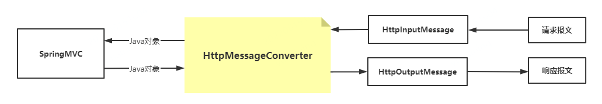
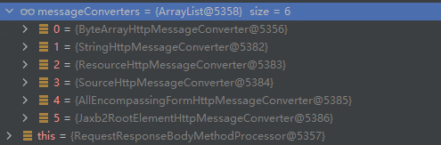
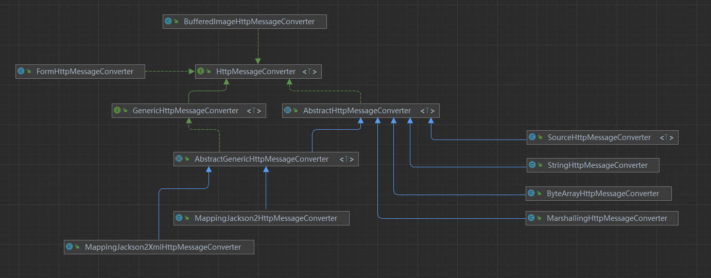
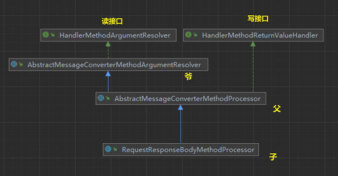

# MessageConverter

# 1、请求体和响应体

请求和响应都有对应的body，而这个body就是需要关注的主要数据。

<font size=4 style="font-weight:bold;background:yellow;">请求体</font>

**请求体**与**请求的查询参数**或者**表单参数**是不同的，

- **请求体**的表述一般就是一段字符串；
- 而**查询参数**可以看作url的一部分，这两个是位于请求报文的不同地方；

- **表单参数**可以按照一定格式放在请求体中，也可以放在url上作为查询参数。总之可以把请求体看作客户端通过请求报文捎带的字符串。

<font size=4 style="font-weight:bold;background:yellow;">响应体</font>

**响应体**则是浏览器渲染页面的依据，对于一个普通html页面得响应，响应体就是这个html页面的源代码。

<!--more-->

# 2、Accept 与 Content-Type

<font size=4 style="font-weight:bold;background:yellow;">含义</font>

- Accept 表示客户端希望接收的响应 body 类型，服务器可根据此字段选择合适的结果表述。

- Content-Type 代表客户端发送的 body 的数据类型。

  - 请求体和响应体都是需要配合 Content-Type 头部使用的，这个头部主要用于说明 body 中的字符串是什么格式的，比如：text，json，xml 等。

  - **对于请求报文，只有通过此头部，服务器才能知道怎么解析请求体中的字符串；**

  - **对于响应报文，浏览器通过此头部才知道应该怎么渲染响应结果，是直接打印字符串还是根据代码渲染为一个网页。**

<font size=4 style="font-weight:bold;background:yellow;">常见的媒体格式</font>

```bash
text/html   # HTML格式
text/plain  # 纯文本格式      
text/xml    # XML格式
image/gif   # gif图片格式    
image/jpeg  # jpg图片格式 
image/png   # png图片格式

application/xhtml+xml # XHTML格式
application/xml       # XML数据格式
application/atom+xml  # Atom XML聚合格式    
application/json      # JSON数据格式
application/pdf       # pdf格式  
application/msword    # Word文档格式
```

<font size=4 style="font-weight:bold;background:yellow;">比如</font>

- 表示希望接收的数据类型是 xml 格式，本次请求发送的数据的数据格式是 html。

```
Accept:text/xml;
Content-Type:text/html;
```

- 表示的是希望接收数据格式的顺序 最好先是 `application/xml`，不行的话使用 `application/json`。

```
Accept application/xml,application/json
```

-  接收任意类型。

```
accept:*/*`
```

- 一大段资源，在最后又加上了`*/*`：客户端支持这些类型，并指定了希望得到类型的优先级，如果没有，依次表达意愿。

```
"Accept", "image/gif, image/jpeg, image/pjpeg, ... application/msword, */*"，
```

<font size=4 style="font-weight:bold;background:yellow;">Accept/Content-Type 对于 Java</font>

对于 HttpServletRequest 和 HttpServletResponse，可以分别调用 getInputStream 和 getOutputStream 来直接获取 body，但是获取到的仅仅只是一段字符串。对于 Java 来说，处理一个对象肯定比处理一个字符串要更方便得也更好理解，Accept 与 Content-Type 的作用就是进行类型之间的转换：

- 根据 Content-Type 头部，将 body 字符串转换为 java 对象；
- 反过来，根据 Accept 头部，将 java 对象转换客户端期望格式的字符串。

SpringMVC 提供了多种 MessageConverter，用户也可以自己扩展实现，框架启动的时候，会装载能支持的各种 MessageConverter，请求来的时候，根据上述设置依次查找本地是否有对应的 MessageConverter，如果找到就用找到的 MessageConverter 返回对应的类型数据。

# 3、HttpMessageConverter

`HttpMessageConverter<T> `是 Spring 3.0 新添加的一个接口，负责将请求信息转换为一个T类型的对象，将T类型的对象输出为响应信息。其中`read`和`write`方法的参数分别有有`HttpInputMessage`和`HttpOutputMessage`对象，这两个对象分别代表着一次http通讯中的请求和响应部分。



```java
package org.springframework.http.converter;

import java.io.IOException;
import java.util.Collections;
import java.util.List;

import org.springframework.http.HttpInputMessage;
import org.springframework.http.HttpOutputMessage;
import org.springframework.http.MediaType;
import org.springframework.lang.Nullable;

/**
 * Strategy interface for converting from and to HTTP requests and responses.
 * @since 3.0
 * @param <T> the converted object type
 */
public interface HttpMessageConverter<T> {
	/**
	 * 判断该转换器是否能将请求内容转换成Java对象
	 */
	boolean canRead(Class<?> clazz, @Nullable MediaType mediaType);
    
	/**
	 * 判断该转换器是否可以将Java对象转换成返回内容
	 */
	boolean canWrite(Class<?> clazz, @Nullable MediaType mediaType);

	/**
	 * 获得该转换器支持的MediaType类型
	 */
	List<MediaType> getSupportedMediaTypes();

	default List<MediaType> getSupportedMediaTypes(Class<?> clazz) {
		return (canRead(clazz, null) || canWrite(clazz, null) ?
				getSupportedMediaTypes() : Collections.emptyList());
	}
    
	/**
	 * 将请求信息流转换为T类型的对象
	 */
	T read(Class<? extends T> clazz, HttpInputMessage inputMessage)
			throws IOException, HttpMessageNotReadableException;
    
	/**
	 * 将T类型的对象写到响应流中，同时指定相应的MediaType为contentType
	 */
	void write(T t, @Nullable MediaType contentType, HttpOutputMessage outputMessage)
			throws IOException, HttpMessageNotWritableException;
}
```

DispatcherServlet 默认装配 RequestMappingHandlerAdapter ，可以打断点查看默认装配的 HttpMessageConverter：





| 实现类                                 | 功能                                           | 读支持MediaType                     | 写支持MediaType                     |
| :------------------------------------- | :--------------------------------------------- | ----------------------------------- | ----------------------------------- |
| **StringHttpMessageConverter**         | 数据与String类型的相互转换                     | `text/*`                            | `text/plain`                        |
| **ByteArrayHttpMessageConverter**      | 数据与字节数组的相互转换                       | `*/*`                               | `application/octet-stream`          |
| FormHttpMessageConverter               | 表单与MultiValueMap的相互转换                  | `application/x-www-form-urlencoded` | `application/x-www-form-urlencoded` |
| **SourceHttpMessageConverter**         | 数据与javax.xml.transform.Source的相互转换     | `text/xml和application/xml`         | `text/xml和application/xml`         |
| MarshallingHttpMessageConverter        | 使用Spring的Marshaller/Unmarshaller转换xml数据 | `text/xml和application/xml`         | `text/xml和application/xml`         |
| MappingJackson2HttpMessageConverter    | 使用Jackson的ObjectMapper转换Json数据          | `application/json`                  | `application/json`                  |
| MappingJackson2XmlHttpMessageConverter | 使用Jackson的XmlMapper转换xml数据              | `application/xml`                   | `application/xml`                   |
| BufferedImageHttpMessageConverter      | 数据与java.awt.image.BufferedImage的相互转换   | `Java I/O API支持的所有类型`        | `Java I/O API支持的所有类型`        |

# 4、MessageConverter 的调用

对于消息转换器的调用，都是在 RequestResponseBodyMethodProcessor 类中完成的。它实现了HandlerMethodArgumentResolver 和 HandlerMethodReturnValueHandler 两个接口，分别实现了处理参数和处理返回值的方法。



（⬇折叠代码块）



```java
/**
 * Resolves method arguments annotated with {@code @RequestBody} and handles return
 * values from methods annotated with {@code @ResponseBody} by reading and writing
 * to the body of the request or response with an {@link HttpMessageConverter}.
 *
 * <p>An {@code @RequestBody} method argument is also validated if it is annotated
 * with {@code @javax.validation.Valid}. In case of validation failure,
 * {@link MethodArgumentNotValidException} is raised and results in an HTTP 400
 * response status code if {@link DefaultHandlerExceptionResolver} is configured.
 */
public class RequestResponseBodyMethodProcessor extends AbstractMessageConverterMethodProcessor {

   /**
    * 以下是四个重载的构造函数，使用super调用父类的构造方法
    * 传入List<HttpMessageConverter<?>> converters参数
    */
   public RequestResponseBodyMethodProcessor(List<HttpMessageConverter<?>> converters) {
      super(converters);
   }

   public RequestResponseBodyMethodProcessor(List<HttpMessageConverter<?>> converters,
         ContentNegotiationManager manager) {

      super(converters, manager);
   }

   public RequestResponseBodyMethodProcessor(List<HttpMessageConverter<?>> converters,
         List<Object> requestResponseBodyAdvice) {

      super(converters, null, requestResponseBodyAdvice);
   }

   public RequestResponseBodyMethodProcessor(List<HttpMessageConverter<?>> converters,
         ContentNegotiationManager manager, List<Object> requestResponseBodyAdvice) {

      super(converters, manager, requestResponseBodyAdvice);
   }

   /**
    * 然后重写读接口HandlerMethodArgumentResolver和写接口HandlerMethodReturnValueHandler中的两个方法
    */

   @Override
   public boolean supportsParameter(MethodParameter parameter) {
      return parameter.hasParameterAnnotation(RequestBody.class);
   }

   @Override
   public boolean supportsReturnType(MethodParameter returnType) {
      return (AnnotatedElementUtils.hasAnnotation(returnType.getContainingClass(), ResponseBody.class) ||
            returnType.hasMethodAnnotation(ResponseBody.class));
   }

   /**
    * Throws MethodArgumentNotValidException if validation fails.
    * @throws HttpMessageNotReadableException if {@link RequestBody#required()}
    * is {@code true} and there is no body content or if there is no suitable
    * converter to read the content with.
    */
   @Override
   public Object resolveArgument(MethodParameter parameter, ModelAndViewContainer mavContainer,
         NativeWebRequest webRequest, WebDataBinderFactory binderFactory) throws Exception {
      /**
       * 使用MessageConverter读取传入的参数，readWithMessageConverters方法调用在本类中被重写
       * 重写自爷爷类AbstractMessageConverterMethodArgumentResolver
       */
      Object arg = readWithMessageConverters(webRequest, parameter, parameter.getGenericParameterType());
      String name = Conventions.getVariableNameForParameter(parameter);

      WebDataBinder binder = binderFactory.createBinder(webRequest, arg, name);
      if (arg != null) {
         validateIfApplicable(binder, parameter);
         if (binder.getBindingResult().hasErrors() && isBindExceptionRequired(binder, parameter)) {
            throw new MethodArgumentNotValidException(parameter, binder.getBindingResult());
         }
      }
      mavContainer.addAttribute(BindingResult.MODEL_KEY_PREFIX + name, binder.getBindingResult());

      return arg;
   }

   @Override
   public void handleReturnValue(Object returnValue, MethodParameter returnType,
         ModelAndViewContainer mavContainer, NativeWebRequest webRequest)
         throws IOException, HttpMediaTypeNotAcceptableException, HttpMessageNotWritableException {

      mavContainer.setRequestHandled(true);
      ServletServerHttpRequest inputMessage = createInputMessage(webRequest);
      ServletServerHttpResponse outputMessage = createOutputMessage(webRequest);
	  /**
       * 使用MessageConverter将处理结果写出，writeWithMessageConverters方法调用的是父类
       */
      // Try even with null return value. ResponseBodyAdvice could get involved.
      writeWithMessageConverters(returnValue, returnType, inputMessage, outputMessage);
   }
    
   
   /**
    * 重写爷爷类的readWithMessageConverters方法
    */
   @Override
   protected <T> Object readWithMessageConverters(NativeWebRequest webRequest, MethodParameter methodParam,
         Type paramType) throws IOException, HttpMediaTypeNotSupportedException, HttpMessageNotReadableException {

      HttpServletRequest servletRequest = webRequest.getNativeRequest(HttpServletRequest.class);
      ServletServerHttpRequest inputMessage = new ServletServerHttpRequest(servletRequest);
      Object arg = readWithMessageConverters(inputMessage, methodParam, paramType);
      if (arg == null) {
         if (checkRequired(methodParam)) {
            throw new HttpMessageNotReadableException("Required request body is missing: " +
                  methodParam.getMethod().toGenericString());
         }
      }
      return arg;
   }

   protected boolean checkRequired(MethodParameter methodParam) {
      return methodParam.getParameterAnnotation(RequestBody.class).required();
   }
}
```



（⬇折叠代码块）



```java
	/**
	 * Writes the given return value to the given web request. Delegates to
	 * {@link #writeWithMessageConverters(Object, MethodParameter, ServletServerHttpRequest, ServletServerHttpResponse)}
	 */
	protected <T> void writeWithMessageConverters(T returnValue, MethodParameter returnType, NativeWebRequest webRequest)
			throws IOException, HttpMediaTypeNotAcceptableException, HttpMessageNotWritableException {

		ServletServerHttpRequest inputMessage = createInputMessage(webRequest);
		ServletServerHttpResponse outputMessage = createOutputMessage(webRequest);
		writeWithMessageConverters(returnValue, returnType, inputMessage, outputMessage);
	}

	/**
	 * Writes the given return type to the given output message.
	 * 将给出的return值转换为output
	 * @param value the value to write to the output message
	 * @param returnType the type of the value
	 * @param inputMessage the input messages. Used to inspect the {@code Accept} header.
	 * @param outputMessage the output message to write to
	 * @throws IOException thrown in case of I/O errors
	 * @throws HttpMediaTypeNotAcceptableException thrown when the conditions indicated by {@code Accept} header on
	 * the request cannot be met by the message converters
	 */
	

	/**
     * 方法参数ServletServerHttpRequest实现了ServerHttpRequest接口
     * 实现中用到了许多之前整理过的HttpServletRequest中的方法，实际上调用的就是HttpServletRequest
     */
	@SuppressWarnings("unchecked")
	protected <T> void writeWithMessageConverters(T value, MethodParameter returnType,
			ServletServerHttpRequest inputMessage, ServletServerHttpResponse outputMessage)
			throws IOException, HttpMediaTypeNotAcceptableException, HttpMessageNotWritableException {

        // 获得需要return的类型
		Class<?> clazz = getReturnValueType(value, returnType);
		Type type = getGenericType(returnType);

        /**
         * CharSequence是一个接口，常见的String、StringhBuilder、StringBuffer都实现了这个接口
         * 可以用String直接代替
         */
		if (value != null && value instanceof CharSequence) {
			clazz = String.class;
			type = String.class;
			value = (T) value.toString();
		}

       /**
        * 获得HttpServletRequest，并通过它获得MediaType
        * MediaType：媒体类型决定浏览器将以什么形式、什么编码对资源进行解析
        * text/html、text/plain、 application/xml...
        * Content-Type:也属于MediaType媒体类型，主要用于在请求头中指定资源的MediaType
        */
		HttpServletRequest servletRequest = inputMessage.getServletRequest();
		List<MediaType> requestedMediaTypes = getAcceptableMediaTypes(servletRequest);
		List<MediaType> producibleMediaTypes = getProducibleMediaTypes(servletRequest, clazz, type);

        // 如果value不为空但是MediaType是空的，抛出异常
		if (value != null && producibleMediaTypes.isEmpty()) {
			throw new IllegalArgumentException("No converter found for return value of type: " + clazz);
		}

		Set<MediaType> compatibleMediaTypes = new LinkedHashSet<MediaType>();
		for (MediaType requestedType : requestedMediaTypes) {
			for (MediaType producibleType : producibleMediaTypes) {
				if (requestedType.isCompatibleWith(producibleType)) {
					compatibleMediaTypes.add(getMostSpecificMediaType(requestedType, producibleType));
				}
			}
		}
		if (compatibleMediaTypes.isEmpty()) {
			if (value != null) {
				throw new HttpMediaTypeNotAcceptableException(producibleMediaTypes);
			}
			return;
		}
        List<MediaType> mediaTypes = new ArrayList<MediaType>(compatibleMediaTypes);
		MediaType.sortBySpecificityAndQuality(mediaTypes);

        /**
         * 找出最匹配的MediaType
         */
		MediaType selectedMediaType = null;
		for (MediaType mediaType : mediaTypes) {
			if (mediaType.isConcrete()) {
				selectedMediaType = mediaType;
				break;
			}
			else if (mediaType.equals(MediaType.ALL) || mediaType.equals(MEDIA_TYPE_APPLICATION)) {
				selectedMediaType = MediaType.APPLICATION_OCTET_STREAM;
				break;
			}
		}

		if (selectedMediaType != null) {
			selectedMediaType = selectedMediaType.removeQualityValue();
            // 遍历消息转换器
			for (HttpMessageConverter<?> messageConverter : this.messageConverters) {
				if (messageConverter instanceof GenericHttpMessageConverter) {
                    // 调用消息转换器的canWrite方法，根据返回值类型returnType和消息格式MediaType判断是否可以转换
					if (((GenericHttpMessageConverter<T>) messageConverter).canWrite(type,
							clazz, selectedMediaType)) {
						value = (T) getAdvice().beforeBodyWrite(value, returnType, selectedMediaType,
								(Class<? extends HttpMessageConverter<?>>) messageConverter.getClass(),
								inputMessage, outputMessage);
						if (value != null) {
							addContentDispositionHeader(inputMessage, outputMessage);
                             /**
                              * 如果对应的消息转换器匹配成功，使用write方法进行消息转换
                              * 将返回值被转换后的字符串写在response的输出流中
                              * 找不到对应的转换器会抛出异常，浏览器收到406状态码
                              */
							((GenericHttpMessageConverter<T>) messageConverter).write(value,
									type, selectedMediaType, outputMessage);
							if (logger.isDebugEnabled()) {
								logger.debug("Written [" + value + "] as \"" +
										selectedMediaType + "\" using [" + messageConverter + "]");
							}
						}
						return;
					}
				}
				else if (messageConverter.canWrite(clazz, selectedMediaType)) {
					value = (T) getAdvice().beforeBodyWrite(value, returnType, selectedMediaType,
							(Class<? extends HttpMessageConverter<?>>) messageConverter.getClass(),
							inputMessage, outputMessage);
					if (value != null) {
						addContentDispositionHeader(inputMessage, outputMessage);
						((HttpMessageConverter<T>) messageConverter).write(value,
								selectedMediaType, outputMessage);
						if (logger.isDebugEnabled()) {
							logger.debug("Written [" + value + "] as \"" +
									selectedMediaType + "\" using [" + messageConverter + "]");
						}
					}
					return;
				}
			}
		}
		if (value != null) {
			throw new HttpMediaTypeNotAcceptableException(this.allSupportedMediaTypes);
		}
	}
```



爷爷类中AbstractMessageConverterMethodArgumentResolver 的 readWithMessageConverter 方法会循序遍历所有HttpMessageConverter，调用其 `canRead()` 方法， 若返回true表示可以处理，一旦有某个HttpMessageConverter可以处理某一请求的参数MediaType，就用这个HttpMessageConverter的 `read()` 方法读取参数；

一旦处理完数据即将返回，又用同样的方法遍历HttpMessageConverter列表， 找出第一个 `canWrite()` 返回true的HttpMessageConverter，调用其 `write()` 方法返回给客户端。

# 5、HttpMessageConverter 初始化

> 寻找子类RequestResponseBodyMethodProcessor构造方法的调用者，会发现处理器适配器 RequestHandlerMapping 使用了该方法，从中可以找到 MessageConverter list 的来源。

- 在ApplicationContextrefresh期间，HttpMessageConverter开始初始化，初始化分别在三个类中进行：其中RequestMappingHandlerAdapter和HttpMessageConvertersAutoConfiguration是同时行的互不干扰，HttpMessageConverters的初始化需要在前两个类初始化完成后才能进行；
- RequestMappingHandlerAdapter初始化默认HttpMessageConverter列表
  - 调用所有WebMvcConfigurer类型的自定义配置类（@Configuration）的configureMessageConverters方法初始化 HttpMessageConverter列表；
  - 如果没有自定义的WebMvcConfigurer配置，调用addDefaultHttpMessageConverters方法初始化HttpMessageConverter列表，默认HttpMessageConverter列表都是根据ClassLoader中是否加载否一个特定类来判断某一个HttpMessageConverter是否需要加到默认列表中，并且在最后做了一下排序，仅仅是把xml类型的转换器放到了目前的HttpMessageConverter列表最后；
  - 调用所有WebMvcConfigurer类型的自定义配置类的extendMessageConverters方法扩展HttpMessageConverter列表，直接加在列表尾部
- HttpMessageConvertersAutoConfiguration类将所有HttpMessageConverter类型的组件(@Conponent/@Bean等)，初始化到一个有上下文提供的 HttpMessageConverter列表中；
- HttpMessageConverters初始化时，将2和3两个列表合并，如果上下文提供的和默认列表中有重复但对象并非是同一个，会把上下文提供的HttpMessageConverter和默认列表中的HttpMessageConverter放在相邻的位置，并且会把上下文提供的放在前面；把所有上下文提供的且不在默认列表中的HttpMessageConverter放在整个合并列表的最前面，上下文提供的HttpMessageConverter顺序由类上的`@Order(value=1)`注解指定，value值越小越靠前，优先级越高。

**RequestMappingHandlerAdapter 的构造方法**

在初始化的时候会向存储 HttpMessageConverter 的列表 messageConverters 中添加各种类型的消息转换器。

```java
	private List<HttpMessageConverter<?>> messageConverters;	// 成员变量之一

	public RequestMappingHandlerAdapter() {
		StringHttpMessageConverter stringHttpMessageConverter = new StringHttpMessageConverter();
		stringHttpMessageConverter.setWriteAcceptCharset(false);  // see SPR-7316

		this.messageConverters = new ArrayList<HttpMessageConverter<?>>(4);
		this.messageConverters.add(new ByteArrayHttpMessageConverter());
		this.messageConverters.add(stringHttpMessageConverter);
		this.messageConverters.add(new SourceHttpMessageConverter<Source>());
		this.messageConverters.add(new AllEncompassingFormHttpMessageConverter());
	}
```

（⬇折叠代码块）



```java
	/**
	 * Return the list of argument resolvers to use including built-in resolvers
	 * and custom resolvers provided via {@link #setCustomArgumentResolvers}.
	 */
	/**
	 * 获取默认的参数解析器，会将各种解析器resolver添加进去
	 */
	private List<HandlerMethodArgumentResolver> getDefaultArgumentResolvers() {
		List<HandlerMethodArgumentResolver> resolvers = new ArrayList<HandlerMethodArgumentResolver>();

		// Annotation-based argument resolution
		resolvers.add(new RequestParamMethodArgumentResolver(getBeanFactory(), false));
		resolvers.add(new RequestParamMapMethodArgumentResolver());
		resolvers.add(new PathVariableMethodArgumentResolver());
		resolvers.add(new PathVariableMapMethodArgumentResolver());
		resolvers.add(new MatrixVariableMethodArgumentResolver());
		resolvers.add(new MatrixVariableMapMethodArgumentResolver());
		resolvers.add(new ServletModelAttributeMethodProcessor(false));
        // RequestResponseBodyMethodProcessor在这里被调用
		resolvers.add(new RequestResponseBodyMethodProcessor(getMessageConverters(), this.requestResponseBodyAdvice));
		resolvers.add(new RequestPartMethodArgumentResolver(getMessageConverters(), this.requestResponseBodyAdvice));
		resolvers.add(new RequestHeaderMethodArgumentResolver(getBeanFactory()));
		resolvers.add(new RequestHeaderMapMethodArgumentResolver());
		resolvers.add(new ServletCookieValueMethodArgumentResolver(getBeanFactory()));
		resolvers.add(new ExpressionValueMethodArgumentResolver(getBeanFactory()));
		resolvers.add(new SessionAttributeMethodArgumentResolver());
		resolvers.add(new RequestAttributeMethodArgumentResolver());

		// Type-based argument resolution
		resolvers.add(new ServletRequestMethodArgumentResolver());
		resolvers.add(new ServletResponseMethodArgumentResolver());
		resolvers.add(new HttpEntityMethodProcessor(getMessageConverters(), this.requestResponseBodyAdvice));
		resolvers.add(new RedirectAttributesMethodArgumentResolver());
		resolvers.add(new ModelMethodProcessor());
		resolvers.add(new MapMethodProcessor());
		resolvers.add(new ErrorsMethodArgumentResolver());
		resolvers.add(new SessionStatusMethodArgumentResolver());
		resolvers.add(new UriComponentsBuilderMethodArgumentResolver());

		// Custom arguments
		if (getCustomArgumentResolvers() != null) {
			resolvers.addAll(getCustomArgumentResolvers());
		}

		// Catch-all
		resolvers.add(new RequestParamMethodArgumentResolver(getBeanFactory(), true));
		resolvers.add(new ServletModelAttributeMethodProcessor(true));

		return resolvers;
	}
```




> 流程：https://blog.csdn.net/qq_40244391/article/details/102808162
>
> 源码、自定义：https://www.jianshu.com/p/2f633cb817f5 、https://blog.csdn.net/w522301629/article/details/81128630
>
> 初始化、加载、时序图：https://blog.csdn.net/CL_YD/article/details/103938905


