# 1、MVC

## 1.1、什么是MVC

- MVC 是模型（Model）、视图（View）、控制器（Controller）的简写，是一种软件设计规范。 
- MVC 将业务逻辑、数据、显示分离的方法来组织代码。 
- MVC 主要作用是**降低了视图与业务逻辑间的双向耦合**，MVC 不是一种设计模式，**MVC 是一种架构模式**。

<!--more-->

**Model（模型）**

数据模型，提供要展示的数据，因此包含数据和行为，可以认为是领域模型或 JavaBean 组件（包含数据和行为），

现在一般都分离开来：Value Object（数据 Dao）和 服务层 （行为 Service），也就是模型提供了模型数据查询和模型数据的状态更新等功能，包括数据和业务。 （dao/service）

**View（视图）**

负责进行模型的展示，一般就是用户界面。 （jsp）

**Controller（控制器）**

接收用户请求，委托给模型进行处理，处理完毕后把返回的模型数据返回给视图，由视图负责展示，也就是说 Controller 做了个调度员的工作。 （servlet）

**最典型的 MVC 就是 JSP + servlet + javabean 的模式。**


## 1.2、MVC框架要做哪些事情

- 将 url 映射到 java 类或 java 类的方法；

- 封装用户提交的数据；

- 处理请求，调用相关的业务处理，封装响应数据；

- 将响应的数据进行渲染 jsp / html 等表示层数据。

# 2、传统 Servlet

## 2.1、HttpServlet

**HttpServlet 扩充的内容，使得代码书写更为简单。**

- 抽象类 HttpServlet 继承自抽象类 GenericServlet，而抽象类 GenericServlet 实现的是 Servlet 接口，所以 HttpServlet 其本质上也是一个 Servlet，是针对 HTTP 协议所定制的 servlet。

- 抽象类 GenericServlet 中有一个抽象 servixce 方法，参数分别是 ServletRequest 和 ServletResponse，在 HttpServlet 中进行了重写，这两个参数被转换成了 HttpServletRequest 和 HttpServletResponse。
  - HttpServletRequest 代表客户端的请求，用户通过 HTTP 协议访问服务器，HTTP 请求中的所有信息会被封装到 HttpServletRequest，通过这个 HttpServletRequest 的方法可以获得客户端的所有信息；
  - 如果要获取客户端请求过来的参数，用 HttpServletRequest；如果要给客户端响应一些信息，用 HttpServletResponse。
- 在 HttpServlet 中的上面说的另一个重载方法 ` service(HttpServletRequest req, HttpServletResponse resp)` 中，request 通过 `req.getMethod()` 获得请求方式，根据请求方式创建对应的 `doXxx()` 方法（doGet、doPost...）

```java
// GenericServlet 
public abstract void service(ServletRequest var1, ServletResponse var2) throws ServletException, IOException;
```

```java
// HttpServlet
public void service(ServletRequest req, ServletResponse res) throws ServletException, IOException {
    HttpServletRequest request;
    HttpServletResponse response;
    try {
        // 转换
        request = (HttpServletRequest)req;
        response = (HttpServletResponse)res;
    } catch (ClassCastException var6) {
        throw new ServletException("non-HTTP request or response");
    }
    // this.service：将参数转换为HttpServletRequest和HttpServletResponse后调用另一个重载方法
    this.service(request, response);
}
```

以上提到的各个类的关系如下所示：

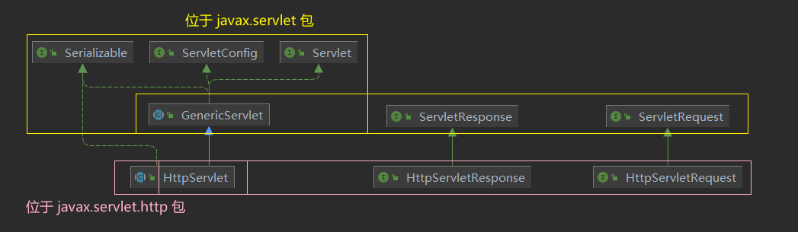

<font size=4 style="font-weight:bold;background:yellow;">响应流程</font>

```
1、Web客户向Servlet容器发出Http请求；
2、Servlet容器解析该Http请求；
3、Servlet容器创建一个HttpRequest对象，在这个对象中封装 Http 请求信息；
4、Servlet容器创建一个HttpResponse对象；
5、Servlet容器调用HttpServlet的service()，把HttpRequest和HttpResponse对象作为service方法的参数传给HttpServlet对象；
6、HttpServlet调用HttpRequest的有关方法，获取HTTP请求信息；
7、HttpServlet调用HttpResponse的有关方法，生成响应数据；
8、Servlet容器把HttpServlet 的响应结果传给Web客户；
9、其中HttpServlet首先必须读取Http请求的内容，Servlet 容器负责创建HttpServlet对象，并把Http请求直接封装到HttpServlet对象中。
```

## 2.2、测试 demo

**新建 module，点击 Add Frameworks Support 添加 Web Application 支持，导入依赖 `servlet-api`。**

**新建 HelloServlet 继承 HttpServlet 抽象类，重写 doGet()、doPost() 方法使用 HttpServletRequest 和 HttpServletResponse 处理用户的请求。**

- HelloServlet 将数据以键值对的形式保存在 `ServletContext` 中； 
- MyGetServlet 通过 `context.getAttribute ` 获取键值对的内容，通过 response 写回到前端；

```java
public class HelloServlet extends HttpServlet {
    @Override
    protected void doGet(HttpServletRequest req, HttpServletResponse resp) {
        // web容器在启动的时候,它会为每个web程序都创建一个对应的ServletContext对象,它代表了当前的web应用
        ServletContext context = this.getServletContext();
        // 将一个数据以键值对的形式保存在ServletContext中
        context.setAttribute("username","yuhaiyang");
    }
    @Override
    protected void doPost(HttpServletRequest req, HttpServletResponse resp) {
        doGet(req, resp);
    }
}
```

```java
public class MyGetServlet extends HttpServlet {
    @Override
    protected void doGet(HttpServletRequest req, HttpServletResponse resp) throws IOException {
        // 设置resp的格式
        resp.setContentType("text/html;charset=utf-8");
        ServletContext context = this.getServletContext();
        // 读取ServletContext中的数据
        String username = (String) context.getAttribute("username");
        resp.getWriter().print("名字: " + username);
    }
    @Override
    protected void doPost(HttpServletRequest req, HttpServletResponse resp) throws IOException {
        doGet(req, resp);
    }
}
```

**在 web.xml 中配置 servlet：**

- 前端先走 hello 请求，将数据放进 ServleContext 中，再走 getname 请求获取数据输出到前端。

```xml
    <servlet>
        <servlet-name>hello</servlet-name>
        <servlet-class>com.haining820.servlet.MyGetServlet</servlet-class>
    </servlet>
    <servlet-mapping>
        <servlet-name>hello</servlet-name>
        <url-pattern>/hello</url-pattern>
    </servlet-mapping>

    <servlet>
        <servlet-name>getname</servlet-name>
        <servlet-class>com.haining820.servlet.MyGetServlet</servlet-class>
    </servlet>
    <servlet-mapping>
        <servlet-name>getname</servlet-name>
        <url-pattern>/getname</url-pattern>
    </servlet-mapping>
```

# 3、SpringMVC 执行原理

> Spring MVC 是 Spring Framework 的一部分，是基于 Java 实现 MVC 的轻量级 Web 框架。
>
> 官方文档：https://docs.spring.io/spring-framework/docs/5.2.0.RELEASE/spring-framework-reference/web.html#spring-web

<font size=4 style="font-weight:bold;background:yellow;">Spring MVC 的特点</font>

- 简洁灵活，轻量级，简单易学 ；

- 高效，基于请求响应的 MVC 框架；

- 与 Spring 兼容性好，无缝结合；

- 约定优于配置；

- 功能强大：Restful、数据验证、格式化、本地化、主题等。

Spring 的 web 框架围绕 DispatcherServlet 调度 Servlet 设计，DispatcherServlet 的作用是**将请求分发到不同的处理器**。从 Spring 2.5 开始，使用 Java 5 或者以上版本的用户可以采用基于注解形式进行开发，十分简洁。

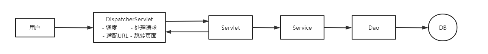

## 3.1、DispatcherServlet 

Spring 的 web 框架围绕 DispatcherServlet 设计，DispatcherServlet 的作用是将请求分发到不同的处理器。Spring MVC 框架像许多其他 MVC 框架一样，以请求为驱动，围绕一个中心 Servlet 分派请求及提供其他功能，DispatcherServlet 与 HttpServlet  类似，也是一个的 Servlet，层级关系如下。

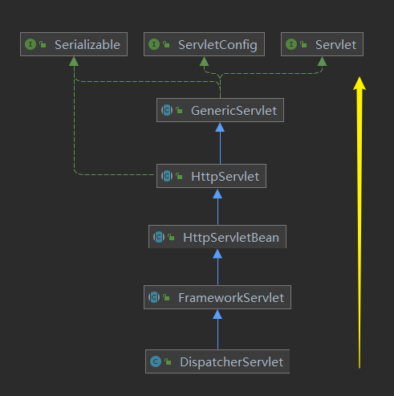

**SpringMVC 的原理如下图所示：** 

当发起请求时被前置的控制器拦截到请求，根据请求参数生成代理请求，找到请求对应的实际控制器，控制器处理请求，创建数据模型，访问数据库，将模型响应给中心控制器，控制器使用模型与视图渲染视图结果，将结果返回给中心控制器，再将结果返回给请求者。

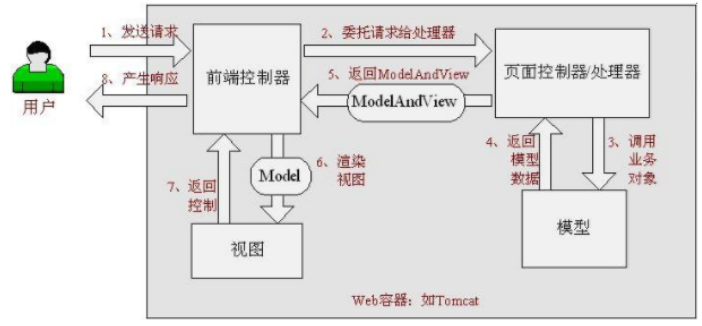

## 3.2、SpringMVC 执行原理

<font size=4 style="font-weight:bold;background:yellow;">执行流程</font>

```
1、前端控制器DispatcherServlet接受用户的请求并拦截
2、根据请求找到对应的映射器最终找到Controller
3、Controller调用业务层并返回信息（ModelAndView）给前端控制器
4、前端控制器调用视图解析器找到对应视图并将数据渲染。
```

<font size=4 style="font-weight:bold;background:yellow;">示意图</font>

黑色箭头表示 SpringMVC 框架提供的技术，不需要开发者实现，红色箭头表示需要开发者实现。

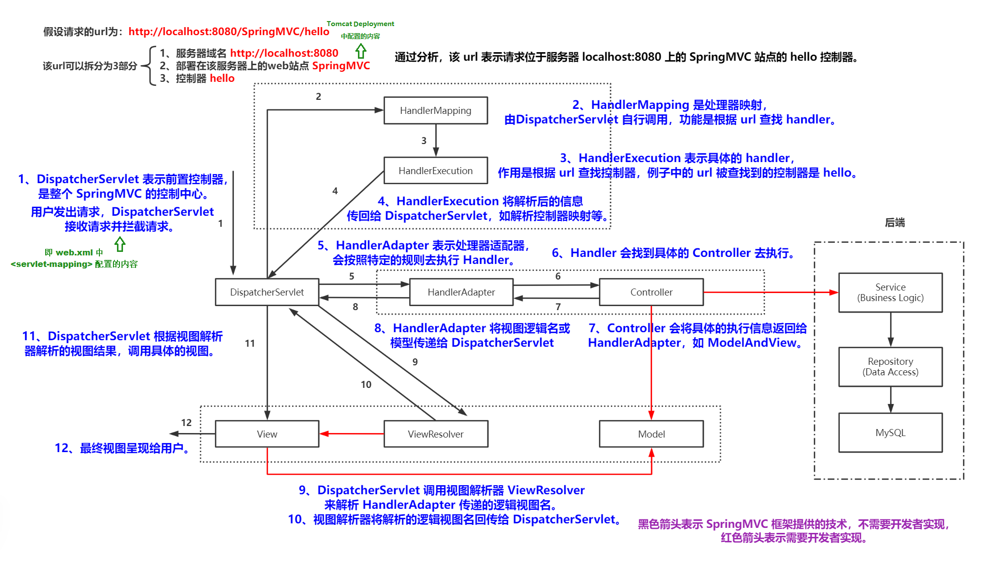

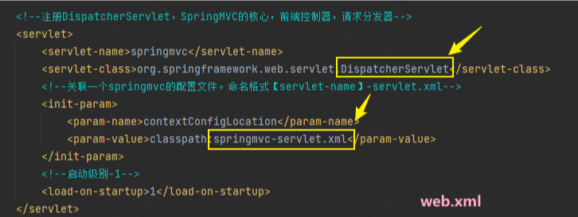

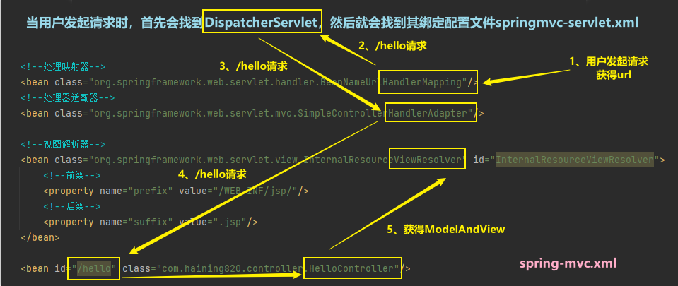

# 4、Hello, SpringMVC!（纯配置实现）

> 这个方式基本不使用，绝大多数情况下都使用注解来实现，主要是注意原理。

**实现控制器 Controller：**控制器复杂提供访问应用程序的行为，通常通过<font color='red' style="font-weight:bold;"> 接口定义 </font> 或 <font color='red' style="font-weight:bold;">注解定义 </font>两种方法实现。

- 控制器负责解析用户的请求并将其转换为一个模型返回给视图解析器；
- 在 SpringMVC 中一个控制器类可以包含多个方法；
- 在 SpringMVC 中，对于 Controller 的配置方式有很多种。

## 4.1、web.xml/spring-mvc.xml 配置

<font size=4 style="font-weight:bold;background:yellow;">配置 web.xml</font>

- 注册 DispatcherServlet，将其与 spring 配置文件 spring-mvc.xml 绑定；
- 在该配置文件中的 `<servlet-mapping>` 中：
  - `/` 只匹配所有的请求，不会匹配 jsp 页面；
  - `/*` 匹配所有的请求，包括 jsp 页面。

**假设当前要访问 `localhost:8080/hello.jsp`，由于 jsp 页面已经是一个完整的页面，可以直接访问，使用 `/*` 的话就会走 DispatcherServlet 然后走视图解析器 ViewResolver 对 jsp 页面进行拼接，会形成 hello.jsp.jsp... 导致无线死循环，所以一般写 `/` 就可以了。**

```xml
`<?xml version="1.0" encoding="UTF-8"?>
<web-app xmlns="http://xmlns.jcp.org/xml/ns/javaee"
         xmlns:xsi="http://www.w3.org/2001/XMLSchema-instance"
         xsi:schemaLocation="http://xmlns.jcp.org/xml/ns/javaee http://xmlns.jcp.org/xml/ns/javaee/web-app_4_0.xsd"
         version="4.0">

    <!--配置DispatcherServlet：SpringMVC的核心，前端控制器，请求分发器-->
    <servlet>
        <servlet-name>springmvc</servlet-name>
        <servlet-class>org.springframework.web.servlet.DispatcherServlet</servlet-class>
        <!--绑定springmvc的配置文件，建议命名格式【servlet-name】-servlet.xml-->
        <init-param>
            <param-name>contextConfigLocation</param-name>
            <param-value>classpath:springmvc-servlet.xml</param-value>
        </init-param>
        <!--设置启动级别为1-->
        <load-on-startup>1</load-on-startup>
    </servlet>

    <!--/ 匹配所有的请求（不包括.jsp）-->
    <!--/* 匹配所有的请求（包括.jsp->hello.jsp.jsp）-->
    <servlet-mapping>
        <servlet-name>springmvc</servlet-name>
        <url-pattern>/</url-pattern>
    </servlet-mapping>
    
</web-app>
```

<font size=4 style="font-weight:bold;background:yellow;">配置 springmvc-servlet.xml</font>

编写 SpringMVC 的配置文件（就是 Spring 的配置文件），命名要求：【servlet-name】-servlet.xml（springmvc-servlet.xml）

```xml
<?xml version="1.0" encoding="UTF-8"?>
<beans xmlns="http://www.springframework.org/schema/beans"
       xmlns:xsi="http://www.w3.org/2001/XMLSchema-instance"
       xsi:schemaLocation="http://www.springframework.org/schema/beans
http://www.springframework.org/schema/beans/spring-beans.xsd">
</beans>
```

- 添加**处理器映射器 BeanNameUrlHandlerMapping：**根据 bean 的名字进行查找（要为 HelloController 配置 bean）

  ```xml
  <bean class="org.springframework.web.servlet.handler.BeanNameUrlHandlerMapping"/>
  ```

- 添加**处理器适配器 HandlerAdapter**（显式配置，之后会省略）

  ```xml
  <bean class="org.springframework.web.servlet.mvc.SimpleControllerHandlerAdapter"/>
  ```

- 添加**视图解析器**，这里的 **InternalResourceViewResolver** 不是固定的，类似的还有 Thymeleaf，Freemarker 等，甚至还可以自定义一个视图解析器。

  DispatcherServlet 会将收到的 ModelAndView 交给视图解析器 ViewResolver，处理过程如下：

  - 获取 ModelAndView 的数据；
  - 解析 ModelAndView 视图名字；
  - 拼接视图名字，找到对应的视图 -> `/WEB-INF/jsp/hello.jsp`；
  - 将数据渲染到这个视图上。

  ```xml
  <bean class="org.springframework.web.servlet.view.InternalResourceViewResolver" id="InternalResourceViewResolver">
      <property name="prefix" value="/WEB-INF/jsp/"/>	<!--前缀-->
      <property name="suffix" value=".jsp"/>			<!--后缀-->
  </bean>
  ```

<font size=4 style="font-weight:bold;background:yellow;">完整版 springmvc-servlet.xml</font>

```xml
<?xml version="1.0" encoding="UTF-8"?>
<beans xmlns="http://www.springframework.org/schema/beans"
       xmlns:xsi="http://www.w3.org/2001/XMLSchema-instance"
       xsi:schemaLocation="http://www.springframework.org/schema/beans
http://www.springframework.org/schema/beans/spring-beans.xsd">
    <!--处理映射器-->
    <bean class="org.springframework.web.servlet.handler.BeanNameUrlHandlerMapping"/>
    <!--处理器适配器-->
    <bean class="org.springframework.web.servlet.mvc.SimpleControllerHandlerAdapter"/>
    <!--视图解析器-->
    <bean class="org.springframework.web.servlet.view.InternalResourceViewResolver" id="InternalResourceViewResolver">
        <!--前缀-->
        <property name="prefix" value="/WEB-INF/jsp/"/>
        <!--后缀-->
        <property name="suffix" value=".jsp"/>
    </bean>
    <bean id="/hello" class="com.haining820.controller.HelloController"/>
</beans>
```

<font size=4 style="font-weight:bold;background:yellow;">编写业务</font>

**在配置完毕后，正式编写业务之前，有必要好好了解一下 Controller。**

## 4.2、Controller 接口

> 最开始是没有 @Controller 注解的，最原生的方式是直接实现 Controller 接口。

**Controller：函数式接口，源码如下：**

```Java
// 包位置
package org.springframework.web.servlet.mvc;
// 之前在2.1、HttpServer中见到的HttpServletRequest与HttpServletResponse
import javax.servlet.http.HttpServletRequest;
import javax.servlet.http.HttpServletResponse;
// 可以为空
import org.springframework.lang.Nullable;
// 视图
import org.springframework.web.servlet.ModelAndView;

@FunctionalInterface
public interface Controller {
    /**
     * 函数式接口，通过HttpServletRequest与HttpServletResponse返回一个可以为空的ModelAndView
     * 处理请求，返回一个模型与视图对象
     */
	@Nullable
	ModelAndView handleRequest(HttpServletRequest request, HttpServletResponse response) throws Exception;
}
```

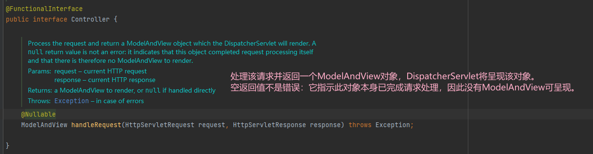

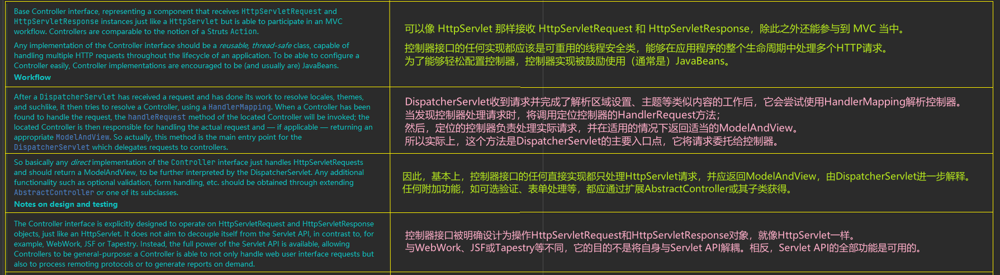

<font color='red' style="font-weight:bold;">实现了 Controller 接口的类，就是一个控制器，实现后需要返回一个 ModelAndView，即装数据，封视图。</font>

说白了，ModelAndView 实际上就是携带的数据，和这个数据要交给的哪个页面！

## 4.3、接口实现

<font size=4 style="font-weight:bold;background:yellow;">实现 Controller 接口</font>

```java
package com.haining820.controller;

import org.springframework.web.servlet.ModelAndView;
import org.springframework.web.servlet.mvc.Controller;
import javax.servlet.http.HttpServletRequest;
import javax.servlet.http.HttpServletResponse;
// 实现Controller接口
public class HelloController implements Controller {
    public ModelAndView handleRequest(HttpServletRequest request, HttpServletResponse response) throws Exception {
        // 模型和视图
        ModelAndView mv = new ModelAndView();
        // 封装对象，放在ModelAndView中
        mv.addObject("msg","Hello, SpringMVC!");
        // 封装要跳转的视图，放在ModelAndView中
        // 会自动加上前缀后缀拼接成 /WEB-INF/jsp/hello.jsp
        mv.setViewName("hello");
        return mv;
    }
}
```

将自己的类交给 SpringIOC 容器，注册 bean；

```xml
<bean id="/hello" class="com.haining820.controller.HelloController"/>
```

<font size=4 style="font-weight:bold;background:yellow;">编写页面，测试</font>

编写要跳转的 jsp 页面，显示 ModelandView 存放的数据，以及正常页面；

```jsp
<%@ page contentType="text/html;charset=UTF-8" language="java" %>
<html>
<head>
	<title>yhy</title>
</head>
<body>
	${msg}
</body>
</html>
```

运行，在浏览器中打开 `localhost:8080/hello`，提示 `Hello, SpringMVC!`。

<font size=4 style="font-weight:bold;background:yellow;">注意</font>

**可能会出现 404，解决：检查在输出的 out 文件夹中是否有 lib 目录，如果没有的话在 IDEA 的项目结构（File -> Project Structure -> Artifacts）中选择项目，在 WEB-INF 目录下添加 lib 目录，向 lib 目录中添加依赖即可解决问题。**

## 4.4、结果跳转方式

<font size=4 style="font-weight:bold;background:yellow;">ModelAndView</font>

设置 ModelAndView 对象，根据 view 的名称，和视图解析器跳到指定的页面（本节使用的方式）。

页面：【视图解析器前缀】 + viewName + 【视图解析器后缀】

<font size=4 style="font-weight:bold;background:yellow;">ServletAPI</font>

设置 ServletAPI , 不需要视图解析器。

> 这些方法都不常用，主要是为了说明在控制器中可以使用 HttpServletRequest 和 HttpServletResponse 。

- 通过 HttpServletResponse 进行输出

  ```java
  resp.getWriter.println("666");
  ```

- 通过 HttpServletResponse 实现重定向

  ```java
  resp.sendRedirect("/index.jsp");
  ```

- 通过 HttpServletRquest 实现转发

  ```java
  req.getRequestDispatcher("/WEB-INF/jsp/test.jsp").forward(req,rsp);
  ```

<font size=4 style="font-weight:bold;background:yellow;">SpringMVC</font>

**通过SpringMVC来实现转发和重定向。**

- **无视图解析器**：测试前先将视图解析器注释掉。

    ```java
    @Controller
    public class ModelTest1 {
        @GetMapping("/m1/t2")
        public String test2(Model model){
            model.addAttribute("msg","ModelTest1");
    //        return "/WEB-INF/jsp/test.jsp";  			// 转发
    //        return "forward:/WEB-INF/jsp/test.jsp";   // 转发
            return "redirect:/index.jsp";  				// 重定向
        }
    }
    ```

- **有视图解析器**

    ```java
    @Controller
    public class ResultSpringMVC2 {
        @RequestMapping("/m2/t1")
        public String test1(){
            return "test";  // 转发
        }

        @RequestMapping("/m2/t2")
        public String test2(){
            return "redirect:/index.jsp";  //重定向
        }
    }
    ```

## 4.5、数据的提交与显示

<font size=4 style="font-weight:bold;background:yellow;">提交的是一个参数名</font>

- 域名称和参数名一致，后端可以接收到前端的参数，提交的数据如下

  ```
  http://localhost:8080/user/t1?name=yuhaiyang
  ```

  ```java
  @Controller
  @RequestMapping("user")
  public class UserController(){
      @GetMapping("/t1")
      public String hello(String name){
          model.Addatribute("msg",name);
          return "hello";
      }
  }
  ```

- 域名称和参数名不一致，当名称不一致时，后端就无法接收到请求参数，需要**使用 @RequestParam 注解**，在参数前加上 `@RequestParam("username")` ，在提交时就可以用 username 替换 name 了 。

  **注意**：加上之后就必须用指定的 username，不能用 name。

  ```
  http://localhost:8080/user/t1?username=yuhaiyang
  ```

  ```java
  @Controller
  @RequestMapping("user")
  public class UserController(){
      @GetMapping("/t1")
      public String test1(@RequestParam("username") String name){
          model.Addatribute("msg",name);
          return "hello";
      }
  }
  ```

- **建议：**无论前后端变量名是否相同都加上@RequestParam 注解，提示这个变量是前端的一个参数。

<font size=4 style="font-weight:bold;background:yellow;">提交的是一个对象</font>

要求提交的表单域和对象的属性名一致，参数使用对象即可，**但是前端传递的参数名和对象名必须一致，否则就是 null。**

**实体类**

```java
public class User {
    private int id;
    private String name;
    private int age;	// 构造，get/set，toString()
}
```

**处理方法**

```java
@Controller
@RequestMapping("user")
public class UserController(){
    @GetMapping("/t2");
    public String test2(User user){
        System.out.println(user);
        return "test";
    }  // 后台输出 User(id=1, name='yuhaiyang', age=16)
}
```

实体类中存储名字的变量是 name，下面这个url 中该字段是 username，后端接收不到，结果是 null；

```
http://localhost:8080/user/t2?username=yuhaiyang&id=1&age=16
```

下面这个 url 中所有的变量就都可以被接收到，顺序也可以调换，可以自动匹配。

```
http://localhost:8080/user/t2?name=yuhaiyang&id=1&age=16	
```

**小结：接收数据的执行流程**

- 接收前端用户传递的参数，判断参数的名字，假设名字直接在方法上，可以直接使用。
- 假设传递的是一个对象，则会匹配对象中的字段名，如果名字一致匹配成功，否则匹配不到。

<font size=4 style="font-weight:bold;background:yellow;">将数据显示到前端</font>

- 通过 ModelAndView（本节使用的方式）
- 通过 Model：使用注解时会用到；

- 通过 ModelMap，其实用起来一样

```java
@Controller
@RequestMapping("user")
public class UserController {
    @GetMapping("t3")
    public String Test(ModelMap map){
        map.addAttribute("msg","ModelMapTest");
        return "test";
    }
}
```

**对比**

- ModelAndView 可以在储存数据的同时，可以进行设置返回的逻辑视图，进行控制展示层的跳转；

- ModelMap 继承了 LinkedMap ，除了实现了自身的一些方法，同样的继承 LinkedMap 的方法和特性；

- Model 只有寥寥几个方法只适合用于储存数据，简化了新手对于 Model 对象的操作和理解。（大部分情况下都直接使用 Model）

# 5、Hello, SpringMVC！（注解实现）

**新建项目，添加 web 支持 Web Application，配置 maven 防止资源导出失败，配置 web.xml。**

<font size=4 style="font-weight:bold;background:yellow;">配置 springmvc-servlet.xml</font>

**开启自动扫描包，让指定包下的注解生效，由 IoC 容器统一管理；**

```xml
<context:component-scan base-package="com.haining820.controller"/>
```

**让 SpringMVC 不处理静态资源，如 `  .css .js .html .mp3 .mp4`，使这些文件不经过视图解析器处理；**

```xml
<mvc:default-servlet-handler />
```

**配置支持 MVC 注解驱动；**

- 在 Spring 中一般采用 `@RequestMapping` 注解来完成映射关系，要想使 `@RequestMapping` 注解生效，必须向上下文中注册 `DefaultAnnotationHandlerMapping` 和一个 `AnnotationMethodHandlerAdapter` 实例，这两个实例分别在类级别和方法级别处理。

- 而 `<mvc:annotation-driven/>` 可以自动完成上述两个实例的注入。

```xml
<mvc:annotation-driven/>
```

最后是**配置视图解析器**，在用配置实现时的处理器映射器和处理器适配器以及 bean 的映射被省略。

<font size=4 style="font-weight:bold;background:yellow;">完整的 springmvc-servlet.xml</font>

```xml
<?xml version="1.0" encoding="UTF-8"?>
<beans xmlns="http://www.springframework.org/schema/beans"
       xmlns:xsi="http://www.w3.org/2001/XMLSchema-instance"
       xmlns:context="http://www.springframework.org/schema/context"
       xmlns:mvc="http://www.springframework.org/schema/mvc"
       xsi:schemaLocation="http://www.springframework.org/schema/beans http://www.springframework.org/schema/beans/spring-beans.xsd
        http://www.springframework.org/schema/context https://www.springframework.org/schema/context/spring-context.xsd
        http://www.springframework.org/schema/mvc https://www.springframework.org/schema/mvc/spring-mvc.xsd">

    <context:component-scan base-package="com.haining820.controller"/>
    <mvc:default-servlet-handler />
    
    <!--<bean class="org.springframework.web.servlet.handler.BeanNameUrlHandlerMapping"/>-->
    <!--<bean class="org.springframework.web.servlet.mvc.SimpleControllerHandlerAdapter"/>-->
    <mvc:annotation-driven />

    <!-- 视图解析器 -->
    <bean class="org.springframework.web.servlet.view.InternalResourceViewResolver" id="internalResourceViewResolver">
        <property name="prefix" value="/WEB-INF/jsp/" />
        <property name="suffix" value=".jsp" />
    </bean>
</beans>
```

<font size=4 style="font-weight:bold;background:yellow;">用注解实现</font>

```
之前使用配置的实现 -> 实现接口，注册bean
使用注解实现 -> 使用 @Controller 注解
```

- **@Controller**
  - 表示被 Spring 接管，让 Spring IoC 容器初始化时能够自动扫描到；
  - 这个注解下的类中的所有方法，如果返回值是 String，并且有具体页面可供跳转，就会被视图解析器解析处理；
  - 视图可以复用，多个方法可以返回相同的 String。

- **@RestController**：跳过视图解析器，直接返回字符串。
- **@RequestMapping**：可放在类或方法上，放在类上的时候，类中的所有响应请求的方法都是以该地址作为父路径。

```java
import org.springframework.stereotype.Controller;
import org.springframework.ui.Model;
import org.springframework.web.bind.annotation.RequestMapping;
import org.springframework.web.bind.annotation.RestController;

@Controller
// @RestController
@RequestMapping("hello")  	// 映射请求路径
public class HelloController {
    // 也可以直接 @RequestMapping("/hello/h1")
    @RequestMapping("/h1")	// 访问地址：localhost8080/hello/h1
    public String hello(Model model){
        model.addAttribute("msg","Hello, SpringMVCAnnotation!");	 // 封装数据
        return "hello";  	// 返回视图，会被视图解析器处理：WEB-INF/jsp/hello.jsp
    }
}
```

<font size=4 style="font-weight:bold;background:yellow;">测试</font>

WEB-INF 目录下新建 jsp 文件夹，存放 hello.jsp，配置 Tomcat 运行，访问 `localhost8080/hello/h1` ，显示 `Hello, SpringMVCAnnotation!`。

<font size=4 style="font-weight:bold;background:yellow;">总结</font>

```
1、新建一个maven项目，导入相关jar包，添加web支持；
2、编写web.xml，注册DispatcherServlet；
3、编写springmvc-servlet.xml配置文件 
4、添加Tomcat，在ProjectStructure中添加lib目录防止打包失败；
5、接下来就是去创建对应的控制类，controller；
6、最后完善前端视图和controller之间的对应；
7、测试运行调试
```

使用 springMVC 必须配置的三大件：① 处理器映射器 	② 处理器适配器 	③视图解析器

但是通常只需要**手动配置视图解析器**，而处理器映射器和处理器适配器只需要开启注解驱动即可，从而省去了大段的 xml 配置。

# 6、RestFul

## 6.1、概念

**Restful 就是一个资源定位及资源操作的风格。不是标准也不是协议，只是一种风格。基于这个风格设计的软件可以更简洁，更有层次，更易于实现缓存等机制。**

**特点**

- 安全，需要使用时只传参数，不会显示出变量的命名，看不见其他的操作。

- 互联网所有的事物都可以被抽象为资源，使用 POST、DELETE、PUT、GET，使用不同方法对资源进行操作，分别对应添加、 删除、修改、查询。 

**传统方式操作资源** ：通过不同的参数来实现不同的效果，方法单一，使用 POST 和 GET。

```bash
http://127.0.0.1/item/queryItem.action?id=1		# 查询，GET
http://127.0.0.1/item/saveItem.action			# 新增，POST
http://127.0.0.1/item/updateItem.action			# 更新，POST
http://127.0.0.1/item/deleteItem.action?id=1	# 删除，GET/POST
```

**RestFul 操作资源** ： 可以通过不同的请求方式来实现不同的效果！如下所示，请求地址一样，但是功能可以不同！

```bash
http://127.0.0.1/item/1		# 查询，GET
http://127.0.0.1/item		# 新增，POST
http://127.0.0.1/item  		# 更新，PUT
http://127.0.0.1/item/1 	# 删除，DELETE
```

## 6.2、测试 demo

**新建 RestFulController.class**

<font size=4 style="font-weight:bold;background:yellow;">传统方式实现</font>

在浏览器中打开 `http://localhost:8080/add`，会报 500 错误，在访问地址中加上参数会显示出结果。

```java
@Controller
public class RestFulController {
    @RequestMapping("/add")
    public String test(int a, int b, Model model) {
        int res = a + b;
        model.addAttribute("msg", "结果为" + res);
        return "test";
    }
}
```

**测试结果**

```bash
http://localhost:8080/add			# 500
http://localhost:8080/add?a=1&b=2	# 结果为3
```

<font size=4 style="font-weight:bold;background:yellow;">RestFul 风格实现</font>

```java
@Controller
public class RestFulController {
	// @GetMapping("/add/{a}/{b}")
    @RequestMapping(value = "/add/{a}/{b}",method = RequestMethod.GET)
    public String test2(@PathVariable int a, @PathVariable int b, Model model) {
        int res = a + b;
        model.addAttribute("msg", "结果为" + res);
        return "test";
    }
}
```

**`@PathVariable`**：将注解后的方法参数的值对应绑定到 URL 的模板变量上，后面可以加参数，给变量起别名。

使用 `@PathVariable` 的好处？

- 使路径变得更加简洁； 

- 获得参数更加方便，框架会自动进行类型转换；

- 通过路径变量的类型可以约束访问参数，如果类型不一样，则访问不到对应的请求方法，如这里访问是的路径是 `/add/1/a`，后面的一个参数是 String 类型，则路径与方法不匹配。

  ```
  HTTP状态 400 - 错误的请求
  类型 状态报告
  描述 由于被认为是客户端对错误（例如：畸形的请求语法、无效的请求信息帧或者虚拟的请求路由），服务器无法或不会处理当前请求。
  Apache Tomcat/9.0.55
  ```

**`@RequestMapping`**：设置请求地址，有两个参数：

- `value`：也可以用 `path`，设置路径，参数只有这一项的时候可以省略；

- `method`：设置提交的方式，在不设置的时候默认是 `RequestMethod.GET` 方式，在需要设置提交方式时在 value 后设置 method 的值即可；

- 还可以合并书写，**表示指定只能用一种方法提交**，如下所示，类似这样的写法除了 `@GetMapping` 外还有 `@PostMapping`、`@PutMapping`、`@DeleteMapping`、`@PatchMapping` 等。

```java
@RequestMapping(value = "/add/{a}/{b}",method = RequestMethod.GET)
@GetMapping("/add/{a}/{b}")  // 简化写法
```

  需要注意提交方式的选择，如果设置为 POST，而实际执行时的提交方式是 GET，运行时会报 405。

  ```
  HTTP状态 405 - 方法不允许
  类型 状态报告
  消息 Request method 'GET' not supported
  描述 请求行中接收的方法由源服务器知道，但目标资源不支持
  Apache Tomcat/9.0.55
  ```

**测试结果**

```bash
http://localhost:8080/add?a=1&b=2	# 404
http://localhost:8080/add/1/2		# 结果为3
```

## 6.3、同一路径实现不同请求的原理

新建 a.jsp 页面创建表单，这里的提交方式是 POST。

```jsp
<%@ page contentType="text/html;charset=UTF-8" language="java" %>
<html>
<head>
    <title>Title</title>
</head>
<body>

<form action="/add/1/2" method="post">
    <input type="submit">
</form>

</body>
</html>
```

控制器中设置两条相同的路径，但是分别使用 GET 和 POST 的提交方式。

```java
    @GetMapping("/add/{a}/{b}")
    public String test2(@PathVariable int a, @PathVariable int b, Model model) {
        int res = a + b;
        model.addAttribute("msg", "GetMapping结果为" + res);
        return "test";
    }

    @PostMapping("/add/{a}/{b}")
    public String test3(@PathVariable int a, @PathVariable String b, Model model) {
        String res = a + b;
        model.addAttribute("msg", "PostMapping结果为" + res);
        return "test";
    }
```

**运行结果**

- 跳转到 a.jsp 页面点击提交按钮直接通过 POST 方式走 `/add/1/2` 请求，显示 `PostMapping结果为12`；
- 正常走该请求结果则是 `GetMapping结果为3`；
- 通过不同的提交方式可以得到不同的结果，最终实现了 URL 的复用。
- 但是不能设置两个相同提交方式的函数，会报 500 错误，`Ambiguous mapping`。

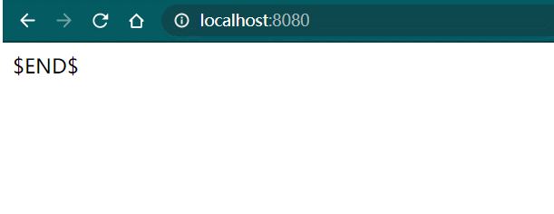

## 6.4、GET/POST

**GET请求一般用来获取服务器信息，POST一般用来更新信息；**

**GET请求能做的，POST都能做，GET请求不能做的，POST也都能做。**

<font size=4 style="font-weight:bold;background:yellow;">GET</font>

GET 方法用于从服务器检索数据。这是一种只读方法，因此它没有改变或损坏数据的风险，使用 GET 的请求应该只被用于获取数据。

GET API 是幂等的，**每次发出多个相同的请求都必须产生相同的结果**，直到另一个 API（POST 或 PUT）更改了服务器上资源的状态。

<font size=4 style="font-weight:bold;background:yellow;">POST</font>

POST 方法用于将实体提交到指定的资源，通常导致在服务器上的状态变化或创建新资源。POST既不安全也不幂等，调用两个相同的 POST 请求将导致两个不同的资源包含相同的信息（资源 ID 除外）。

<font size=4 style="font-weight:bold;background:yellow;">PUT</font>

使用 PUT API更新现有资源（如果资源不存在，则 API 可能决定是否创建新资源）。

<font size=4 style="font-weight:bold;background:yellow;">DELETE</font>

DELETE 方法删除指定的资源。DELETE 操作是幂等的。如果您删除一个资源，它会从资源集合中删除。


# 8、JSON

前后端分离时代

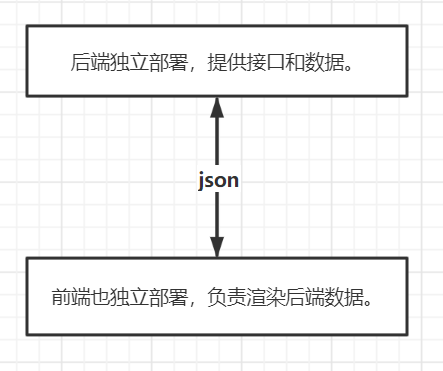


## 8.1、什么是 JSON？

JSON（JavaScript Object Notation，JS 对象标记） 是一种轻量级的数据交换格式，目前使用特别广泛。采用完全独立于编程语言的**文本格式**来存储和表示数据。

简洁和清晰的层次结构使得 JSON 成为理想的数据交换语言。 易于阅读编写，同时也易于机器解析和生成，并有效地提升网络传输效率。在 JavaScript 语言中，一切都是对象。因此，任何 JavaScript 支持的类型都可以通过 JSON 来表示，例如字符串、数字、对象、数组等。

<font size=4 style="font-weight:bold;background:yellow;">JSON 的语法格式</font>

- 对象表示为键值对，数据由逗号分隔；
- 花括号保存对象；
- 方括号保存数组。

JSON 键值对是用来保存 JavaScript 对象的一种方式，和 JavaScript 对象的写法也大同小异，键/值对组合中的键名写在前面并用双引号 `" "` 包裹，使用冒号 `:` 分隔，然后后面紧接着值，如下所示：

```json
{"name":"于海洋","age":3,"sex":"男"}
```

<font size=4 style="font-weight:bold;background:yellow;">JSON 和 JavaScript 对象的关系</font>

JSON 是 JavaScript 对象的字符串表示法，它使用文本表示一个 JS 对象的信息，本质是一个字符 串。

```javascript
var obj = {a: 'Hello', b: 'World'};  		// 这是一个对象，注意键名也是可以使用引号包裹的
var json = '{"a": "Hello", "b": "World"}';  // 这是一个 JSON 字符串，本质是一个字符串
```

<font size=4 style="font-weight:bold;background:yellow;">JSON 和 JavaScript 对象互转</font>

要实现从 JavaScript 对象转换为 JSON 字符串，使用 `JSON.stringify()` 方法：

```javascript
var user = {
    name: "yuhaiyang",
    age: 3,
    sex: "男"
};	// javascript对象
var json = JSON.stringify(user);	// 将js对象转换为json对象
// {"name":"于海洋","age":3,"sex":"男"}
```

要实现从 JSON 字符串转换为 JavaScript 对象，使用 `JSON.parse()` 方法：

```javascript
var obj = JSON.parse(json);	// 将json对象转换为js对象
console.log(obj);			// {name: "于海洋", age: 3, sex: "男"}
```

## 8.2、Jackson

`Jackson` 应该是目前比较好的 json 解析工具了，当然工具不止这一个，还有阿里的 `fastjson` 等。

这里使用 `Jackson`，使用步骤：

**导入 jar 包，配置 web.xml 和 springmvc-servlet.xml；**

```xml
<dependency>
    <groupId>com.fasterxml.jackson.core</groupId>
    <artifactId>jackson-databind</artifactId>
    <version>2.12.1</version>
</dependency>
```

**实体类**

```java
public class User {
    private String name;
    private int age;
    private String sex;
}
```

**配置乱码问题，可以通过注解解决，或者通过配置文件一次性解决；**

- 使用注解

    `@RequestMapping` 注解有一个 produces 参数，可以对编码进行设置，防止出现乱码；

    ```java
    @RequestMapping(value = "/j1",produces = "application/json;charset=utf-8")
    ```

- 在 `springmvc-servlet.xml` 文件中进行统一配置

    ```xml
     <!--JSON乱码问题配置,死代码,用了json就要配置这个-->
    <mvc:annotation-driven>
        <mvc:message-converters register-defaults="true">
            <bean class="org.springframework.http.converter.StringHttpMessageConverter">
                <constructor-arg value="UTF-8"/>
            </bean>
            <bean class="org.springframework.http.converter.json.MappingJackson2HttpMessageConverter">
                <property name="objectMapper">
                    <bean class="org.springframework.http.converter.json.Jackson2ObjectMapperFactoryBean">
                        <property name="failOnEmptyBeans" value="false"/>
                    </bean>
                </property>
            </bean>
        </mvc:message-converters>
    </mvc:annotation-driven>
    ```

<font size=4 style="font-weight:bold;background:yellow;">测试输出</font>

**编写 Controller 测试 User 对象输出**

- `@ResponseBody`： 加上这个注解后，不会走视图解析器，会直接返回一个字符串，可以配合 `@Controller `使用；

- `@RestController`：用了这个注解，注解下方所有的方法只会返回字符串；

 `@RestController` 注解会使所有方法都返回字符串；如果想让部分方法返回字符串的话，就使用 `@Controller`，在需要返回字符串的方法上额外加上 `@ResponseBody`。

```java
// @Controller
@RestController  //用了这个注解,下面所有的方法只会返回字符串
public class UserController {
    // @RequestMapping(value = "/j1",produces = "application/json;charset=utf-8")
    @RequestMapping("/j1")
    public String json1() throws JsonProcessingException {
        ObjectMapper mapper = new ObjectMapper();
        User user = new User("于海洋", 6, "男");		 // 创建一个对象
        String str = mapper.writeValueAsString(user);	// 把user变成json
        return str;
    }
}	// 打开浏览器，走j1路径，显示{"name":"于海洋","age":6,"sex":"男"}
```

**测试 User 对象集合输出**

`writeValueAsString()` 方法还可以对集合进行转换。

```java
@RequestMapping("/j2")
public String json2() throws JsonProcessingException {
    ObjectMapper mapper = new ObjectMapper();
    List<User> userList = new ArrayList<User>();
    User user1 = new User("于海洋1", 6, "男");
    User user2 = new User("于海洋2", 6, "男");
    User user3 = new User("于海洋3", 6, "男");
    userList.add(user1);
    userList.add(user2);
    userList.add(user3);

    String str = mapper.writeValueAsString(userList);
    return str;
}	// 打开浏览器，走j2路径，显示[{"name":"于海洋1","age":6,"sex":"男"},{"name":"于海洋1","age":6,"sex":"男"}...]
```

**测试时间对象输出**

传统方法，纯 Java 解决

```java
@RequestMapping("/j3")
public String json3() throws JsonProcessingException {
    ObjectMapper mapper = new ObjectMapper();
    Date date = new Date();
    // 时间解析后的默认格式为：Timestamp，即1970年1月1日到现在的毫秒数
    SimpleDateFormat sdf = new SimpleDateFormat("yyyy-MM-dd HH:mm:ss");
    return mapper.writeValueAsString(sdf.format(date));   
}
```

使用 ObjectMapper 格式化输出

```java
@RequestMapping("/j3")
public String json3() throws JsonProcessingException {
    ObjectMapper mapper = new ObjectMapper();
    // 使用ObjectMapper格式化输出，自定义不使用Timestamp的方式
    mapper.configure(SerializationFeature.WRITE_DATES_AS_TIMESTAMPS, false);
    // 设置自定义日期格式
    SimpleDateFormat sdf = new SimpleDateFormat("yyyy-MM-dd HH:mm:ss");
    mapper.setDateFormat(sdf);
    Date date = new Date();
    return mapper.writeValueAsString(date);
}	// 打开浏览器，走j3路径，显示"2021-04-16 20:41:31"
```

## 8.3、JsonUtils

在之前的几个返回 JSON 数据的例子中，可以建立 JsonUtils.class 工具类进行简化，建立工具类后，之前的操作就可以得到简化。

```java
public class JsonUtils {
    public static String getJson(Object object){
        return getJson(object,"yyyy-MM-dd HH:mm:ss");
    }  // 重载
    public static String getJson(Object object,String DateFormat){
        ObjectMapper mapper = new ObjectMapper();
        // 不使用Timestamp的方式
        mapper.configure(SerializationFeature.WRITE_DATES_AS_TIMESTAMPS, false);
        // 自定义日期格式
        SimpleDateFormat sdf = new SimpleDateFormat(DateFormat);
        mapper.setDateFormat(sdf);
        try {
            return mapper.writeValueAsString(object);
        } catch (JsonProcessingException e) {
            e.printStackTrace();
        }
        return null;
    }
}
```

**输出 User 对象**

```java
@RequestMapping("/j11")
public String json11() throws JsonProcessingException {
    User user = new User("于海洋", 16, "男");
    return JsonUtils.getJson(user);
}
```

**输出 User 对象集合**

```java
    @RequestMapping("/j2")
    public String json2() throws JsonProcessingException {
        List<User> userList = new ArrayList<User>();
        User user1 = new User("于海洋1", 6, "男");
        User user2 = new User("于海洋2", 6, "男");
        User user3 = new User("于海洋3", 6, "男");
        userList.add(user1);
        userList.add(user2);
        userList.add(user3);
        return JsonUtils.getJson(userList);
    }
```

**输出时间对象**

```java
    @RequestMapping("/j4")
    public String json4() throws JsonProcessingException {
        Date date = new Date();
        return JsonUtils.getJson(date);
    }
```

## 8.4、fastjson

> fastjson 与 Jackson 类似，实现 json 的转换方法很多，最后的实现结果都是一样的。

fastjson 是阿里开发的一款专门用于 Java 开发的包，可以方便的实现 json 对象，json 字符串与 JavaBean 对象之间的的转换。

**导包**

```xml
<dependency>
    <groupId>com.alibaba</groupId>
    <artifactId>fastjson</artifactId>
    <version>1.2.60</version>
</dependency>
```

**fastjson 三个主要的类：**

- JSONObject 代表 json 对象
  - 可以通过各种形式的 `get()` 方法获得  JSONObject  中的数据，也可利用诸如 `size()`，`isEmpty()` 等方法获取 k-v 的个数、判断是否为空；
  - JSONObject 实现了 Map 接口，其本质是通过实现 Map 接口并调用接口中的方法完成的。
- JSONArray：由 JSONObject 构成的数组，内部有 List 接口中的方法完成操作；
- JSON：实现 json 对象，json 对象数组，java 对象，json 字符串之间的相互转化。

**json 对象 JSONObject 和 json 字符串之间的区别**

- json 对象的属性值可以访问到，这也是最显著的特征；
- Json 字符串，就是用单引号或者双引号引起来的普通字符串。

<font size=4 style="font-weight:bold;background:yellow;">测试</font>

```java
@Test
public void testFastJSON() {
    List<User> list = new ArrayList<>();
    User user1 = new User("yuhaiyang1", 11, "男");
    User user2 = new User("yuhaiyang2", 22, "男");
    User user3 = new User("yuhaiyang3", 33, "男");
    list.add(user1);
    list.add(user2);
    list.add(user3);

    // 包含Java对象的集合类转换成JSON字符串
    String strList = JSON.toJSONString(list);
    System.out.println("JSON.toJSONString(list)==>" + strList);

    // 包含Java对象的集合类转换成JSONObject
    JSONArray jsonArray = (JSONArray) JSON.toJSON(list);
    System.out.println(jsonArray);

    // Java对象转JSON字符串
    String str = JSON.toJSONString(user1);
    System.out.println("JSON.toJSONString(user1)==>" + str);

    // JSON字符串转Java对象
    User jp_user1 = JSON.parseObject(str, User.class);
    System.out.println("JSON.parseObject(str,User.class)==>" + jp_user1);

    // Java对象转JSON对象JSONObject，JSON对象的特点就是可以get到其中的属性
    JSONObject jsonObject = (JSONObject) JSON.toJSON(user2);
    System.out.println("(JSONObject) JSON.toJSON(user2)==>" + jsonObject.getString("name"));

    // JSON对象转Java对象
    User to_java_user = JSON.toJavaObject(jsonObject, User.class);
    System.out.println("JSON.toJavaObject(jsonObject1,User.class)==>" + to_java_user);
}
```

# 9、Ajax

## 9.1、什么是 Ajax？

> 在 2005 年，Google 通过其 Google Suggest 使 Ajax 变得流行起来，Google Suggest 能够自动帮你完成搜索单词。 Google Suggest 使用 Ajax 创造出动态性极强的 web 界面：当您在谷歌的搜索框输入关键字时， JavaScript 会把这些字符发送到服务器，然后服务器会返回一个搜索建议的列表。 就和国内百度的搜索框一样

Ajax 不是一种新的编程语言，而是一种用于创建更好更快以及交互性更强的Web应用程序的技术。 传统的网页（即不用 Ajax 技术的网页），想要更新内容或者提交一个表单，都需要重新加载整个网页。使用 Ajax 技术的网页，通过在后台服务器进行少量的数据交换，就可以实现异步局部更新。使用 Ajax，用户可以创建接近本地桌面应用的直接、高可用、更丰富、更动态的 Web 用户界面。

Ajax（Asynchronous JavaScript and XML），异步的 JavaScript 和 XML，Ajax 是一种在无需重新加载整个网页的情况下，能够更新部分网页的技术。

## 9.2、模拟 Ajax

构造下面这样的一个 html 页面，输入网页地址，点击提交按钮，在下方的窗口中就可以显示出输入地址对应的页面，但是上方地址栏并没有发生变化，下方的页面可以随意更换动态刷新。

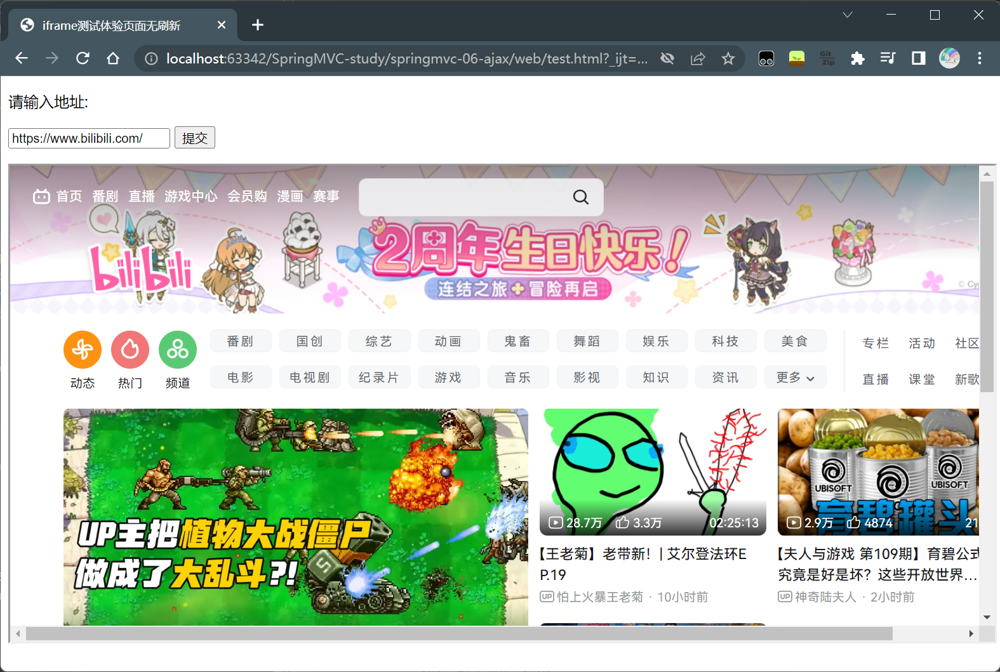

```html
<!DOCTYPE html>
<html lang="en">
<head>
    <meta charset="UTF-8">
    <title>iframe测试体验页面无刷新</title>
    <script>
        function go() {
            var url = document.getElementById("url").value;
            document.getElementById("iframe1").src = url;
        }
    </script>
</head>
<body>

<div>
    <p>请输入地址:</p>
    <p>
        <input type="text" id="url">
        <!--点击按钮下方iframe直接跳转到目标页面-->
        <input type="button" value="提交" onclick="go()">
    </p>
</div>

<div>
    <iframe url="url" id="iframe1" style="width:100%; height:500px;"></iframe>
</div>

</body>
</html>
```

## 9.3、jQuery.ajax

jQuery 是一个库，里面有大量的 js 函数（方法），这里直接使用 jquery 提供的 Ajax，避免重复造轮子。

Ajax 的核心是 XMLHttpRequest 对象（XHR）。XHR 为向服务器发送请求和解析服务器响应提供了接口，能够以异步方式从服务器获取新数据。 

jQuery 提供多个与 AJAX 有关的方法。 通过 jQuery AJAX 方法，能够使用 HTTP Get 和 HTTP Post 从远程服务器上请求文本、HTML、 XML 或 JSON，同时能够把这些外部数据直接载入网页的被选元素中。 

jQuery 不是生产者，而是大自然搬运工。jQuery Ajax 本质就是 XMLHttpRequest，进行了封装，方便调用。

```java
jQuery.ajax(...)
    部分参数：
        url：请求地址
    	data：要发送的数据
     	success：成功之后执行的回调函数(全局)
    	error：失败之后执行的回调函数(全局)
        type：请求方式，GET、POST（1.9.0之后用method）
        headers：请求头
        
        contentType：即将发送信息至服务器的内容编码类型(默认: "application/x-www-form-urlencoded; charset=UTF-8")
        async：是否异步
        timeout：设置请求超时时间（毫秒）
        beforeSend：发送请求前执行的函数(全局)
        complete：完成之后执行的回调函数(全局)
        accepts：通过请求头发送给服务器，告诉服务器当前客户端课接受的数据类型
        dataType：将服务器端返回的数据转换成指定类型
        "xml": 将服务器端返回的内容转换成xml格式
        "text": 将服务器端返回的内容转换成普通文本格式
        "html": 将服务器端返回的内容转换成普通文本格式，在插入DOM中时，如果包含JavaScript标签，则会尝试去执行。
        "script": 尝试将返回值当作JavaScript去执行，然后再将服务器端返回的内容转换成普通文本格式
        "json": 将服务器端返回的内容转换成相应的JavaScript对象
        "jsonp": JSONP 格式使用 JSONP 形式调用函数时，如 "myurl?callback=?" jQuery 将自动替换 ? 为正确的函数名，以执行回调函数
```

**配置静态资源过滤**

```xml
<mvc:default-servlet-handler/>
```

**编写 AjaxController**

```java
@RestController
public class AjaxController {
    @RequestMapping("/a1")
    public void a1(String name, HttpServletResponse response) throws IOException {
        System.err.println("a1:"+name);
        if("haiyang".equals(name)){
            response.getWriter().print("true");
        }else{
            response.getWriter().print("false");
        }
    }
}
```

**index.jsp**

```jsp
<%@ page contentType="text/html;charset=UTF-8" language="java" %>
<html>
  <head>
    <title>$Title$</title>

    <script src="${pageContext.request.contextPath}/statics/js/jquery-3.6.0.js"></script>

    <script>
      function a(){
          $.post({
              url:"${pageContext.request.contextPath}/a1",
              // 后端获取数据时是从data这里获取数据，而不是下面的input，所以后端变量名要和这里的变量名匹配
              data:{"name":$("#userName").val()},
              success:function (data,status) {
                console.log("data="+data)
                console.log("status="+status)
              } // 回调函数
          })
      }
    </script>

  </head>
  <body>
    <%--onblur:失去焦点时调用的函数--%>
    <%--失去焦点的时候，发起一个请求（携带信息）到后台--%>
    用户名: <input type="text" id="userName" onblur="a()">
  </body>
</html>
```

**测试**

运行程序，打开浏览器点击输入框，此时聚焦输入框上；输入内容后点击其他地方，失去焦点，就会调用  `a()` 函数，在浏览器控制台中根据输入框中的内容输出相应结果，流程图：

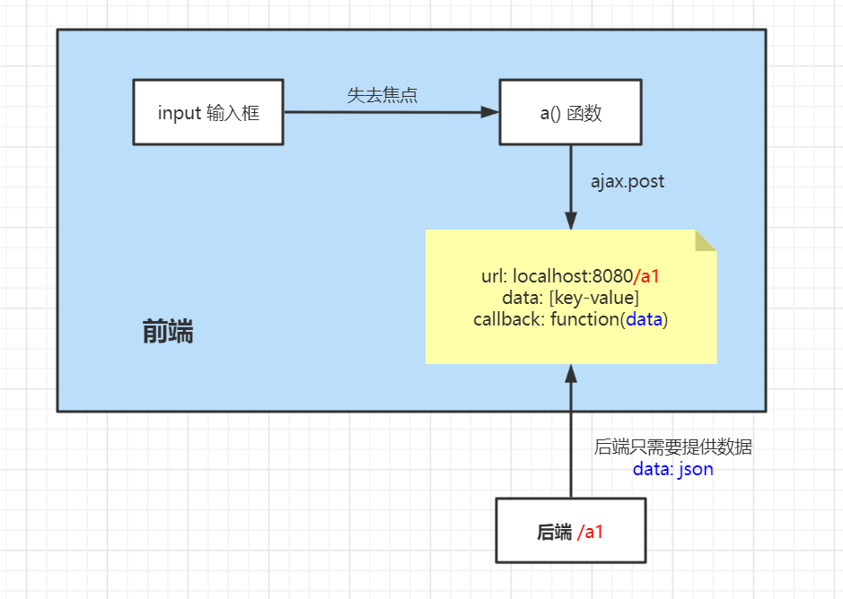


