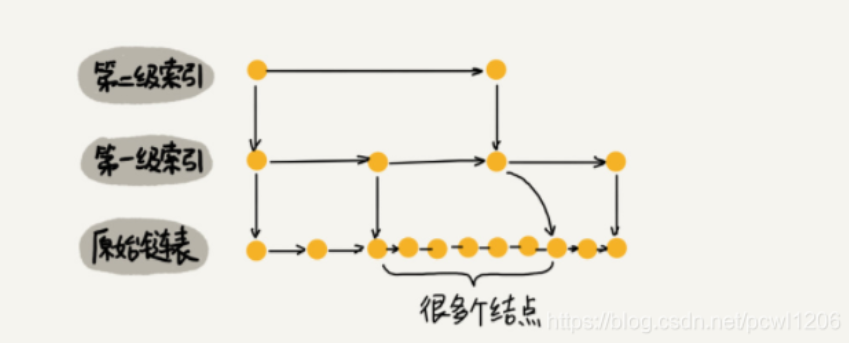
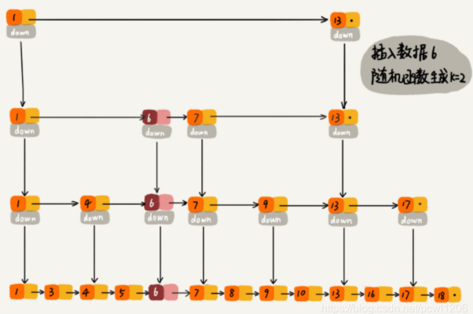
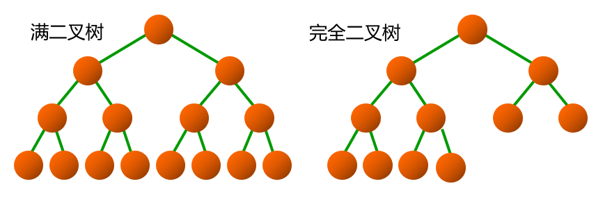
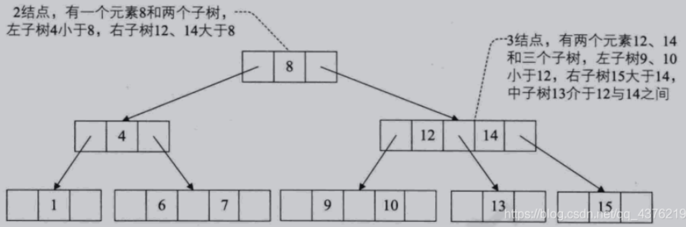

# 一、前言

## 1、什么是数据结构？

数据结构是相互之间存在一种或多种特定关系的数据元素的集合。

数据结构的逻辑结构：集合结构，线性结构，树形结构，图形结构

- “数据结构是数据对象，以及存在于该对象的实例和组成实例的数据元素之间的各种联系。这些联系可以通过定义相关的函数来给出。”  ——Sartaj Sahni，《数据结构、算法与应用》
- “数据结构是ADT（抽象数据类型 Abstract DataType）的物理实现。”—— Clifford A.Shaffer，《数据结构与算法分析》
- “数据结构（data structure）是计算机中存储、组织数据的方式。通常情况下，精心选择的数据结构可以带来最优效率的算法。”——中文维基百科

<!--more-->

## 2、计算时间复杂度与空间复杂度

[大O记法](https://mp.weixin.qq.com/s/mBTyBkeNHoW7-Rcbv2Exwg)

# 二、链表

### 数组和链表操作的时间复杂度

**1、数组：无序数组、有序数组**

无序数组

- 查询：通过index直接定位，即O(1)。

- 插入分为以下两种情况：
  - 空间充足：无序数组不需要考虑插入位置，直接插入到末尾，即O(1)。
  - 空间不足：如果空间不足，则需要将整个数组移动到另一个空间，再添加元素，即O(n)。
- 删除分为以下两种情况：
  - 删除末尾元素：删除末尾不需要考虑移动元素位置，即O(1)。
  - 非末尾元素且元素个数>1：删除操作O(1)+移动元素位置O(n)=O(n)。

有序数组

- 查询：通过index直接定位，故时间复杂度为O(1)。

- 插入有序数组的插入需要考虑插入位置，即分下列两种情况查询插入位置：

  - 二分查找法

    二分查找法的时间复杂度为O(log2n)，移动元素位置的时间复杂度为O(n)，即O(log2n)+O(n)=O(n)。

  - 顺序查找法

    顺序查找法查找的时间复杂度为O(n)，移动元素位置的时间复杂度为O(n)，即O(n)+O(n)=O(n)。

    ps：如果数组本身无序，还需要进行排序的话，使用冒泡排序复杂度达到o(n^2)。    

- 删除分为以下两种情况：

  - 删除末尾元素：删除末尾不需要考虑移动元素位置，即O(1)。
  - 非末尾元素且元素个数>1：删除操作O(1)+移动元素位置O(n)=O(n)。 

**2、链表：无序链表、有序链表**

无序链表

- 查询：同有序链表查询，取最坏情况o(n)。
- 插入：不需要考虑插入位置，即o(1)。
- 删除：同有序链表一样，即查询元素位置O(n)+删除操作O(1)=O(n)。

有序链表

- 查询：依次比较，最好情况下第一个就是即o(1)，最坏情况o(n)，取最坏情况o(n)。

- 插入：有序链表的插入需要先查询到该插入的位置，且链表不能使用二分查找，即o(n)。

  可以考虑使用跳跃表来达到o(logn)的时间复杂度，但是其空间复杂度达到了o(n)，也是可以接受的。  

- 删除：和插入一样，需要先去找到要删除的元素，查询元素位置O(n)+删除操作O(1)=O(n)。

单链表

静态链表

循环链表

双向链表

### 跳表

[跳表](https://blog.csdn.net/pcwl1206/article/details/83512600?ops_request_misc=%257B%2522request%255Fid%2522%253A%2522163110266716780357250755%2522%252C%2522scm%2522%253A%252220140713.130102334..%2522%257D&request_id=163110266716780357250755&biz_id=0&utm_medium=distribute.pc_search_result.none-task-blog-2~all~sobaiduend~default-6-83512600.first_rank_v2_pc_rank_v29&utm_term=%E8%B7%B3%E8%A1%A8&spm=1018.2226.3001.4187)（SkipList）：增加了向前指针的链表叫做指针。跳表全称叫做跳跃表，简称跳表。跳表是一个随机化的数据结构，实质是一种可以进行二分查找的有序链表。

- 跳表在原有的有序链表上增加了多级索引，通过索引来实现快速查询。
- 跳表不仅能提高搜索性能，同时也可以提高插入和删除操作的性能。redis中的有序集合 ZSet，其实就是基于跳表实现的。

#### 跳表的时间复杂度

> 单链表查询时间复杂度：O(n)

- <span style="color:red;font-weight:bold">跳表查找任意数据的时间复杂度为 O(logn)。</span>

- **跳表插入的时间复杂度为：O(logn)，支持高效的动态插入。**

  在单链表中，一旦定位好要插入的位置，插入结点的时间复杂度是很低的，就是O(1)。但是为了保证原始链表中数据的有序性，我们需要先找到要插入的位置，这个查找的操作就会比较耗时。

  对于纯粹的单链表，需要遍历每个结点，来找到插入的位置。但是对于跳表来说，查找的时间复杂度为O(logn)，所以这里查找某个数据应该插入的位置的时间复杂度也是O(logn)。

- **跳表的删除操作时间复杂度为：O(logn)，支持动态的删除。**

  在跳表中删除某个结点时，如果这个结点在索引中也出现了，除了要删除原始链表中的结点，还要删除索引中的。因为单链表中的删除操作需要拿到删除结点的前驱结点，然后再通过指针操作完成删除。所以在查找要删除的结点的时候，一定要获取前驱结点（双向链表除外）。因此跳表的删除操作时间复杂度即为O(logn)。

#### 跳表的索引更新

当不断地往跳表中插入数据时，如果不更新索引，就有可能出现某2个索引节点之间的数据非常多的情况，在极端情况下，跳表还会退化成单链表。



作为一种动态数据结构，我们需要某种手段来维护索引与原始链表大小之间的平衡，也就是说，如果链表中的结点多了，索引结点就相应地增加一些，避免复杂度退化，以及查找、插入和删除操作性能的下降。

像红黑树、AVL 树这样的平衡二叉树，它们是通过左右旋的方式保持左右子树的大小平衡，而跳表是通过**随机函数**来维护“平衡性”。随机函数的选择是非常有讲究的，从概率上讲，能够保证跳表的索引大小和数据大小平衡性，不至于性能的过度退化。

当我们往跳表中插入数据的时候，通过这个随机函数，就可以决定这个结点插入到哪几级索引层中，比如随机函数生成了值 K，那我们就将这个结点添加到第一级到第 K 级这个 K 级索引中。如下图中要插入数据为6，K = 2 的例子：




**小结**

- 跳表结合了链表和二分查找的思想，由原始链表和一些通过 “跳跃” 生成的链表组成，第0层是原始链表，越上层“跳跃”的越高，元素越少，查找时从顶层向下，不断缩小搜索范围。

- 由很多层结构组成，level 是通过一定的概率随机产生的；
- 每一层都是一个有序的链表，默认是升序；
- 最底层(Level 1)的链表包含所有元素；
- 如果一个元素出现在Level i 的链表中，则它在Level i 之下的链表也都会出现； 
- 每个节点包含两个指针，一个指向同一链表中的下一个元素，一个指向下面一层的元素 ，上层链表是下层链表的子序列。

# 三、栈与队列

在 Java 中，栈是在 Collection 接口下的 List 接口下的 Vector 类的一个子类 Stack 中实现的，主要操作如下，这些操作的底层实现都是基于 Vector 类中的操作进行的。

```java
empty()					// 测试堆栈是否为空。 
E peek()				// 查看堆栈顶部的对象，但不从堆栈中移除它。 
E pop()					// 移除堆栈顶部的对象，并作为此函数的值返回该对象。 
E push(E item)			// 把项压入堆栈顶部。 
int search(Object o)	// 返回对象在堆栈中的位置，以 1 为基数。 
```

## 优先队列

自动排序！

C++ STL 中的优先队列：**priority_queue**

概念：优先队列也是一种抽象数据类型。优先队列中的每个元素都有优先级，而优先级高（或者低）的将会先出队，而优先级相同的则按照其在优先队列中的顺序依次出队。

**优先队列往往使用堆来实现。**

# 四、字符串

# 五、树

树 -> 堆-> 二叉树 -> 二叉搜索树（BST） -> 平衡二叉搜索树（AVL树） -> 哈夫曼树 -> 红黑树 -> B树 -> B+树

## 二叉树

<span style="color:red;font-weight:bold">二叉树就是每个结点最多有两个子结点的树。</span>

**满二叉树**：每一层的结点数量都达到最大值的二叉树。

**完全二叉树**：若设二叉树的深度为 k，则共有 k 层。除第 k 层外，其它各层 (1～k-1) 的结点数都达到最大个数，第 k 层从右向左连续缺若干结点，这就是完全二叉树。




## 堆

堆是一种常用的树形结构，是一种特殊的**完全二叉树**，当且仅当满足所有节点的值总是不大于或不小于其父节点的值的完全二叉树被称之为堆。堆的这一特性称之为堆序性。因此，在一个堆中，根节点是最大（或最小）节点。

- 如果根节点最小，称之为小顶堆（或小根堆）。
- 如果根节点最大，称之为大顶堆（或大根堆）。
- <span style="color:red">堆的左右孩子没有大小的顺序。</span>

堆的存储一般都用**数组**来存储堆，节点 i 的父节点下标为 `(i-1)/2`。它的左右子节点下标分别为`2*i+1` 和 `2*i+2`。

> JVM 中的堆和栈：
>
> 栈：存放基本类型的变量数据和对象的引用，但对象本身不存放在栈中，而是存放在堆（new 出来的对象）或者常量池中（字符串常量对象存放在常量池中。） 
>
> 堆：存放所有 new 出来的对象。 


## 二叉搜索树（BST）

二叉搜索树，Binary Search Tree，BST

利用左右子树的规则（二分查找），来减少查找时递归深度。

<span style="color:red;font-weight:bold">1、左子树上所有结点的值均小于或等于它的根结点的值。</span>

<span style="color:red;font-weight:bold">2、右子树上所有结点的值均大于或等于它的根结点的值。</span>

<span style="color:red;font-weight:bold">3、左、右子树也分别为 BST。</span>

**特性**

- 含有 n 个结点的二叉搜索树的高度最大为 n，最小为 log2 (n+1)。

- 有序插入时形成一棵单支树，此时是最坏情况，对树的搜索、插入和删除操作所需要的时间均为 O(n)。

- 在随机情况下，搜索、插入和删除操作的平均时间是 O(log2n)。

## 平衡二叉树（AVL）

BST 在一定程度上可以提高搜索效率，但是当原序列有序，例如序列 A = {1，2，3，4，5，6}，构造的二叉搜索树会变成一个单链表，搜索效率降低为 O(n)。

AVL 树是一种平衡二叉树，得名于其发明者的名字（ Adelson-Velskii 以及 Landis）。

AVL 仍然是 BST，但是对高度有平衡要求。O(log2n)

<span style="color:red;font-weight:bold">1、左右子树的高度差不能超过 1。</span>

<span style="color:red;font-weight:bold">2、每个子树也是一颗AVL。</span>

## 红黑树

不再是 AVL 那样的绝对高度平衡树，而是有一套自己的自平衡逻辑。

<span style="color:red;font-weight:bold">1、每个节点只能是红色或者黑色。</span>

<span style="color:red;font-weight:bold">2、根结点都是黑色。</span>

<span style="color:red;font-weight:bold">3、每个叶子节点都是黑色的空节点（NIL节点）。</span>

<span style="color:red;font-weight:bold">4、如果一个节点是红色，则它的两个子节点都是黑色。（从根结点到外部结点的路径上，不允许出现两个连续的红节点。）</span>

<span style="color:red;font-weight:bold">5、所有从根结点到外部结点的路径上都有相同数目的黑色结点。</span>

**特性**

- 利用对树中的结点 “红黑着色”的要求，降低了平衡性的条件，达到局部平衡；

- 有着良好的最坏情况运行时间，它可以在 O(log2n) 时间内做查找、插入和删除，这里的 n 是树中结点的数目。
- 红黑树使用与二叉搜索树完全相同的算法进行搜索，在搜索过程中不需使用颜色信息。
- 应用：Java 集合类 TreeMap 和 TreeSet 底层就是红黑树实现的，在 Java 8 中，HashMap 也用到了红黑树。

**红黑树 VS AVL 树**

- AVL树要求完全平衡
- 红黑树只要求局部平衡
  - 时间复杂度和 AVL 相同，但统计性能比 AVL 树更高。
  - 任何不平衡都会在3次旋转之内解决。
  - 增、删算法性能好、易于实现。
  - 减少了开销、性能几乎没有下降。


**红黑树如何保证最长路径不超过最短路径的二倍？**

最短路径为全黑，最长路径就是红黑节点交替（因为红色节点不能连续），每条路径的黑色节点相同，则最长路径刚好是最短路径的两倍。

**红黑树可以全黑吗？**

插入红色节点树的性质可能不会改变，而插入黑色节点每次都会违反性质 5。将红黑树的节点默认颜色设置为红色，是为尽可能减少在插入新节点对红黑树造成的影响。所以说理论上红黑树是可以全黑的，但是实际不存在。

## 2-3 树

> 二叉查找树的查找的时间复杂度是Ｏ(log N)，其查找效率已经足够高了，那为什么还有Ｂ树和Ｂ＋树的出现呢？难道这两个树的时间复杂度比二叉查找树还小吗？
>
> 答案当然不是，Ｂ树和Ｂ+ 树的出现是因为另外一个问题，那就是磁盘 IO；众所周知，IO 操作的效率很低，那么，当在大量数据存储中，查询时我们不能一下子将所有数据加载到内存中，只能逐一加载磁盘页，每个磁盘页对应树的节点。造成大量磁盘 IO 操作（最坏情况下为树的高度）。平衡二叉树由于树深度过大而造成磁盘 IO 读写过于频繁，进而导致效率低下。
>
> 我们为了减少磁盘 IO 的次数，就你必须降低树的深度，将“瘦高”的树变得“矮胖”。
>
> - 每个节点存储多个元素
>
> - 摒弃二叉树结构，采用多叉树

2-3 树是一个简单的多路查找树。

什么是 2-3 树？

<span style="color:red;font-weight:bold">1、每一个节点都有两个孩子（称为二节点）或三个孩子（三节点）或者没有。</span>

<span style="color:red;font-weight:bold">2、子节点排序参考二叉树</span>

<span style="color:red;font-weight:bold">3、一个二节点包含一个元素和两个子节点（或没有子节点），一个三节点包含两个元素和三个子节点（或没有子节点）</span>

<span style="color:red;font-weight:bold">4、2-3树中所有的叶子节点都在同一层次上。</span>



## B 树（B-树）

> B 树是一种平衡的多路查找树。节点最大的孩子的数量的树叫做 m 阶 B树，所以 2-3 树就是 3 阶 B 树，二叉树就是 2 阶 B 树。

一个 m 阶的 B 树具有如下特征：B 树中所有结点的孩子结点最大值称为 B 树的阶，通常用 m 表示。一个结点有 k 个孩子时，必有 k-1 个关键字才能将子树中所有关键字划分为 k 个子集。

B 树有如下性质：

- 如果根节点不是叶节点，那么 B 树至少有两个子女。

- 每一个非根的分支结点都有 k-1 个元素和 k 个孩子，其中 `ceil (m/2) ≤ k ≤ m` 。
- 每一个叶子节点都包含 k-1 个元素，其中 `ceil (m/2) ≤ k ≤ m` 。
- 所有叶子节点都位于同一层。
- 每个节点中的元素从小到大排列，节点当中的 k-1 个元素正好是 k 个孩子包含元素的值域划分

B 树的规则

- 排序方式：所有节点关键字是按递增次序排列，并遵循左小右大原则；
- 子节点数：非叶节点的子节点数：**1 < 子节点数 <= M** ，且 M>=2，空树除外。（M 代表一个树节点最多有多少个查找路径，M=M路，当 M=2 则是2叉树，M=3 则是3叉树）；
- 关键字数：枝节点的关键字数量大于等于 `ceil(m/2)-1` 个且小于等于 M-1 个。（`ceil()` 是个朝正无穷方向取整的函数，如 `ceil(1.1) = 2`)；


B树的典型应用
我们的外存，比如硬盘，是将所有的信息分割成相等大小的页面，每次硬盘读写的都是一个或多个完整的页面，对于一个硬盘来说，-页的长度可能是 211到214个字节。

在一个典型的B树应用中，要处理的硬盘数据量很大，因此无法一次全部装入内存。因此我们会对 B树进行调整， 使得B树的阶数 (或结点的元素)与硬盘存储的页面大小相匹配。比如说一棵B树的阶为1001 (即1个结点包含1000个关键字)，高度为2,它可以储存超过10亿个关键字，我们只要让根结点持久地保留在内存中，那么在这棵树上，寻找某一个关键字至多需要两次硬盘的读取即可。

B树查找的时间复杂度：O(log n).


B树相对于平衡二叉树的不同是，每个节点包含的关键字增多了，特别是在B树应用到数据库中的时候，数据库充分利用了磁盘块的原理（磁盘数据存储是采用块的形式存储的，每个块的大小为4K，每次IO进行数据读取时，同一个磁盘块的数据可以一次性读取出来）把节点大小限制和充分使用在磁盘快大小范围；把树的节点关键字增多后树的层级比原来的二叉树少了，减少数据查找的次数和复杂度;

## B+ 树

B+树是B树的一个升级版，相对于B树来说B+树更充分的利用了节点的空间，让查询速度更加稳定，其速度完全接近于二分法查找。B+树查找的效率要比B树更高、更稳定。

B+树规则

- B+跟B树不同，B+树的非叶子节点不保存关键字记录的指针，只进行数据索引，这样使得B+树每个非叶子节点所能保存的关键字大大增加；

- B+树叶子节点保存了父节点的所有关键字记录的指针，所有数据地址必须要到叶子节点才能获取到。所以每次数据查询的次数都一样；

- B+树叶子节点的关键字从小到大有序排列，左边结尾数据都会保存右边节点开始数据的指针。

  > 根据各种资料，这里有两种算法的实现方式，另一种为非叶节点的关键字数=子节点数-1（来源维基百科)，虽然他们数据排列结构不一样，但其原理还是一样的Mysql 的B+树是用第一种方式实现）;

- 非叶子节点的子节点数 = 关键字数（来源百度百科）


**特点**

1、B+树的层级更少：相较于B树B+每个非叶子节点存储的关键字数更多，树的层级更少所以查询数据更快；

2、B+树查询速度更稳定：B+所有关键字数据地址都存在叶子节点上，所以每次查找的次数都相同所以查询速度要比B树更稳定;

3、B+树天然具备排序功能：B+树所有的叶子节点数据构成了一个有序链表，在查询大小区间的数据时候更方便，数据紧密性很高，缓存的命中率也会比B树高。

4、B+树全节点遍历更快：B+树遍历整棵树只需要遍历所有的叶子节点即可，，而不需要像B树一样需要对每一层进行遍历，这有利于数据库做全表扫描。

B树相对于B+树的优点是，如果经常访问的数据离根节点很近，而B树的非叶子节点本身存有关键字其数据的地址，所以这种数据检索的时候会要比B+树快。

## [哈夫曼树](https://blog.csdn.net/qq_45737068/article/details/106910349)

不断地选出最小的两个节点进行结合，最后形成一棵树。

**一颗有n个叶子结点的的哈夫曼树共有2n-1个结点**

**哈夫曼编码：**按照字母出现的频率进行编码。

比如有一段电报：BADCADFEED，传统编码方式：A->000，B->001，C->010...
如果电报内容特别长，计算机翻译的编码也会特别长，知道了字母出现的频率，就有了权重，就可以构建哈夫曼树，将左分支权值改为0，右分支权值改为1，进行重新编码，编码后会节省一些空间。


# 六、图

## Dijkstra算法

**算法思想**

Dijkstra算法算是**贪心思想**实现的。

- 首先将图中的点分为两组，第一组为已求出最短路径的顶点集合 S（初始时只有起点），第二组为其余未确定最短路径的顶点集合（初始时为其他所有的顶点）。每个节点对应一个距离，即该节点到起点的距离。
- 然后计算起点到其他点的距离，若在图中两点之间有边存在（直接连通），则距离为该边的权值，否则为无穷大，找出距离值最小的节点加入到 S。
- 每往第一组加入一个顶点，就要对第二组的各顶点的距离值进行一次修正（松弛）：计算通过刚找到的距离最短的点作为中转距离是否会更短，如果是就更新距离，然后继续找出距离最小的点加入到第一组中，这样把所有的点找遍之后就存下了起点到其他所有点的最短距离。

## Floyd 算法

**算法思想**

弗洛伊德算法定义了两个二维矩阵。

- 矩阵 D，记录顶点间的最小路径。

  矩阵中 `D[i][j]` 的距离为顶点 i 到顶点 j 的权值；如果 i 和 j 不相邻，则 `D[i][j] = ∞`；如果 `i == j` ，则 `D[i][j] = 0` ;   例如 `D[0][3] = 10`，说明顶点 0 到 3 的最短路径为10； 

- 矩阵 P， 记录顶点间最小路径中的中转点。

  例如`P[0][3] = 1 ` ，说明 0 到 3 的最短路径轨迹为：0 -> 1 -> 3。

Floyd 算法通过三重循环，v 为起点，w 为终点，k 为中转点，循环比较 `D[v][w] `和 `D[v][k] + D[k][w] ` 的最小值，如果 `D[v][k] + D[k][w] < D[v][w]`，则把`D[v][w]` 的值用`D[v][k] + D[k][w] ` 来替代。


**Floyd 算法与 Dijkstra 算法的不同**

1、Floyd 算法是求任意两点之间的距离，是多源最短路，而 Dijkstra 算法是求一个顶点到其他所有顶点的最短路径，是单源最短路。
2、Floyd 算法属于动态规划，我们在写核心代码时候就是相当于推 dp 状态方程，Dijkstra 算法属于贪心算法。
3、Dijkstra 算法时间复杂度一般是 O(n^2)，Floyd算法时间复杂度是 O(n^3)，Dijkstra 算法比 Floyd 算法快。
4、Floyd 算法可以算带负权的，而 Dijkstra 算法是不可以算带负权的。但 Floyd 算法不能算负权回路。


